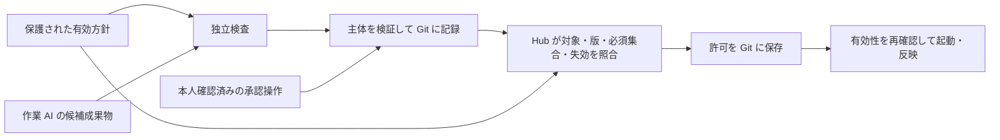

# ADR-0006: 主体別の権限と有効方針・緊急失効を分離する

## ステータス

提案中（著者提案。実行基盤では未実装・未検証）

## 日付

2026-09-23

## コンテキスト（背景）

対象と版を記録しても、作業 AI が検査設定・承認・結果を同じ権限で書ければ、その記録だけでは適合性を判断できない。
通常改訂で run の版を固定する方針と、旧許可の継続が認められない緊急失効を区別する必要もある。

## 判断（Decision）

既存の認証・権限・Git 保護基盤を利用し、次の主体と経路を分ける。製品・認証方式の選定は別途行う。

| 主体 | 読み取り | 書込み・実行 | 許可しない操作 |
|---|---|---|---|
| 作業 AI / 実行器 | 許可された Spec・固定した指示・候補コード | 隔離作業領域と許可範囲の候補成果物、変更提案 | 保護ブランチへの直接反映、有効方針・承認・検査発行記録の変更 |
| 独立検査の発行者 | 対象成果物、保護された検査定義・設定、必要な非公開テスト | 検査の実行、対象と版を伴う結果の発行 | 作業 AI が提案した設定の自動採用、人間承認の代行 |
| 人間の承認主体 | 権限内の対象・証拠・変更理由 | 本人確認済み操作による対象限定の承認・却下・例外 | 権限のない他組織の代諾、検査結果の上書き |
| Hub の判断処理 | 正本の対象・方針・検査・承認・失効 | 許可候補と照合理由の生成 | 自分で検査結果や人間承認を生成すること |
| 記録サービス | 検証可能な主体の要求、許可候補 | Git に追記、競合確認と保存成功の応答 | 未確認の主体から有効記録を発行、履歴の削除・書換え |
| 方針・基盤管理者 | 権限・方針・監査記録 | レビュー済み方針と権限設定、緊急失効 | 通常のタスク権限への管理資格情報の配布 |

有効方針は承認済みの固定版から解決し、候補ブランチの `.jsix-checks.json` や指示書をそのまま信用しない。
方針変更は別のレビュー対象とし、変更対象自身が変更後の方針を選んで自己承認する循環を防ぐ。
hold-out 等の非公開検査は、担当する独立検査主体にだけ必要な権限を与える。
記録サービスも検査結果を正しく計算した保証にはならず、発行者・対象・実行環境の検証が必要である。

必須検査の照合は [構想 §2.3](../concept.md#23-信頼境界と必須検査著者提案未実装) の規則に従う。
欠落・未実行・対象外・未知・実行例外は合格に数えない。Plugin の no-op は有効方針の充足を証明しない。

### 通常改訂と緊急失効

- 通常改訂は新しい run から適用する。実行中の対象・方針を変更するときは新しい検査・必要な承認を要する。
- 緊急失効は管理者が、対象方針・許可、対象 run、発効時点、理由、権限の根拠を Git に記録する。投入・反映の直前に失効を再確認する。
- 失効後は新規起動・結果取込みを止め、実行中の run に取消しを要求する。停止が確認できない間は unknown として隔離する。後から届いた結果も旧許可で反映しない。
- 再開は新方針での検査・必要な承認と新しい許可・run ID を要する。既に完了した外部作用が自動的に元に戻るとは扱わず、影響確認と回収を別記録にする。
- 下位方針は上位の禁止を緩められない。例外可能と定義された条件のみ、所定の権限・対象・期限を伴う別の例外記録で扱う。例外不可条件は上書きできない。

## 理由（Rationale）

保存先の統一だけでは、誰がどの基準で確認したかは保証できない。作業・検査・承認・記録・管理の責任を分け、信頼する部分と未検証の部分を説明できるようにする。
認証基盤や Git 管理者が悪用されないことは信頼の前提であり、Hub の検査で解決済みとしない。

## 検討した代替案

| 代替案 | メリット | デメリット | 却下理由 |
|---|---|---|---|
| 作業権限で検査・承認記録も発行 | 構成が単純 | 自己承認・基準緩和を防げない | 有効性の確認が循環する |
| 常に最新版を実行中 run に適用 | 改訂が即時反映 | 前提変更を追跡しにくい | 通常改訂と失効を分ける |
| 固定版なら失効を認めない | 再現条件が安定 | 撤回された許可が続く | 緊急時に継続を認められない |

## 影響（Consequences）

### ポジティブな影響

検査方針の改変、偽の発行者、古い承認、緊急失効を合成試験で検査する条件が明確になる。

### ネガティブな影響（トレードオフ）

主体間の記録・資格情報の管理と照合が増える。Git が利用不能なら新しい許可を発行しない。

### 将来の注意事項

試作時は、作業 AI に管理資格情報が届かないこと、許可経路を迂回できないこと、失効中の結果が取り込まれないことを実地検証する。表と図だけで権限分離を達成したとはしない。

## 関連

- [ADR-0001](0001-git-as-source-of-truth.md)、[ADR-0007](0007-execution-recovery.md)
- [構想 §2.3・5.3](../concept.md)
