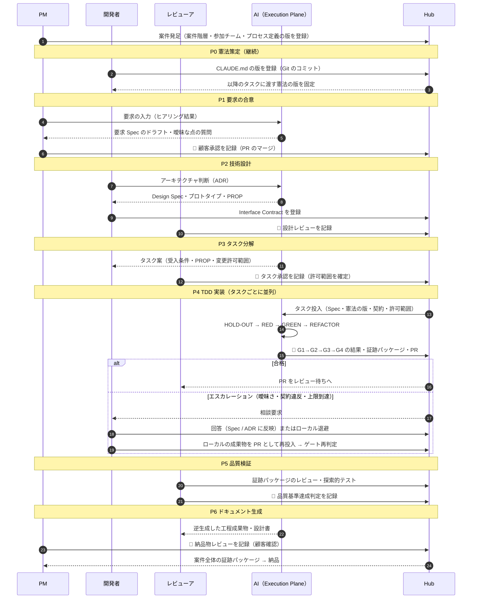

# J-SIX Hub 構想

**Author**: H.Sekita | **Date**: 2026-09-22 | **状態**: 構想（仮説）

> 本書は J-SIX の補足資料であり、**構想段階の仮説**を記述する。J-SIX Hub は実装されておらず、
> 本書に書く効果はいずれも検証されていない。数値による効果の主張はしない。
> 決定事項（D1〜D9）とその ADR は [README](README.md) を参照。
> 本書と [J-SIX 本体](../J-SIX.md) が矛盾する場合は J-SIX 本体を正とする。

---

## 1. 課題：大規模・複数チームで AI 駆動開発が破綻する要因

J-SIX は、個人〜小規模チームが Claude Code（以下 CC）の Plugin として使う前提で設計している。
受発注・多重下請け構造に対しては「CLAUDE.md で全参加者のルールを統一し、Plugin として共有する」
ことを対策としてきた（[J-SIX.md 6.2](../J-SIX.md)）。

しかしこの対策は、**全員が同じ版の CLAUDE.md・Plugin・テンプレートを使い、同じ順序で Phase を
進める**ことを、各開発者の規律に委ねている。チームやベンダーが増えると、次の問題が起きると考える
（著者見解。実案件での観測に基づく定量データはない）。

| # | 問題 | 具体例 | J-SIX 単体での限界 |
|---|---|---|---|
| 1 | 環境のばらつき | 開発者ごとに CC・Plugin・CLAUDE.md・テンプレートの版が異なる。モデルの版も揃わない | Plugin の有効化はローカル設定であり、各開発者の環境に依存する（J-SIX.md 4.4） |
| 2 | 工程順序の個人依存 | タスク承認前に実装を始める、hold-out を書かずに GREEN に進む、Skill を実行しない | Hook と CI で個々のゲートは強制できるが、**Phase の順序**を横断的に強制する仕組みがない |
| 3 | 承認と証跡の散在 | 承認記録・ゲート結果・証跡パッケージが各リポジトリ・各 PC に分かれ、案件全体で「どの工程まで適合しているか」が見えない | 証跡パッケージはタスク単位（J-SIX.md 第9章）で、案件横断の集約がない |
| 4 | チーム間の境界 | 他チームが所有する API・DB スキーマ・イベントを、AI が自チームの都合で変更する | エスカレーション条件「外部 IF 仕様の変更が必要」（J-SIX.md Phase 4）はあるが、**誰の IF か**を判定する情報がない |
| 5 | 例外の不可視化 | ゲートを通さずに手元で直したコード、理由の残らない閾値の緩和 | Stop hook は8回で自動解除される（J-SIX.md 4.4）。CI は最終的に止めるが、例外を認めた理由・承認者は残らない |

J-SIX 本体はこれらを個々のゲートとして部分的に扱っているが、**案件全体でプロセスに適合しているか**を
判定し、証明する層を持たない。J-SIX Hub はこの層を提案する。

---

## 2. 構想の定義と3層構成

> J-SIX の工程（Phase・ゲート・証跡）を中央で管理し、AI エージェントの実行もその管理下に置くことで、
> 複数チーム・複数ベンダーでもプロセス適合性が保たれる開発基盤。

```
[J-SIX Hub：Control Plane]
  工程状態・ゲート・承認・証跡・Interface Contract・メトリクス
        │ タスク投入（Spec・CLAUDE.md・契約を添えて）
        ▼
[Execution Plane]
  タスクごとにコンテナ生成 → CC + J-SIX Plugin → TDD → 品質ゲート → PR → 破棄
        │
        ▼
[Git：正本]
  Spec / ADR / コード / テスト / 逆生成設計書 / 証跡パッケージ / 承認記録
```

| 層 | 役割 | 持つもの | 持たないもの |
|---|---|---|---|
| Control Plane（Hub） | 工程状態の管理、ゲートの判定結果と承認の集約、タスク投入、Interface Contract の管理、メトリクス | Git から再構築できる**読み取りモデル**（[ADR-0001](adr/0001-git-as-source-of-truth.md)） | 成果物の正本 |
| Execution Plane | タスク単位の隔離環境で CC + J-SIX Plugin を実行し、PR を出して破棄する | 実行中の一時的な作業領域 | 永続する状態 |
| Git | 正本 | すべての成果物と承認記録 | — |

**J-SIX との関係**：Hub は J-SIX の実装の一つであり、J-SIX は Hub に依存しない。Phase・ゲート・遷移の
定義は J-SIX 側の `process/jsix-process.yaml` にデータとして置き、Hub は版数を指定して取り込む
（[ADR-0003](adr/0003-dependency-direction-and-process-as-data.md)）。

**中央実行とローカル退避**：AI の実行は Execution Plane を基本とするが、人間がローカルの CC で作業する
退避路を残す。ローカルの成果物は PR としてゲートを再通過する（[ADR-0005](adr/0005-central-execution-with-local-fallback.md)）。

**モデル非依存性**：実装は CC ネイティブのまま（決定事項 D7）とし、マルチモデルのオーケストレータは
作らない。モデル非依存性は、プロセス定義（`jsix-process.yaml`）が特定のモデル・ツールを前提にしない
記述であることによって主張する。

---

## 3. 人間の4つの役割と AI の役割

J-SIX は人間の役割を7つ挙げている（J-SIX.md 第8章）。Hub の観点では、人間が Hub と関わる接点を
次の4つに整理する。

| 役割 | 内容 | 主な Phase | J-SIX 第8章の対応 |
|---|---|---|---|
| 意図の提供 | 要求・制約・判断理由（What / Why）の入力 | P0〜P2 | ビジネス翻訳者、アーキテクト、CLAUDE.md 設計者 |
| 承認 | Spec・設計・タスク分解・納品物のゲート判定 | 各 Phase 境界 | 品質の門番、顧客折衝者 |
| レビュー | AI 成果物のサンプリング確認と指摘 | P2, P5, P6 | サンプリング検証者、探索的テスター |
| 例外対応 | AI からのエスカレーション（詰まり・曖昧さ・逸脱）への応答 | P4 中心 | （J-SIX.md Phase 4 のエスカレーション条件） |

**人間承認は Phase 境界に限定する**。P4 のタスク単位のゲート（G1〜G4）には人間承認を置かない
（J-SIX.md の設計どおり）。承認を増やすと統制が過剰になり、承認待ちが工程を止めるためである（§8）。

**AI の役割**は、J-SIX の自律度モデル（J-SIX.md 2.3）に従う。Hub が加えるのは、AI が
「どの Phase の、どのタスクを、どの版の憲法と契約の下で」実行しているかを Hub が決めて渡すことである。
AI が自分で工程を進めたり、許可範囲を広げたりはしない。

---

## 4. 状態モデル

Phase・ゲート・成果物は J-SIX.md から導出する。本節は `process/jsix-process.yaml`（H2）の
設計の入力であり、yaml と食い違う場合は yaml（さらにその正である J-SIX.md）を正とする。

### 4.1 通常の流れ

```
P0 憲法策定（継続）
 ↓
P1 要求の合意 ──🚪 顧客承認──→ P2 技術設計 ──🚪 設計レビュー──→ P3 タスク分解 ──🚪 タスク承認──→
P4 TDD 実装（タスク単位で並列。各タスクが 🚪 G1→G2→G3→G4）──→
P5 品質検証 ──🚪 品質基準達成判定──→ P6 ドキュメント生成 ──🚪 納品物レビュー──→ 納品
```

| Phase | ゲート（J-SIX.md の名称） | ゲートの構成 | 主な成果物 |
|---|---|---|---|
| P0 憲法策定 | なし（**継続的な月次ループ**。J-SIX.md Phase 0） | — | CLAUDE.md（版管理。§5.3） |
| P1 要求の合意 | 顧客承認 | 人間承認（合意成熟度：要求 Spec が完成レベル） | 要求 Spec（REQ・受入条件・PROP・非機能要件） |
| P2 技術設計 | 設計レビュー | 人間承認（合意成熟度の到達基準は J-SIX.md Phase 1 の表） | Design Spec、ADR、実動プロトタイプ |
| P3 タスク分解 | タスク承認 | 人間承認（変更許可ファイル範囲の承認を含む） | タスク一覧、`docs/tasks/<タスクID>.md` |
| P4 TDD 実装 | G1→G2→G3→G4（タスク単位、順序固定） | G1・G2 決定論的、G3 LLM 判定（参考所見）、G4 証跡生成 | コード、テスト、証跡パッケージ |
| P5 品質検証 | 品質基準達成判定 | 人間承認（証跡パッケージのレビューを含む） | 品質メトリクス |
| P6 ドキュメント生成 | 納品物レビュー | 人間承認（全納品物が完成レベル） | 逆生成した工程成果物・設計書 |

ゲートを構成する判定は、性質によって3種類に分ける。J-SIX の証跡パッケージの3区分
（証跡 / 参考所見 / 承認。J-SIX.md 9.1）と対応させる。

| 判定の種類 | 例 | 再現性 | 証跡パッケージの区分 |
|---|---|---|---|
| 決定論的チェック | G1・G2 のスクリプト | 同じ入力なら同じ結果 | 証跡 |
| LLM 判定 | G3 scope-judge | 再実行で結果が変わりうる | 参考所見（単独で合否の根拠にしない） |
| 人間承認 | Phase 境界のゲート | — | 承認（承認者と日付を記録） |

### 4.2 状態

**Phase の状態**

| 状態 | 意味 | 遷移先 |
|---|---|---|
| 未着手 | 前の Phase のゲートを通過していない | 進行中 |
| 進行中 | 成果物を作成中 | レビュー待ち |
| レビュー待ち | ゲートの判定待ち | 承認済み / 差戻し |
| 承認済み | ゲートを通過した | （逸脱時のみ）進行中 |
| 差戻し | ゲートで差し戻された | 進行中 |

**タスクの状態（P4）**

| 状態 | 意味 | 遷移先 |
|---|---|---|
| 待機 | 依存タスクの完了待ち、または実行枠の空き待ち | 実行中 |
| 実行中 | Execution Plane で HOLD-OUT → RED → GREEN → REFACTOR を実行中 | ゲート判定中 / エスカレーション中 |
| ゲート判定中 | G1→G4 を順に判定中 | 合格 / 不合格 |
| 合格 | G1〜G4 を通過し、PR が出ている | 完了 |
| 不合格 | いずれかの層で落ちた | 実行中（自動修正の上限内）/ エスカレーション中 |
| エスカレーション中 | 人間の判断待ち（J-SIX.md Phase 4 のエスカレーション条件） | 実行中 / ローカル退避中 |
| ローカル退避中 | 人間がローカル CC で作業中（§4.3） | ゲート判定中（PR の再判定） |
| 完了 | PR が統合ブランチにマージされた | — |

「不合格 → 実行中」に戻れる回数は J-SIX の既定に従う（例：G3 のスコープ逸脱は修正1回まで自動、
2回目で人間へ。J-SIX.md Phase 4）。

### 4.3 逸脱と回収

プロセス中心型開発環境（PSEE）を含むプロセス支援システムは広く普及せず、その主要な欠点の一つとして、
想定外の状況で逸脱が必要になるとかえって障害になる点が指摘されている [41]（§6.2）。
Hub はこの指摘への回答として、**逸脱を禁止するのではなく、逸脱の種類と回収の手順を状態モデルに含める**（決定事項 D6）。

| 逸脱の種類 | 例 | 回収方法 | 記録するもの |
|---|---|---|---|
| Phase 逆戻り | P4 中に要求 Spec の変更が必要になった | 影響するタスクを Hub がフラグ付け → 該当 Phase を「進行中」に戻して再承認 → 影響タスクを再投入 | 変更理由、影響タスクの一覧、再承認の記録 |
| ゲート例外承認 | カバレッジ閾値未達だが合理的な理由がある | 理由・承認者・期限を記録した例外として通過させる。期限切れで再判定 | 例外の理由・承認者・期限（証跡パッケージの「承認」区分に明記） |
| エスカレーション | AI が曖昧さ・矛盾で停止した | 人間に相談要求を送る → 回答を Spec / ADR に反映 → タスクを再開 | 相談内容、回答、反映先のコミット |
| ローカル退避 | 中央実行では解決できず、人間がローカル CC で作業する | 成果物を PR としてゲートに再投入する。ゲートは省略しない | 退避の開始・終了、再判定の結果 |
| Interface Contract 違反 | 他チームの契約を破る変更 | ゲートで検出 → 契約所有者の承認なしには通過させない | 違反内容、所有者の判断 |

**逸脱の回数そのものを観測対象にする**。逸脱が多い箇所は、プロセス定義か憲法（CLAUDE.md）の
不備を示すサインであり、J-SIX の Phase 0 の月次ループ（ゲート失敗理由の還元）の入力にする。

ゲート例外承認は、決定論的チェックの**判定結果を書き換えない**。「G2 は不合格だったが、この理由で
例外として通した」という記録を承認区分に追加する。証跡は誰が何度実行しても同じ値になる、という
J-SIX の証跡の原則（J-SIX.md 9.1）を崩さないためである。

### 4.4 スイムレーン図

PM・開発者・レビューア・AI・Hub の5者で、案件発足から納品までを示す。顧客の承認は PM が取り次ぐ
ものとして PM のレーンに含める。



---

## 5. 大規模向けの概念

### 5.1 案件階層

```
Program > Project > System > Subsystem > Feature > Requirement / Task
```

J-SIX の Phase は Project（1つの契約単位）ごとに進む。Hub は複数の Project を Program の下に束ね、
**どの Project がどの Phase にあるか、どこで逸脱が起きているか**を横断的に見せる。
Requirement（REQ）と Task は J-SIX のトレーサビリティ・キー（REQ-nnn・PROP-nnn・タスク ID）をそのまま使う。

### 5.2 Interface Contract

チーム・ベンダー間の境界を **Interface Contract** として登録する。対象は OpenAPI / AsyncAPI / DB スキーマ /
イベントスキーマなど、機械で比較できる形式に限る。

| 属性 | 内容 |
|---|---|
| 所有者 | 契約を変更できるチーム |
| 利用者 | 契約に依存するチーム |
| 版 | Git 上の版（タグまたはコミット） |
| 互換性 | 後方互換 / 破壊的変更の判定規則 |
| 承認状態 | 提案中 / 承認済み / 廃止予定 |

**AI は契約を破る変更を行ってはならない**。ゲートで契約の差分を決定論的に検出し（破壊的変更の判定）、
所有者の承認なしには通過させない。これは J-SIX のエスカレーション条件「外部 IF 仕様の変更が必要」
（J-SIX.md Phase 4）を、**誰の IF か**が分かる形に具体化したものである。

### 5.3 憲法（CLAUDE.md）の版管理と伝播

- CLAUDE.md は Git で版管理し、Hub は各タスクに**どの版の憲法を渡したか**を記録する
- 憲法の改訂（Phase 0 の月次ループ）は、以後に投入するタスクから適用する。実行中のタスクの憲法は変えない
- あわせて、タスクを実行したモデルの版・Plugin の版・プロセス定義の版を記録する。J-SIX の証跡パッケージの
  再現情報（`env.json`。J-SIX.md 9.2）を案件単位に広げたものである
- これらの記録は監査ログとして Git に残す（[ADR-0001](adr/0001-git-as-source-of-truth.md)）

---

## 6. 関連研究とポジショニング

調査は 2026-09-22 時点で行った。方法は、SASE [35] の被引用論文の追跡（Semantic Scholar。60件）、
キーワード検索、主要文献の一次資料の確認である。**網羅的な調査ではない**。未確認の範囲は §6.6 に記す。
書誌の確認状況は [REFERENCES_AUDIT](../REFERENCES_AUDIT.md) の 2.9 に記録している。

### 6.1 学術ビジョン：SASE

Hassan らは、エージェントが開発を担う時代のソフトウェア工学を **SASE（Structured Agentic Software
Engineering）** として構想し、研究ロードマップを示した [35]。人間向けの SE（SE for Humans）とエージェント向けの
SE（SE for Agents）に分け、人間の作業環境 ACE（Agent Command Environment）とエージェントの作業環境
AEE（Agent Execution Environment）を置く。成果物として、マージ可能であることの証拠を束ねる
Merge-Readiness Pack（MRP）と、エージェントが人間の判断を求める Consultation Request Pack（CRP）を定義している。
実証評価は含まない、ビジョン論文である。

| SASE [35] | J-SIX Hub | 差異 |
|---|---|---|
| ACE | Control Plane | ACE は複数案の比較・合成、エージェントの編成、IDE での直接作業も含む。Hub は工程状態・承認・証跡に絞る |
| AEE | Execution Plane | AEE はエージェント向けツールに重点。Hub はタスク単位の隔離と破棄に重点 |
| MentorScript（版管理された規範集） | CLAUDE.md（P0） | SASE 自身が CLAUDE.md を MentorScript に近い例として挙げている |
| LoopScript（ワークフローの宣言的定義） | `jsix-process.yaml` と G1→G4 の固定順序 | LoopScript はタスクごとに厳格さを変えられる。Hub は Phase 境界で固定する |
| BriefingScript（タスクの作業指示） | P1〜P3 の Spec・設計・タスク定義 | SASE は要求・設計・テスト計画を1つの成果物に融合し、反復的に育てる。Hub は承認ゲートで区切る（**対立点**。下記） |
| MRP | G4 証跡パッケージ | MRP の基準のうち衛生・検証・監査可能性は G1・G2・G4 に近い。Hub は mutation score・テスト改変検出・LLM 判定（G3）を加える |
| CRP | エスカレーション | ほぼ同じ概念 |
| Version-Controlled Resolution | 承認記録・ゲート例外承認 | Hub の例外承認は期限を持つ |
| （なし） | Phase 逆戻り、Interface Contract、逆生成設計書 | SASE に相当する概念はない |

**対立点**：SASE は、ソフトウェア工学を硬直した普遍的なプロセスが通用しない問題とみなし、ウォーターフォール型の
工程分割を避けている [35]。一方で、組織が規制等のために定義するプロセスを、タスクごとの上書きを記録したうえで
使うことは認めている（同 §4.2.3）。J-SIX Hub は後者の立場に立つ。**契約型の開発では、工程の区切りと承認そのものが
契約上の要件である**ため、Phase とゲートを固定し、例外は記録を残して許す。

したがって本構想は「SASE の具体化」とは称さない。**SASE の語彙を借りつつ、SASE が扱っていない契約型・
複数ベンダーの開発について、組織が定める工程を強制する側の設計を示すもの**と位置づける。
なお SASE は、プロセス中心型開発環境（§6.2）の系譜を参照していない。

### 6.2 プロセス中心型開発環境（PSEE）

「ソフトウェアプロセスもソフトウェアである」[36][37] に始まる研究は、プロセスをモデルとして記述し、
環境がその実行を支援・強制する PSEE（Process-centered Software Engineering Environment）を生んだ。
SPADE [38] などが作られ、評価と比較の研究もある [39][40]。J-SIX Hub は、プロセス定義をデータとして持ち、
その実行を基盤が管理する点で、この系譜の直接の子孫である。

PSEE を含むプロセス支援システムは広く普及しなかった。Cugola は、その**主要な欠点の一つ**として、
想定外の状況に対処する仕組みが不十分で、プロセスモデルからの逸脱が必要になる場面ではかえって障害になりがちな点を
挙げ、実行中の逸脱を許容する方式を提案している [41][42]。普及しなかった原因を実証的に調べた研究は、
本調査では確認していない。

Hub が逸脱の種類と回収手順を状態モデルに含める（§4.3）のは、この指摘への回答である。
「実行者がエージェントなら強制を嫌がらない」という論法は採らない。エージェントも想定外の状況で止まり
（エスカレーション）、人間はローカル作業などで工程の外に出るからである。

### 6.3 SOP を埋め込んだマルチエージェント

MetaGPT は標準作業手順（SOP）をプロンプトの列に埋め込み、役割を分担したエージェントに中間成果物を
検証させる [43]。ChatDev はウォーターフォールモデルに倣い、設計・コーディング・テストの段階を順に進める [44]。
プロセスをエージェントに持たせる発想は既存である。ただしいずれも、単一の依頼からソフトウェアを生成する
ことが中心で、人間の組織による承認、長期の運用、契約上の証跡は対象外である。
また SOP はプロンプトとして与えられ、**エージェントの外から強制されるものではない**。

### 6.4 エージェントの工程を外部から統制する近年の研究

SASE の被引用論文とキーワード検索から、2026年に次の研究を確認した。**フェーズ状態機械による統制そのものは
既存研究にある**。

| 研究 | 内容 | Hub との関係 |
|---|---|---|
| Madatha [50] | エージェントの設定（ルールファイル等）をサプライチェーンとして管理する決定論的な control plane。**フェーズ状態機械で機能開発をゲートし、要求→ファイル→テストのトレーサビリティを持つ**。ハッシュ連鎖の監査ログ。開発者への効果は未評価 | 最も近い。ただし単一組織・単一リポジトリの設定管理が主眼で、顧客承認・納品物・複数ベンダーは扱わない |
| Moreira（IACDM）[54] | 8フェーズの手法。モデルの外にある状態機械がゲートを強制し、エージェントは前進を要求できるが許可はできない | 「AI は自分で工程を進めない」（§3）と同じ原則。単一チームの手法 |
| Vella ら [51][52] | 保守工程向けに、影響分析と承認ゲートを固定順序のフェーズで強制するパイプライン | 保守工程が対象。契約・複数ベンダーは扱わない |
| Kang [56] | 規制分野向けに監督の段階を定め、段階ごとに必要な証跡成果物を規定する | 証跡を監査のために残す点が近い。証跡の受け手は規制当局で、顧客への納品物ではない |
| Koch（Agentic Agile-V）[55] | 問題はプロンプトではなく工程の統制である、とする検証重視の手法 | 問題意識が近い |
| Zhang・Sun [57]、Wang・Liu [58] | 信頼境界（ベンダー・委託先・顧客）をまたぐ協業、独立に統治される複数組織の共同受入れ | 複数組織の観点が近い。中央の統制基盤は提案していない |
| Meawad [53] | 契約駆動の開発環境で、ドメインモデルから API と制約層を生成しアーキテクチャの劣化を抑える | Interface Contract に近いが、単一システム内 |
| Spec Kit Agents [59] | Spec Kit の各フェーズに検証フックを入れる | 開発者ツールの内側のフェーズ構造 |

### 6.5 ベンダー製品

| 製品 | 統制の中心 | 工程との関係 |
|---|---|---|
| GitHub Agent HQ [45]、Enterprise AI Controls（agent control plane）[46] | 複数ベンダーのエージェントの割り当て・追跡、セキュリティポリシー、監査ログ、アクセス管理、カスタムエージェント定義 | エージェントにも既存のブランチ保護・必須チェック・PR 承認が適用される [47]。マージ直前の関門はあるが、要求→設計→実装の工程を順に経たかを検証する機能は確認できなかった |
| Kiro [48] | requirements / design / tasks の Spec（`.kiro/specs` に保存し、コードとともにコミットすることを推奨）、steering、hooks | 開発者の作業にフェーズ構造を与える。段階の移行はチャットでの了承で行い、組織として順守を検証・監査する仕組みは確認できなかった。Spec をリポジトリで版管理する点は [ADR-0001](adr/0001-git-as-source-of-truth.md) と同じ考え方 |
| GitHub Spec Kit [49] | constitution → specify → plan → tasks → implement の段階とテンプレート | 最もプロセス寄り。ただし強制は LLM への指示とテンプレートによるもので、外部からの検証ではない |

製品の統制は主に**アクセス統制**（誰が・どのエージェントが・何にできるか）と、マージ直前の関門である。
工程の適合性を組織として強制・証明する機能は、今回確認した範囲にはなかった。

### 6.6 残る独自性と未確認の範囲

§6.4 のとおり、フェーズ状態機械・承認ゲート・証跡・トレーサビリティは、**それぞれ単独では既存研究にある**。
本構想が主張できるのは、次の組み合わせと適用先である。

1. **契約型開発の工程に沿った統制**：要求の顧客承認から逆生成設計書の納品物レビューまでを Phase とゲートで定義し、
   逸脱の種類と回収手順（ゲート例外承認・ローカル退避を含む）を状態モデルに持つ
2. **証跡を顧客への納品物として扱う**：決定論的な証跡・AI の参考所見・人間の承認を区別した証跡パッケージを、
   従来の納品物（テスト結果報告書・品質報告書等）に対応付ける（J-SIX.md 第9章）
3. **多重下請け・複数ベンダー構造での中央統制**：国際的には「契約型の外部委託開発での統制」として一般化する
4. **チーム間 Interface Contract によるエージェントの拘束**：所有者の承認なしに契約を破る変更を通さない

> 本調査の範囲（2026年9月、上記の方法）では、これら4点を**統合して**扱った研究・製品は確認できなかった。
> 「存在しない」とは主張しない。個別には隣接する取り組みがある。実行時の証跡が統制上の問いに答えるに足るかを
> 測るベンチマーク [60]、組織をまたぐエージェント協調で実装の秘匿と信頼階層を扱う提案 [61]、アーキテクチャの
> 制約層を生成する contract-driven な統制 [53] などである。いずれも、契約型開発の工程統制・顧客納品物としての
> 証跡・多重下請けの中央統制を同時に満たすものではない。

**追加調査の結果（2026-09-22）**：

- ICSSP 2024 のプログラムを確認した。工程適合性の支援（プロセス制約違反への是正ガイダンス生成）や
  プロセスのサービス化の研究はあるが、**LLM エージェントの工程統制を扱う論文は無い**。ICSSP 2025・2026 は
  開催記録を確認できなかった（シリーズ休止の可能性。要確認）
- Journal of Software: Evolution and Process（2024〜2026）には、**LLM エージェントの工程統制・ガバナンスを
  扱う論文は無い**。近いものは、規制領域の成果物モデル生成、自然文からの検査制約生成、プロセス制約充足の
  ガイダンスである（いずれもエージェントではない）
- SASE [35] の被引用は Semantic Scholar で 60 件のまま（Google Scholar の表示は 76 件だが、一覧は自動取得を
  拒否されるため未確認）。新たに [60][61] を関連研究に加えた
- IEEE 掲載の3件 [51][52][53] の書誌を確定した。いずれも**単一組織内**の保守工程・アーキテクチャ統制が対象で、
  契約型・多重下請けは扱っていない

**なお未確認**：ChatDev の後継研究、Google Scholar での被引用一覧、ICSSP 2025・2026 の開催有無。

---

## 7. 仮説と評価計画

### 7.1 仮説

本構想は次の仮説に基づく。いずれも未検証である。

| # | 仮説 |
|---|---|
| H-1 | 工程の順序とゲートを中央で強制すると、各開発者の規律に委ねる場合に比べ、Phase の逸脱とゲートの迂回が減る |
| H-2 | 承認・証跡を Git に集約すると、要件からテスト・コード・設計書までのトレーサビリティの欠落が減る |
| H-3 | 逸脱の種類と回収手順を状態モデルに含めると、統制を保ったまま、想定外の状況で工程が止まる時間を抑えられる |
| H-4 | 人間承認を Phase 境界に限定すれば、統制による人間の負荷（承認回数・待ち時間）は許容範囲に収まる |

### 7.2 リサーチクエスチョン

| RQ | 問い | 指標（案） |
|---|---|---|
| RQ1 | Hub による統制は、プロセス適合性を高めるか | Phase 順序違反の件数、ゲート迂回（ゲートを通らずにマージされた変更）の件数 |
| RQ2 | 証跡とトレーサビリティは完全になるか | REQ・PROP ⇔ テスト ⇔ コードの対応の欠落数、証跡パッケージの欠落数 |
| RQ3 | 逸脱は回収されるか | 逸脱の種類別の件数、回収までの時間、回収されず残った逸脱の件数 |
| RQ4 | 統制のコストはどれだけか | 人間承認の回数と待ち時間、エスカレーション件数、トークン使用量 |

### 7.3 予備実験の設計（人間の被験者なし）

実施は本計画の範囲外とし、設計だけを示す。

- **模擬開発者**：設定の異なる複数のエージェントで、複数の開発者を模擬する。例：CLAUDE.md の版が古い、
  Plugin が無効、急いで工程を飛ばすよう指示されている、他チームの API を変更したがる、など
- **条件**：統制あり（Hub がタスク投入とゲートを管理）／統制なし（各エージェントが J-SIX Plugin を
  個別に使う。現状の J-SIX）
- **題材**：J-SIX の既存サンプル（`examples/approval-workflow`、`examples/monthly-billing`）を、
  複数チームに分割した構成
- **測定**：RQ1〜RQ4 の指標。逸脱は、模擬開発者の設定から意図的に起こすものと、自然に起きたものを分けて数える
- **限界**：模擬開発者は人間の開発者の行動を再現しない。この実験が示せるのは「統制の仕組みが意図どおりに
  作動するか」であり、実際の組織で効果があるかではない

---

## 8. 課題と制約

| 課題 | 内容 | 現時点の考え |
|---|---|---|
| 閉域環境 | 顧客環境によっては外部 API に接続できない | Bedrock / Vertex 等の経由を想定するが、本構想のサンプル環境の範囲外 |
| セキュリティ | 顧客のソースコードを AI の API に送信する | J-SIX.md 第7章のリスク（コード外部送信）と同じ。Execution Plane でのデータの扱い（保持・破棄）を定義する必要がある |
| コスト | タスクごとのコンテナ・トークン消費が案件全体で積み上がる | トークン予算をタスク・Project 単位で設定し、超過をエスカレーションにする案がある（未検討） |
| 統制過剰 | 承認・ゲートが増えると工程が止まり、統制を回避する運用が生まれる | 人間承認を Phase 境界に限定する（§3）。承認待ち時間をメトリクスにする（RQ4） |
| PSEE 型の硬直 | 想定外の状況を扱えず、プロセスが現場から乖離する | 逸脱を状態モデルに含める（§4.3）。ただしこれで硬直を避けられるかは検証されていない |
| LLM 判定の非決定性 | G3 の結果は再実行で変わりうる | G3 は参考所見として扱い、単独で合否の根拠にしない（J-SIX.md 9.1） |
| Hook の限界 | Stop hook は8回で自動解除され、ローカル設定に依存する | 外側ループ（CI）を併設する J-SIX の設計（4.4）を前提とする。Execution Plane では Hub が CI 相当の判定を持つ |
| 実証の不足 | 本構想は実案件に適用していない。サンプル環境も実行記録の再生であり、Hub 固有のイベントの多くは再構成になる | リプレイでは実測と再構成を区別して表示する（[ADR-0004](adr/0004-replay-sample-environment.md)） |

---

## 参考文献

番号は [J-SIX.md](../J-SIX.md) と [REFERENCES_AUDIT](../REFERENCES_AUDIT.md) の番号体系に続けて [35] から採番している。
書誌の確認状況（要確認の項目を含む）は REFERENCES_AUDIT 2.9 と 7.1 を参照。

- [35] A. E. Hassan, H. Li, D. Lin, B. Adams, T.-H. Chen, Y. Kashiwa, D. Qiu. "Agentic Software Engineering: Foundational Pillars and a Research Roadmap". arXiv:2509.06216（v1 2025-09-07、本書は v3 2026-06-24 を参照）. https://arxiv.org/abs/2509.06216
- [36] L. J. Osterweil. "Software Processes are Software Too". Proc. ICSE '87, 1987.（頁・DOI は要確認）
- [37] L. J. Osterweil. "Software processes are software too, revisited". Proc. ICSE '97, pp. 540–548, 1997. doi:10.1145/253228.253440
- [38] S. C. Bandinelli, A. Fuggetta, C. Ghezzi. "Software process model evolution in the SPADE environment". IEEE TSE 19(12), pp. 1128–1144, 1993. doi:10.1109/32.249659
- [39] V. Ambriola, R. Conradi, A. Fuggetta. "Assessing process-centered software engineering environments". ACM TOSEM 6(3), pp. 283–328, 1997. doi:10.1145/258077.258080
- [40] S. Arbaoui, J.-C. Derniame, F. Oquendo, H. Verjus. "A Comparative Review of Process-Centered Software Engineering Environments". Annals of Software Engineering 14, pp. 311–340, 2002. doi:10.1023/A:1020513911052
- [41] G. Cugola. "Tolerating deviations in process support systems via flexible enactment of process models". IEEE TSE 24(11), pp. 982–1001, 1998. doi:10.1109/32.730546
- [42] G. Cugola, E. Di Nitto, A. Fuggetta, C. Ghezzi. "A framework for formalizing inconsistencies and deviations in human-centered systems". ACM TOSEM 5(3), pp. 191–230, 1996. doi:10.1145/234426.234427
- [43] S. Hong, M. Zhuge, et al. "MetaGPT: Meta Programming for a Multi-Agent Collaborative Framework". ICLR 2024. arXiv:2308.00352. https://arxiv.org/abs/2308.00352
- [44] C. Qian, W. Liu, et al. "ChatDev: Communicative Agents for Software Development". Proc. ACL 2024 (Vol. 1), pp. 15174–15186. doi:10.18653/v1/2024.acl-long.810
- [45] GitHub. "Welcome home, agents" (2025-10-28). https://github.blog/news-insights/company-news/welcome-home-agents/
- [46] GitHub Changelog. "Enterprise AI controls & agent control plane now generally available" (2026-02-26). https://github.blog/changelog/2026-02-26-enterprise-ai-controls-agent-control-plane-now-generally-available/
- [47] GitHub Docs. "Risks and mitigations for Copilot coding agent". https://docs.github.com/en/copilot/concepts/agents/coding-agent/risks-and-mitigations
- [48] Kiro Docs. "Specs". https://kiro.dev/docs/specs/
- [49] GitHub. "Spec Kit". https://github.com/github/spec-kit
- [50] P. Madatha. "A Deterministic Control Plane for LLM Coding Agents". arXiv:2606.26924 (2026-06-25). https://arxiv.org/abs/2606.26924
- [51] S. Vella, A. Ferworn, M. Sharieh. "ATeam: Governance-Aware LLM-Assisted Software Sustaining Engineering for Enterprise Systems". ICECET 2026. doi:10.1109/ICECET65726.2026.11633274（書誌は要確認）
- [52] S. Vella, M. Sharieh, et al. "Executable Control Matters More Than Model Intelligence in LLM-Assisted Software Sustaining Engineering". FLICS 2026. doi:10.1109/FLICS70075.2026.11621935（書誌は要確認）
- [53] F. Meawad. "Design-First Governance for Reliable AI-Assisted Software Development". ICSA-C 2026. doi:10.1109/ICSA-C68850.2026.00048（書誌は要確認）
- [54] J. Moreira. "IACDM: Interactive Adversarial Convergence Development Methodology". arXiv:2604.16399 (v3 2026-08-12). https://arxiv.org/abs/2604.16399
- [55] C. Koch. "Agentic Agile-V: From Vibe Coding to Verified Engineering in Software and Hardware Development". arXiv:2605.20456. https://arxiv.org/abs/2605.20456
- [56] R. Kang. "Governed AI-Assisted Engineering: Graduated Human Oversight for Agentic Code Generation in Regulated Domains". arXiv:2606.22484. https://arxiv.org/abs/2606.22484
- [57] X. Zhang, W. Sun. "Knowledge-Based Pull Requests: A Trusted Workflow for Agent-Mediated Knowledge Collaboration". arXiv:2606.26721. https://arxiv.org/abs/2606.26721
- [58] Z. Wang, M. Liu. "Software Engineering in the Agent Era: From Trustworthy Change to Human Agent Software Organizations". arXiv:2609.04630. https://arxiv.org/abs/2609.04630
- [59] P. Taghavi, S. Bhavani. "Spec Kit Agents: Context-Grounded Agentic Workflows". arXiv:2604.05278. https://arxiv.org/abs/2604.05278
- [60] O. Solozobov. "DEMM-Bench: A Cross-Regime Benchmark for Agent-Runtime Governance-Evidence Sufficiency". arXiv:2606.20634. https://arxiv.org/abs/2606.20634
- [61] Z. Zhao et al. "Skill-as-API: Confidential Multi-Agent Coordination for Agentic Software Engineering". arXiv:2609.01677. https://arxiv.org/abs/2609.01677
