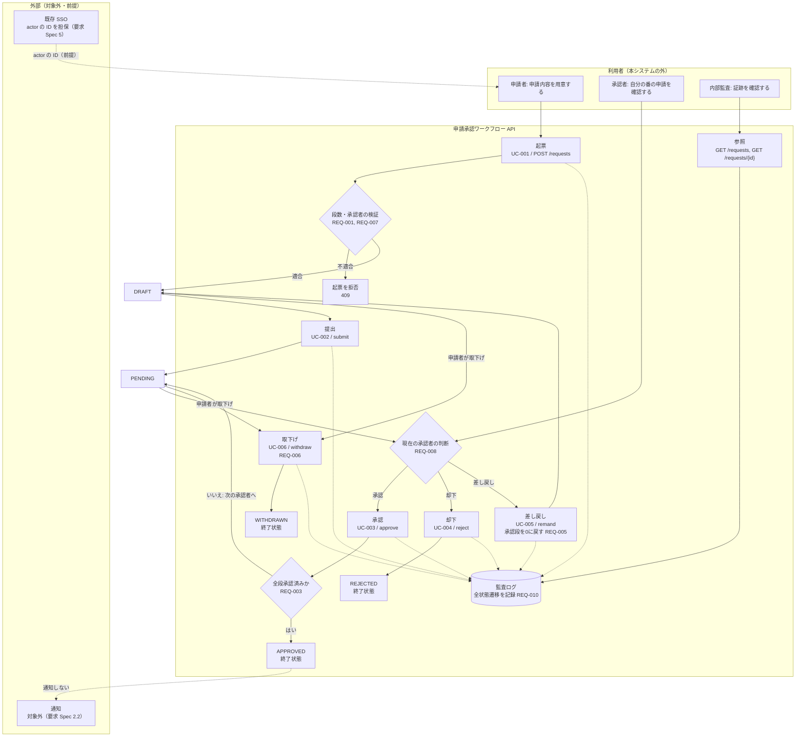

# システム化業務フロー

> **ドラフト（人手の確認が必要）** — 本成果物は人手で書く5点の1つだが、Phase 1-2 で作成されて
> いなかったため、Phase 6 の逆生成時に要求 Spec・Design Spec から起こした。発注者・開発者の確認を
> 経るまで合意済みの成果物として扱わない。

**工程成果物**: システム振舞い ② ／ **由来**: Spec（人手更新）
**逆生成元**: `docs/requirement-spec.md` 1 業務背景 / 2 スコープ / 3.1 ユースケース一覧 / 3.2 業務ルール / 5 前提条件、`docs/design-spec.md` 3 状態遷移図
**対象**: 申請承認ワークフロー（approval-workflow） ／ **版**: 0.1（ドラフト） ／ **日付**: 2026-09-19

> 業務全体を俯瞰する流れ図において、システム化する部分を識別したもの。

## 申請承認フロー

## 担当と実行契機

| 作業 | 担当 | 契機 | 自動/手動 |
|---|---|---|---|
| 起票・提出 | 申請者 | 随時（備品・経費の購入前） | 手動（API） |
| 承認・却下・差し戻し | 承認者（上長） | 随時（自分が現在の承認者の申請） | 手動（API） |
| 取下げ | 申請者 | 随時（DRAFT / PENDING の間） | 手動（API） |
| 監査ログの確認 | 内部監査 | 随時 | 手動（API の参照） |
| 承認段数の決定 | システム | 起票時 | 自動（金額から決定。REQ-001） |

[要確認] 承認者が「自分の番」を知る手段。要求 Spec 1.3 は承認者の期待として「自分の番だけ通知され」を
挙げているが、通知は対象外（2.2）であり、承認者は API の参照（`next_approver`）で確認するしかない。

## 業務上の分岐

| 分岐 | 条件 | 動作 | 要件 |
|---|---|---|---|
| 承認段数 | 金額 10万円未満 / 10万〜100万円未満 / 100万円以上 | 承認者 1 / 2 / 3 名。人数が合わなければ起票を拒否 | REQ-001 |
| 自己承認 | 申請者が承認者に含まれる | 起票を拒否 | REQ-007 |
| 承認順序 | 操作者が現在の承認者でない | 承認・却下・差し戻しを拒否 | REQ-008 |
| 最終段の承認 | 全段の承認が済んだ | APPROVED（終了状態） | REQ-003 |
| 却下 | 現在の承認者が却下した | REJECTED（終了状態） | REQ-004 |
| 差し戻し | 現在の承認者が差し戻した | DRAFT に戻し、承認段を 0 にリセット。再提出で最初の承認者からやり直し | REQ-005 |
| 取下げ | 申請者が DRAFT / PENDING で取下げた | WITHDRAWN（終了状態） | REQ-006 |
| 終了済みへの操作 | APPROVED / REJECTED / WITHDRAWN の申請への操作 | 拒否（何もしない） | REQ-009 |
| 対象不在 | 存在しない申請への参照・操作 | 「対象不在」として拒否（何もしない） | REQ-011 |
| 入力不正 | 定義されていない入力項目を含む | 「入力不正」として拒否（何もしない） | REQ-012 |

拒否された操作では、申請の状態も監査ログも変わらない（Design Spec 4.3、PROP-008 / PROP-009）。
