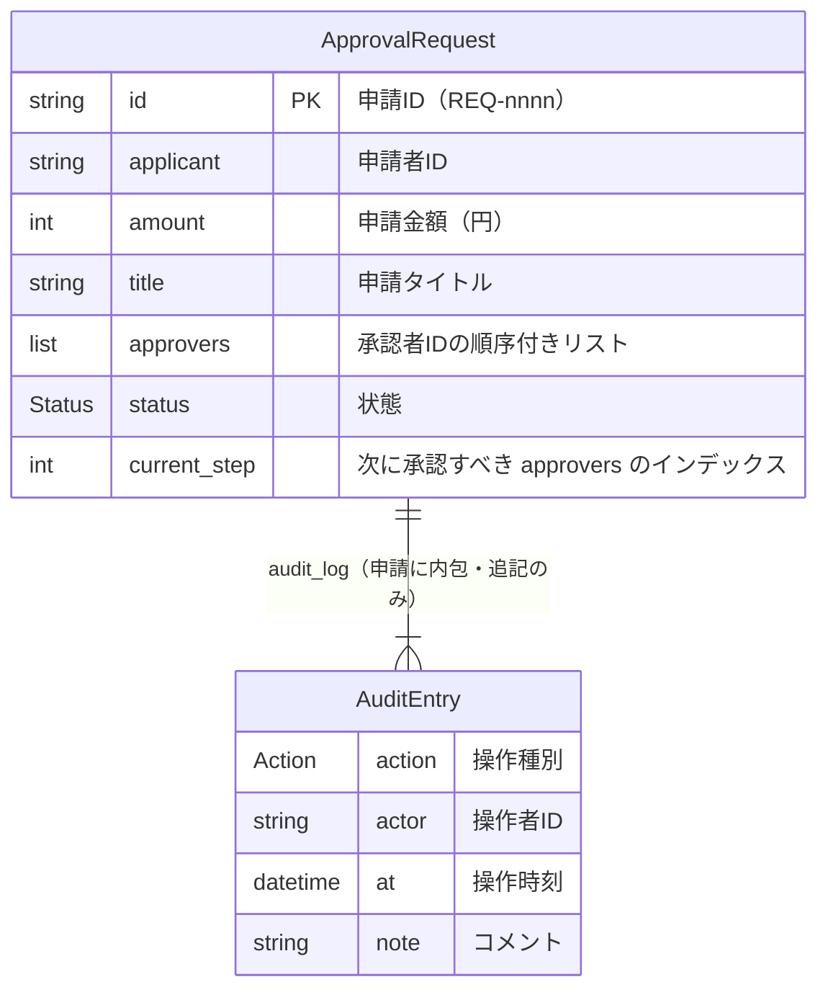

# ER図

**工程成果物**: データモデル ① ／ **由来**: **コードから逆生成**
**逆生成元**: `app/models.py`（`ApprovalRequest`, `AuditEntry`, `Status`, `Action`）、`app/workflow.py`（`WorkflowService._store`, `WorkflowService.create_request`）
**対象**: 申請承認ワークフロー（approval-workflow） ／ **版**: 1.0 ／ **日付**: 2026-09-19

関連の多重度は「1件以上」とした。`create_request` が申請を登録する前に `CREATE` のエントリを
必ず1件記録するため、監査ログが空の申請は存在しない。

## 構造上の重要点

### 利用者（申請者・承認者）のエンティティを持たない

申請者・承認者・操作者はすべて ID 文字列（`str`）として保持し、利用者マスタを参照しない。
認証・認可は既存 SSO が担い、actor の ID は信頼できるという前提による（要求 Spec 2.2・5）。
このため「承認者が実在するか」「上長か」は本システムでは検証しない。

### 監査ログを独立したエンティティにせず、申請に内包する

`AuditEntry` は申請ごとの `audit_log` リストの要素であり、独自の ID も、申請を指す外部キーも
持たない。申請オブジェクト単体で証跡が完結するようにする判断による（ADR-0002「影響」）。
監査ログのエントリは `frozen=True` で、書き換えできない（ADR-0002）。

### 承認段数・承認済みの人を属性として持たない

- **必要承認段数**は保持しない。起票時に `required_approval_levels(amount)` で算出し、承認者の
  人数と一致することを検証するだけである（REQ-001）。金額を変える経路が無いため、
  `len(approvers)` が常に段数に等しい
- **承認済みの人のリスト**は保持しない。進捗は `current_step`（次に承認すべき approvers の
  インデックス）1つで表し、承認済みの人は `approvers[:current_step]`、誰がいつ承認したかは
  監査ログで分かる。差し戻しでは `current_step` を 0 に戻す（REQ-005）

### 削除・更新日時の属性を持たない

削除フラグ・更新日時・版番号の属性は無い。削除の経路が無く（[CRUD図](04-crud-matrix.md)）、
操作の時刻は監査ログの `at` で分かる。
