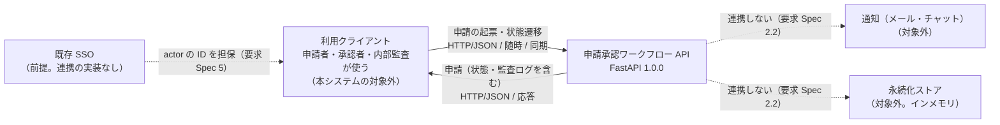

# 外部システム関連図

**工程成果物**: 外部インタフェース ① ／ **由来**: **コードから逆生成**
**逆生成元**: `app/main.py`（FastAPI のエンドポイント定義 8本）、`app/workflow.py` / `app/models.py`（import の確認）
**対象**: 申請承認ワークフロー（approval-workflow） ／ **版**: 1.0 ／ **日付**: 2026-09-19

本システムは画面を持たない HTTP API のみのシステムであり、他システム（利用クライアント）に
API を**提供する**。他システムを**呼び出す**実装（HTTP クライアント・ファイル入出力・
メッセージ送受信）は無い（`app/` の import は `fastapi` / `pydantic` と標準ライブラリの
`dataclasses` / `datetime` / `enum` / `typing` のみ）。

## 連携方式

| 凡例 | 方式 |
|---|---|
| 実線 | 同期 API（HTTP/JSON）。本システムが提供し、クライアントが呼ぶ |
| 点線 | 実装上の連携は無い。前提（SSO）または対象外（通知・永続化）であることを示す |

**同期 API にした理由**: Spec・ADR に明示の記述は無い [要確認]。Design Spec 1 はアーキテクチャを
「モジュラーモノリス」、HTTP 層を「FastAPI 層（薄いラッパー）」と定めており、要求 Spec 4.1 は
Python / FastAPI を社内標準スタックとしている。

**認証**: API は操作者を認証しない。操作者はリクエストボディの `actor`（ID 文字列）で受け取り、
その ID は既存 SSO が担保して信頼できる、という前提に立つ（要求 Spec 2.2・5）。前提が崩れた場合は
なりすまし対策を本システム側に追加する必要がある（要求 Spec 5）。

## 授受のタイミング

| IF | 連携先 | 方向 | タイミング | 起動 |
|---|---|---|---|---|
| `POST /requests` | 利用クライアント | 受信（応答を返す） | 随時 | クライアントの呼び出し |
| `GET /requests` | 利用クライアント | 受信（応答を返す） | 随時 | 同上 |
| `GET /requests/{request_id}` | 利用クライアント | 受信（応答を返す） | 随時 | 同上 |
| `POST /requests/{request_id}/submit` | 利用クライアント | 受信（応答を返す） | 随時 | 同上 |
| `POST /requests/{request_id}/approve` | 利用クライアント | 受信（応答を返す） | 随時 | 同上 |
| `POST /requests/{request_id}/reject` | 利用クライアント | 受信（応答を返す） | 随時 | 同上 |
| `POST /requests/{request_id}/remand` | 利用クライアント | 受信（応答を返す） | 随時 | 同上 |
| `POST /requests/{request_id}/withdraw` | 利用クライアント | 受信（応答を返す） | 随時 | 同上 |

IF の識別子は EIF-ID ではなくメソッド＋パスとした（Spec に EIF の採番が無いため。
[システム振舞い共通ルール](../behavior/04-common-rules.md) の ID 体系を参照）。

応答で返す申請の範囲を絞る条件は無い。`GET /requests` は登録済みの全申請を、操作者を問わず
監査ログごと返す（`list_all`）。どのクライアントに何を見せてよいかは本システムでは制御しない
[要確認: 参照の権限。認可は要求 Spec 2.2 で対象外]。
