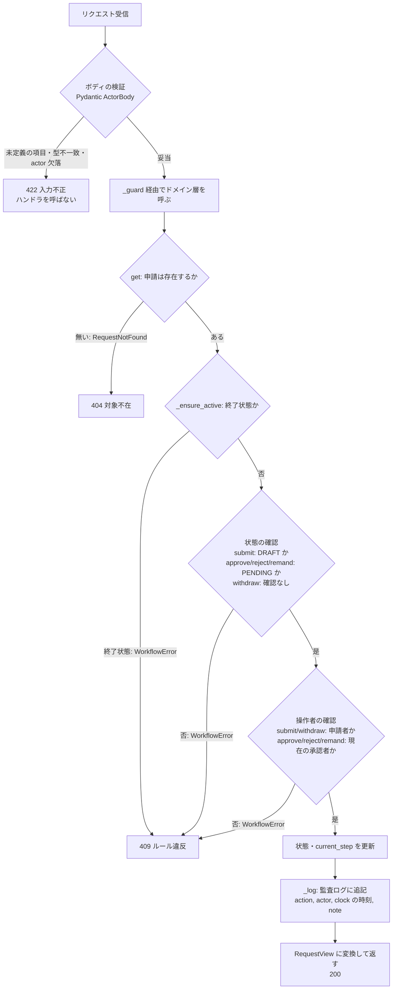
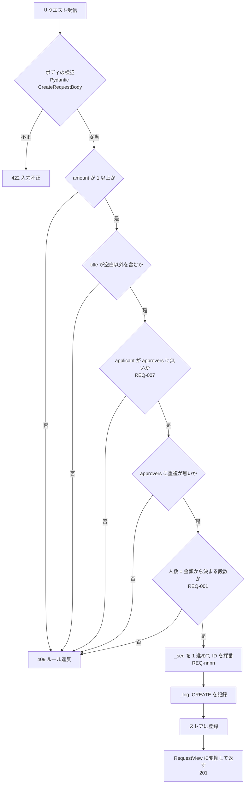

# 外部インタフェース処理説明

**工程成果物**: 外部インタフェース ④ ／ **由来**: コード＋Spec
**逆生成元**: コード — `app/main.py`（`_guard`、各エンドポイント、`CreateRequestBody` / `ActorBody` の `extra="forbid"`）、`app/workflow.py`（`WorkflowService.get` / `create_request` / `submit` / `approve` / `reject` / `remand` / `withdraw` / `_ensure_active` / `_ensure_pending` / `_log`）。Spec — `docs/design-spec.md` 4.3、ADR-0001 / ADR-0003
**対象**: 申請承認ワークフロー（approval-workflow） ／ **版**: 1.0 ／ **日付**: 2026-09-19

本システムは他システムからの取込・他システムへの出力を持たない。本書では、提供する HTTP API が
1件のリクエストをどう処理するかを記述する。フロー図と「再実行時の動作」はコードから、
「設計上の判断」の理由は Spec・ADR から引用した。

---

## 状態遷移 5本（submit / approve / reject / remand / withdraw）

**起動**: 随時（クライアントの呼び出し）。例: `approve(request_id: str, body: ActorBody) -> RequestView`
→ `WorkflowService.approve(request_id, actor, note)`

### 設計上の判断

| 判断 | 理由 |
|---|---|
| 判定の順序を 入力不正（422）→ 対象不在（404）→ ルール違反（409）にする | FastAPI はハンドラを呼ぶ前にボディを検証するため、存在しない ID に不正なボディを送った場合は 422 になる（ADR-0003「判断」、Design Spec 4.3） |
| 例外の型で変換先を決め、`_guard` 1箇所で全エンドポイントを同じように変換する | メッセージ文字列や呼び出し元のエンドポイントで分けると、文言の変更で変換先が変わる。エンドポイントごとに変換を書くと書き漏れる（ADR-0003「理由」「検討した代替案」） |
| `RequestNotFound` を `WorkflowError` のサブクラスにしない | サブクラスにすると except 節の並び順を誤っただけで 404 が 409 に化ける（ADR-0003「理由」）。`_guard` は `RequestNotFound` を先に捕まえているが、順序に依存しない |
| 存在確認をエンドポイントでせず、`WorkflowService.get` を通して行う | 状態遷移メソッドはすべて `get()` で対象を取るため、参照・状態遷移のすべてで同じ例外になる。エンドポイントで個別に確認すると6か所に散らばる（ADR-0003「判断」「検討した代替案」、ADR-0001） |
| 未定義の項目を無視せず 422 で拒否する | 項目名を打ち間違えたコメントが黙って捨てられ、監査証跡が欠けるのを防ぐ（ADR-0003「理由」、REQ-012） |
| 検証をすべて終えてから書き込む | いずれの異常時も申請の状態と監査ログを変更しない（Design Spec 4.3）。コードでは、どのメソッドも確認がすべて書き込み（状態の更新と `_log`）より前にある |

### 再実行時の動作

同じ状態遷移リクエストを2回送った場合（応答を受け取れずに再送した場合など）、**2回目は 409 になり、
状態も監査ログも二重には変わらない。** 1回目の成功で状態が変わり、2回目は状態または操作者の確認に
かからないためである（コードから導出。同じ操作の二重実行をテストで直接検証しているのは、
提出 `test_cannot_submit_twice`、最終段の承認 `test_cannot_operate_on_terminal_request`、
取下げ `test_rule_violation_on_terminal_request_is_still_409[withdraw]` の3つ。
最終段以外の承認・却下・差し戻しの二重実行を直接検証するテストは無い）。

| 操作 | 1回目の成功後 | 2回目の結果 |
|---|---|---|
| submit | PENDING | 409「起票中の申請のみ提出できます」 |
| approve（最終段以外） | 次の承認者に進む | 409「承認順序が不正です…」（承認者の重複は起票時に拒否しているため、同じ人が次の承認者になることはない） |
| approve（最終段） / reject / withdraw | 終了状態 | 409「終了済みの申請は操作できません…」 |
| remand | DRAFT | 409「承認待ちの申請のみ操作できます」 |

クライアントは 409 を受けたとき、`GET /requests/{request_id}` で現在の状態と監査ログを確認すれば、
1回目が成功していたかを判別できる。

**[要確認] 同時実行の排他制御が無い。** `WorkflowService` は申請の読み取りから書き込みまでを
ロックせずに行う。同じ申請への状態遷移が同時に届いた場合の動作は、コード・Spec・テストのいずれでも
定められていない。

---

## 起票（`POST /requests`）

**起動**: 随時。`create_request(body: CreateRequestBody) -> RequestView` → `WorkflowService.create_request(applicant, amount, title, approvers)`

### 設計上の判断

| 判断 | 理由 |
|---|---|
| 金額 1 未満・空のタイトルを 422 ではなく 409 にする | 型としては正しいのでドメイン層で判定する。**Design Spec 4.3 は、これらを 422 に寄せるかを未確定としている**（設計レビュー W-1。確定: 次回の Design Spec 改訂時 / 担当: アーキテクト） |
| 採番は全検証を通ってから行う | 拒否された起票で連番が進まない（コードの並び順から） |

### 再実行時の動作

**起票は冪等ではない。** 同じ内容を2回送ると、別の ID（`REQ-0001`, `REQ-0002`, …）で申請が2件作られる。
重複を検出するキー（冪等キー等）は無い。応答を受け取れずに再送した場合は、`GET /requests` で
二重に作られていないかを確認する必要がある [要確認: 二重起票の扱いは Spec に無い]。

---

## 参照（`GET /requests` / `GET /requests/{request_id}`）

**起動**: 随時。`list_requests()` → `WorkflowService.list_all()` ／ `get_request(request_id)` → `WorkflowService.get(request_id)`

| 事象 | 動作 |
|---|---|
| 一覧 | 登録済みの全申請を、監査ログを含めて起票の古い順に返す。0件なら空の配列 |
| 取得で申請が存在する | その申請を返す（200） |
| 取得で申請が存在しない | 404 |

参照は何も書き込まないため、何度実行しても結果に影響しない。
