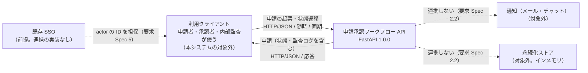
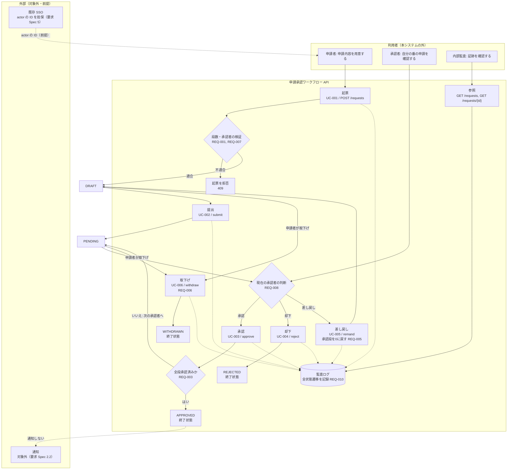
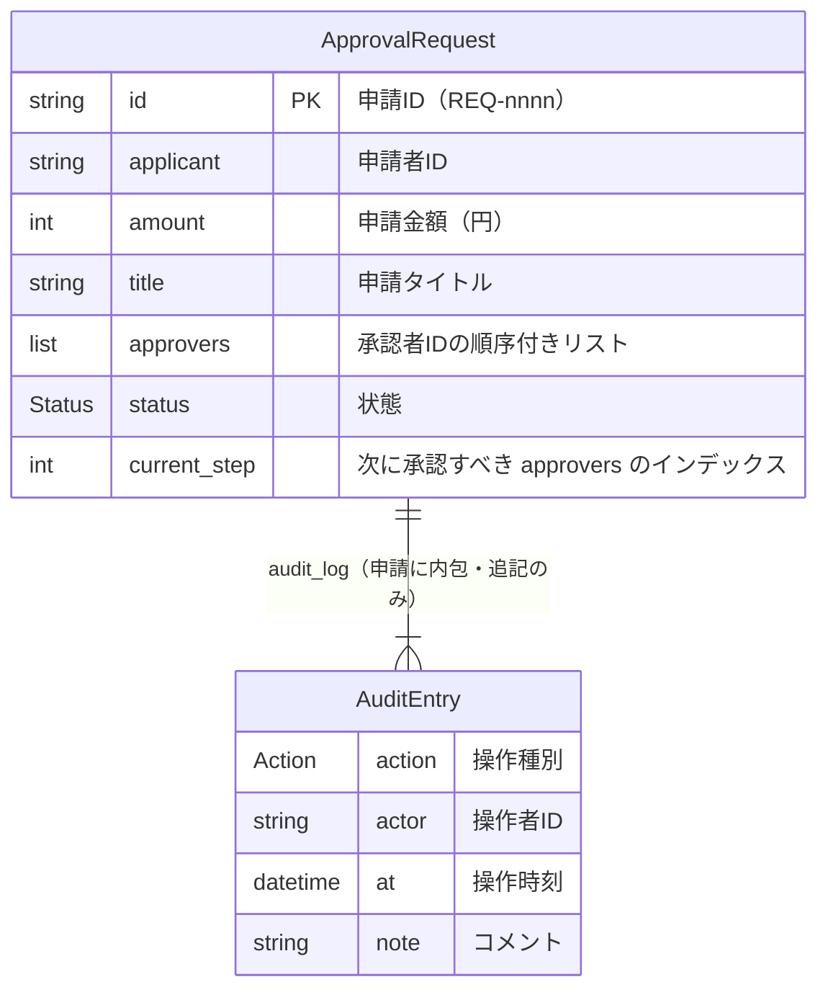
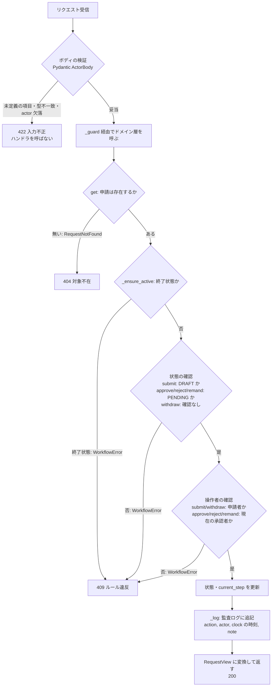
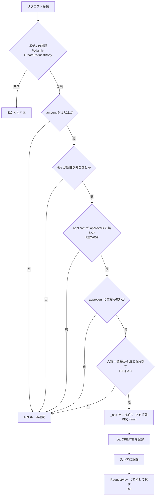

# 基本設計書 — 申請承認ワークフロー

> **本書はプロジェクトの組立定義に基づいていない。** `docs/design-docs/assembly-kihon-sekkei.md` が無く、
> **顧客と目次を合意していない**ため、`doc-reverse-gen` Skill 同梱の組立例
> `templates/deliverables/assembly/kihon-sekkei.md` の目次をそのまま使って組み立てた。
> 顧客と目次を合意したら、組立定義を `docs/design-docs/assembly-kihon-sekkei.md` に保存して
> 組み立て直すこと（組立ガイド 4）。

**設計書**: 基本設計書（外部設計） ／ **対象**: 申請承認ワークフロー（approval-workflow）
**版**: 1.0（納品版・Phase 6） ／ **組立日**: 2026-09-19 ／ **組立時の HEAD**: `f3ccb67`
**構成要素**: [工程成果物](../deliverables/README.md)（本システムが持つ12点）＋ 要求 Spec ＋ Design Spec ＋ ADR ＋ トレーサビリティマトリクス

> **本書は工程成果物を束ねたビューであり、直接編集しない。** 修正は構成要素（`docs/deliverables/`、
> Spec、ADR）の側で行い、逆生成した章はさらにその逆生成元（コード・受入テスト）を直してから
> 組み立て直す。構成要素の本文は書き換えていない。組立で変えたのは見出しのレベルと、
> 相対リンクのパス（本書の置き場所から辿れるように付け替えた）だけである。

## 本書の読み方

各章の冒頭に**由来**を表示している。顧客レビューで重点を置くべきは**人手で書いた章**
（1章、2.1、3.1、3.2、3.4、3.5、9章、10章）である。逆生成した章（2.2、3.3、6章、7章、11章）は
「実装がこうなっている」という事実の記述であり、3.3 は通っている受入テストが、6・7章は
コードがその正しさの根拠である。

| 由来 | 意味 |
|---|---|
| 人手 | Spec・ADR として人が書き、合意したもの |
| 人手（ドラフト） | 本来は人手で書く工程成果物だが、Phase 6 に Spec から起こした下書き。**未合意** |
| 受入テストから逆生成 | hold-out 受入テスト（全て通過）から起こしたもの |
| コードから逆生成 | 実装から機械的に起こしたもの |
| コード＋Spec | コード由来の部分と、Spec・ADR からの引用を併せたもの |

本書は**納品版（Phase 6）**である。組立例の「事前提出」列の代替物は使っておらず、逆生成する章は
すべて実装から逆生成した版を収めた。

本システムは HTTP API のみのシステムで、**画面・帳票・バッチを持たない**。4・5・8章は章を残して
「該当なし」と理由を書いた。本システムが提供する API は外部インタフェース（2.2、7章）として扱う。

## 目次

| 章 | 構成要素 | 由来 |
|---|---|---|
| 1.1 目的・業務背景 | 要求 Spec 1 業務背景 | 人手 |
| 1.2 対象範囲・対象外 | 要求 Spec 2 スコープ | 人手 |
| 1.3 制約・前提 | 要求 Spec 4 制約条件 / 5 前提条件 | 人手 |
| 2.1 アーキテクチャ | Design Spec 1 アーキテクチャ概要 | 人手 |
| 2.2 外部システム関連 | ⑮ 外部システム関連図 | コードから逆生成 |
| 3.1 システム化業務一覧 | ① システム化業務一覧 | 人手（ドラフト） |
| 3.2 システム化業務フロー | ② システム化業務フロー | 人手（ドラフト） |
| 3.3 システム化業務説明 | ③ システム化業務説明 | 受入テストから逆生成 |
| 3.4 業務ルール | 要求 Spec 3.2 業務ルール（REQ）、3.3 Property（PROP） | 人手 |
| 3.5 共通ルール | ④ システム振舞い共通ルール | 人手（ドラフト） |
| 4.1〜4.6 画面 | ⑤〜⑩ | 該当なし |
| 5.1〜5.5 帳票 | ㉓〜㉗ | 該当なし |
| 6.1 ER図 | ⑪ ER図 | コードから逆生成 |
| 6.2 エンティティ一覧 | ⑫ エンティティ一覧 | コードから逆生成 |
| 6.3 エンティティ定義 | ⑬ エンティティ定義 | コードから逆生成 |
| 6.4 CRUD図 | ⑭ CRUD図 | コードから逆生成 |
| 7.1 外部インタフェース一覧 | ⑯ 外部インタフェース一覧 | コードから逆生成 |
| 7.2 外部インタフェース項目 | ⑰ 外部インタフェース項目説明 | コードから逆生成 |
| 7.3 外部インタフェース処理 | ⑱ 外部インタフェース処理説明 | コード＋Spec |
| 8.1〜8.4 バッチ | ⑲〜㉒ | 該当なし |
| 9.1 非機能要件 | 要求 Spec 3.5 非機能要件 | 人手 |
| 9.2 非機能設計 | Design Spec 5 非機能設計（組立例の「Design Spec 7」に相当する節。下の注記） | 人手 |
| 9.3 セキュリティ | 該当する Design Spec の節なし（下の注記） | — |
| 10. 設計判断 | ADR-0001〜0003 | 人手 |
| 11. トレーサビリティ | `docs/traceability.md` | 逆生成 |
| 付録A 構成要素の版表 | — | — |
| 付録B 組立後の検査 | — | — |

---

## 1. システム概要

### 1.1 目的・業務背景

> 由来: 人手（`docs/requirement-spec.md` 1. 業務背景）

> 出典: docs/requirement-spec.md#1. 業務背景

#### 1. 業務背景

##### 1.1 現行業務の課題

備品・経費の申請承認を Excel と社内メールで運用しており、(1) 承認順序が守られない、
(2) 誰がいつ承認したかの記録が散逸する、(3) 申請者本人が代理承認してしまう統制違反が
発生している。

##### 1.2 本システムで解決したいこと

申請の状態と承認順序をシステムで強制し、全操作を監査ログに残すことで、統制（内部統制）
を担保する。金額に応じた承認段数を自動決定し、運用の属人性を排除する。

##### 1.3 ステークホルダーと期待

| ステークホルダー | 役割 | 主な期待 |
|---|---|---|
| 申請者（一般社員） | 申請の起票・提出・取下げ | 簡単に申請でき、状態が分かる |
| 承認者（上長） | 承認・却下・差し戻し | 自分の番だけ通知され、順序が守られる |
| 内部監査 | 監査ログ閲覧 | 全操作の証跡が改ざん不能で残る |

### 1.2 対象範囲・対象外

> 由来: 人手（`docs/requirement-spec.md` 2. スコープ）

> 出典: docs/requirement-spec.md#2. スコープ

#### 2. スコープ

##### 2.1 対象業務範囲

申請の起票から承認完了/却下/取下げまでの状態管理、金額に応じた承認段数の決定、
承認順序の強制、監査ログの記録。

##### 2.2 対象外の明示

- 認証・認可基盤（既存 SSO を利用する前提。本サンプルでは actor を ID 文字列で受ける）
- 通知（メール/チャット連携）
- 永続化（本サンプルはインメモリ。実装の差し替え点は Design Spec 参照）

### 1.3 制約・前提

> 由来: 人手（`docs/requirement-spec.md` 4. 制約条件, `docs/requirement-spec.md` 5. 前提条件）

> 出典: docs/requirement-spec.md#4. 制約条件

#### 4. 制約条件

##### 4.1 技術的制約

| 制約 | 根拠 |
|---|---|
| Python / FastAPI | 社内標準スタック。サンプルの再現性のため |

##### 4.2 組織的制約

なし（サンプルのため、運用体制などの組織的制約は置かない）。

##### 4.3 法規制・コンプライアンス

内部統制（J-SOX）対応のため、承認の証跡保全が必須。

> 出典: docs/requirement-spec.md#5. 前提条件

#### 5. 前提条件

| 前提 | 前提が崩れた場合の影響 |
|---|---|
| 認証は外部 SSO が担保し、actor の ID は信頼できる | なりすまし対策を本システム側に追加実装する必要が生じる |

## 2. システム構成

### 2.1 アーキテクチャ

> 由来: 人手（`docs/design-spec.md` 1. アーキテクチャ概要）

> 出典: docs/design-spec.md#1. アーキテクチャ概要

#### 1. アーキテクチャ概要

モジュラーモノリス。ドメインロジックを HTTP/永続化から分離する。

```
app/
├── models.py    … ドメインモデル（Status / Action / ApprovalRequest / AuditEntry）
├── workflow.py  … ステートマシン（WorkflowService）★ビジネスルールの単一の置き場所
│                  不在は RequestNotFound、ルール違反は WorkflowError を送出（ADR-0003）
└── main.py      … FastAPI 層（薄いラッパー）。例外を HTTP ステータスへ変換する
                   RequestNotFound → 404 / WorkflowError → 409 / 入力不正（Pydantic）→ 422
```

設計の要は **ビジネスルールを `workflow.py` に集約**し、HTTP もDBも知らない純粋ロジックに
すること。これにより TDD（Phase 4）は `workflow.py` を高速・網羅的に検証でき、API 層は
結線テストのみで足りる。

### 2.2 外部システム関連

> 由来: **コードから逆生成**（`app/main.py`、`app/` の import）

**工程成果物**: 外部インタフェース ① ／ **由来**: **コードから逆生成**
**逆生成元**: `app/main.py`（FastAPI のエンドポイント定義 8本）、`app/workflow.py` / `app/models.py`（import の確認）
**対象**: 申請承認ワークフロー（approval-workflow） ／ **版**: 1.0 ／ **日付**: 2026-09-19

本システムは画面を持たない HTTP API のみのシステムであり、他システム（利用クライアント）に
API を**提供する**。他システムを**呼び出す**実装（HTTP クライアント・ファイル入出力・
メッセージ送受信）は無い（`app/` の import は `fastapi` / `pydantic` と標準ライブラリの
`dataclasses` / `datetime` / `enum` / `typing` のみ）。



#### 連携方式

| 凡例 | 方式 |
|---|---|
| 実線 | 同期 API（HTTP/JSON）。本システムが提供し、クライアントが呼ぶ |
| 点線 | 実装上の連携は無い。前提（SSO）または対象外（通知・永続化）であることを示す |

**同期 API にした理由**: Spec・ADR に明示の記述は無い [要確認]。Design Spec 1 はアーキテクチャを
「モジュラーモノリス」、HTTP 層を「FastAPI 層（薄いラッパー）」と定めており、要求 Spec 4.1 は
Python / FastAPI を社内標準スタックとしている。

**認証**: API は操作者を認証しない。操作者はリクエストボディの `actor`（ID 文字列）で受け取り、
その ID は既存 SSO が担保して信頼できる、という前提に立つ（要求 Spec 2.2・5）。前提が崩れた場合は
なりすまし対策を本システム側に追加する必要がある（要求 Spec 5）。

#### 授受のタイミング

| IF | 連携先 | 方向 | タイミング | 起動 |
|---|---|---|---|---|
| `POST /requests` | 利用クライアント | 受信（応答を返す） | 随時 | クライアントの呼び出し |
| `GET /requests` | 利用クライアント | 受信（応答を返す） | 随時 | 同上 |
| `GET /requests/{request_id}` | 利用クライアント | 受信（応答を返す） | 随時 | 同上 |
| `POST /requests/{request_id}/submit` | 利用クライアント | 受信（応答を返す） | 随時 | 同上 |
| `POST /requests/{request_id}/approve` | 利用クライアント | 受信（応答を返す） | 随時 | 同上 |
| `POST /requests/{request_id}/reject` | 利用クライアント | 受信（応答を返す） | 随時 | 同上 |
| `POST /requests/{request_id}/remand` | 利用クライアント | 受信（応答を返す） | 随時 | 同上 |
| `POST /requests/{request_id}/withdraw` | 利用クライアント | 受信（応答を返す） | 随時 | 同上 |

IF の識別子は EIF-ID ではなくメソッド＋パスとした（Spec に EIF の採番が無いため。
[システム振舞い共通ルール](../deliverables/behavior/04-common-rules.md) の ID 体系を参照）。

応答で返す申請の範囲を絞る条件は無い。`GET /requests` は登録済みの全申請を、操作者を問わず
監査ログごと返す（`list_all`）。どのクライアントに何を見せてよいかは本システムでは制御しない
[要確認: 参照の権限。認可は要求 Spec 2.2 で対象外]。

## 3. 業務機能

### 3.1 システム化業務一覧

> 由来: 人手・**ドラフト（人手の確認が必要）**（要求 Spec 1.3 / 2 / 3.1、Design Spec 4.1）

> **ドラフト（人手の確認が必要）** — 本成果物は人手で書く5点の1つだが、Phase 1-2 で作成されて
> いなかったため、Phase 6 の逆生成時に要求 Spec から起こした。発注者・開発者の確認を経るまで
> 合意済みの成果物として扱わない。

**工程成果物**: システム振舞い ① ／ **由来**: Spec（人手更新）
**逆生成元**: `docs/requirement-spec.md` 1.3 ステークホルダーと期待 / 2 スコープ / 3.1 ユースケース一覧、`docs/design-spec.md` 4.1 エンドポイント一覧
**対象**: 申請承認ワークフロー（approval-workflow） ／ **版**: 0.1（ドラフト） ／ **日付**: 2026-09-19

> 業務全体のうち、システム化する作業と機能を一覧にしたもの。
> **この成果物はコードから逆生成できない。** 「何を作るか」の合意であり、実装には現れない。

#### 業務一覧

本システムは画面・帳票・バッチを持たない HTTP API のみのシステムのため、実現手段の列には
API エンドポイント（メソッド＋パス）を書く。外部インタフェース ID（EIF-nnn）は Spec に
採番が無いため振っていない（[外部インタフェース一覧](../deliverables/external-if/02-interface-list.md) 参照）。

| 業務 | 中機能 | 小機能 | UC | システム化 | 実現手段 |
|---|---|---|---|---|---|
| 申請承認 | 申請 | 申請を起票する | UC-001 | ○ | `POST /requests` |
| 申請承認 | 申請 | 申請を提出する | UC-002 | ○ | `POST /requests/{id}/submit` |
| 申請承認 | 申請 | 申請を取下げる | UC-006 | ○ | `POST /requests/{id}/withdraw` |
| 申請承認 | 承認 | 申請を承認する | UC-003 | ○ | `POST /requests/{id}/approve` |
| 申請承認 | 承認 | 申請を却下する | UC-004 | ○ | `POST /requests/{id}/reject` |
| 申請承認 | 承認 | 申請を差し戻す | UC-005 | ○ | `POST /requests/{id}/remand` |
| 申請承認 | 照会 | 申請を一覧する | — | ○ | `GET /requests` |
| 申請承認 | 照会 | 申請を取得する | — | ○ | `GET /requests/{id}` |
| 監査 | 監査ログ閲覧 | 申請ごとの監査ログを閲覧する | — | ○ | `GET /requests/{id}` / `GET /requests` の `audit_log` |
| 申請承認 | 申請 | 差し戻された申請の内容を修正する | — | **[要確認]** | なし |
| 認証・認可 | — | — | — | **×** | 既存 SSO（要求 Spec 2.2） |
| 通知 | — | — | — | **×** | 対象外（要求 Spec 2.2） |
| 永続化 | — | — | — | **×** | 対象外。インメモリ（要求 Spec 2.2、Design Spec 5.2） |

**[要確認] 照会・監査ログ閲覧に UC が無い。** 要求 Spec 1.3 は内部監査の期待として
「監査ログ閲覧」を挙げているが、3.1 のユースケース一覧には対応する UC が無い。実装では
`GET /requests` / `GET /requests/{id}` の応答に監査ログが含まれる（Design Spec 4.1 では対応 UC「—」）。

**[要確認] 差し戻し後の再編集を実現する手段が無い。** 要求 Spec 3.1 は UC-005 を
「PENDING → DRAFT（再編集を促す）」、`app/models.py` は DRAFT を「起票中（申請者が編集可能）」と
説明しているが、申請の金額・タイトル・承認者を変更する API・メソッドは存在しない。差し戻された
申請は、そのまま再提出するか取下げるしかない。システム化するか・対象外とするかを合意する必要がある。

#### システム化しない業務を載せる理由

「やらないこと」を発注者と明示的に合意するため。IPA ガイドが挙げる齟齬の類型に
「開発者が何らかの理由により誤認・拡大解釈し、実現範囲に盛り込んでしまった」がある。
対象外を書かないと、この齟齬は防げない。

実装レベルの拡大解釈は2段で止めている。G1 のスコープ検査（`.jsix-checks.json` の
`gates.g1.scope`）は変更ファイルが許可範囲（`app/**` ほか）に収まるかをファイル単位で検査する。
許可範囲内での機能の拡大解釈はファイル単位では検出できないため、G3（scope-judge）がタスク定義と
Spec に照らしてスコープ逸脱を判定する。

### 3.2 システム化業務フロー

> 由来: 人手・**ドラフト（人手の確認が必要）**（要求 Spec 1 / 2 / 3.1 / 3.2 / 5、Design Spec 3）

> **ドラフト（人手の確認が必要）** — 本成果物は人手で書く5点の1つだが、Phase 1-2 で作成されて
> いなかったため、Phase 6 の逆生成時に要求 Spec・Design Spec から起こした。発注者・開発者の確認を
> 経るまで合意済みの成果物として扱わない。

**工程成果物**: システム振舞い ② ／ **由来**: Spec（人手更新）
**逆生成元**: `docs/requirement-spec.md` 1 業務背景 / 2 スコープ / 3.1 ユースケース一覧 / 3.2 業務ルール / 5 前提条件、`docs/design-spec.md` 3 状態遷移図
**対象**: 申請承認ワークフロー（approval-workflow） ／ **版**: 0.1（ドラフト） ／ **日付**: 2026-09-19

> 業務全体を俯瞰する流れ図において、システム化する部分を識別したもの。

#### 申請承認フロー



#### 担当と実行契機

| 作業 | 担当 | 契機 | 自動/手動 |
|---|---|---|---|
| 起票・提出 | 申請者 | 随時（備品・経費の購入前） | 手動（API） |
| 承認・却下・差し戻し | 承認者（上長） | 随時（自分が現在の承認者の申請） | 手動（API） |
| 取下げ | 申請者 | 随時（DRAFT / PENDING の間） | 手動（API） |
| 監査ログの確認 | 内部監査 | 随時 | 手動（API の参照） |
| 承認段数の決定 | システム | 起票時 | 自動（金額から決定。REQ-001） |

[要確認] 承認者が「自分の番」を知る手段。要求 Spec 1.3 は承認者の期待として「自分の番だけ通知され」を
挙げているが、通知は対象外（2.2）であり、承認者は API の参照（`next_approver`）で確認するしかない。

#### 業務上の分岐

| 分岐 | 条件 | 動作 | 要件 |
|---|---|---|---|
| 承認段数 | 金額 10万円未満 / 10万〜100万円未満 / 100万円以上 | 承認者 1 / 2 / 3 名。人数が合わなければ起票を拒否 | REQ-001 |
| 自己承認 | 申請者が承認者に含まれる | 起票を拒否 | REQ-007 |
| 承認順序 | 操作者が現在の承認者でない | 承認・却下・差し戻しを拒否 | REQ-008 |
| 最終段の承認 | 全段の承認が済んだ | APPROVED（終了状態） | REQ-003 |
| 却下 | 現在の承認者が却下した | REJECTED（終了状態） | REQ-004 |
| 差し戻し | 現在の承認者が差し戻した | DRAFT に戻し、承認段を 0 にリセット。再提出で最初の承認者からやり直し | REQ-005 |
| 取下げ | 申請者が DRAFT / PENDING で取下げた | WITHDRAWN（終了状態） | REQ-006 |
| 終了済みへの操作 | APPROVED / REJECTED / WITHDRAWN の申請への操作 | 拒否（何もしない） | REQ-009 |
| 対象不在 | 存在しない申請への参照・操作 | 「対象不在」として拒否（何もしない） | REQ-011 |
| 入力不正 | 定義されていない入力項目を含む | 「入力不正」として拒否（何もしない） | REQ-012 |

拒否された操作では、申請の状態も監査ログも変わらない（Design Spec 4.3、PROP-008 / PROP-009）。

### 3.3 システム化業務説明

> 由来: **受入テストから逆生成**（`tests/acceptance/` 72件・全て通過）

**工程成果物**: システム振舞い ③ ／ **由来**: **hold-out 受入テストから逆生成**
**逆生成元**: `tests/acceptance/`（7ファイル・72件〔parametrize 展開後〕・全て通過。2026-09-19 に `pytest tests/acceptance` で確認）
**対象**: 申請承認ワークフロー（approval-workflow） ／ **版**: 1.0 ／ **日付**: 2026-09-19

> システム利用作業と機能の内容を、事前条件・事後条件・基本シナリオで記述したもの。

#### この成果物が逆生成できる理由

IPA ガイドが想定する「システム化業務説明」の構成要素は、**受入テストの構造そのもの**である。

| 工程成果物の欄 | 受入テストの対応物 |
|---|---|
| 事前条件 | fixture（`client`: 申請ストアを空にして API クライアントを返す）と、各テストの準備関数（`_create` / `_pending` / `_submitted` / `_prepare`）が作る状態 |
| 基本シナリオ | テスト本体の操作列 |
| 事後条件 | アサーション |
| 入力データ / 出力データ | リクエストと検証対象のレスポンス |

したがって本書の記述は**通っているテストが根拠**であり、実装との乖離が起こらない。
テストが落ちれば本書も誤りになるため、G2 が本書の正しさを保証している。

対象は `tests/acceptance/`（hold-out 受入テスト）に限る。実装を書く工程が読めない
テストであり、実装に引きずられていないため。

##### 本書を読む前提

- 受入テストは HTTP API 経由でのみ検証する（`tests/acceptance/conftest.py`）。例外として
  `test_cross_request_not_found_domain.py` だけはドメイン層の公開された例外を検証する（本書末尾の横断 3）。
- **成功の判定は 2xx で行っている。** 成功時のステータスコード（201 / 200 など）は Design Spec が
  規定していないため、受入テストは固定していない（`conftest.py` の docstring）。本書でも
  「成功（2xx）」と書く。
- テストの登場人物は、申請者 `alice`、承認者 `bob`・`carol`（2段承認では `bob` → `carol` の順）。
- 失敗時のステータスは 409（ルール違反）/ 404（対象不在）/ 422（入力不正）で、受入テストが固定している。

---

#### UC-001 申請を起票する

| 項目 | 内容 |
|---|---|
| 概要 | 申請者が金額・タイトル・承認者を指定して、DRAFT の申請を作成する |
| アクター | 申請者 |
| 事前条件 | 申請が1件も無い（`client` fixture がストアを空にする） |
| 事後条件 | 状態 DRAFT の申請が作られ、申請者・金額・承認者が入力どおりで、監査ログが `CREATE` の1件だけであること。作った申請を ID で取得できること |
| 入力データ | `applicant`=`alice`, `amount`=`50000`, `title`=`備品購入`, `approvers`=`["bob"]` |
| 出力データ | 申請（`id`, `status`=`DRAFT`, `applicant`=`alice`, `amount`=`50000`, `approvers`=`["bob"]`, `audit_log` の action 列 = `["CREATE"]`） |
| 根拠テスト | `test_uc001_applicant_creates_draft_request` |

**基本シナリオ**

1. 申請者が `POST /requests` に、金額 50,000 円・承認者1名（`bob`）で起票する
2. システムは成功（2xx）を返し、状態 DRAFT の申請を返す。監査ログには `CREATE` が1件残る
3. 申請者が返された `id` で `GET /requests/{id}` を呼ぶと、同じ申請が取得できる

**代替シナリオ**

| 状況 | 動作 | 根拠テスト |
|---|---|---|
| 申請者自身を承認者に含めた（`approvers`=`["alice"]`） | 409（REQ-007） | `test_uc001_rejects_self_approval` |
| 金額 300,000 円に承認者1名（段数不一致） | 409（422 ではない）。申請は作られない（一覧が空） | `test_uc001_create_rule_violation_is_still_409` |
| 入力に未定義の項目 `note` を含めた | 422。申請は作られない（一覧が変わらない） | `test_uc001_create_with_undefined_key_returns_422` |
| 入力に未定義の項目を1〜3個含めた（任意の項目名・値。25例） | 必ず 422。申請は作られない（PROP-009） | `test_prop009_create_with_any_undefined_key_is_invalid_input` |

---

#### UC-002 申請を提出する

| 項目 | 内容 |
|---|---|
| 概要 | 申請者が DRAFT の申請を提出し、承認待ち（PENDING）にする |
| アクター | 申請者 |
| 事前条件 | `alice` が金額 50,000 円・承認者 `["bob"]` で起票した DRAFT の申請がある |
| 事後条件 | 状態が PENDING になり、次の承認者（`next_approver`）が `bob` になること |
| 入力データ | `actor`=`alice` |
| 出力データ | 申請（`status`=`PENDING`, `next_approver`=`bob`） |
| 根拠テスト | `test_uc002_applicant_submits_draft` |

**基本シナリオ**

1. 申請者 `alice` が `POST /requests/{id}/submit` を呼ぶ
2. システムは成功（2xx）を返し、状態 PENDING・次の承認者 `bob` の申請を返す

**代替シナリオ**

| 状況 | 動作 | 根拠テスト |
|---|---|---|
| 申請者以外（`bob`）が提出した | 409（REQ-002）。状態・監査ログは変わらない | `test_rule_violation_on_existing_request_is_still_409[submit-bob]` |
| 取下げ済み（WITHDRAWN）の申請を提出した | 409（REQ-009）。状態・監査ログは変わらない | `test_rule_violation_on_terminal_request_is_still_409[submit]` |
| コメント `至急お願いします` を付けて提出した | 監査ログ末尾が (`SUBMIT`, `alice`, `至急お願いします`) | `test_uc002_uc003_notes_on_submit_and_approve_are_recorded` |

存在しない申請への提出・コメントの記録は、横断 1・2 を参照。

---

#### UC-003 申請を承認する

| 項目 | 内容 |
|---|---|
| 概要 | 承認者が、承認者リストの順序どおりに承認する。全段の承認で APPROVED になる |
| アクター | 承認者 |
| 事前条件 | (a) 金額 50,000 円・承認者 `["bob"]` の申請を `alice` が提出済み ／ (b) 金額 300,000 円・承認者 `["bob", "carol"]` の申請を `alice` が提出済み |
| 事後条件 | (a) `bob` の承認で APPROVED ／ (b) `bob` の承認後は PENDING・次の承認者 `carol`、`carol` の承認で APPROVED。監査ログの action 列が `["CREATE", "SUBMIT", "APPROVE", "APPROVE"]` |
| 入力データ | `actor`（`bob` / `carol`）、任意で `note` |
| 出力データ | 申請（`status`, `next_approver`, `audit_log`） |
| 根拠テスト | `test_uc003_single_step_approval_completes`, `test_uc003_two_step_approval_requires_both_in_order`, `test_uc002_uc003_notes_on_submit_and_approve_are_recorded` |

**基本シナリオ（2段承認）**

1. 申請者 `alice` が金額 300,000 円・承認者 `["bob", "carol"]` で起票し、提出する
2. 1人目の承認者 `bob` が `POST /requests/{id}/approve` を呼ぶ
3. システムは成功（2xx）を返す。状態は PENDING のまま、次の承認者は `carol`
4. 2人目の承認者 `carol` が承認する
5. システムは成功（2xx）を返し、状態は APPROVED。監査ログは `CREATE` → `SUBMIT` → `APPROVE` → `APPROVE`

**コメントの記録（同じ2段承認の例）**

| 操作 | 送ったコメント | 監査ログに残った (action, actor, note) |
|---|---|---|
| 起票 | — | (`CREATE`, `alice`, ``) |
| 提出 | `至急お願いします` | (`SUBMIT`, `alice`, `至急お願いします`) |
| 1段目の承認 | `内容確認済み` | (`APPROVE`, `bob`, `内容確認済み`) |
| 2段目の承認 | 省略 | (`APPROVE`, `carol`, ``) |

取得し直しても（`GET /requests/{id}`）同じ4件がこの順で残っている（`test_uc002_uc003_notes_on_submit_and_approve_are_recorded`）。

**代替シナリオ**

| 状況 | 動作 | 根拠テスト |
|---|---|---|
| 2段承認で2人目（`carol`）が先に承認した | 409（REQ-008） | `test_uc003_two_step_approval_requires_both_in_order` |
| 現在の承認者でない `carol` が承認した（承認者 `["bob"]`） | 409（REQ-008）。状態・監査ログは変わらない | `test_rule_violation_on_existing_request_is_still_409[approve-carol]` |
| 一度も起票されていない ID `never-created` を承認した | 404（対象不在）。登録済みの申請は変わらない | `test_uc003_approve_never_created_id_is_not_found` |
| 承認の入力で `note` を `nte` と打ち間違えた | 422。状態は PENDING のまま、監査ログは `["CREATE", "SUBMIT"]` のまま | `test_uc003_approve_with_typo_nte_returns_422_and_changes_nothing` |
| 取下げ済みの申請を承認した | 409（REQ-009） | `test_rule_violation_on_terminal_request_is_still_409[approve]` |
| 却下済みの申請を承認した | 409（REQ-009） | `test_uc004_approver_rejects_and_it_is_terminal` |

---

#### UC-004 申請を却下する

| 項目 | 内容 |
|---|---|
| 概要 | 現在の承認者が承認待ちの申請を却下する。却下は終了状態 |
| アクター | 承認者 |
| 事前条件 | 金額 50,000 円・承認者 `["bob"]` の申請を `alice` が提出済み |
| 事後条件 | 状態が REJECTED になること。以降の承認（`bob`）・取下げ（`alice`）が 409 になること |
| 入力データ | `actor`=`bob`, `note`=`予算超過` |
| 出力データ | 申請（`status`=`REJECTED`） |
| 根拠テスト | `test_uc004_approver_rejects_and_it_is_terminal` |

**基本シナリオ**

1. 承認者 `bob` が理由 `予算超過` を付けて `POST /requests/{id}/reject` を呼ぶ
2. システムは成功（2xx）を返し、状態 REJECTED の申請を返す
3. その後の `bob` による承認、`alice` による取下げは、いずれも 409 になる（REQ-009）

**代替シナリオ**

| 状況 | 動作 | 根拠テスト |
|---|---|---|
| 現在の承認者でない `carol` が却下した | 409（REQ-008）。状態・監査ログは変わらない | `test_rule_violation_on_existing_request_is_still_409[reject-carol]` |
| 取下げ済みの申請を却下した | 409（REQ-009）。状態・監査ログは変わらない | `test_rule_violation_on_terminal_request_is_still_409[reject]` |
| 却下のコメントを付けた / 省略した | 監査ログ末尾が (`REJECT`, `bob`, 送ったコメント) / (`REJECT`, `bob`, ``) | `test_req010_every_transition_records_its_note[reject]`, `test_req010_omitted_note_is_recorded_as_empty[reject]` |

---

#### UC-005 申請を差し戻す

| 項目 | 内容 |
|---|---|
| 概要 | 現在の承認者が承認待ちの申請を DRAFT に差し戻す。再提出すると最初の承認者からやり直す |
| アクター | 承認者 |
| 事前条件 | 金額 300,000 円・承認者 `["bob", "carol"]` の申請を `alice` が提出し、`bob` が承認済み（現在の承認者は `carol`） |
| 事後条件 | 差し戻しで状態が DRAFT になること。申請者が再提出すると、次の承認者が最初の `bob` に戻ること |
| 入力データ | `actor`=`carol`, `note`=`見積添付漏れ` |
| 出力データ | 申請（`status`=`DRAFT`）、再提出後の申請（`next_approver`=`bob`） |
| 根拠テスト | `test_uc005_remand_returns_to_draft_and_restarts` |

**基本シナリオ**

1. 2人目の承認者 `carol` が理由 `見積添付漏れ` を付けて `POST /requests/{id}/remand` を呼ぶ
2. システムは成功（2xx）を返し、状態 DRAFT の申請を返す
3. 申請者 `alice` が再提出する
4. システムは成功（2xx）を返し、次の承認者は `bob`（1段目からやり直し。REQ-005）

**代替シナリオ**

| 状況 | 動作 | 根拠テスト |
|---|---|---|
| 現在の承認者でない `carol` が差し戻した（承認者 `["bob"]`） | 409（REQ-008）。状態・監査ログは変わらない | `test_rule_violation_on_existing_request_is_still_409[remand-carol]` |
| 取下げ済みの申請を差し戻した | 409（REQ-009）。状態・監査ログは変わらない | `test_rule_violation_on_terminal_request_is_still_409[remand]` |
| 差し戻しのコメントを付けた / 省略した | 監査ログ末尾が (`REMAND`, `bob`, 送ったコメント) / (`REMAND`, `bob`, ``) | `test_req010_every_transition_records_its_note[remand]`, `test_req010_omitted_note_is_recorded_as_empty[remand]` |

---

#### UC-006 申請を取下げる

| 項目 | 内容 |
|---|---|
| 概要 | 申請者が DRAFT または PENDING の申請を取下げる。取下げは終了状態 |
| アクター | 申請者 |
| 事前条件 | 金額 50,000 円・承認者 `["bob"]` で `alice` が起票した申請（DRAFT）、またはそれを提出した申請（PENDING） |
| 事後条件 | 状態が WITHDRAWN になること。付けたコメントが監査ログに残ること |
| 入力データ | `actor`=`alice`、任意で `note` |
| 出力データ | 申請（`status`=`WITHDRAWN`） |
| 根拠テスト | `test_uc006_applicant_withdraws_from_draft`, `test_uc006_applicant_withdraws_from_pending`, `test_uc006_withdraw_note_is_recorded_from_draft`, `test_uc006_withdraw_note_is_recorded_from_pending` |

**基本シナリオ**

1. 申請者 `alice` が `POST /requests/{id}/withdraw` を呼ぶ（DRAFT・PENDING のどちらでも）
2. システムは成功（2xx）を返し、状態 WITHDRAWN の申請を返す

**コメントの記録**

| 取下げ元 | 送ったコメント | 監査ログ |
|---|---|---|
| DRAFT | `購入不要になった` | (`CREATE`, `alice`, ``) → (`WITHDRAW`, `alice`, `購入不要になった`) の2件 |
| PENDING | `金額を誤った` | 末尾が (`WITHDRAW`, `alice`, `金額を誤った`) |

**代替シナリオ**

| 状況 | 動作 | 根拠テスト |
|---|---|---|
| 申請者以外（`bob`）が取下げた（DRAFT） | 409（REQ-006） | `test_uc006_others_cannot_withdraw` |
| 申請者以外（`bob`）が取下げた（PENDING） | 409（REQ-006）。状態・監査ログは変わらない | `test_rule_violation_on_existing_request_is_still_409[withdraw-bob]` |
| 取下げ済みの申請を再び取下げた | 409（REQ-009）。状態・監査ログは変わらない | `test_rule_violation_on_terminal_request_is_still_409[withdraw]` |
| 却下済みの申請を取下げた | 409（REQ-009） | `test_uc004_approver_rejects_and_it_is_terminal` |

---

#### 横断 1. 状態遷移コメントの記録（UC-002〜UC-006）

根拠: `test_cross_transition_notes.py`（13件）。対応: REQ-010 / PROP-007。

| 項目 | 内容 |
|---|---|
| 事前条件 | 金額 50,000 円・承認者 `["bob"]` の申請。提出・取下げ（DRAFT から）は DRAFT のまま、承認・却下・差し戻し・取下げ（PENDING から）は `alice` が提出済み |
| 事後条件 | 操作の応答と、取得し直した申請の両方で、監査ログ末尾が (その操作の action, 操作者, 送ったコメント) であること。コメントを省略したときは空文字 |

| 操作 | 操作者 | 監査ログ末尾の action | 根拠テスト |
|---|---|---|---|
| 提出 | `alice` | `SUBMIT` | `test_req010_every_transition_records_its_note[submit]` ほか |
| 承認 | `bob` | `APPROVE` | `test_req010_every_transition_records_its_note[approve]` ほか |
| 却下 | `bob` | `REJECT` | `test_req010_every_transition_records_its_note[reject]` ほか |
| 差し戻し | `bob` | `REMAND` | `test_req010_every_transition_records_its_note[remand]` ほか |
| 取下げ（DRAFT から） | `alice` | `WITHDRAW` | `test_req010_every_transition_records_its_note[withdraw]` ほか |
| 取下げ（PENDING から） | `alice` | `WITHDRAW` | `test_req010_every_transition_records_its_note[withdraw_pending]` ほか |

- コメントを付けた場合（`"<操作> のコメント"`）: `test_req010_every_transition_records_its_note`（6件）
- コメントを省略した場合（空文字で記録。操作は成功）: `test_req010_omitted_note_is_recorded_as_empty`（6件）
- 上の6操作 × 任意のコメント（省略を含む、40文字以内。30例）で、末尾のコメントが送ったもの
  （省略時は空文字）と一致し、action・actor も一致する: `test_prop007_last_audit_note_equals_sent_note`（PROP-007）

---

#### 横断 2. エラーの分類（UC-001〜UC-006）

根拠: `test_cross_error_classification.py`（39件）。対応: REQ-011 / REQ-012 / PROP-008 / PROP-009 / ADR-0003。

どの異常でも、登録済みの申請の状態と監査ログは変わらない（各テストが操作前後の一覧・申請を比較している）。

##### 対象不在（404）

| 状況 | 動作 | 根拠テスト |
|---|---|---|
| 存在しない申請 `REQ-9999` を取得した | 404 | `test_req011_get_unknown_request_returns_404` |
| 存在しない申請 `REQ-9999` に状態遷移（5種）を行った | 404（409 ではない） | `test_req011_transition_on_unknown_request_returns_404_not_409`（5件） |
| 任意の未登録 ID（英数字・`-`・`_` の1〜12文字）に、参照または状態遷移（5種）を、任意の操作者・任意のコメントで行った（25例） | 必ず 404 | `test_prop008_any_operation_on_unregistered_id_is_not_found`（PROP-008） |

##### 入力不正（422）

| 状況 | 動作 | 根拠テスト |
|---|---|---|
| 状態遷移（5種）の入力に未定義の項目 `comment` を含めた。未定義の項目が無ければ成功する状態・操作者で試す | 422 | `test_req012_transition_with_undefined_key_returns_422`（5件） |
| 状態遷移（5種）の入力に、未定義の項目を1〜3個含めた（任意の項目名・値。25例） | 必ず 422 | `test_prop009_transition_with_any_undefined_key_is_invalid_input`（PROP-009） |

起票の入力不正は UC-001 の代替シナリオ、承認の `nte` は UC-003 の代替シナリオを参照。

##### ルール違反（409）

UC-002〜UC-006 の代替シナリオに記載（`test_rule_violation_on_existing_request_is_still_409` 5件、
`test_rule_violation_on_terminal_request_is_still_409` 5件、`test_uc001_create_rule_violation_is_still_409`）。
存在する申請へのルール違反は 404 / 422 にならず 409 のままであることを確認している。

##### 判定の順序（ADR-0003）

| 状況 | 動作 | 根拠テスト |
|---|---|---|
| 存在しない申請 `REQ-9999` に、未定義の項目 `nte` を含む入力で状態遷移（5種）を行った | 422（404 より先） | `test_adr0003_invalid_body_on_unknown_id_returns_422[undefined-key-*]`（5件） |
| 存在しない申請 `REQ-9999` に、`actor` を欠いた入力で状態遷移（5種）を行った | 422（404 より先） | `test_adr0003_invalid_body_on_unknown_id_returns_422[missing-actor-*]`（5件） |
| 存在しない申請 `REQ-9999` に、形の正しい入力で、`alice` / `bob` / `carol` / `nobody` のいずれが状態遷移（5種）を行っても | 404（ルール違反の判定より先） | `test_adr0003_unknown_id_takes_precedence_over_rule_violation` |

---

#### 横断 3. 対象不在の例外（ドメイン層の公開インタフェース）

根拠: `test_cross_request_not_found_domain.py`（7件）。対応: REQ-011 / PROP-008 / ADR-0003。

| 状況 | 動作 | 根拠テスト |
|---|---|---|
| 例外の型の関係 | `RequestNotFound` は `Exception` のサブクラスで、`WorkflowError` のサブクラスではない（逆も同じ） | `test_request_not_found_is_not_a_workflow_error` |
| 存在しない申請 `REQ-9999` を `WorkflowService.get` で取得した | `RequestNotFound`（`WorkflowError` ではない） | `test_get_unknown_request_raises_request_not_found` |
| 存在しない申請 `REQ-9999` に状態遷移（5種）のメソッドを呼んだ | `RequestNotFound`（`WorkflowError` ではない）。登録済みの申請（PENDING）の状態・監査ログは変わらない | `test_transition_on_unknown_request_raises_request_not_found`（5件） |

---

#### 受入テストに無いため本書に書かなかったこと

本書は通っている受入テストだけを根拠にしているため、次の事項は書いていない。仕様としては
要求 Spec・Design Spec にあるが、hold-out 受入テストでは検証していない。

| 事項 | 仕様の所在 | 検証している可視テスト |
|---|---|---|
| 100万円以上の3段承認 | 要求 Spec REQ-001 | `test_required_levels_by_amount`（`tests/test_workflow.py`） |
| 金額が1未満・タイトルが空の起票の拒否 | Design Spec 4.3 | `test_create_request_rejects_zero_amount`, `test_create_request_rejects_empty_title` |
| 承認者の重複の拒否 | Design Spec 4.3 | `test_duplicate_approvers_rejected` |
| 申請の一覧（`GET /requests`）の並び順 | 規定なし | なし（`test_list_requests` は件数のみ） |

### 3.4 業務ルール

> 由来: 人手（`docs/requirement-spec.md` 3.2 業務ルール, `docs/requirement-spec.md` 3.3 受入条件と Property）

> 出典: docs/requirement-spec.md#3.2 業務ルール

#### 3.2 業務ルール（要件ID = テストのトレーサビリティ・キー）

| # | ルール | 詳細 |
|---|---|---|
| REQ-001 | 承認段数は金額で決まる | 10万未満=1段 / 10万〜100万未満=2段 / 100万以上=3段。承認者数は段数と一致必須 |
| REQ-002 | 提出は申請者のみ | DRAFT の申請を申請者が PENDING にできる |
| REQ-003 | 多段承認は順序どおり | 全段の承認完了で APPROVED |
| REQ-004 | 却下は終了状態 | 現在の承認者が却下でき REJECTED になる |
| REQ-005 | 差し戻しで DRAFT に戻る | 承認段は 0 にリセットされ、再提出で最初からやり直し |
| REQ-006 | 取下げは申請者のみ | DRAFT/PENDING から WITHDRAWN にできる |
| REQ-007 | 自己承認の禁止 | 申請者は自身の承認者になれない |
| REQ-008 | 承認順序の強制 | 現在の承認者以外は承認/却下/差し戻し不可 |
| REQ-009 | 終了済みは操作不可 | APPROVED/REJECTED/WITHDRAWN への操作はエラー |
| REQ-010 | 全状態遷移を監査記録 | CREATE/SUBMIT/APPROVE/REJECT/REMAND/WITHDRAW を時刻・操作者付きで記録。状態遷移（提出・承認・却下・差し戻し・取下げ）では、操作者が任意で付けたコメントも記録する。受け付けたコメントを記録せずに捨てない |
| REQ-011 | 対象不在をルール違反と区別する | 存在しない申請を参照・操作しようとした場合は「対象不在」として拒否し、ルール違反（REQ-002〜REQ-009）と区別できる形で返す |
| REQ-012 | 未定義の入力項目は拒否する | 操作の入力に定義されていない項目が含まれる場合は「入力不正」として拒否し、申請の状態も監査ログも変えない（項目名の打ち間違いを黙って無視しない） |

> 出典: docs/requirement-spec.md#3.3 受入条件と Property

#### 3.3 受入条件と Property（PROP）

業務ルール（REQ）は個別の例で書かれている。例だけを検証面にすると、その例だけを通す
実装が成立しうるため、入力空間全体で成り立つべき**性質**を `PROP-nnn` として取り出す。
Phase 4 で property-based testing（Hypothesis）に変換する。

| # | 対応要件 | 受入条件（例ベース） | Property（性質ベース） |
|---|---|---|---|
| PROP-001 | REQ-001 | 5万円=1段 / 30万円=2段 / 200万円=3段 | 任意の2つの金額 a ≤ b について、必要承認段数は `levels(a) ≤ levels(b)`（単調非減少） |
| PROP-002 | REQ-001 | 金額は1円以上 | 任意の金額 ≥ 1 と妥当な承認者リストについて、起票は必ず成功し状態は DRAFT になる |
| PROP-003 | REQ-007 | alice の申請に alice を承認者にできない | 任意の申請について、起票が成功したなら承認者リストに申請者は含まれない |
| PROP-004 | REQ-010 | 承認したら監査ログに APPROVE が残る | 任意の成功した操作列について、監査ログの件数は成功した状態遷移の回数と一致する |
| PROP-005 | REQ-010 | 監査ログに操作者が残る | 任意の操作について、監査ログ末尾の `actor` は操作を行った本人と一致する |
| PROP-006 | REQ-003, REQ-008 | 順序どおりに承認する | 任意の承認者リストについて、順序どおりに全段承認すると必ず APPROVED になる |
| PROP-007 | REQ-010 | 承認時に「承認コメント」を付けると、監査ログの APPROVE に同じコメントが残る | 任意の状態遷移操作（提出・承認・却下・差し戻し・取下げ）と任意のコメントについて、操作が成功したなら、監査ログ末尾のコメントは送ったコメントと一致する（省略したときは空文字） |
| PROP-008 | REQ-011 | 一度も起票されていない ID の申請を承認しようとすると「対象不在」になり、「ルール違反」にはならない | 任意の未登録の ID と任意の操作（参照・提出・承認・却下・差し戻し・取下げ）について、結果は必ず「対象不在」であり、登録済みの申請の状態と監査ログは変わらない |
| PROP-009 | REQ-012 | 承認の入力に `note` の打ち間違い `nte` を含めると「入力不正」になり、監査ログは増えない | 任意の操作と、定義されていない項目を 1 つ以上含む任意の入力について、結果は必ず「入力不正」であり、対象の申請の状態と監査ログは変わらない |

**Property が書きにくい要件**: REQ-005（差し戻し）は「DRAFT に戻る」という状態の性質は
書けるが、再提出後の承認順序は PROP-006 に含まれるため個別の PROP にしていない。

**コメントの扱い**: コメントはすべての状態遷移で任意とする。却下・差し戻しの理由も必須にしない
（空文字でも操作は成功し、空文字のまま記録する）。

### 3.5 共通ルール

> 由来: 人手・**ドラフト（人手の確認が必要）**（CLAUDE.md、ADR-0001〜0003）

> **ドラフト（人手の確認が必要）** — 本成果物は人手で書く5点の1つだが、Phase 1-2 で作成されて
> いなかったため、Phase 6 の逆生成時に CLAUDE.md・ADR・要求 Spec から起こした。発注者・開発者の
> 確認を経るまで合意済みの成果物として扱わない。

**工程成果物**: システム振舞い ④ ／ **由来**: CLAUDE.md・ADR（人手更新）
**逆生成元**: `CLAUDE.md`（コーディング規約・J-SIX プロセス上の約束・禁止事項）、`docs/adr/0001-state-machine.md`、`docs/adr/0002-audit-log.md`、`docs/adr/0003-error-classification.md`、`docs/requirement-spec.md` 3.1〜3.3、`.jsix-checks.json`
**対象**: 申請承認ワークフロー（approval-workflow） ／ **版**: 0.1（ドラフト） ／ **日付**: 2026-09-19

> 他の工程成果物に共通に適用される記述ルールと、構成要素の整理分類に関するルール。

#### ID 体系

| 接頭辞 | 対象 | 採番 |
|---|---|---|
| `UC-nnn` | ユースケース | 要求 Spec 3.1 の並び順 |
| `REQ-nnn` | 業務ルール | 要求 Spec 3.2 の並び順。**テストコードに書き込む** |
| `PROP-nnn` | 性質 | 要求 Spec 3.3 の並び順。**テストコードに書き込む** |
| `ADR-nnnn` | 設計判断 | `docs/adr/` の連番 |
| `SCR-nnn` | 画面 | 該当なし（画面を持たない） |
| `RPT-nnn` | 帳票 | 該当なし（帳票を持たない） |
| `BATCH-nnn` | バッチ | 該当なし（バッチを持たない） |
| `EIF-nnn` | 外部インタフェース | **[要確認] 未採番。** 本システムが提供する HTTP API は外部インタフェースにあたるが、Spec に EIF の採番が無い。現状はメソッド＋パス（例: `POST /requests/{id}/approve`）を識別子とする |

REQ / PROP は G2 のトレーサビリティ検証が機械的に走査する。ID を書き忘れると
**未トレースとして品質ゲートが落ちる**（`.jsix-checks.json` の `gates.g2.traceability`）。

**[要確認] 申請 ID と要件 ID の接頭辞が同じ。** 申請の ID は `REQ-` ＋ 4桁の連番
（`REQ-0001`。`WorkflowService.create_request`）で、業務ルールの `REQ-nnn`（3桁）と接頭辞が同じである。
テストには申請 ID の文字列（例: 存在しない申請 `REQ-9999`）も現れる。文書・テストを読む人が
取り違えやすく、将来 `REQ-\d+` を走査する検査と干渉しうる。

#### 金額と承認段数の扱い

| ルール | 理由 |
|---|---|
| 金額は `int`（円単位）で、1以上 | 要求 Spec 3.3 PROP-002（金額 ≥ 1 なら起票できる）。1未満はルール違反として拒否（Design Spec 4.3） |
| 承認段数は金額だけで決まる: 10万円未満 1段 / 10万〜100万円未満 2段 / 100万円以上 3段 | REQ-001。境界の 100,000 円は2段、1,000,000 円は3段 |
| 承認者の人数は段数と一致しなければならない。段数と承認者の対応はリストの順序 | REQ-001、REQ-003。承認はリストの先頭から順に行う |
| 承認者に申請者を含めない。承認者を重複させない | 申請者の除外は REQ-007（自己承認の禁止）。重複の拒否は Design Spec 4.3 のルール違反の一覧による（[要確認] 重複を拒否する理由は Spec・ADR に書かれていない） |
| 起票後に金額・タイトル・承認者を変える経路を持たない | 段数と承認者数の一致は起票時にだけ検証しているため、変更経路を足すときは同じ検証を通すこと（[要確認] 差し戻し後の再編集。[システム化業務一覧](../deliverables/behavior/01-system-function-list.md) 参照） |

#### 状態と遷移

| 状態 | 意味 | 可能な操作 |
|---|---|---|
| DRAFT | 起票中 | 提出（申請者）、取下げ（申請者） |
| PENDING | 承認待ち | 承認・却下・差し戻し（現在の承認者のみ）、取下げ（申請者） |
| APPROVED | 承認完了（終了状態） | なし |
| REJECTED | 却下（終了状態） | なし |
| WITHDRAWN | 取下げ（終了状態） | なし |

**終了状態（APPROVED / REJECTED / WITHDRAWN）からの遷移を追加しない**（CLAUDE.md 禁止事項、REQ-009）。
追加すると、承認完了・却下の結果が後から覆り、監査ログ上の「最終結果」が確定しなくなる。
終了状態の判定は `Status.is_terminal` の1箇所に集約し、各遷移の冒頭で `_ensure_active` /
`_ensure_pending` を通して検証する（ADR-0001）。

**申請者が自身の承認者になる経路を作らない**（CLAUDE.md 禁止事項、REQ-007、PROP-003）。

#### エラーの扱い

エラーは3種類に分け、例外の型と HTTP ステータスを1対1で対応させる（ADR-0003）。

| 分類 | 例外 | HTTP |
|---|---|---|
| 入力不正（型の不一致・必須項目の欠落・未定義の項目） | Pydantic の検証エラー | 422 Unprocessable Entity |
| 対象が存在しない | `RequestNotFound` | 404 Not Found |
| 業務ルール違反 | `WorkflowError` | 409 Conflict |

- 判定の順序は 入力不正 → 対象不在 → ルール違反（ADR-0003）
- `RequestNotFound` は `WorkflowError` のサブクラスにしない（ADR-0003。`except WorkflowError` が不在まで捕まえる事故を型で防ぐ）
- 入力の未定義の項目は黙って無視せず拒否する（REQ-012。`extra="forbid"`）
- いずれの異常時も、申請の状態と監査ログを変更しない（Design Spec 4.3）

業務ルールは `app/workflow.py` に集約する。HTTP 層（`app/main.py`）にルールを書かない
（CLAUDE.md コーディング規約、ADR-0001）。HTTP 層は例外をステータスに変換するだけにする。

#### 監査ログ

| ルール | 理由 |
|---|---|
| 起票と全状態遷移を記録する（CREATE / SUBMIT / APPROVE / REJECT / REMAND / WITHDRAW。REQ-010） | 内部統制（J-SOX。要求 Spec 4.3）。遷移メソッドの末尾で必ず `_log` を呼ぶ（ADR-0002） |
| 操作種別・操作者・時刻・コメントを持つ | 「誰がいつ何をしたか」と、操作者が付けた理由を追えること。状態遷移のコメントは受け付けたとおりに記録し、省略時は空文字（REQ-010、PROP-007） |
| 記録済みのエントリは書き換えない（`frozen=True`）。追記のみ | 改ざん困難な証跡（ADR-0002） |
| **拒否された操作（404 / 409 / 422）は記録しない** | 監査ログの件数は成功した状態遷移の回数と一致する（PROP-004） |
| 時刻は注入された `clock` から取る | テスト容易性。`datetime.now()` を直接呼ばない（CLAUDE.md、ADR-0002） |

[要確認] 時刻のタイムゾーン。既定の `clock` は `datetime.now`（タイムゾーン情報を持たない）で、
API はオフセットの付かない ISO 8601 文字列を返す（[外部インタフェース項目説明](../deliverables/external-if/03-interface-items.md)）。
記録される時刻はサーバのローカル時刻に依存する。

## 4. 画面

### 4.1 画面一覧

**該当なし**（画面を持たない。全エンドポイントが JSON を返す HTTP API のみのシステムであり、利用者が使う画面は利用クライアント側の責務。[工程成果物の索引](../deliverables/README.md) の「画面（6点）— 該当なし」を参照）

### 4.2 画面遷移

**該当なし**（画面を持たない。全エンドポイントが JSON を返す HTTP API のみのシステムであり、利用者が使う画面は利用クライアント側の責務。[工程成果物の索引](../deliverables/README.md) の「画面（6点）— 該当なし」を参照）

### 4.3 画面レイアウト

**該当なし**（画面を持たない。全エンドポイントが JSON を返す HTTP API のみのシステムであり、利用者が使う画面は利用クライアント側の責務。[工程成果物の索引](../deliverables/README.md) の「画面（6点）— 該当なし」を参照）

### 4.4 画面入出力項目

**該当なし**（画面を持たない。全エンドポイントが JSON を返す HTTP API のみのシステムであり、利用者が使う画面は利用クライアント側の責務。[工程成果物の索引](../deliverables/README.md) の「画面（6点）— 該当なし」を参照）

### 4.5 画面アクション

**該当なし**（画面を持たない。全エンドポイントが JSON を返す HTTP API のみのシステムであり、利用者が使う画面は利用クライアント側の責務。[工程成果物の索引](../deliverables/README.md) の「画面（6点）— 該当なし」を参照）

### 4.6 画面共通ルール

**該当なし**（画面を持たない。全エンドポイントが JSON を返す HTTP API のみのシステムであり、利用者が使う画面は利用クライアント側の責務。[工程成果物の索引](../deliverables/README.md) の「画面（6点）— 該当なし」を参照）

## 5. 帳票

### 5.1 帳票一覧

**該当なし**（帳票を持たない。PDF・CSV・印刷用 HTML を生成する実装が無く、要求 Spec にも帳票の要件が無い。監査ログの確認は API の応答で行う。[工程成果物の索引](../deliverables/README.md) の「帳票（5点）— 該当なし」を参照）

### 5.2 帳票概要

**該当なし**（帳票を持たない。PDF・CSV・印刷用 HTML を生成する実装が無く、要求 Spec にも帳票の要件が無い。監査ログの確認は API の応答で行う。[工程成果物の索引](../deliverables/README.md) の「帳票（5点）— 該当なし」を参照）

### 5.3 帳票レイアウト

**該当なし**（帳票を持たない。PDF・CSV・印刷用 HTML を生成する実装が無く、要求 Spec にも帳票の要件が無い。監査ログの確認は API の応答で行う。[工程成果物の索引](../deliverables/README.md) の「帳票（5点）— 該当なし」を参照）

### 5.4 帳票項目

**該当なし**（帳票を持たない。PDF・CSV・印刷用 HTML を生成する実装が無く、要求 Spec にも帳票の要件が無い。監査ログの確認は API の応答で行う。[工程成果物の索引](../deliverables/README.md) の「帳票（5点）— 該当なし」を参照）

### 5.5 帳票編集

**該当なし**（帳票を持たない。PDF・CSV・印刷用 HTML を生成する実装が無く、要求 Spec にも帳票の要件が無い。監査ログの確認は API の応答で行う。[工程成果物の索引](../deliverables/README.md) の「帳票（5点）— 該当なし」を参照）

## 6. データ

### 6.1 ER図

> 由来: **コードから逆生成**（`app/models.py`）

**工程成果物**: データモデル ① ／ **由来**: **コードから逆生成**
**逆生成元**: `app/models.py`（`ApprovalRequest`, `AuditEntry`, `Status`, `Action`）、`app/workflow.py`（`WorkflowService._store`, `WorkflowService.create_request`）
**対象**: 申請承認ワークフロー（approval-workflow） ／ **版**: 1.0 ／ **日付**: 2026-09-19



関連の多重度は「1件以上」とした。`create_request` が申請を登録する前に `CREATE` のエントリを
必ず1件記録するため、監査ログが空の申請は存在しない。

#### 構造上の重要点

##### 利用者（申請者・承認者）のエンティティを持たない

申請者・承認者・操作者はすべて ID 文字列（`str`）として保持し、利用者マスタを参照しない。
認証・認可は既存 SSO が担い、actor の ID は信頼できるという前提による（要求 Spec 2.2・5）。
このため「承認者が実在するか」「上長か」は本システムでは検証しない。

##### 監査ログを独立したエンティティにせず、申請に内包する

`AuditEntry` は申請ごとの `audit_log` リストの要素であり、独自の ID も、申請を指す外部キーも
持たない。申請オブジェクト単体で証跡が完結するようにする判断による（ADR-0002「影響」）。
監査ログのエントリは `frozen=True` で、書き換えできない（ADR-0002）。

##### 承認段数・承認済みの人を属性として持たない

- **必要承認段数**は保持しない。起票時に `required_approval_levels(amount)` で算出し、承認者の
  人数と一致することを検証するだけである（REQ-001）。金額を変える経路が無いため、
  `len(approvers)` が常に段数に等しい
- **承認済みの人のリスト**は保持しない。進捗は `current_step`（次に承認すべき approvers の
  インデックス）1つで表し、承認済みの人は `approvers[:current_step]`、誰がいつ承認したかは
  監査ログで分かる。差し戻しでは `current_step` を 0 に戻す（REQ-005）

##### 削除・更新日時の属性を持たない

削除フラグ・更新日時・版番号の属性は無い。削除の経路が無く（[CRUD図](../deliverables/data/04-crud-matrix.md)）、
操作の時刻は監査ログの `at` で分かる。

### 6.2 エンティティ一覧

> 由来: **コードから逆生成**（`app/models.py`）

**工程成果物**: データモデル ② ／ **由来**: **コードから逆生成**
**逆生成元**: `app/models.py`（`ApprovalRequest`, `AuditEntry`, `Status`, `Action`）、`app/workflow.py`（`WorkflowService._store`）
**対象**: 申請承認ワークフロー（approval-workflow） ／ **版**: 1.0 ／ **日付**: 2026-09-19

| # | エンティティ | 論理名 | 役割 | 主キー | 永続化 |
|---|---|---|---|---|---|
| 1 | `ApprovalRequest` | 申請 | 備品・経費の申請1件。状態と承認の進捗を持つ | `id`（`REQ-` ＋ 4桁の連番） | インメモリの dict（`WorkflowService._store`、キーは `id`） |
| 2 | `AuditEntry` | 監査ログのエントリ | 申請に対する1回の操作（起票・状態遷移）の記録。不変 | なし | 親（`ApprovalRequest.audit_log`）に内包 |

#### 区分（列挙型）

| # | 列挙型 | 論理名 | 値 |
|---|---|---|---|
| 1 | `Status` | 申請の状態 | `DRAFT` 起票中 ／ `PENDING` 承認待ち ／ `APPROVED` 承認完了（終了状態） ／ `REJECTED` 却下（終了状態） ／ `WITHDRAWN` 取下げ（終了状態） |
| 2 | `Action` | 監査ログの操作種別 | `CREATE` 起票 ／ `SUBMIT` 提出 ／ `APPROVE` 承認 ／ `REJECT` 却下 ／ `REMAND` 差し戻し ／ `WITHDRAW` 取下げ |

どちらも `str` を継承した `Enum` で、値は名前と同じ文字列である。API の応答にはこの文字列が
そのまま出る（`status` / `audit_log[].action`）。終了状態の判定は `Status.is_terminal`
（APPROVED / REJECTED / WITHDRAWN のとき真）に集約している（ADR-0001）。

#### 永続化について

永続化は行わない。`WorkflowService` がインメモリの dict（`_store`）を内包し、Repository を
兼ねている（`app/workflow.py` の docstring「Repository を兼ねた最小実装（インメモリ）」）。
プロセスを再起動すると申請も監査ログも失われる（Design Spec 5.3 可用性、ADR-0002「影響」）。

永続化は要求 Spec 2.2 で対象外としている。RDB へ差し替える場合は `current_step` と `audit_log`
を永続化すればよい（Design Spec 5.2）。差し替え時のテーブル構成は Spec・ADR に無く、
コードからも決まらない [要確認: 物理設計は未着手]。

### 6.3 エンティティ定義

> 由来: **コードから逆生成**（`app/models.py`、`app/workflow.py` の検証）

**工程成果物**: データモデル ③ ／ **由来**: **コードから逆生成**
**逆生成元**: `app/models.py` の型注釈（`ApprovalRequest`, `AuditEntry`）、`app/workflow.py`（`WorkflowService.create_request` の検証、各状態遷移メソッド、`_log`）、`app/main.py`（`CreateRequestBody`, `ActorBody`）
**対象**: 申請承認ワークフロー（approval-workflow） ／ **版**: 1.0 ／ **日付**: 2026-09-19

制約違反はすべて起票（`create_request`）の時点で検出し、`WorkflowError`（API では 409）として
起票全体を拒否する。検証の順序はコードの順（下表の「検証順」）で、最初に違反したものの
メッセージが返る。型の不一致・必須項目の欠落は、ドメイン層に届く前に API 層で 422 になる。

#### ApprovalRequest（申請）

| # | 属性 | 型 | PK | 必須 | 説明 | 制約 |
|---|---|---|---|---|---|---|
| 1 | `id` | `str` | ○ | ○ | 申請ID | システムが採番する（`REQ-` ＋ `_seq` の4桁ゼロ埋め）。`_seq` は起票が成功したときだけ1増える。削除が無いため再利用されない |
| 2 | `applicant` | `str` | | ○ | 申請者ID | 承認者に含めてはならない（検証順 3。違反時「申請者は自身の承認者になれません」。REQ-007） |
| 3 | `amount` | `int` | | ○ | 申請金額（円） | 1以上（検証順 1。違反時「金額は1以上で指定してください」） |
| 4 | `title` | `str` | | ○ | 申請タイトル | 前後の空白を除いて空でないこと（検証順 2。違反時「タイトルは必須です」）。値は空白を除かずにそのまま保持する |
| 5 | `approvers` | `list[str]` | | ○ | 承認者IDの順序付きリスト | 重複不可（検証順 4。違反時「承認者が重複しています」）。人数が必要承認段数と一致すること（検証順 5。違反時「金額 {amount:,} 円には {needed} 名の承認者が必要です（指定: {n} 名）」。REQ-001）。入力のリストの複製を保持する |
| 6 | `status` | `Status` | | ○ | 状態 | 初期値 `DRAFT`。変更は状態遷移メソッドだけ（[CRUD図](../deliverables/data/04-crud-matrix.md)） |
| 7 | `current_step` | `int` | | ○ | 次に承認すべき approvers のインデックス | 初期値 0。提出・差し戻しで 0、承認で +1。範囲は 0〜`len(approvers)` |
| 8 | `audit_log` | `list[AuditEntry]` | | ○ | 監査ログ | 初期値は空リストだが、起票時に `CREATE` を1件追記してから登録するため、登録済みの申請では常に1件以上。追記のみ |

**導出属性**

| 属性 | 算出式 | 根拠 |
|---|---|---|
| `next_approver`（次の承認者） | `status` が PENDING かつ `current_step < len(approvers)` のとき `approvers[current_step]`、それ以外は `None` | `ApprovalRequest.next_approver`。承認・却下・差し戻しを行えるのはこの人だけ（REQ-008） |
| 必要承認段数 | `required_approval_levels(amount)`: 100,000 未満 → 1、1,000,000 未満 → 2、それ以上 → 3 | REQ-001、PROP-001（金額に対して単調非減少） |
| 終了状態か | `status.is_terminal`: APPROVED / REJECTED / WITHDRAWN のとき真 | REQ-009、ADR-0001 |

**状態ごとの `current_step` の意味**

| 状態 | `current_step` | 備考 |
|---|---|---|
| DRAFT | 0 | 起票直後・差し戻し後とも 0 |
| PENDING | 承認済みの段数（0〜`len(approvers)-1`） | |
| APPROVED | `len(approvers)` | 最終段の承認で `current_step` が人数に達したとき APPROVED にする |
| REJECTED | 却下した承認者のインデックス（＝それまでの承認済み段数） | 却下では変えない |
| WITHDRAWN | 取下げ時点の値のまま | DRAFT からなら 0、PENDING からならそれまでの承認済み段数 |

> **申請には「必要承認段数」の属性が存在しない。** 段数は金額から毎回導出でき、起票時に承認者の
> 人数と一致させているため、別に持つと金額・承認者との食い違いが起こりうる（[ER図](../deliverables/data/01-er-diagram.md)）。

---

#### AuditEntry（監査ログのエントリ）

`@dataclass(frozen=True)`。生成後は属性を書き換えられない（ADR-0002）。

| # | 属性 | 型 | PK | 必須 | 説明 | 制約 |
|---|---|---|---|---|---|---|
| 1 | `action` | `Action` | | ○ | 操作種別 | `Action` の6値のいずれか |
| 2 | `actor` | `str` | | ○ | 操作者ID | 起票では申請者、状態遷移では API で受けた `actor`（PROP-005） |
| 3 | `at` | `datetime` | | ○ | 操作時刻 | `WorkflowService` に注入された `clock` の戻り値。既定は `datetime.now`（タイムゾーン情報なし。[要確認]） |
| 4 | `note` | `str` | | | コメント | 既定値は空文字。起票（`CREATE`）では常に空文字。状態遷移では API で受けた `note` をそのまま記録し、省略時は空文字（REQ-010、PROP-007） |

> **監査ログのエントリには ID も、申請の内容（金額・タイトル）のスナップショットも無い。**
> 並び順はリスト内の位置で表し、申請の内容は起票後に変わらないため記録していない。
> 申請の内容を変更する経路を追加する場合は、変更前後の値を記録するかを別途決める必要がある
> （[要確認]。[システム化業務一覧](../deliverables/behavior/01-system-function-list.md) の再編集の項）。

### 6.4 CRUD図

> 由来: **コードから逆生成**（`app/workflow.py` のアクセス解析）

**工程成果物**: データモデル ④ ／ **由来**: **コードから逆生成**
**逆生成元**: `app/workflow.py`（`WorkflowService` の各メソッドと `_store` / `audit_log` へのアクセス）、`app/main.py`（エンドポイントとメソッドの対応）
**対象**: 申請承認ワークフロー（approval-workflow） ／ **版**: 1.0 ／ **日付**: 2026-09-19

> 業務機能とエンティティの関係を表現したもの。C=生成 R=参照 U=更新 D=削除。

#### 機能 × エンティティ

| 機能（実現手段） | UC | ApprovalRequest | AuditEntry | 更新する属性 |
|---|---|---|---|---|
| 起票（`POST /requests` → `create_request`） | UC-001 | **C** | **C** | — |
| 一覧（`GET /requests` → `list_all`） | — | R | R | — |
| 取得（`GET /requests/{id}` → `get`） | — | R | R | — |
| 提出（`POST /requests/{id}/submit` → `submit`） | UC-002 | R/**U** | **C** | `status`（→ PENDING）, `current_step`（→ 0） |
| 承認（`POST /requests/{id}/approve` → `approve`） | UC-003 | R/**U** | **C** | `current_step`（+1）, 最終段のみ `status`（→ APPROVED） |
| 却下（`POST /requests/{id}/reject` → `reject`） | UC-004 | R/**U** | **C** | `status`（→ REJECTED） |
| 差し戻し（`POST /requests/{id}/remand` → `remand`） | UC-005 | R/**U** | **C** | `status`（→ DRAFT）, `current_step`（→ 0） |
| 取下げ（`POST /requests/{id}/withdraw` → `withdraw`） | UC-006 | R/**U** | **C** | `status`（→ WITHDRAWN） |

表の C/U は操作が成功した場合である。検証に失敗した操作（404 / 409 / 422）は何も書き込まない。

#### 読み取り方

##### D（削除）が1つも無い

申請も監査ログも削除されない。**全操作の証跡を残す要件（REQ-010、ADR-0002）と、終了状態を
操作不可にする要件（REQ-009）から、削除操作を持たない設計になっている。** 終了した申請も
一覧・取得で参照できる。

##### ApprovalRequest の U は `status` と `current_step` だけ

`id` / `applicant` / `amount` / `title` / `approvers` を更新する機能は無い。起票時に検証した
「承認者の人数 = 金額から決まる段数」（REQ-001）と「申請者は承認者でない」（REQ-007、PROP-003）が、
起票後に崩れる経路が存在しないことがこの表から読み取れる。
その裏返しとして、差し戻された申請の内容を直す経路も無い（[要確認]。
[システム化業務一覧](../deliverables/behavior/01-system-function-list.md) 参照）。

##### U の行には必ず AuditEntry の C がある

`ApprovalRequest` を更新する5機能すべてが、同じメソッドの末尾で `AuditEntry` を1件生成する
（`_log`）。状態が変わったのに記録が無い、という経路が無い（ADR-0002、PROP-004）。

##### AuditEntry が C のみ

監査ログは追記のみで、更新・削除の経路を持たない。エントリ自体も `frozen=True` で書き換えられない（ADR-0002）。

##### 検証が書き込みより先にある

どのメソッドも、存在確認（`get`）→ 状態の確認（`_ensure_active` / `_ensure_pending`）→ 操作者の
確認 → 書き込み → `_log` の順に並んでいる。起票も、全検証を通ってから `_seq` を進めて登録する。
このため拒否された操作は申請の状態・監査ログ・採番のいずれも変えない（Design Spec 4.3、PROP-008）。

#### 逆生成の方法

`WorkflowService` の各メソッドが `_store`（申請）と `req.audit_log`（監査ログ）に触れる箇所を
静的に追跡して作成した。データアクセスは `app/workflow.py` の `WorkflowService` 1クラスに集約されており
（CLAUDE.md「ビジネスルールは `app/workflow.py` に集約する」）、`app/main.py` は `service` のメソッドを
呼ぶだけでストアに直接触れないため、追跡は容易である。

**除外したもの**: `tests/acceptance/conftest.py` の fixture は `service._store.clear()` /
`service._seq = 0` でストアを初期化し、`tests/test_api.py` の fixture は `WorkflowService` を
作り直して差し替えている。いずれもテストのための操作で、業務機能ではないため表に載せていない。

## 7. 外部インタフェース

### 7.1 外部インタフェース一覧

> 由来: **コードから逆生成**（`app/main.py`、OpenAPI）

**工程成果物**: 外部インタフェース ② ／ **由来**: **コードから逆生成**
**逆生成元**: `app/main.py`（エンドポイント定義、`status_code`、`response_model`、`_guard`）、FastAPI が生成する OpenAPI（`app.openapi()`）
**対象**: 申請承認ワークフロー（approval-workflow） ／ **版**: 1.0 ／ **日付**: 2026-09-19

本システムが**提供する** HTTP API の一覧。他システムを呼び出す IF は無い
（[外部システム関連図](../deliverables/external-if/01-system-relation.md)）。

| IF | 名称 | 相手システム | 方向 | 形式 | 文字コード | 改行 | タイミング | 実装 |
|---|---|---|---|---|---|---|---|---|
| `POST /requests` | 申請の起票（UC-001） | 利用クライアント | 受信 | JSON（`CreateRequestBody`）→ JSON（`RequestView`） | UTF-8 | — | 随時・同期 | `main.create_request` → `WorkflowService.create_request` |
| `GET /requests` | 申請の一覧 | 利用クライアント | 受信 | なし → JSON（`RequestView` の配列） | UTF-8 | — | 随時・同期 | `main.list_requests` → `WorkflowService.list_all` |
| `GET /requests/{request_id}` | 申請の取得 | 利用クライアント | 受信 | なし → JSON（`RequestView`） | UTF-8 | — | 随時・同期 | `main.get_request` → `WorkflowService.get` |
| `POST /requests/{request_id}/submit` | 提出（UC-002） | 利用クライアント | 受信 | JSON（`ActorBody`）→ JSON（`RequestView`） | UTF-8 | — | 随時・同期 | `main.submit` → `WorkflowService.submit` |
| `POST /requests/{request_id}/approve` | 承認（UC-003） | 利用クライアント | 受信 | JSON（`ActorBody`）→ JSON（`RequestView`） | UTF-8 | — | 随時・同期 | `main.approve` → `WorkflowService.approve` |
| `POST /requests/{request_id}/reject` | 却下（UC-004） | 利用クライアント | 受信 | JSON（`ActorBody`）→ JSON（`RequestView`） | UTF-8 | — | 随時・同期 | `main.reject` → `WorkflowService.reject` |
| `POST /requests/{request_id}/remand` | 差し戻し（UC-005） | 利用クライアント | 受信 | JSON（`ActorBody`）→ JSON（`RequestView`） | UTF-8 | — | 随時・同期 | `main.remand` → `WorkflowService.remand` |
| `POST /requests/{request_id}/withdraw` | 取下げ（UC-006） | 利用クライアント | 受信 | JSON（`ActorBody`）→ JSON（`RequestView`） | UTF-8 | — | 随時・同期 | `main.withdraw` → `WorkflowService.withdraw` |

#### 応答ステータス

| IF | 成功 | 対象不在 | ルール違反 | 入力不正 |
|---|---|---|---|---|
| `POST /requests` | 201 | —（対象を取らない） | 409 | 422 |
| `GET /requests` | 200 | — | — | —（ボディなし） |
| `GET /requests/{request_id}` | 200 | 404 | — | —（ボディなし） |
| `POST /requests/{request_id}/submit` | 200 | 404 | 409 | 422 |
| `POST /requests/{request_id}/approve` | 200 | 404 | 409 | 422 |
| `POST /requests/{request_id}/reject` | 200 | 404 | 409 | 422 |
| `POST /requests/{request_id}/remand` | 200 | 404 | 409 | 422 |
| `POST /requests/{request_id}/withdraw` | 200 | 404 | 409 | 422 |

成功時のステータスはコード（`status_code=201` の指定と FastAPI の既定値 200）から写した。
Design Spec は成功時のステータスを規定しておらず、受入テストも 2xx としか検証していない
（`tests/acceptance/conftest.py`）。404 / 409 / 422 の対応は ADR-0003 と Design Spec 4.3 のとおり。

**[要確認] OpenAPI に 404 / 409 が載っていない。** FastAPI が自動生成する OpenAPI
（`/openapi.json`、Swagger UI）には、各エンドポイントの応答として成功（200 / 201）と 422 しか
宣言されていない。404 / 409 は `_guard` が `HTTPException` として送出しており、`responses=` で
宣言していないためである。OpenAPI だけを見るクライアントは 404 / 409 を知ることができない。

#### 件数・容量

| IF | 想定件数 | 備考 |
|---|---|---|
| 全 IF | [要確認] 要求 Spec・Design Spec に件数の見積りが無い | 性能目標は API レスポンスタイム 200ms 以内（要求 Spec 3.5.2）。Design Spec 5.3 は「インメモリのため計測対象外」 |
| `GET /requests` | 登録済みの全件 | ページング・絞り込みは無い。応答の大きさは申請数と監査ログの件数に比例して増える |

#### エラー時の扱い

| IF | 事象 | 動作 | 根拠 |
|---|---|---|---|
| 状態遷移 5本 / 起票 | ボディに未定義の項目がある・型が合わない・必須項目が無い | 422。ハンドラを呼ばず、状態も監査ログも変えない | REQ-012、ADR-0003（Pydantic `extra="forbid"`） |
| 取得 / 状態遷移 5本 | 対象の申請が存在しない | 404（`detail` は「申請が存在しません: {id}」）。何も変えない | REQ-011、ADR-0003 |
| 起票 / 状態遷移 5本 | 業務ルール違反 | 409（`detail` は違反したルールの説明文）。何も変えない | REQ-001〜REQ-009、ADR-0003 |
| 状態遷移 5本 | 存在しない ID に不正なボディを送った | 422（404 より先に判定） | ADR-0003 の判定順序 |
| `GET /requests` | 申請が0件 | 200 で空の配列 `[]` | `list_all` が空リストを返す |

#### 環境依存が残っている箇所

**[要確認] 監査ログの時刻にタイムゾーンが無い。** 既定の `clock` は `datetime.now`（ローカル時刻・
タイムゾーン情報なし）で、応答の `audit_log[].at` は `datetime.isoformat()` による
オフセット無しの文字列（例: `2026-09-19T13:47:55.447038`）になる。同じ操作でも、サーバの
タイムゾーン設定によって記録される値が変わる。テストでは `clock` を固定値（`FIXED_NOW`）に
差し替えているため、この環境依存は検出されない。

文字コードは FastAPI（Starlette）の `JSONResponse` が UTF-8 で固定しており、日本語は
エスケープされずにそのまま出力される（`detail` のメッセージ、`title` / `note` の値）。

### 7.2 外部インタフェース項目

> 由来: **コードから逆生成**（`app/main.py` のスキーマ、`app/workflow.py` の検証）

**工程成果物**: 外部インタフェース ③ ／ **由来**: **コードから逆生成**
**逆生成元**: `app/main.py`（`CreateRequestBody`, `ActorBody`, `RequestView`, `AuditEntryView`, `RequestView.of`）、`app/workflow.py`（`create_request` の検証とメッセージ）、`app/models.py`（`ApprovalRequest.next_approver`）、FastAPI が生成する OpenAPI（`app.openapi()`）
**対象**: 申請承認ワークフロー（approval-workflow） ／ **版**: 1.0 ／ **日付**: 2026-09-19

すべての IF で、リクエスト・レスポンスとも JSON（`application/json`、UTF-8）。

---

#### `POST /requests` 起票の入力（受信）

**レイアウト**: JSON オブジェクト（`CreateRequestBody`）。**未定義の項目を含むと 422**（`extra="forbid"`。REQ-012）

| No | 項目名 | 型 | 必須 | 説明 | 検証 |
|---|---|---|---|---|---|
| 1 | `applicant` | string | ○ | 申請者ID | 欠落・型不一致は 422。承認者に含まれると 409「申請者は自身の承認者になれません」（REQ-007） |
| 2 | `amount` | integer | ○ | 申請金額（円） | 欠落・型不一致は 422。1未満は 409「金額は1以上で指定してください」 |
| 3 | `title` | string | ○ | 申請タイトル | 欠落・型不一致は 422。前後の空白を除いて空なら 409「タイトルは必須です」 |
| 4 | `approvers` | array of string | ○ | 承認者IDの順序付きリスト。先頭から順に承認する | 欠落・型不一致は 422。重複は 409「承認者が重複しています」。人数が金額から決まる段数と違えば 409「金額 {amount:,} 円には {needed} 名の承認者が必要です（指定: {n} 名）」（REQ-001） |

409 の検証は 金額 → タイトル → 自己承認 → 重複 → 人数 の順に行い、最初に違反したものを返す
（`WorkflowService.create_request`）。

**サンプル**（受入テスト `test_uc001_applicant_creates_draft_request` の入力）

```json
{"applicant": "alice", "amount": 50000, "title": "備品購入", "approvers": ["bob"]}
```

---

#### 状態遷移 5本の入力（受信）

`POST /requests/{request_id}/submit` / `approve` / `reject` / `remand` / `withdraw` は同じ入力を取る。

**レイアウト**: パスパラメータ `request_id`（string）＋ JSON オブジェクト（`ActorBody`）。**未定義の項目を含むと 422**（`extra="forbid"`。REQ-012）

| No | 項目名 | 型 | 必須 | 説明 | 検証 |
|---|---|---|---|---|---|
| 1 | `request_id`（パス） | string | ○ | 対象の申請ID | 存在しなければ 404「申請が存在しません: {request_id}」（REQ-011） |
| 2 | `actor` | string | ○ | 操作者ID | 欠落・型不一致は 422。操作できる人でなければ 409（下表） |
| 3 | `note` | string | | コメント（既定値は空文字） | 型不一致は 422。内容の制約は無い。監査ログにそのまま記録する（REQ-010、PROP-007） |

**409 になる条件とメッセージ**（`app/workflow.py` から写した）

| IF | 条件 | `detail` |
|---|---|---|
| 5本共通 | 申請が終了状態（APPROVED / REJECTED / WITHDRAWN） | 「終了済みの申請は操作できません（状態: {status}）」（REQ-009） |
| `submit` | 状態が DRAFT でない | 「起票中の申請のみ提出できます」 |
| `submit` | `actor` が申請者でない | 「提出できるのは申請者のみです」（REQ-002） |
| `approve` / `reject` / `remand` | 状態が PENDING でない | 「承認待ちの申請のみ操作できます」 |
| `approve` | `actor` が現在の承認者でない | 「承認順序が不正です。現在の承認者は {next_approver} です」（REQ-008） |
| `reject` | `actor` が現在の承認者でない | 「却下できるのは現在の承認者 {next_approver} のみです」（REQ-008） |
| `remand` | `actor` が現在の承認者でない | 「差し戻しできるのは現在の承認者 {next_approver} のみです」（REQ-008） |
| `withdraw` | `actor` が申請者でない | 「取下げできるのは申請者のみです」（REQ-006） |

**サンプル**（受入テスト `test_uc002_uc003_notes_on_submit_and_approve_are_recorded` の入力）

```json
{"actor": "bob", "note": "内容確認済み"}
```

---

#### 申請の出力（送信。全 IF の成功時）

起票・取得・状態遷移は申請1件を、一覧は申請の配列を返す。

**レイアウト**: JSON オブジェクト（`RequestView`）。監査ログは `AuditEntryView` の配列として内包する。

| No | 項目名 | 型 | null | 説明 |
|---|---|---|---|---|
| 1 | `id` | string | 不可 | 申請ID（`REQ-` ＋ 4桁の連番） |
| 2 | `applicant` | string | 不可 | 申請者ID |
| 3 | `amount` | integer | 不可 | 申請金額（円） |
| 4 | `title` | string | 不可 | 申請タイトル（入力のまま） |
| 5 | `approvers` | array of string | 不可 | 承認者IDの順序付きリスト |
| 6 | `status` | string | 不可 | `DRAFT` / `PENDING` / `APPROVED` / `REJECTED` / `WITHDRAWN` |
| 7 | `current_step` | integer | 不可 | 次に承認すべき `approvers` のインデックス（0始まり） |
| 8 | `next_approver` | string | **可** | 次の承認者。PENDING 以外では null |
| 9 | `audit_log` | array of object | 不可 | 監査ログ。古い順 |
| 9.1 | `audit_log[].action` | string | 不可 | `CREATE` / `SUBMIT` / `APPROVE` / `REJECT` / `REMAND` / `WITHDRAW` |
| 9.2 | `audit_log[].actor` | string | 不可 | 操作者ID |
| 9.3 | `audit_log[].at` | string | 不可 | 操作時刻。`datetime.isoformat()` の文字列（タイムゾーンのオフセット無し。[要確認]） |
| 9.4 | `audit_log[].note` | string | 不可 | コメント。省略時・起票時は空文字 |

**サンプル**（`alice` が起票し、コメント付きで提出した直後の応答。2026-09-19 に TestClient で実際に取得。`at` は取得時刻）

```json
{
  "id": "REQ-0001",
  "applicant": "alice",
  "amount": 50000,
  "title": "備品購入",
  "approvers": ["bob"],
  "status": "PENDING",
  "current_step": 0,
  "next_approver": "bob",
  "audit_log": [
    {"action": "CREATE", "actor": "alice", "at": "2026-09-19T13:47:55.447038", "note": ""},
    {"action": "SUBMIT", "actor": "alice", "at": "2026-09-19T13:47:55.448522", "note": "至急お願いします"}
  ]
}
```

---

#### エラーの出力（送信）

| ステータス | 本文 | サンプル（2026-09-19 に TestClient で実際に取得） |
|---|---|---|
| 404 | `{"detail": <string>}` | `{"detail": "申請が存在しません: REQ-9999"}` |
| 409 | `{"detail": <string>}` | `{"detail": "承認順序が不正です。現在の承認者は bob です"}` |
| 422 | `{"detail": [<検証エラー>...]}`（FastAPI / Pydantic の既定形式） | `{"detail": [{"type": "extra_forbidden", "loc": ["body", "nte"], "msg": "Extra inputs are not permitted", "input": "x"}]}` |

404 / 409 の `detail` の文言は Spec・ADR・受入テストのいずれでも規定されていない
（`docs/quality-metrics-2026-09-19.md` 3.2: 404 の `detail` を変異させたミュータント3件が生存）。
クライアントは文言ではなくステータスで分岐すること。

#### 項目間の整合

| 制約 | 内容 | 根拠 |
|---|---|---|
| 承認者の人数 | `len(approvers)` は `amount` から決まる段数（10万円未満 1 / 100万円未満 2 / それ以上 3）に等しい | REQ-001（起票時に検証。以後変わらない） |
| 申請者と承認者 | `applicant` は `approvers` に含まれない。`approvers` に重複は無い | REQ-007、PROP-003 |
| 次の承認者 | `status` が `PENDING` のとき `next_approver` = `approvers[current_step]`。それ以外は null | `ApprovalRequest.next_approver` |
| 承認完了 | `status` が `APPROVED` なら `current_step` = `len(approvers)` | `WorkflowService.approve` |
| 監査ログの先頭 | `audit_log[0]` は必ず (`CREATE`, `applicant`, `""`) | `WorkflowService.create_request` |
| 監査ログの件数 | `audit_log` の件数 = 1（起票）＋ 成功した状態遷移の回数 | PROP-004 |
| 並び順 | `audit_log` は操作の古い順。`GET /requests` の配列は起票の古い順（dict の挿入順） | `_log` の append、`list_all`（一覧の並び順は Spec で規定されていない） |

**読み違えやすい点**

- `current_step` は「承認済みの人数」とほぼ同じだが、**差し戻すと 0 に戻る**。差し戻し前に
  誰が承認していたかは `audit_log` にしか残らない
- DRAFT では `next_approver` が null になる。提出前の申請では、最初の承認者は `approvers[0]` で読む
- REJECTED では `current_step` は却下した承認者のインデックスのまま、WITHDRAWN では取下げ時点の値のまま残る
  （[エンティティ定義](../deliverables/data/03-entity-definition.md) の「状態ごとの `current_step` の意味」）

### 7.3 外部インタフェース処理

> 由来: コード＋Spec（`app/main.py`、`app/workflow.py`、Design Spec 4.3、ADR-0001 / 0003）

**工程成果物**: 外部インタフェース ④ ／ **由来**: コード＋Spec
**逆生成元**: コード — `app/main.py`（`_guard`、各エンドポイント、`CreateRequestBody` / `ActorBody` の `extra="forbid"`）、`app/workflow.py`（`WorkflowService.get` / `create_request` / `submit` / `approve` / `reject` / `remand` / `withdraw` / `_ensure_active` / `_ensure_pending` / `_log`）。Spec — `docs/design-spec.md` 4.3、ADR-0001 / ADR-0003
**対象**: 申請承認ワークフロー（approval-workflow） ／ **版**: 1.0 ／ **日付**: 2026-09-19

本システムは他システムからの取込・他システムへの出力を持たない。本書では、提供する HTTP API が
1件のリクエストをどう処理するかを記述する。フロー図と「再実行時の動作」はコードから、
「設計上の判断」の理由は Spec・ADR から引用した。

---

#### 状態遷移 5本（submit / approve / reject / remand / withdraw）

**起動**: 随時（クライアントの呼び出し）。例: `approve(request_id: str, body: ActorBody) -> RequestView`
→ `WorkflowService.approve(request_id, actor, note)`



##### 設計上の判断

| 判断 | 理由 |
|---|---|
| 判定の順序を 入力不正（422）→ 対象不在（404）→ ルール違反（409）にする | FastAPI はハンドラを呼ぶ前にボディを検証するため、存在しない ID に不正なボディを送った場合は 422 になる（ADR-0003「判断」、Design Spec 4.3） |
| 例外の型で変換先を決め、`_guard` 1箇所で全エンドポイントを同じように変換する | メッセージ文字列や呼び出し元のエンドポイントで分けると、文言の変更で変換先が変わる。エンドポイントごとに変換を書くと書き漏れる（ADR-0003「理由」「検討した代替案」） |
| `RequestNotFound` を `WorkflowError` のサブクラスにしない | サブクラスにすると except 節の並び順を誤っただけで 404 が 409 に化ける（ADR-0003「理由」）。`_guard` は `RequestNotFound` を先に捕まえているが、順序に依存しない |
| 存在確認をエンドポイントでせず、`WorkflowService.get` を通して行う | 状態遷移メソッドはすべて `get()` で対象を取るため、参照・状態遷移のすべてで同じ例外になる。エンドポイントで個別に確認すると6か所に散らばる（ADR-0003「判断」「検討した代替案」、ADR-0001） |
| 未定義の項目を無視せず 422 で拒否する | 項目名を打ち間違えたコメントが黙って捨てられ、監査証跡が欠けるのを防ぐ（ADR-0003「理由」、REQ-012） |
| 検証をすべて終えてから書き込む | いずれの異常時も申請の状態と監査ログを変更しない（Design Spec 4.3）。コードでは、どのメソッドも確認がすべて書き込み（状態の更新と `_log`）より前にある |

##### 再実行時の動作

同じ状態遷移リクエストを2回送った場合（応答を受け取れずに再送した場合など）、**2回目は 409 になり、
状態も監査ログも二重には変わらない。** 1回目の成功で状態が変わり、2回目は状態または操作者の確認に
かからないためである（コードから導出。同じ操作の二重実行をテストで直接検証しているのは、
提出 `test_cannot_submit_twice`、最終段の承認 `test_cannot_operate_on_terminal_request`、
取下げ `test_rule_violation_on_terminal_request_is_still_409[withdraw]` の3つ。
最終段以外の承認・却下・差し戻しの二重実行を直接検証するテストは無い）。

| 操作 | 1回目の成功後 | 2回目の結果 |
|---|---|---|
| submit | PENDING | 409「起票中の申請のみ提出できます」 |
| approve（最終段以外） | 次の承認者に進む | 409「承認順序が不正です…」（承認者の重複は起票時に拒否しているため、同じ人が次の承認者になることはない） |
| approve（最終段） / reject / withdraw | 終了状態 | 409「終了済みの申請は操作できません…」 |
| remand | DRAFT | 409「承認待ちの申請のみ操作できます」 |

クライアントは 409 を受けたとき、`GET /requests/{request_id}` で現在の状態と監査ログを確認すれば、
1回目が成功していたかを判別できる。

**[要確認] 同時実行の排他制御が無い。** `WorkflowService` は申請の読み取りから書き込みまでを
ロックせずに行う。同じ申請への状態遷移が同時に届いた場合の動作は、コード・Spec・テストのいずれでも
定められていない。

---

#### 起票（`POST /requests`）

**起動**: 随時。`create_request(body: CreateRequestBody) -> RequestView` → `WorkflowService.create_request(applicant, amount, title, approvers)`



##### 設計上の判断

| 判断 | 理由 |
|---|---|
| 金額 1 未満・空のタイトルを 422 ではなく 409 にする | 型としては正しいのでドメイン層で判定する。**Design Spec 4.3 は、これらを 422 に寄せるかを未確定としている**（設計レビュー W-1。確定: 次回の Design Spec 改訂時 / 担当: アーキテクト） |
| 採番は全検証を通ってから行う | 拒否された起票で連番が進まない（コードの並び順から） |

##### 再実行時の動作

**起票は冪等ではない。** 同じ内容を2回送ると、別の ID（`REQ-0001`, `REQ-0002`, …）で申請が2件作られる。
重複を検出するキー（冪等キー等）は無い。応答を受け取れずに再送した場合は、`GET /requests` で
二重に作られていないかを確認する必要がある [要確認: 二重起票の扱いは Spec に無い]。

---

#### 参照（`GET /requests` / `GET /requests/{request_id}`）

**起動**: 随時。`list_requests()` → `WorkflowService.list_all()` ／ `get_request(request_id)` → `WorkflowService.get(request_id)`

| 事象 | 動作 |
|---|---|
| 一覧 | 登録済みの全申請を、監査ログを含めて起票の古い順に返す。0件なら空の配列 |
| 取得で申請が存在する | その申請を返す（200） |
| 取得で申請が存在しない | 404 |

参照は何も書き込まないため、何度実行しても結果に影響しない。

## 8. バッチ

### 8.1 バッチ処理一覧

**該当なし**（バッチを持たない。CLI・スケジューラ・定期実行のエントリポイントが無く、すべての処理は API 呼び出しを契機に同期で行う。[工程成果物の索引](../deliverables/README.md) の「バッチ（4点）— 該当なし」を参照）

### 8.2 バッチ処理フロー

**該当なし**（バッチを持たない。CLI・スケジューラ・定期実行のエントリポイントが無く、すべての処理は API 呼び出しを契機に同期で行う。[工程成果物の索引](../deliverables/README.md) の「バッチ（4点）— 該当なし」を参照）

### 8.3 バッチ処理定義

**該当なし**（バッチを持たない。CLI・スケジューラ・定期実行のエントリポイントが無く、すべての処理は API 呼び出しを契機に同期で行う。[工程成果物の索引](../deliverables/README.md) の「バッチ（4点）— 該当なし」を参照）

### 8.4 バッチ共通ルール

**該当なし**（バッチを持たない。CLI・スケジューラ・定期実行のエントリポイントが無く、すべての処理は API 呼び出しを契機に同期で行う。[工程成果物の索引](../deliverables/README.md) の「バッチ（4点）— 該当なし」を参照）

## 9. 非機能

### 9.1 非機能要件

> 由来: 人手（`docs/requirement-spec.md` 3.5 非機能要件）

> 出典: docs/requirement-spec.md#3.5 非機能要件

#### 3.5 非機能要件

IPA「非機能要求グレード2018」の6大項目で分類する。本サンプルはインメモリ実装のため、
システム基盤に関わる項目の多くは「本番化の際に合意する」扱いとし、その旨を明記する。

##### 3.5.1 モデルシステム

**社会的影響がほとんど無いシステム**を選択する。利用者は社内に限られ、停止しても影響は
社内の申請・承認業務にとどまる（取引先や顧客には及ばない）。

##### 3.5.2 要求レベル（6大項目）

| 大項目 | 要件 | レベル／目標値 | 根拠 |
|---|---|---|---|
| 可用性 | 運用スケジュール | 平日業務時間帯 | 社内の申請・承認業務 |
| 性能・拡張性 | API レスポンスタイム | 200ms 以内（インメモリでは無視できる） | 社内基準 |
| 運用・保守性 | 操作の追跡 | 全状態遷移を監査ログに記録（REQ-010） | 内部統制 |
| 移行性 | 過去の申請データ | 移行しない。現行は Excel と社内メールで移行元システムが無いため、稼働後の申請から扱う | 1.1 現行業務 |
| セキュリティ | 操作の証跡保全・統制 | 全状態遷移の監査ログ必須（REQ-010）。自己承認の禁止（REQ-007）・承認順序の強制（REQ-008） | 内部統制 |
| システム環境・エコロジー | — | 対象外（サンプル。本番化の際に設置環境と合わせて合意する） | — |

##### 3.5.3 品質ゲートの閾値

| 指標 | 目標値 | 根拠 |
|---|---|---|
| ドメインロジックのテストカバレッジ | 95% 以上 | J-SIX 品質ゲート |
| mutation score | 90% 以上 | ケーススタディ #2 の実測（91.8% → 93.4%）に基づく |

### 9.2 非機能設計

> 由来: 人手（`docs/design-spec.md` 5. 非機能設計）

> 組立の注記: 組立例は 9.2 の構成要素を「Design Spec 7（6大項目）」としているが、本システムの
> Design Spec には 7 章が無い。非機能設計は 5 章にあり、5.3 が要求 Spec 3.5 の6大項目との対応を
> 示しているため、5 章全体を構成要素とした。

> 出典: docs/design-spec.md#5. 非機能設計

#### 5. 非機能設計

##### 5.1 テスト容易性

`WorkflowService` は `clock` を注入可能にし、監査ログのタイムスタンプを決定論的に検証する
（`test_workflow.py` の `FIXED_NOW`）。

##### 5.2 永続化の差し替え

現状 `WorkflowService` が dict を内包。将来は Repository インタフェースを切り出し、
RDB 実装に差し替える（`current_step` と `audit_log` を永続化すればよい）。

##### 5.3 要求 Spec 3.5（非機能要求グレード）との対応

本書は旧テンプレートの構成で作成しており、非機能設計の節は6大項目に揃えていない（5.1・5.2 は
テスト容易性と永続化の方針）。6大項目ごとの扱いは次のとおり。

| 大項目 | 本サンプルでの扱い |
|---|---|
| 可用性 | 冗長化しない。インメモリのため再起動で状態が失われる（5.2 で永続化へ差し替える前提） |
| 性能・拡張性 | インメモリのため計測対象外 |
| 運用・保守性 | 全状態遷移を監査ログに記録（REQ-010）。状態遷移のコメントも記録する。タイムスタンプは `clock` 注入で検証可能（5.1） |
| 移行性 | 過去の申請データは移行しない |
| セキュリティ | 自己承認の禁止（REQ-007）と承認順序の強制（REQ-008）をドメイン層で強制。未定義の入力項目は 422 で拒否（REQ-012）。認証は対象外 |
| システム環境・エコロジー | 対象外 |

### 9.3 セキュリティ

> 由来: —（構成要素なし）

**[要確認] 構成要素となる Design Spec の節が無い。** 組立例は 9.3 の構成要素を「Design Spec 6
セキュリティ設計」としているが、本システムの Design Spec には該当する章が無い。セキュリティに
関する設計上の扱いは 9.2 に収めた Design Spec 5.3 の「セキュリティ」行（自己承認の禁止・承認順序の
強制・未定義の入力項目の拒否。認証は対象外）にだけ書かれている。セキュリティ設計の節を Design Spec に
設けるかは人手で判断する。

セキュリティ診断の結果（SAST 等）は品質系の納品物 [セキュリティ診断結果](security-report.md) を参照
（同じ内容を2冊に書かないため、本書には収めない）。

## 10. 設計判断

> 由来: 人手（`docs/adr/`）

### ADR-0001: 申請の状態を明示的なステートマシンで表現する

#### ステータス

承認

#### 日付

2026-06-14

#### コンテキスト（背景）

申請には DRAFT/PENDING/APPROVED/REJECTED/WITHDRAWN の状態があり、許可される遷移は
状態ごとに異なる（REQ-002〜REQ-009）。状態判定を各エンドポイントに散在させると、
「終了済み申請への操作」「順序違反の承認」などの統制ルールが抜け落ちやすい。

- 関連要件: REQ-002, REQ-003, REQ-005, REQ-008, REQ-009

#### 判断（Decision）

状態を `Status` Enum で表し、すべての遷移を `WorkflowService` のメソッドに集約する。
各メソッドの冒頭で `_ensure_active` / `_ensure_pending` により事前条件を検証する。
`Status.is_terminal` で終了状態を一元判定する。

#### 理由（Rationale）

- 許可される遷移と事前条件が1ファイル（`workflow.py`）に集まり、レビューと TDD が容易
- 終了状態の判定が `is_terminal` に集約され、REQ-009 の抜け漏れを防げる
- HTTP 層はルールを一切持たず、薄く保てる

#### 検討した代替案

| 代替案 | メリット | デメリット | 却下理由 |
|---|---|---|---|
| 各エンドポイントで個別に if 判定 | 実装が直感的 | ルールが散在し抜け漏れ・重複 | 統制要件の保証が困難 |
| ステートマシンライブラリ導入 | 宣言的に書ける | 依存追加・学習コスト | この規模では過剰 |

#### 影響（Consequences）

##### ポジティブな影響

- 状態遷移の単体テストが網羅的に書ける（カバレッジ 99% を達成）
- 新しい遷移の追加が `workflow.py` 内で完結する

##### ネガティブな影響（トレードオフ）

- 状態数が増えると `WorkflowService` が肥大化しうる（将来は遷移表へのリファクタを検討）

#### 関連

- 関連する Spec: `docs/design-spec.md#3-ドメインモデル`
- 関連するコード: `app/workflow.py`, `app/models.py`

### ADR-0002: 監査ログを全状態遷移で必須化し、イミュータブルに保持する

#### ステータス

承認

#### 日付

2026-06-14

#### コンテキスト（背景）

内部統制（J-SOX）対応として、誰がいつどの操作を行ったかの証跡を改ざん困難な形で
残す必要がある（REQ-010）。記録漏れがあると統制が成立しない。

- 関連要件: REQ-010

#### 判断（Decision）

すべての状態遷移メソッドの末尾で `_log()` を呼び、`AuditEntry`（`frozen=True` の
dataclass）を `audit_log` に append する。`AuditEntry` は action / actor / at / note を持つ。
時刻は注入された `clock` から取得する。

#### 理由（Rationale）

- 遷移メソッドと記録を同じ場所に置くことで「遷移したのに記録がない」状態を構造的に防ぐ
- `frozen=True` により記録済みエントリの書き換えを型レベルで禁止
- `clock` 注入でテスト時にタイムスタンプを固定でき、監査ログを決定論的に検証できる

#### 検討した代替案

| 代替案 | メリット | デメリット | 却下理由 |
|---|---|---|---|
| デコレータ/AOP で自動記録 | 記述が減る | アクション種別の判定が間接的 | 小規模では明示的 append の方が読みやすい |
| 外部ロギング基盤のみ | 集約しやすい | アプリ状態と証跡が分離し再現困難 | 申請に紐づく証跡はドメインに持つべき |

#### 影響（Consequences）

##### ポジティブな影響

- `test_full_audit_trail` で操作列が完全一致することを検証でき、REQ-010 を保証
- 申請オブジェクト単体で証跡が完結

##### ネガティブな影響（トレードオフ）

- インメモリ実装では再起動で証跡が消える → 永続化実装時に `audit_log` の保存が必須

#### 関連

- 関連する ADR: ADR-0001
- 関連するコード: `app/models.py`（AuditEntry）, `app/workflow.py`（_log）

### ADR-0003: エラーを「不在 / ルール違反 / 入力不正」に分け、例外の型と HTTP ステータスを対応させる

#### ステータス

承認

#### 日付

2026-09-19

#### コンテキスト（背景）

ドメイン層は「申請が存在しない」も「ドメインルール違反」も同じ `WorkflowError` で表していた。
API 層は `GET /requests/{id}` だけで `WorkflowError` を 404 に、ほかのエンドポイントでは一律に
409 に変換していた。このため、状態遷移 API（submit / approve / reject / remand / withdraw）では
存在しない ID への操作が 409 Conflict として返っていた。クライアントからは「ID の誤り」と
「状態の競合（再読込すれば解決しうる）」の区別がつかない（設計レビュー
`docs/reviews/design-review-2026-09-19.md` C-1）。

あわせて、リクエストボディの未定義キーは黙って無視されていた。項目名を打ち間違えても
（例: `note` を `nte`）エラーにならず、コメントが監査ログに残らないことに気づけない（同 C-2）。

- 関連要件: REQ-002〜REQ-009（ルール違反）, REQ-011（対象不在の区別）, REQ-012（未定義の入力項目の拒否）

#### 判断（Decision）

エラーを次の 3 種類に分け、例外の型と HTTP ステータスを 1 対 1 で対応させる。

| 分類 | 表す例外 | HTTP | 判定する層 |
|---|---|---|---|
| 入力不正 | Pydantic の検証エラー（型の不一致、必須項目の欠落、未定義キー） | 422 | API 層（リクエストスキーマ） |
| 不在 | `RequestNotFound`（新設） | 404 | ドメイン層（`WorkflowService.get`） |
| ルール違反 | `WorkflowError` | 409 | ドメイン層（各状態遷移メソッド） |

- `RequestNotFound` は `WorkflowError` の**サブクラスにしない**。独立した例外とする
- `WorkflowService.get()` は対象がなければ `RequestNotFound` を送出する。状態遷移メソッドは
  `get()` を通して対象を取るので、参照・状態遷移のすべてで同じ例外になる
- API 層は `RequestNotFound` → 404、`WorkflowError` → 409 をすべてのエンドポイントで同じように
  変換する（エンドポイントごとに個別の変換を書かない）
- リクエストスキーマは `model_config = ConfigDict(extra="forbid")` とし、未定義キーを 422 で拒否する
- 判定の順序は 入力不正（422）→ 不在（404）→ ルール違反（409）とする。FastAPI はハンドラ
  を呼ぶ前にボディを検証するため、存在しない ID に不正なボディを送った場合は 422 になる

#### 理由（Rationale）

- 例外の型で意味を分ければ、変換先のステータスが型から一意に決まる。メッセージ文字列や
  呼び出し元のエンドポイントで分ける必要がなくなる
- サブクラスにしないことで、`except WorkflowError` が不在まで捕まえてしまう事故（C-1 の再発）を
  型の上で防げる。サブクラスにすると、except 節の並び順を間違えただけで 404 が 409 に化ける
- 未定義キーを拒否すれば、打ち間違いがその場でエラーになる。監査証跡（REQ-010）に残したつもりの
  コメントが消える事態を防げる
- 422 は「リクエストの形が不正」、409 は「形は正しいが、現在の状態では許されない」、404 は
  「対象がない」という HTTP の意味にそろう

#### 検討した代替案

| 代替案 | メリット | デメリット | 却下理由 |
|---|---|---|---|
| 例外は `WorkflowError` 1 種類のまま、メッセージで 404/409 を分ける | 例外クラスが増えない | 文言の変更で変換先が変わる。テストが文言に依存する | 現状の不具合（C-1）の原因そのもの |
| `RequestNotFound(WorkflowError)` とサブクラスにする | 既存の `except WorkflowError` がそのまま動く | except 節の順序に依存し、順序を誤ると 409 に戻る | 不在とルール違反を「別のもの」として扱う判断と矛盾する |
| 各エンドポイントで存在確認をしてから遷移を呼ぶ | ドメイン層を変えずに済む | 存在確認が 6 か所に散らばり、書き漏れが起きる | ルールを `workflow.py` に集約する方針（ADR-0001）に反する |
| 未定義キーは無視する（Pydantic の既定） | クライアントの送りすぎに寛容 | 打ち間違いに気づけない | 監査証跡が黙って欠ける（C-2） |

#### 影響（Consequences）

##### ポジティブな影響

- クライアントは 404 / 409 / 422 だけで、ID の誤り・状態の競合・入力の誤りを見分けられる
- 逆生成する IF 設計書（Phase 6）に、エンドポイントごとの異常時ステータスを型から機械的に書ける

##### ネガティブな影響（トレードオフ）

- 既存のテスト `tests/test_workflow.py` の不在ケース（`pytest.raises(WorkflowError, match="存在しません")`）は
  `RequestNotFound` を期待する形に書き換える必要がある（Phase 4 の Red で行う）
- 未定義キーを送っていたクライアントは 422 になる。本サンプルには既存の外部クライアントがないため、
  移行措置は設けない

#### 関連

- 関連する ADR: ADR-0001（ルールを `workflow.py` に集約）, ADR-0002（監査ログ）
- 関連する Spec: `docs/design-spec.md#4-api-設計`, `docs/requirement-spec.md`（REQ-011, REQ-012）
- 関連するレビュー: `docs/reviews/design-review-2026-09-19.md`（C-1, C-2, W-2）
- 関連するコード: `app/workflow.py`（`WorkflowService.get`）, `app/main.py`（`_guard`、リクエストスキーマ）

## 11. トレーサビリティ

> 由来: 逆生成（`j-six:traceability` Skill の出力に相当）（`docs/traceability.md`）

> J-SIX `j-six:traceability` Skill の出力に相当する、要件 ⇔ テスト ⇔ コードの対応表。
> 計測日: 2026-06-14 / 更新: 2026-09-19（TASK-AW-002 反映。unit 81 + hold-out 72 = 153 tests / カバレッジ 99% / mutation 92.42%）

| 要件 | 内容 | テスト | 実装 | ADR |
|---|---|---|---|---|
| REQ-001 | 金額に応じた承認段数 | `test_required_levels_by_amount`, `test_create_request_rejects_wrong_approver_count` | `workflow.required_approval_levels`, `WorkflowService.create_request` | — |
| REQ-002 | 提出は申請者のみ | `test_submit_moves_draft_to_pending`, `test_only_applicant_can_submit`, `test_cannot_submit_twice` | `WorkflowService.submit` | ADR-0001, ADR-0003 |
| REQ-003 | 順序どおりの多段承認 | `test_two_step_approval_completes`, `test_single_step_approval_completes` | `WorkflowService.approve` | ADR-0001, ADR-0003 |
| REQ-004 | 却下 | `test_reject_terminates`, `test_only_current_approver_can_reject`, `test_reject_endpoint` | `WorkflowService.reject` | ADR-0003 |
| REQ-005 | 差し戻し | `test_remand_returns_to_draft_and_resets_step`, `test_remand_endpoint` | `WorkflowService.remand` | ADR-0001, ADR-0003 |
| REQ-006 | 取下げ | `test_withdraw_from_draft`, `test_withdraw_from_pending`, `test_only_applicant_can_withdraw`, `test_withdraw_endpoint` | `WorkflowService.withdraw` | ADR-0003 |
| REQ-007 | 自己承認の禁止 | `test_applicant_cannot_be_approver`, `test_duplicate_approvers_rejected` | `WorkflowService.create_request` | ADR-0003 |
| REQ-008 | 承認順序の強制 | `test_out_of_order_approval_rejected`, `test_cannot_approve_draft`, `test_out_of_order_returns_409` | `WorkflowService.approve` / `reject` / `remand` | ADR-0001, ADR-0003 |
| REQ-009 | 終了済みは操作不可 | `test_cannot_operate_on_terminal_request`, `test_operating_on_terminal_request_returns_409_not_404` | `WorkflowService._ensure_active` / `_ensure_pending` | ADR-0001, ADR-0003 |
| REQ-010 | 全状態遷移の監査記録（コメント含む） | `test_full_audit_trail`, `test_create_request_sets_draft_and_audit`, `test_{submit,approve,withdraw}_records_note`, `test_{submit,approve,reject,remand,withdraw}_note_defaults_to_empty_string`, `test_{submit,approve,withdraw}_note_reaches_audit_log`（API） | `WorkflowService._log`, 5 遷移メソッドの `note` 引数, `main.ActorBody.note`, `models.AuditEntry` | ADR-0002 |
| REQ-011 | 対象不在をルール違反と区別する | `test_get_unknown_request_raises`, `test_request_not_found_is_not_a_workflow_error`, `test_unknown_id_raises_request_not_found_for_every_operation`, `test_unknown_request_get_returns_404`, `test_unknown_request_transition_returns_404_not_409` | `workflow.RequestNotFound`, `WorkflowService.get`, `main._guard`（→ 404） | ADR-0003 |
| REQ-012 | 未定義の入力項目は拒否する | `test_transition_body_with_undefined_key_returns_422`, `test_create_body_with_undefined_key_returns_422`, `test_unknown_id_with_invalid_body_returns_422_not_404` | `main.CreateRequestBody` / `main.ActorBody`（`extra="forbid"` → 422） | ADR-0003 |

REQ-010 のうち reject / remand に非空のコメントを渡すケースは unit テスト（`test_workflow.py`）に
個別テストがなく、`test_prop_007_transition_note_matches_sent_note`（全 5 遷移 × 任意のコメント）と
hold-out の `test_cross_transition_notes.py` で検証している。

### Property（PROP）⇔ テスト

要求 Spec 3.3 で定義した性質。`tests/test_properties.py` で property-based testing（Hypothesis）
として検証する。ケーススタディ #2 の生存ミュータント分析から PROP-002 / PROP-005 を追加した。
PROP-007〜PROP-009 は要求 Spec 1.1 で追加し、TASK-AW-002 でテストを作成した。

| 性質 | 内容 | テスト | 対応要件 |
|---|---|---|---|
| PROP-001 | 承認段数は金額の単調非減少関数 | `test_prop_001_levels_are_monotonic`, `test_prop_001_levels_are_within_defined_range` | REQ-001 |
| PROP-002 | 金額 ≥ 1 なら起票は必ず成功し DRAFT になる | `test_prop_002_any_valid_request_is_created_as_draft` | REQ-001 |
| PROP-003 | 起票成功なら承認者に申請者は含まれない | `test_prop_003_applicant_is_never_an_approver` | REQ-007 |
| PROP-004 | 監査ログ件数 = 成功した状態遷移の回数 | `test_prop_004_audit_log_counts_every_transition` | REQ-010 |
| PROP-005 | 監査ログ末尾の actor は操作者本人 | `test_prop_005_audit_log_records_the_actual_actor` | REQ-010 |
| PROP-006 | 順序どおりの全段承認は必ず APPROVED になる | `test_prop_006_in_order_approval_always_completes`, `test_prop_006_out_of_order_approval_never_advances` | REQ-003, REQ-008 |
| PROP-007 | 状態遷移で送ったコメントが監査ログ末尾に残る | `test_prop_007_transition_note_matches_sent_note` | REQ-010 |
| PROP-008 | 未登録の ID への参照・操作は必ず「対象不在」 | `test_prop_008_unknown_id_always_raises_request_not_found` | REQ-011 |
| PROP-009 | 未定義の項目を含む入力は必ず「入力不正」で、状態も監査ログも変わらない | `test_prop_009_transition_body_with_undefined_key_returns_422`, `test_prop_009_create_body_with_undefined_key_returns_422` | REQ-012 |

### hold-out 受入テスト ⇔ ユースケース

実装を書くエージェントが読めない受入テスト（`tests/acceptance/`）。件数は parametrize 展開後。

| ユースケース | テストファイル | 対応要件 / 性質 | 件数 |
|---|---|---|---|
| UC-001 | `test_uc001_create.py` | REQ-001, REQ-007, REQ-010 | 2 |
| UC-002, UC-003 | `test_uc002_uc003_approve.py` | REQ-001〜003, REQ-008, REQ-010 / PROP-007 | 4 |
| UC-004, UC-005 | `test_uc004_uc005_reject_remand.py` | REQ-004, REQ-005 | 2 |
| UC-006 | `test_uc006_withdraw.py` | REQ-006, REQ-009, REQ-010 / PROP-007 | 5 |
| UC-002〜UC-006（横断） | `test_cross_transition_notes.py` | REQ-010 / PROP-007 | 13 |
| UC-001〜UC-006（横断） | `test_cross_error_classification.py` | REQ-011, REQ-012 / PROP-008, PROP-009 / ADR-0003 | 39 |
| UC-002〜UC-006（横断） | `test_cross_request_not_found_domain.py` | REQ-011 / PROP-008 / ADR-0003 | 7 |

### 充足状況

**トレーサビリティ**: 全 21 件（REQ 12 + PROP 9）にテストが存在する（`jsix_traceability_check.py`:
REQ 12/12・PROP 9/9 トレース済）。要求 Spec 1.1 で追加した REQ-011 / REQ-012 / PROP-007〜PROP-009 は
TASK-AW-002 で解消し、G2（トレーサビリティ）は合格。
全テストに対応する実装が存在し、153 件すべて合格する。技術判断は ADR-0001〜0003 に記録済みで、
REQ-001（段数ルール）以外の要件はいずれかの ADR から参照されている。
API 結線は `test_api.py`（create/get/list/submit/approve/reject/remand/withdraw と 404/409/422 の分類）で検証。

---

## 付録A 構成要素の版表

表紙の版は組み立てた時点を表すにすぎない。どの章がいつの実装から逆生成されたかは下表で確認する。
逆生成した成果物の逆生成元は、`app/` が `221a47e`、`tests/acceptance/` が `a664bdd` の時点のもの
（組立時の HEAD `f3ccb67` まで変更なし）。

| 章 | 構成要素 | 由来 | 版 | 日付 | 最終コミット |
|---|---|---|---|---|---|
| 1.1 | `docs/requirement-spec.md` 1. 業務背景 | 人手 | 1.1 | 2026-09-19 | `307d382 2026-09-19` |
| 1.2 | `docs/requirement-spec.md` 2. スコープ | 人手 | 1.1 | 2026-09-19 | `307d382 2026-09-19` |
| 1.3 | `docs/requirement-spec.md` 4. 制約条件 | 人手 | 1.1 | 2026-09-19 | `307d382 2026-09-19` |
| 1.3 | `docs/requirement-spec.md` 5. 前提条件 | 人手 | 1.1 | 2026-09-19 | `307d382 2026-09-19` |
| 2.1 | `docs/design-spec.md` 1. アーキテクチャ概要 | 人手 | 1.1 | 2026-09-19 | `307d382 2026-09-19` |
| 2.2 | `docs/deliverables/external-if/01-system-relation.md` | コードから逆生成 | 1.0 | 2026-09-19 | 未コミット（本組立と同時に生成。逆生成元は HEAD `f3ccb67`） |
| 3.1 | `docs/deliverables/behavior/01-system-function-list.md` | 人手（ドラフト） | 0.1（ドラフト） | 2026-09-19 | 未コミット（本組立と同時に生成。逆生成元は HEAD `f3ccb67`） |
| 3.2 | `docs/deliverables/behavior/02-business-flow.md` | 人手（ドラフト） | 0.1（ドラフト） | 2026-09-19 | 未コミット（本組立と同時に生成。逆生成元は HEAD `f3ccb67`） |
| 3.3 | `docs/deliverables/behavior/03-business-description.md` | 受入テストから逆生成 | 1.0 | 2026-09-19 | 未コミット（本組立と同時に生成。逆生成元は HEAD `f3ccb67`） |
| 3.4 | `docs/requirement-spec.md` 3.2 業務ルール | 人手 | 1.1 | 2026-09-19 | `307d382 2026-09-19` |
| 3.4 | `docs/requirement-spec.md` 3.3 受入条件と Property | 人手 | 1.1 | 2026-09-19 | `307d382 2026-09-19` |
| 3.5 | `docs/deliverables/behavior/04-common-rules.md` | 人手（ドラフト） | 0.1（ドラフト） | 2026-09-19 | 未コミット（本組立と同時に生成。逆生成元は HEAD `f3ccb67`） |
| 6.1 | `docs/deliverables/data/01-er-diagram.md` | コードから逆生成 | 1.0 | 2026-09-19 | 未コミット（本組立と同時に生成。逆生成元は HEAD `f3ccb67`） |
| 6.2 | `docs/deliverables/data/02-entity-list.md` | コードから逆生成 | 1.0 | 2026-09-19 | 未コミット（本組立と同時に生成。逆生成元は HEAD `f3ccb67`） |
| 6.3 | `docs/deliverables/data/03-entity-definition.md` | コードから逆生成 | 1.0 | 2026-09-19 | 未コミット（本組立と同時に生成。逆生成元は HEAD `f3ccb67`） |
| 6.4 | `docs/deliverables/data/04-crud-matrix.md` | コードから逆生成 | 1.0 | 2026-09-19 | 未コミット（本組立と同時に生成。逆生成元は HEAD `f3ccb67`） |
| 7.1 | `docs/deliverables/external-if/02-interface-list.md` | コードから逆生成 | 1.0 | 2026-09-19 | 未コミット（本組立と同時に生成。逆生成元は HEAD `f3ccb67`） |
| 7.2 | `docs/deliverables/external-if/03-interface-items.md` | コードから逆生成 | 1.0 | 2026-09-19 | 未コミット（本組立と同時に生成。逆生成元は HEAD `f3ccb67`） |
| 7.3 | `docs/deliverables/external-if/04-interface-process.md` | コード＋Spec | 1.0 | 2026-09-19 | 未コミット（本組立と同時に生成。逆生成元は HEAD `f3ccb67`） |
| 9.1 | `docs/requirement-spec.md` 3.5 非機能要件 | 人手 | 1.1 | 2026-09-19 | `307d382 2026-09-19` |
| 9.2 | `docs/design-spec.md` 5. 非機能設計 | 人手 | 1.1 | 2026-09-19 | `307d382 2026-09-19` |
| 10 | `docs/adr/0001-state-machine.md` | 人手 | 承認 | 2026-06-14 | `7159a94 2026-06-15` |
| 10 | `docs/adr/0002-audit-log.md` | 人手 | 承認 | 2026-06-14 | `7159a94 2026-06-15` |
| 10 | `docs/adr/0003-error-classification.md` | 人手 | 承認 | 2026-09-19 | `307d382 2026-09-19` |
| 11 | `docs/traceability.md` | 逆生成 | —（更新: 2026-09-19） | 2026-09-19 | `d652475 2026-09-19` |

## 付録B 組立後の検査

組立ガイド 5 の各項目を、本書と[詳細設計書](shousai-sekkei.md)の2冊を通して検査した結果（2026-09-19）。

| # | 検査項目 | 結果 | 根拠 |
|---|---|---|---|
| 1 | 27点のうち、どの設計書にも入っていない工程成果物が無いか（入れないなら理由があるか） | ✅ | 本システムが持つ12点（①〜④、⑪〜⑱）はすべて本書に収めた。持たない15点（画面⑤〜⑩・帳票㉓〜㉗・バッチ⑲〜㉒）は 4・5・8章に「該当なし」と理由を書いた |
| 2 | 同じ工程成果物が2冊に全文で入っていないか | ✅ | 工程成果物は本書にだけ収め、詳細設計書 5章は参照のみ。ADR は本書 10章だけに収め、詳細設計書は引用と参照のみ。トレーサビリティは本書 11章だけに収め、品質系の[トレーサビリティマトリクス](traceability-matrix.md)は証跡の件数と参照のみ |
| 3 | 章ごとに由来が表示されているか | ✅ | 構成要素のある全章の冒頭に `> 由来:` を置いた。「該当なし」の章は理由を表示した |
| 4 | ID が工程成果物と同じか | ✅ | UC / REQ / PROP / ADR の ID は Spec・テストのものをそのまま使い、新たに採番していない。EIF-ID は Spec に採番が無いため振らず、メソッド＋パスを識別子にした（[要確認]。3.5 の ID 体系） |
| 5 | 「該当なし」の章に理由が書かれているか | ✅ | 4.1〜4.6、5.1〜5.5、8.1〜8.4、詳細設計書 5・6・8章 |
| 6 | 事前提出版の場合、差し替え予定の章にその旨が書かれているか | 対象外 | 本書は納品版（Phase 6）。代替物を使った章は無い |
| 7 | 表紙の版・日付が組立時点のもので、構成要素ごとの版・日付が一覧になっているか | ✅ | 表紙に組立日と組立時の HEAD、付録A に構成要素ごとの版・日付・最終コミット |

**組立例からの逸脱**（検査項目の外で、組立例どおりにできなかった点）

| 箇所 | 内容 |
|---|---|
| 目次全体 | プロジェクトの組立定義が無く、顧客と目次を合意していない。組立例の目次をそのまま使った（表紙の注記） |
| 9.2 | 組立例の構成要素「Design Spec 7」が無いため、Design Spec 5 非機能設計を充てた |
| 9.3 | 組立例の構成要素「Design Spec 6 セキュリティ設計」が無い。章を残して [要確認] とした |
| 本文のリンク | 構成要素の相対リンクを、本書の置き場所から辿れるパスに付け替えた。リンクの文言と本文は変えていない |
| 3.1 / 3.2 / 3.5 | 人手で書く工程成果物が未作成だったため、Phase 6 に起こしたドラフトを収めた。**顧客レビューの前に人手の確認が必要** |
