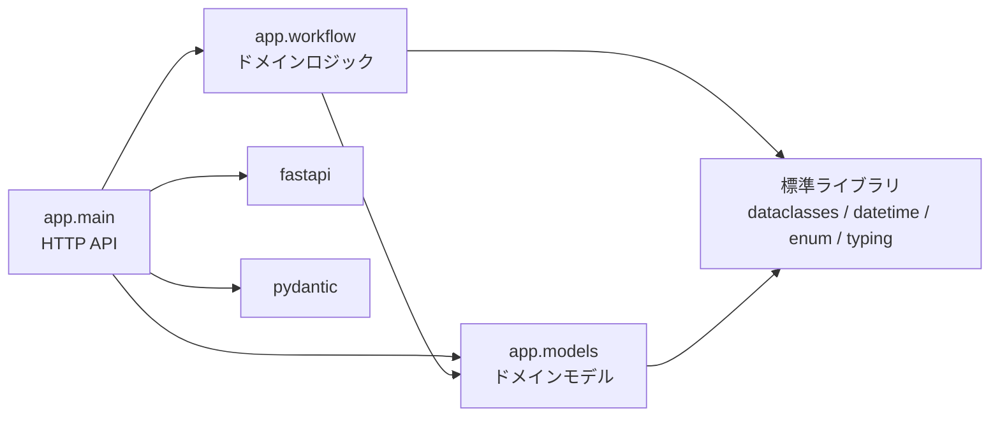
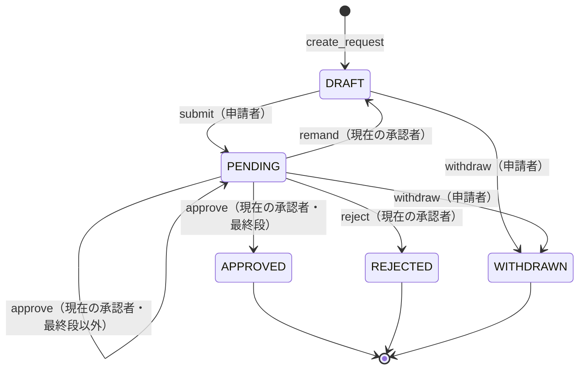

# 詳細設計書 — 申請承認ワークフロー

> **本書はプロジェクトの組立定義に基づいていない。** `docs/design-docs/assembly-shousai-sekkei.md` が無く、
> **顧客と目次を合意していない**ため、`doc-reverse-gen` Skill 同梱の組立例
> `templates/deliverables/assembly/shousai-sekkei.md` の目次をそのまま使って組み立てた。
> 顧客と目次を合意したら、組立定義を `docs/design-docs/assembly-shousai-sekkei.md` に保存して
> 組み立て直すこと（組立ガイド 4）。

**設計書**: 詳細設計書（内部設計） ／ **対象**: 申請承認ワークフロー（approval-workflow）
**版**: 1.0（納品版・Phase 6） ／ **組立日**: 2026-09-19 ／ **組立時の HEAD**: `f3ccb67`
**構成要素**: コード（`app/`、`app/` の最終変更 `221a47e`）、テスト（`tests/`）、要求 Spec の PROP、ADR、証跡パッケージ（`reports/evidence/TASK-AW-002/`）

> **本書は直接編集しない。** 各章はコード・テストから逆生成したものであり、修正はコード（または
> 引用元の Spec・ADR）の側で行ってから組み立て直す。

## 本書の位置づけ

IPA の工程成果物27点は外部設計工程の成果物であり、内部設計は対象に含まれない。本書の目次は
IPA ガイドに拠らず、J-SIX の方針（著者見解）として組立例が定めたものである。J-SIX では
詳細設計書を実装前に書かず、Phase 6 にコード・テスト・ADR から逆生成する。

本書は**コードを読んでもすぐには分からないこと**（責務と依存の向き、不変条件をどこで守っているか、
例外と応答の対応、状態遷移を許す／拒む箇所、計算方式の根拠）に絞る。関数本体を日本語に
置き換えた処理記述は書かない。

外部仕様（エンティティ定義・API の項目・処理）は[基本設計書](kihon-sekkei.md)に収めており、
本書からは参照だけにする（同じ情報を2冊に書かない）。

| 由来 | 意味 |
|---|---|
| コードから逆生成 | 実装から機械的に起こしたもの |
| コード＋Spec / コード＋ADR | コード由来の部分と、Spec・ADR からの引用を併せたもの |
| 受入条件＋テスト | 要求 Spec の PROP と、それを検証する性質テスト |
| 決定論的な実行結果 | 証跡パッケージ（品質ゲートの実行結果） |

## 目次

| 章 | 構成要素 | 由来 |
|---|---|---|
| 1.1 モジュール一覧と責務 | `app/` のモジュール構成 ＋ Design Spec 1 | コード＋Spec |
| 1.2 依存関係 | `app/` の import | コードから逆生成 |
| 2.1 公開インタフェース | `WorkflowService` ほかの公開関数・クラス | コードから逆生成 |
| 2.2 不変条件 | 要求 Spec 3.3 の PROP-001〜009 ＋ `tests/test_properties.py` | 受入条件＋テスト |
| 2.3 状態遷移 | `models.Status`、`WorkflowService` の遷移メソッド | コードから逆生成 |
| 3.1 計算方式 | `workflow.required_approval_levels` ＋ 要求 Spec REQ-001 | コード＋Spec |
| 3.2 採番・一意性 | `WorkflowService.create_request` ＋ PROP-003 | コード＋Spec |
| 4.1 例外の種類と発生条件 | `WorkflowError` / `RequestNotFound` と raise 箇所 ＋ ADR-0003 | コードから逆生成 |
| 4.2 外部への応答 | `main._guard`、リクエストスキーマ | コードから逆生成 |
| 5. 外部仕様の詳細 | — | 該当なし |
| 6. 物理データ設計 | — | 該当なし |
| 7.1 テスト観点 | `tests/` | コードから逆生成 |
| 7.2 テスト結果 | 証跡パッケージ → [テスト結果報告書](test-report.md) | 決定論的な実行結果 |
| 8. 設計判断 | 実装段階で追加された ADR | 該当なし |
| 付録 構成要素の版表・組立後の検査 | — | — |

---

## 1. モジュール構成

### 1.1 モジュール一覧と責務

> 由来: コード＋Spec（`app/__init__.py`, `app/models.py`, `app/workflow.py`, `app/main.py` の docstring と定義、`docs/design-spec.md` 1 アーキテクチャ概要）

| モジュール | 責務 | 持つもの |
|---|---|---|
| `app/models.py` | ドメインモデル。状態・操作種別・申請・監査ログのエントリを定義する | `Status`, `Action`, `AuditEntry`, `ApprovalRequest` |
| `app/workflow.py` | ドメインロジック。状態遷移と承認順序・権限ルールを集約し、インメモリのストアを兼ねる | `WorkflowService`, `required_approval_levels`, `WorkflowError`, `RequestNotFound` |
| `app/main.py` | HTTP API。リクエストの検証、ドメイン層の呼び出し、例外から HTTP ステータスへの変換、応答への変換 | `app`（FastAPI）, `service`（`WorkflowService` の唯一のインスタンス）, リクエスト／レスポンスのスキーマ, `_guard`, 8エンドポイント |

> 出典: docs/design-spec.md#1. アーキテクチャ概要
> 設計の要は **ビジネスルールを `workflow.py` に集約**し、HTTP もDBも知らない純粋ロジックに
> すること。

コードはこの方針どおりになっている。

- `workflow.py` / `models.py` は FastAPI・Pydantic を import しない（1.2）
- `main.py` のエンドポイントは `service` のメソッドを `_guard` で包んで呼び、結果を `RequestView.of`
  で変換するだけで、業務ルールの判定（`if`）を持たない
- `WorkflowService` は時刻を注入された `clock` から取る（既定は `datetime.now`）。テストでは固定時刻に
  差し替える（Design Spec 5.1）

`main.service` はモジュール読み込み時に1つだけ作られ、全リクエストで共有される。テストは
これを差し替える（`tests/test_api.py`）か、中身を空にして（`tests/acceptance/conftest.py`）状態を分離している。

### 1.2 依存関係

> 由来: コードから逆生成（`app/` の各モジュールの import 文）

| モジュール | import しているもの |
|---|---|
| `app.main` | `fastapi`（`FastAPI`, `HTTPException`）、`pydantic`（`BaseModel`, `ConfigDict`, `Field`）、`.models`（`ApprovalRequest`）、`.workflow`（`RequestNotFound`, `WorkflowService`, `WorkflowError`） |
| `app.workflow` | `datetime`、`typing`、`.models`（`Action`, `ApprovalRequest`, `AuditEntry`, `Status`） |
| `app.models` | `dataclasses`、`datetime`、`enum`、`typing` |

依存は `main` → `workflow` → `models` の一方向で、循環は無い。外部ライブラリに依存するのは
`main` だけである。ドメイン層（`workflow` / `models`）を FastAPI 以外の入口から呼ぶ、あるいは
永続化を差し替える（Design Spec 5.2）ときに、HTTP の知識を持ち込まずに済む。

---

## 2. モジュール詳細

### 2.1 公開インタフェース

> 由来: コードから逆生成（`app/workflow.py`, `app/models.py` の公開関数・クラスと docstring）

呼び出し元はすべて `app/main.py` のエンドポイント（テストを除く）。各メソッドは違反を見つけると
何も変更せずに例外を送出する（4.1）。

**`WorkflowService`**（「申請のライフサイクルを管理する。Repository を兼ねた最小実装（インメモリ）」）

| メソッド | 呼び出し元 | 事前条件（満たさないと例外） | 成功時の効果 |
|---|---|---|---|
| `__init__(clock=None)` | `main`（モジュール読み込み時） | — | 空のストア。`clock` 省略時は `datetime.now` |
| `get(request_id)` | `get_request`、各遷移メソッド | 申請が存在する（`RequestNotFound`） | 申請を返す |
| `list_all()` | `list_requests` | — | 全申請を登録順に返す |
| `create_request(applicant, amount, title, approvers)` | `create_request` | 金額 ≥ 1、タイトルが空白以外を含む、申請者が承認者に含まれない、承認者に重複が無い、人数が段数と一致（`WorkflowError`） | DRAFT の申請を採番・登録し、`CREATE` を記録 |
| `submit(request_id, actor, note="")` | `submit` | 存在する、終了状態でない、DRAFT、`actor` が申請者 | PENDING、`current_step`=0、`SUBMIT` を記録 |
| `approve(request_id, actor, note="")` | `approve` | 存在する、終了状態でない、PENDING、`actor` が現在の承認者 | `current_step`+1、最終段なら APPROVED、`APPROVE` を記録 |
| `reject(request_id, actor, note="")` | `reject` | 同上 | REJECTED、`REJECT` を記録 |
| `remand(request_id, actor, note="")` | `remand` | 同上 | DRAFT、`current_step`=0、`REMAND` を記録（docstring「差し戻し。現在の承認者が起票中（DRAFT）へ戻す。」） |
| `withdraw(request_id, actor, note="")` | `withdraw` | 存在する、終了状態でない、`actor` が申請者 | WITHDRAWN、`WITHDRAW` を記録（docstring「取下げ。申請者が DRAFT / PENDING から取り下げる。」） |

**その他の公開要素**

| 要素 | 内容 |
|---|---|
| `required_approval_levels(amount) -> int` | 金額に応じた必要承認段数（3.1） |
| `WorkflowError` | ドメインルール違反（4.1） |
| `RequestNotFound` | 対象の申請が存在しない。`WorkflowError` のサブクラスではない（4.1） |
| `ApprovalRequest.next_approver` | PENDING のとき次に承認すべき人、それ以外は `None` |
| `Status.is_terminal` | APPROVED / REJECTED / WITHDRAWN のとき真 |

`_ensure_active` / `_ensure_pending` / `_log` は内部ヘルパ（先頭の `_`）で、`WorkflowService` の外からは呼ばない。

### 2.2 不変条件

> 由来: 受入条件＋テスト（`docs/requirement-spec.md` 3.3 の PROP-001〜009、`tests/test_properties.py`）。PROP の本文は[基本設計書 3.4](kihon-sekkei.md#34-業務ルール) に収めているため、本章では要旨と守っている箇所だけを書く

| PROP | 要旨 | 守っている箇所 | 性質テスト |
|---|---|---|---|
| PROP-001 | 段数は金額の単調非減少関数 | `required_approval_levels` の閾値を昇順に判定する if の並び | `test_prop_001_levels_are_monotonic`, `test_prop_001_levels_are_within_defined_range` |
| PROP-002 | 金額 ≥ 1 と妥当な承認者なら起票は成功し DRAFT | `create_request` の検証が金額・タイトル・承認者だけで、それ以外の理由で拒否しない。`status` の既定値が DRAFT | `test_prop_002_any_valid_request_is_created_as_draft` |
| PROP-003 | 起票に成功した申請の承認者に申請者は含まれない | `create_request` の `applicant in approvers` の検査。起票後に `applicant` / `approvers` を変える経路が無い（[CRUD図](kihon-sekkei.md#64-crud図)） | `test_prop_003_applicant_is_never_an_approver` |
| PROP-004 | 監査ログの件数 = 成功した状態遷移の回数 | 各遷移メソッドが末尾で `_log` をちょうど1回呼ぶ。検証はすべて `_log` より前にあり、失敗時は記録しない | `test_prop_004_audit_log_counts_every_transition` |
| PROP-005 | 監査ログ末尾の actor は操作者本人 | 各遷移メソッドが引数の `actor` をそのまま `_log` に渡す | `test_prop_005_audit_log_records_the_actual_actor` |
| PROP-006 | 順序どおりの全段承認は必ず APPROVED | `approve` が `next_approver` との一致を確認して `current_step` を1進め、人数に達したら APPROVED にする | `test_prop_006_in_order_approval_always_completes`, `test_prop_006_out_of_order_approval_never_advances` |
| PROP-007 | 状態遷移で送ったコメントが監査ログ末尾に残る | `main` が `body.note`（既定値は空文字）を各遷移メソッドに渡し、メソッドがそのまま `_log` に渡す | `test_prop_007_transition_note_matches_sent_note` |
| PROP-008 | 未登録の ID への参照・操作は必ず対象不在 | 全遷移メソッドが最初に `get()` を呼び、`get()` が `RequestNotFound` を送出する | `test_prop_008_unknown_id_always_raises_request_not_found` |
| PROP-009 | 未定義の項目を含む入力は必ず入力不正で、何も変えない | `CreateRequestBody` / `ActorBody` の `model_config = ConfigDict(extra="forbid")`。FastAPI がハンドラ呼び出し前に検証する | `test_prop_009_transition_body_with_undefined_key_returns_422`, `test_prop_009_create_body_with_undefined_key_returns_422` |

同じ性質を hold-out 受入テスト（`tests/acceptance/`）も API 経由で検証している（[基本設計書 3.3](kihon-sekkei.md#33-システム化業務説明)）。

### 2.3 状態遷移

> 由来: コードから逆生成（`models.Status`、`WorkflowService.submit` / `approve` / `reject` / `remand` / `withdraw` / `_ensure_active` / `_ensure_pending`）

**遷移を拒む箇所**

| 検査 | 実装 | 適用するメソッド | 守る要件 |
|---|---|---|---|
| 終了状態でないこと | `_ensure_active`（`req.status.is_terminal` なら `WorkflowError`） | 全遷移メソッド（`submit` / `withdraw` は直接、`approve` / `reject` / `remand` は `_ensure_pending` 経由） | REQ-009 |
| PENDING であること | `_ensure_pending` | `approve` / `reject` / `remand` | — |
| DRAFT であること | `submit` 内の `req.status != Status.DRAFT` | `submit` | — |
| 申請者であること | `actor != req.applicant` | `submit` / `withdraw` | REQ-002 / REQ-006 |
| 現在の承認者であること | `actor != req.next_approver` | `approve` / `reject` / `remand` | REQ-008 |

終了状態の判定は `Status.is_terminal` の1箇所だけにあり、各メソッドはそれを `_ensure_active` 経由で
使う。終了状態から出る遷移は無い（CLAUDE.md 禁止事項。ADR-0001「`Status.is_terminal` で終了状態を
一元判定する」）。`withdraw` だけは状態を DRAFT / PENDING に限定する検査を持たないが、
終了状態以外の状態は DRAFT と PENDING しかないため、`_ensure_active` で足りている。

---

## 3. 業務ロジック

### 3.1 計算方式

> 由来: コード＋Spec（`workflow.required_approval_levels`、`docs/requirement-spec.md` 3.2 REQ-001）

| 金額（円） | 必要承認段数 | コードの条件 |
|---|---|---|
| 1 〜 99,999 | 1 | `amount < 100_000` |
| 100,000 〜 999,999 | 2 | `amount < 1_000_000` |
| 1,000,000 以上 | 3 | 上のどちらでもない |

> 出典: docs/requirement-spec.md#3.2 業務ルール
> REQ-001 承認段数は金額で決まる — 10万未満=1段 / 10万〜100万未満=2段 / 100万以上=3段。承認者数は段数と一致必須

根拠は要求 Spec の業務ルール（REQ-001）だけで、段数の閾値を決めた経緯を記録した ADR は無い
（`docs/traceability.md`「REQ-001（段数ルール）以外の要件はいずれかの ADR から参照されている」）。
境界値（99,999 / 100,000 / 999,999 / 1,000,000）は `test_required_levels_by_amount` が固定している。
金額 1 未満はこの関数に渡る前に `create_request` が拒否する。

### 3.2 採番・一意性

> 由来: コード＋Spec（`WorkflowService.create_request` / `_seq` / `_store`、PROP-003）

| 対象 | 方式 | 一意性の範囲 |
|---|---|---|
| 申請 ID | `_seq` を 1 進めて `f"REQ-{self._seq:04d}"`。全検証を通った後にだけ進める | `WorkflowService` のインスタンス内。削除が無いため再利用されない |
| 承認者 | `len(set(approvers)) != len(approvers)` なら拒否 | 1件の申請の中 |

- 拒否された起票は `_seq` を進めない。したがって申請 ID は欠番なく連続する
- インメモリのため、プロセスを再起動すると `_seq` は 0 に戻り、再び `REQ-0001` から採番する
  （以前の申請も失われる。Design Spec 5.3 可用性）。永続化へ差し替える場合は採番の永続化も要る
- 4桁のゼロ埋めは書式の指定であり、10,000件目以降は `REQ-10000` のように桁が増える（上限の検査は無い）
- 承認者の重複を拒否することで、`approvers[current_step]` による「現在の承認者」の特定が一意になり、
  同じ人が連続する段を承認する経路も無い（[基本設計書 7.3](kihon-sekkei.md#73-外部インタフェース処理) の再実行時の動作）

---

## 4. エラー処理

### 4.1 例外の種類と発生条件

> 由来: コードから逆生成（`app/workflow.py` の例外クラスと raise 箇所）。分類の理由は ADR-0003

| 例外 | 基底 | 意味 | raise 箇所 |
|---|---|---|---|
| `WorkflowError` | `Exception` | ドメインルール違反 | `create_request`（5箇所）、`submit`（2）、`approve`（1）、`reject`（1）、`remand`（1）、`withdraw`（1）、`_ensure_active`（1）、`_ensure_pending`（1） |
| `RequestNotFound` | `Exception` | 対象の申請が存在しない | `get`（1箇所。全遷移メソッドは `get` を通る） |

各 raise の条件とメッセージは[基本設計書 7.2](kihon-sekkei.md#72-外部インタフェース項目) の 409 / 404 の表に
写してある。

`RequestNotFound` を `WorkflowError` のサブクラスにしないのは ADR-0003 の判断による。

> ADR-0003: エラーを「不在 / ルール違反 / 入力不正」に分け、例外の型と HTTP ステータスを対応させる
> サブクラスにしないことで、`except WorkflowError` が不在まで捕まえてしまう事故（C-1 の再発）を
> 型の上で防げる。サブクラスにすると、except 節の並び順を間違えただけで 404 が 409 に化ける

どの raise も、申請の状態・`current_step`・監査ログ・`_seq` を書き換える前にある。

### 4.2 外部への応答

> 由来: コードから逆生成（`app/main.py` の `_guard`、`CreateRequestBody` / `ActorBody`、エンドポイントの `status_code`）

| 発生源 | 変換箇所 | HTTP | 本文 |
|---|---|---|---|
| Pydantic の検証エラー（型不一致・必須項目の欠落・未定義の項目） | FastAPI（ハンドラ呼び出し前） | 422 | FastAPI の既定形式 `{"detail": [...]}` |
| `RequestNotFound` | `_guard` の1つ目の `except` | 404 | `{"detail": str(exc)}` |
| `WorkflowError` | `_guard` の2つ目の `except` | 409 | `{"detail": str(exc)}` |
| 成功 | エンドポイント | 201（起票）/ 200（その他） | `RequestView` |

`_guard` は全エンドポイント（一覧を除く7本）で共通に使われ、エンドポイントごとの変換は無い
（ADR-0003「エンドポイントごとに個別の変換を書かない」）。`_guard` は例外を `raise ... from exc`
で包むため、元の例外は `__cause__` に残る。

FastAPI が自動生成する OpenAPI には 404 / 409 が宣言されていない（[基本設計書 7.1](kihon-sekkei.md#71-外部インタフェース一覧) の [要確認]）。

---

## 5. 外部仕様の詳細

**該当なし**（項目レベルの工程成果物 ⑬ エンティティ定義・⑰ 外部インタフェース項目説明は、
基本設計書 6.3・7.2 に収めた。画面・帳票・バッチの項目レベルの成果物（⑧ ㉑ ㉖ ㉗）は、
該当する領域を持たないため存在しない）

## 6. 物理データ設計

**該当なし**（永続化しない。`WorkflowService` がインメモリの dict を内包する。要求 Spec 2.2 で
永続化を対象外とし、差し替えの方針は Design Spec 5.2 にある。DDL・マイグレーション・インデックス定義は
存在しない。永続化へ差し替える時点で本章を起こす）

---

## 7. 単体テスト

### 7.1 テスト観点

> 由来: コードから逆生成（`tests/` のテスト関数名・docstring・コメントの REQ / PROP タグ、`pytest --collect-only` の件数）

| ファイル | 層 | 件数（parametrize 展開後） | 観点 |
|---|---|---|---|
| `tests/test_workflow.py` | ドメイン層の例ベース | 43 | REQ-001〜REQ-011 を関数単位で検証。段数の境界値、起票の各検証、各遷移の事前条件と効果、監査ログの並び（`FIXED_NOW` で時刻を固定）、不在時の `RequestNotFound`、各遷移のコメント記録 |
| `tests/test_properties.py` | ドメイン層・API 層の性質ベース（Hypothesis） | 12 | PROP-001〜PROP-009（2.2 の表） |
| `tests/test_api.py` | API 層の結線 | 26 | 8エンドポイントの結線、201 / 404 / 409 / 422 の変換、ADR-0003 の判定順序、コメントが監査ログまで届くこと |
| `tests/acceptance/`（7ファイル） | API 経由の hold-out 受入テスト | 72 | UC-001〜UC-006 と横断（エラー分類・コメント記録）。実装を書く工程からは読めない |

REQ / PROP とテスト関数の対応は[基本設計書 11 トレーサビリティ](kihon-sekkei.md#11-トレーサビリティ)
（`docs/traceability.md`）と同じ ID を使う。可視テスト（81件）と hold-out（72件）は品質ゲート G2 で
別々に判定する（`.jsix-checks.json` の `gates.g2.tests` / `gates.g2.holdout`）。

### 7.2 テスト結果

> 由来: 決定論的な実行結果（`reports/evidence/TASK-AW-002/01_traceability.md` / `02_test_results.md` / `03_coverage_mutation.md`）

証跡パッケージから変換した [テスト結果報告書](test-report.md)（件数・カバレッジ）と
[品質報告書](quality-report.md)（mutation score・生存ミュータントの扱い）を参照。数値は証跡から
引用しており、本書には再掲しない（同じ情報を2冊に書かない）。

---

## 8. 設計判断

**該当なし**（実装段階で追加された ADR は無い。ADR-0001・0002 は初版の Phase 2、ADR-0003 は
設計レビュー（`docs/reviews/design-review-2026-09-19.md`）を受けた Spec 改訂と同じコミット
`307d382` で、TASK-AW-002 の Red（`6f5df62`）より前に追加された。3件とも[基本設計書 10 設計判断](kihon-sekkei.md#10-設計判断)
に収めている）

---

## 付録A 構成要素の版表

| 章 | 構成要素 | 版・日付 | 最終コミット |
|---|---|---|---|
| 1.1〜4.2 | `app/models.py` | — | `05fe639`（2026-09-12） |
| 1.1〜4.2 | `app/workflow.py` | — | `221a47e`（2026-09-19） |
| 1.1〜4.2 | `app/main.py` | — | `221a47e`（2026-09-19） |
| 1.1 | `docs/design-spec.md` 1 | 1.1（2026-09-19） | `307d382` |
| 2.2, 3.1 | `docs/requirement-spec.md` 3.2 / 3.3 | 1.1（2026-09-19） | `307d382` |
| 2.2, 7.1 | `tests/test_properties.py` | — | `05b35b4`（2026-09-19） |
| 7.1 | `tests/test_workflow.py` | — | `34e625e`（2026-09-19） |
| 7.1 | `tests/test_api.py` | — | `6f5df62`（2026-09-19） |
| 7.1 | `tests/acceptance/` | — | `a664bdd`（2026-09-19） |
| 4.1 | ADR-0003 | 承認（2026-09-19） | `307d382` |
| 7.2 | `reports/evidence/TASK-AW-002/` | 生成 2026-09-19T05:03:09Z | 証跡の対象 commit `f3ccb67` |

## 付録B 組立後の検査

組立ガイド 5 の各項目の結果は[基本設計書 付録B](kihon-sekkei.md#付録b-組立後の検査) にまとめた（2冊を通して検査するため）。
