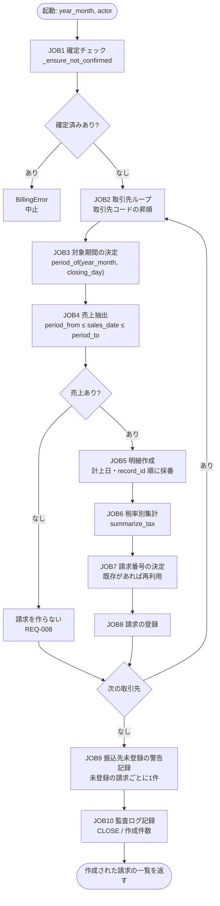
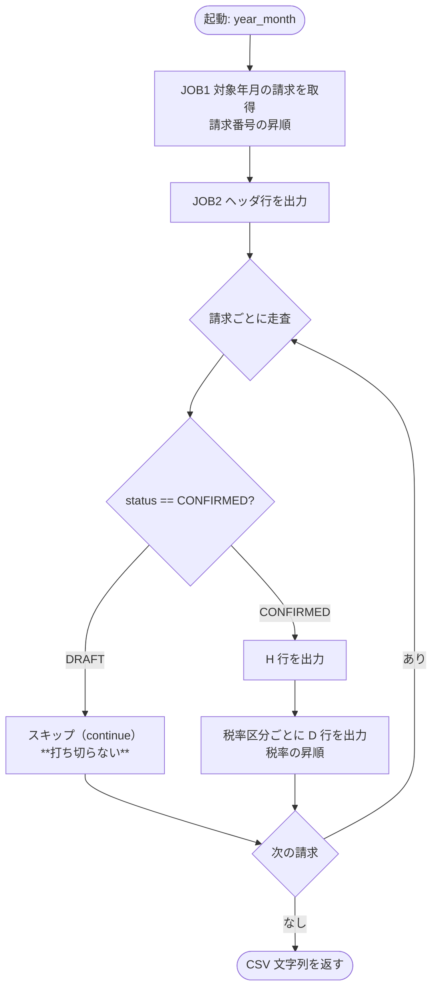

# バッチ処理フロー

**工程成果物**: バッチ ② ／ **由来**: **コードから逆生成**
**逆生成元**: `app/batch.py`, `app/billing.py`
**対象**: 月次請求書発行 ／ **版**: 1.1 ／ **日付**: 2026-09-21

## BATCH-001 月次請求データ作成

### ジョブステップと件数の目安

| ジョブ | 処理内容 | 入力件数 | 出力件数 |
|---|---|---|---|
| JOB1 | 確定済みの有無を判定 | 対象年月の請求 | 0 or 中止 |
| JOB2-J8 | 取引先ごとの請求作成 | 取引先数 | 売上のある取引先数 |
| JOB6 | 税率別集計 | 明細数 | 税率区分数（最大2） |
| JOB9 | 振込先未登録の警告記録（REQ-013） | 作成した請求 | 振込先が未登録の請求の件数（0 以上） |
| JOB10 | 監査ログ記録（REQ-010） | — | 1（監査ログの末尾） |

## BATCH-002 会計連携ファイル出力

### JOB2 の「打ち切らない」

未確定の請求に出会ったときに走査を打ち切ると、請求番号順で後ろにある確定済み請求が
丸ごと欠ける。mutation testing がこの経路の未検証を検出しており、回帰テストで固定している
（`test_req_009_draft_invoice_does_not_stop_later_confirmed_ones`）。
