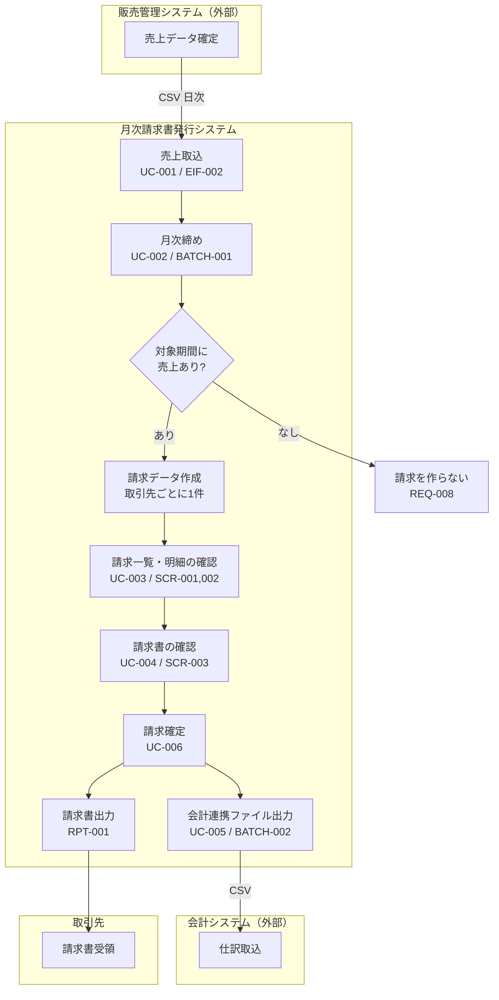

# システム化業務フロー

**工程成果物**: システム振舞い ② ／ **由来**: Spec（人手更新）
**逆生成元**: 要求 Spec 1.1 / 2.1、Design Spec 1.2
**対象**: 月次請求書発行 ／ **版**: 1.0 ／ **日付**: 2026-09-18

> 業務全体を俯瞰する流れ図において、システム化する部分を識別したもの。

## 月次請求業務フロー

## 担当と実行契機

| 作業 | 担当 | 契機 | 自動/手動 |
|---|---|---|---|
| 売上取込 | 経理担当者 | 日次 | バッチ（BATCH-001 の前提） |
| 月次締め | 経理担当者 | 月次（締め日翌日） | バッチ起動は手動 |
| 請求内容の確認 | 経理担当者 | 締め後 | 手動（画面） |
| 請求確定 | 経理担当者 | 確認後 | 手動（画面） |
| 会計連携 | — | 日次 | バッチ（確定済みのみ対象） |

## 業務上の分岐

| 分岐 | 条件 | 動作 | 要件 |
|---|---|---|---|
| 請求作成の要否 | 対象期間に売上が1件もない | 請求を作らない | REQ-008 |
| 再締めの可否 | 対象年月に確定済みの請求がある | 再締めを拒否 | REQ-007 |
| 会計連携の対象 | 請求が確定済み（CONFIRMED） | 未確定は出力しない | UC-005 |
