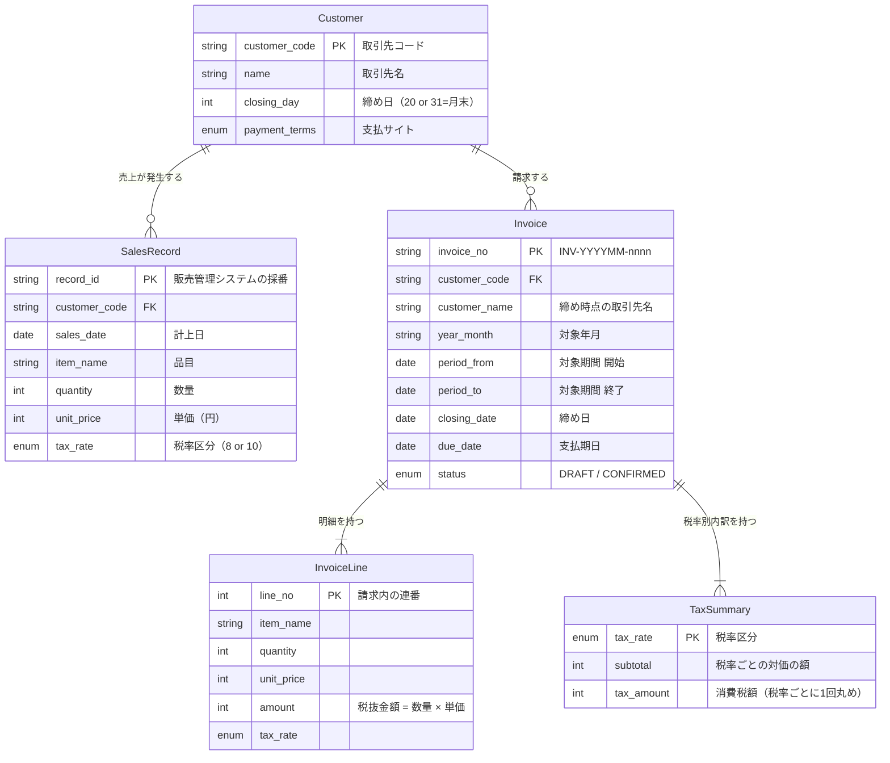

# ER図

**工程成果物**: データモデル ① ／ **由来**: **コードから逆生成**
**逆生成元**: `app/models.py`
**対象**: 月次請求書発行 ／ **版**: 1.0 ／ **日付**: 2026-09-18

## 構造上の重要点

### InvoiceLine が消費税額を持たない

端数処理は**請求単位・税率ごとに1回**である（ADR-0001 / REQ-005）。明細に税額を持たせると、
それを合計する実装を書きたくなる。制度上認められない計算方法を**構造として書けなくする**ため、
意図的に属性を置いていない。

### TaxSummary を独立させた理由

REQ-004 / REQ-006 が税率ごとの区分記載を求めており、端数処理の単位もこの粒度と一致する。
「端数処理が起きる場所」をエンティティとして明示している。

### Invoice が customer_name を持つ理由

締め時点の取引先名を保持する（スナップショット）。取引先名が変更されても、発行済みの
請求書の記載は変わらない。
