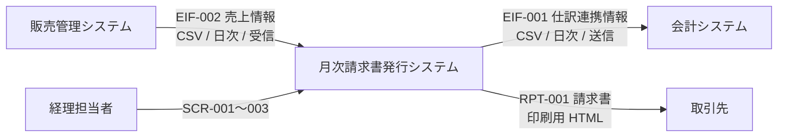

# 外部システム関連図

**工程成果物**: 外部インタフェース ① ／ **由来**: **コードから逆生成**
**逆生成元**: `app/importer.py`, `app/accounting.py`, `app/batch.py`
**対象**: 月次請求書発行 ／ **版**: 1.0 ／ **日付**: 2026-09-18

## 連携方式

| 凡例 | 方式 |
|---|---|
| 実線 | ファイル渡し（CSV） |
| — | 同期 API 呼び出しは使用しない |

**ファイル連携に統一した理由**（Design Spec 5.2）: 販売管理・会計いずれも
夜間バッチでの授受が前提であり、同期 API を持たない。またファイルであれば
再取込・再出力による復旧が容易で、連携先の停止に影響されない。

## 授受のタイミング

| IF-ID | 連携先 | 方向 | タイミング | 起動 |
|---|---|---|---|---|
| EIF-002 | 販売管理システム | 受信 | 日次 | 本システム側で取込 |
| EIF-001 | 会計システム | 送信 | 日次 | BATCH-002 |

EIF-001 は**確定済み（CONFIRMED）の請求のみ**を出力する。未確定の請求を会計に流すと、
再締めで金額が変わった場合に仕訳と食い違うため。
