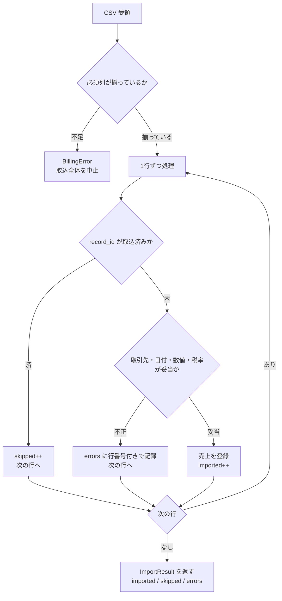
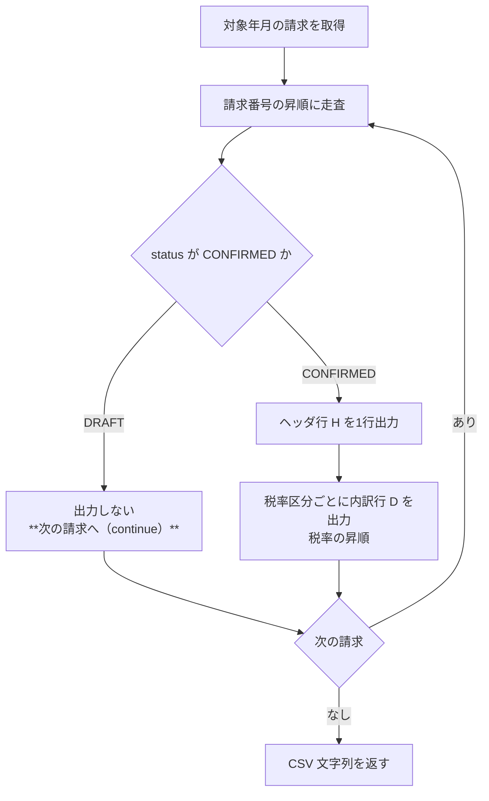

# 外部インタフェース処理説明

**工程成果物**: 外部インタフェース ④ ／ **由来**: コード＋Spec
**逆生成元**: `app/importer.py`, `app/accounting.py`, `app/batch.py`
**対象**: 月次請求書発行 ／ **版**: 1.0 ／ **日付**: 2026-09-18

---

## EIF-002 売上情報の取込

**起動**: 日次。`importer.import_sales(service, csv_text)`

### 設計上の判断

| 判断 | 理由 |
|---|---|
| 必須列の不足は**全体を中止** | ファイル自体が仕様違反であり、部分取込は状態を不明瞭にする |
| 1行の不備は**その行だけスキップして継続** | 1行の不備で日次取込全体を止めない。エラー行は行番号付きで返す |
| 取込済み record_id は**無視**（冪等） | 再送・バッチ再実行に耐える。二重計上を防ぐ |

### 再実行時の動作

同じファイルを再投入すると全件が `skipped` になり、売上は増えない。
障害復旧時にファイルを再投入してよい。

---

## EIF-001 仕訳連携情報の出力

**起動**: 日次。`batch.run_accounting_export(service, year_month)`

### 未確定を「スキップ」であって「打ち切り」にしない

請求番号順に走査するため、**先頭が未確定だと以降の確定済み請求が丸ごと欠ける**
実装になりうる。実際 mutation testing で `continue` を `break` に変えたミュータントが
生き残り、テストの穴として検出された。

`test_req_009_draft_invoice_does_not_stop_later_confirmed_ones` が、
「C001 は未確定・C002 は確定済み」という状態で C002 が出力されることを固定している。

### 再実行時の動作

同じ年月を再度出力しても、確定済みの請求は変化しないため出力内容は同一になる
（PROP-006）。連携先で重複取込が起きないよう、受信側での冪等性は別途必要。
