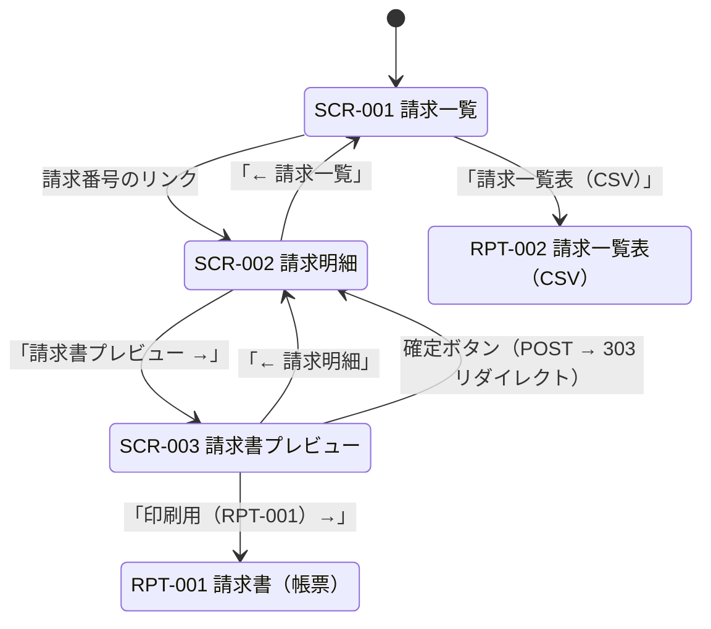

<!-- Jinja2 のコード例を GitHub Pages の Liquid が評価しないようにする。 -->
<!--  -->

# 画面遷移

**工程成果物**: 画面 ② ／ **由来**: **コードから逆生成**
**逆生成元**: `app/templates/*.html` の `<a href>` / `<form action>`、`app/main.py` のリダイレクト
**対象**: 月次請求書発行 ／ **版**: 1.0 ／ **日付**: 2026-09-18

## 遷移の詳細

| # | 遷移元 | 遷移先 | 契機 | 条件 | 実装 |
|---|---|---|---|---|---|
| 1 | SCR-001 | SCR-002 | 請求番号リンクの押下 | — | `invoice_list.html` の `<a href="/invoices/{{ inv.invoice_no }}">` |
| 2 | SCR-001 | RPT-002 | 「請求一覧表（CSV）」の押下 | — | `<a href="/invoices.csv?year_month=...">` |
| 3 | SCR-002 | SCR-001 | 「← 請求一覧」の押下 | — | `<a href="/invoices?year_month={{ inv.year_month }}">` |
| 4 | SCR-002 | SCR-003 | 「請求書プレビュー →」の押下 | — | `<a href="/invoices/{{ inv.invoice_no }}/preview">` |
| 5 | SCR-003 | SCR-002 | 「← 請求明細」の押下 | — | `<a href="/invoices/{{ inv.invoice_no }}">` |
| 6 | SCR-003 | RPT-001 | 「印刷用（RPT-001）→」の押下 | — | `<a href="/invoices/{{ inv.invoice_no }}/report">` |
| 7 | SCR-003 | SCR-002 | 確定ボタンの押下 | **status == DRAFT のときのみ表示** | `POST /invoices/{no}/confirm` → 303 リダイレクト |

## 条件付き表示

| 画面 | 要素 | 表示条件 | 実装 |
|---|---|---|---|
| SCR-003 | 確定ボタン | `status == "DRAFT"` | `` |
| SCR-003 | 「確定済み」表示 | `status == "CONFIRMED"` | `` |
| SCR-001 | 「対象の請求がありません」 | 一覧が空 | ``（for-else） |

確定済みの請求には確定ボタンを表示しない。二重確定は HTTP 409 で拒否されるが
（REQ-007）、画面上でも操作できないようにしている。

## エラー時の遷移

| 事象 | 動作 |
|---|---|
| 存在しない請求番号 | HTTP 404（画面遷移しない） |
| 二重確定 | HTTP 409（画面遷移しない） |

<!--  -->
