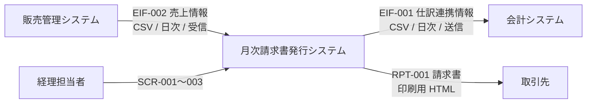
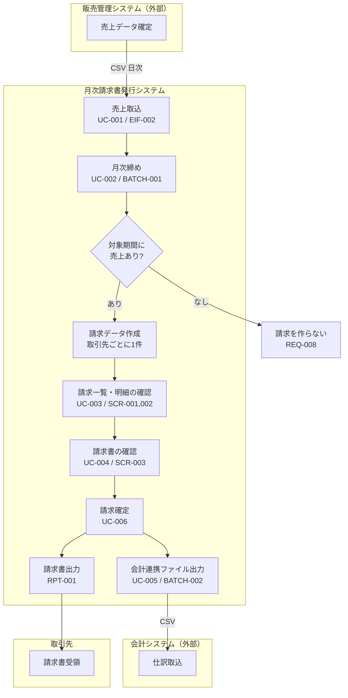
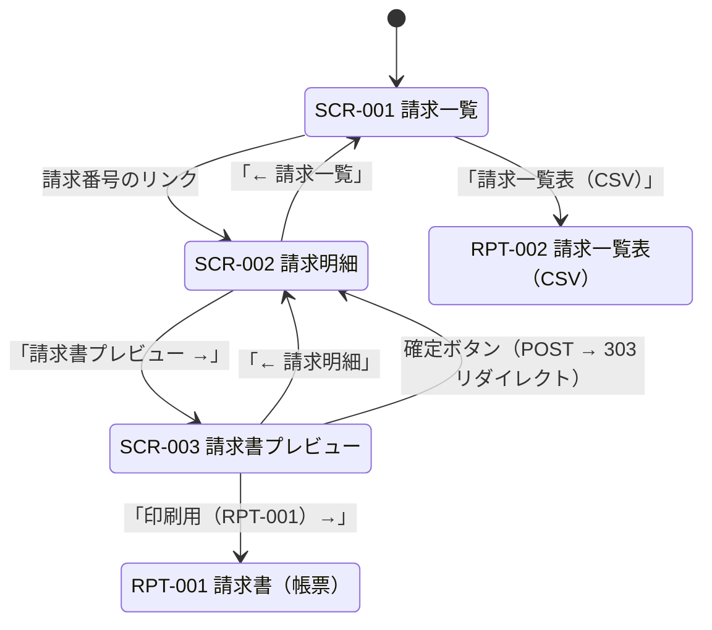
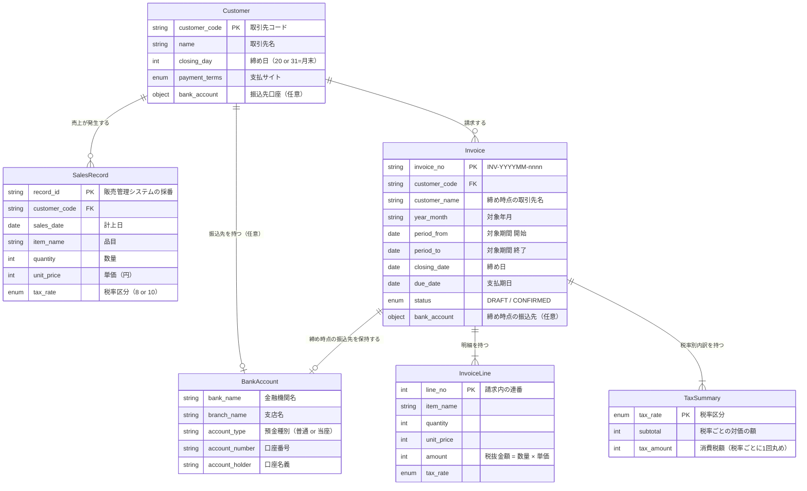
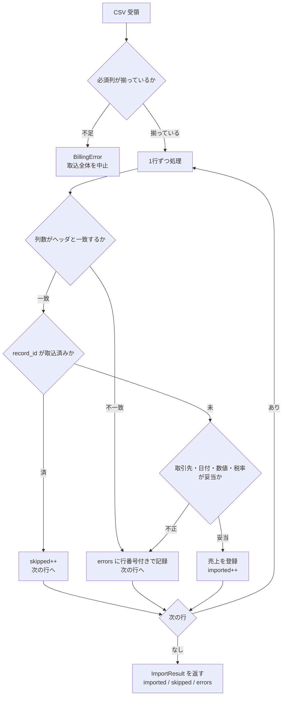
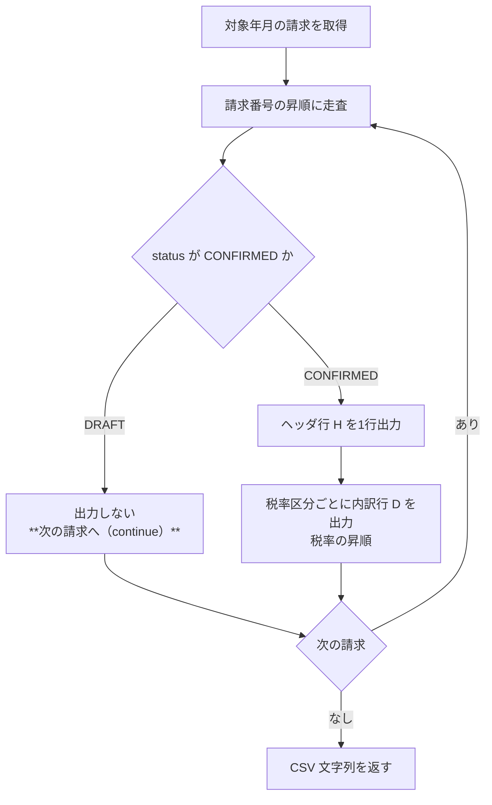
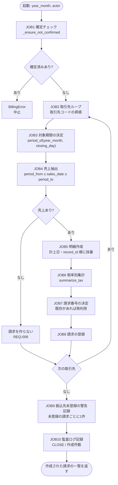
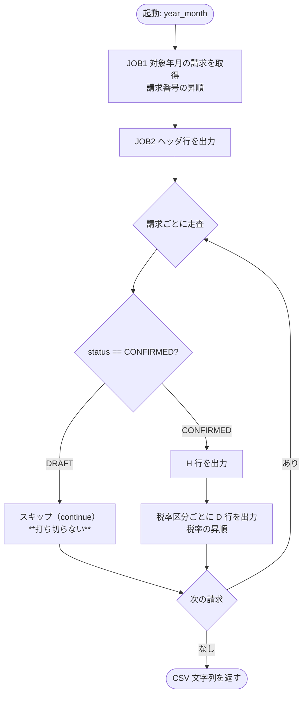

<!-- Jinja2 のコード例を GitHub Pages の Liquid が評価しないようにする。 -->
<!--  -->

# 基本設計書 — 月次請求書発行

> **本書はプロジェクトの組立定義に基づいていない。** `docs/design-docs/assembly-kihon-sekkei.md` が無く、
> **顧客と目次を合意していない**ため、`doc-reverse-gen` Skill 同梱の組立例
> `templates/deliverables/assembly/kihon-sekkei.md` の目次をそのまま使って組み立てた。
> 顧客と目次を合意したら、組立定義を `docs/design-docs/assembly-kihon-sekkei.md` に保存して
> 組み立て直すこと（組立ガイド 4）。

**設計書**: 基本設計書（外部設計） ／ **対象**: 月次請求書発行（monthly-billing）
**版**: 1.0（納品版・Phase 6） ／ **組立日**: 2026-09-21 ／ **組立時の HEAD**: `dd4ebbb`
**構成要素**: [工程成果物27点](../deliverables/README.md) ＋ 要求 Spec ＋ Design Spec ＋ ADR ＋ トレーサビリティマトリクス

> **本書は工程成果物を束ねたビューであり、直接編集しない。** 修正は構成要素（`docs/deliverables/`、
> Spec、ADR）の側で行い、逆生成した章はさらにその逆生成元（コード・受入テスト）を直してから
> 組み立て直す。構成要素の本文は書き換えていない。組立で変えたのは見出しのレベルと、
> 本書の位置から辿れるようにした相対リンクだけである。

## 本書の読み方

各章の冒頭に**由来**を表示している。顧客レビューで重点を置くべきは**人手で書いた章**
（1章、2.1、3.1、3.2、3.4、3.5、4.6、8.4、9章、10章）である。逆生成した章は「実装がこうなっている」
という事実の記述であり、3.3 は通っている受入テストが、それ以外はコードがその正しさの根拠である。

| 由来 | 意味 |
|---|---|
| 人手 | Spec・ADR・CLAUDE.md として人が書き、合意したもの |
| 受入テストから逆生成 | hold-out 受入テスト（全23件通過）から起こしたもの |
| コードから逆生成 | 実装から機械的に起こしたもの |
| コード＋Spec／ADR | コード由来の部分と、Spec・ADR からの引用を併せたもの |

本書は**納品版（Phase 6）**である。組立例の「事前提出」列の代替物は使っておらず、逆生成する章は
すべて実装から逆生成した版を収めた。

本システムは画面・帳票・バッチ・外部インタフェースをすべて持つため、「該当なし」とした章は無い。

## 目次

| 章 | 構成要素 | 由来 |
|---|---|---|
| 1.1 目的・業務背景 | requirement-spec.md | 人手 |
| 1.2 対象範囲・対象外 | requirement-spec.md | 人手 |
| 1.3 制約・前提 | requirement-spec.md | 人手 |
| 2.1 アーキテクチャ | design-spec.md | 人手 |
| 2.2 外部システム関連 | 01-system-relation.md | コードから逆生成 |
| 3.1 システム化業務一覧 | 01-system-function-list.md | Spec（人手更新） |
| 3.2 システム化業務フロー | 02-business-flow.md | Spec（人手更新） |
| 3.3 システム化業務説明 | 03-business-description.md | hold-out 受入テストから逆生成 |
| 3.4 業務ルール | requirement-spec.md | 人手 |
| 3.5 システム振舞い共通ルール | 04-common-rules.md | CLAUDE.md・ADR（人手更新） |
| 4.1 画面一覧 | 01-screen-list.md | コードから逆生成 |
| 4.2 画面遷移 | 02-screen-transition.md | コードから逆生成 |
| 4.3 画面レイアウト | 03-screen-layout.md | コードから逆生成 |
| 4.4 画面入出力項目一覧 | 04-screen-io-items.md | コードから逆生成 |
| 4.5 画面アクション明細 | 05-screen-actions.md | コードから逆生成 |
| 4.6 画面遷移・レイアウト共通ルール | 06-common-rules.md | CLAUDE.md・テンプレート（人手更新） |
| 5.1 帳票一覧 | 01-report-list.md | コードから逆生成 |
| 5.2 帳票概要 | 02-report-overview.md | コード＋Spec |
| 5.3 帳票レイアウト | 03-report-layout.md | コードから逆生成 |
| 5.4 帳票項目説明 | 04-report-items.md | コードから逆生成 |
| 5.5 帳票編集定義 | 05-report-edit-rules.md | コード＋ADR |
| 6.1 ER図 | 01-er-diagram.md | コードから逆生成 |
| 6.2 エンティティ一覧 | 02-entity-list.md | コードから逆生成 |
| 6.3 エンティティ定義 | 03-entity-definition.md | コードから逆生成 |
| 6.4 CRUD図 | 04-crud-matrix.md | コードから逆生成 |
| 7.1 外部インタフェース一覧 | 02-interface-list.md | コードから逆生成 |
| 7.2 外部インタフェース項目説明 | 03-interface-items.md | コードから逆生成 |
| 7.3 外部インタフェース処理説明 | 04-interface-process.md | コード＋Spec |
| 8.1 バッチ処理一覧 | 01-batch-list.md | コードから逆生成 |
| 8.2 バッチ処理フロー | 02-batch-flow.md | コードから逆生成 |
| 8.3 バッチ処理定義 | 03-batch-definition.md | コードから逆生成 |
| 8.4 バッチ処理共通ルール | 04-common-rules.md | CLAUDE.md・ADR（人手更新） |
| 9.1 非機能要件 | requirement-spec.md | 人手 |
| 9.2 非機能設計 | design-spec.md | 人手 |
| 9.3 セキュリティ | design-spec.md | 人手 |
| 10.1 ADR-0001: 消費税の端数処理を「請求単位・税率ごとに1回」で行う | 0001-tax-rounding-unit.md | 人手 |
| 10.2 ADR-0002: 端数処理の方法として「切捨て」を採用する | 0002-rounding-method-floor.md | 人手 |
| 10.3 ADR-0003: 帳票は PDF を生成せず、印刷用 HTML と CSV で出力する | 0003-report-format.md | 人手 |
| 10.4 ADR-0004: form の解析に python-multipart を使わない | 0004-no-python-multipart.md | 人手 |
| 11 トレーサビリティマトリクス | traceability.md |  |

---

## 1. システム概要

### 1.1 目的・業務背景

> **由来**: 人手 ／ **構成要素**: [requirement-spec.md](../requirement-spec.md)

#### 1. 業務背景

##### 1.1 現行業務の課題

販売管理システムに蓄積された売上データから、経理担当者が Excel で取引先ごとに集計し、
請求書を手作業で作成している。(1) 締め日・支払サイトが取引先ごとに異なり転記ミスが起きる、
(2) 軽減税率（8%）と標準税率（10%）の混在で消費税額の計算が誤る、
(3) 会計システムへの仕訳入力が二重手間になっている。

##### 1.2 本システムで解決したいこと

売上データからの月次締め・請求書発行・会計連携を自動化する。特に**消費税額の端数処理**を
適格請求書等保存方式（インボイス制度）の要件どおりに機械的に保証し、手計算による誤りをなくす。

##### 1.3 ステークホルダーと期待

| ステークホルダー | 役割 | 主な期待 |
|---|---|---|
| 経理担当者 | 月次締めの実行、請求書の確認・発行 | 締めボタン一つで請求書が揃う。内容を画面で確認できる |
| 取引先（顧客） | 請求書の受領 | 適格請求書の記載事項が漏れなく記載されている |
| 会計部門 | 仕訳の取込 | 請求データが会計システムに自動連携される |
| 内部監査 | 締め処理の証跡確認 | いつ誰がどの期間を締めたかが残る |

---

### 1.2 対象範囲・対象外

> **由来**: 人手 ／ **構成要素**: [requirement-spec.md](../requirement-spec.md)

#### 2. スコープ

##### 2.1 対象業務範囲

売上データの取込、取引先ごとの月次締め、請求データの作成、請求書（帳票）の出力、
請求一覧の画面照会、会計システムへの連携ファイル出力、締め処理の監査記録。

##### 2.2 対象外の明示

- 入金消込・売掛金残高管理（債権管理は別システム）
- 請求書の電子送付（メール送信・電子帳簿保存法対応）
- 与信管理・督促
- 認証・認可基盤（既存 SSO を利用する前提。本サンプルでは actor を ID 文字列で受ける）
- PDF 生成（帳票は印刷用 HTML と CSV で出力する。理由は Design Spec 参照）

---

### 1.3 制約・前提

> **由来**: 人手 ／ **構成要素**: [requirement-spec.md](../requirement-spec.md)

#### 4. 制約条件

##### 4.1 技術的制約

| 制約 | 根拠 |
|---|---|
| Python / FastAPI | 社内標準スタック。`examples/approval-workflow` と揃える |
| 帳票は PDF を生成しない | PDF 生成ライブラリは依存が重く、サンプルの再現性を損なう。印刷用 HTML と CSV で代替する |

##### 4.3 法規制・コンプライアンス

適格請求書等保存方式（インボイス制度）の記載事項および端数処理の単位に従う（REQ-005, REQ-006）。

---

#### 5. 前提条件

| 前提 | 前提が崩れた場合の影響 |
|---|---|
| 売上データは販売管理システムから確定済みのものが渡される | 取込後の訂正処理を本システム側に追加実装する必要が生じる |
| 事業者の適格請求書発行事業者登録番号は設定値として与えられる | 取引先ごとの発行元切替が必要になる |

---

## 2. システム構成

### 2.1 アーキテクチャ

> **由来**: 人手 ／ **構成要素**: [design-spec.md](../design-spec.md)

#### 1. アーキテクチャ概要

##### 1.1 アーキテクチャスタイル

レイヤード（ドメイン層 / 出力層 / HTTP層 / バッチ層）。業務ルールはドメイン層
（`app/billing.py`）に集約し、他の層はそれを呼ぶだけにする。

**この構成にした理由**: 本システムの価値は消費税の端数処理（ADR-0001/0002）と締め処理の
正しさにある。これが画面・帳票・バッチ・会計連携の4つの入口から使われるため、ルールを
1箇所に置かないと入口ごとに実装がずれる。

##### 1.2 システム構成図

```
                    ┌──────────────┐
  販売管理システム ──▶│ importer.py  │ EIF-002 売上取込（CSV）
                    └──────┬───────┘
                           ▼
  ┌────────────┐    ┌──────────────┐    ┌────────────┐
  │ main.py    │───▶│ billing.py   │◀───│ batch.py   │
  │ 画面 SCR   │    │ ドメイン      │    │ BATCH-001/2│
  └────────────┘    │ 締め・税計算  │    └────────────┘
                    └──────┬───────┘
                    ┌──────┴───────┐
                    ▼              ▼
             ┌────────────┐  ┌──────────────┐
             │ reports.py │  │ accounting.py│ EIF-001 会計連携
             │ RPT-001/2  │  └──────────────┘
             └────────────┘
```

##### 1.3 技術スタック

| 分類 | 採用 | 理由 |
|---|---|---|
| 言語 | Python 3.9+ | `examples/approval-workflow` と揃える |
| Web | FastAPI | 同上 |
| 画面 | Jinja2（サーバサイドレンダリング） | 画面設計書の逆生成元がテンプレートとして残る |
| 帳票 | 印刷用 HTML ＋ CSV | ADR-0003 |
| 永続化 | なし（インメモリ） | サンプルのため。Repository を切り出して差し替え可能 |

**インメモリ実装の `reset()`**: `BillingService.reset(clock)` はストアを初期化する公開メソッド。
サンプルの再実行とテストのために置く。永続化実装に差し替えた場合は未サポートとしてよい。
| 金額計算 | `int`（円単位） | 浮動小数点の誤差を持ち込まない。ADR-0002 |

---

### 2.2 外部システム関連

> **由来**: コードから逆生成 ／ **逆生成元**: `app/importer.py`, `app/accounting.py`, `app/batch.py` ／ **構成要素**: [01-system-relation.md](../deliverables/external-if/01-system-relation.md)（版 1.0・2026-09-18）



#### 連携方式

| 凡例 | 方式 |
|---|---|
| 実線 | ファイル渡し（CSV） |
| — | 同期 API 呼び出しは使用しない |

**ファイル連携に統一した理由**（Design Spec 5.2）: 販売管理・会計いずれも
夜間バッチでの授受が前提であり、同期 API を持たない。またファイルであれば
再取込・再出力による復旧が容易で、連携先の停止に影響されない。

#### 授受のタイミング

| IF-ID | 連携先 | 方向 | タイミング | 起動 |
|---|---|---|---|---|
| EIF-002 | 販売管理システム | 受信 | 日次 | 本システム側で取込 |
| EIF-001 | 会計システム | 送信 | 日次 | BATCH-002 |

EIF-001 は**確定済み（CONFIRMED）の請求のみ**を出力する。未確定の請求を会計に流すと、
再締めで金額が変わった場合に仕訳と食い違うため。

## 3. 業務機能

### 3.1 システム化業務一覧

> **由来**: Spec（人手更新） ／ **逆生成元**: 要求 Spec 3.1 ユースケース一覧 ／ **構成要素**: [01-system-function-list.md](../deliverables/behavior/01-system-function-list.md)（版 1.0・2026-09-18）

#### 業務一覧

| 業務 | 中機能 | 小機能 | UC | システム化 | 実現手段 |
|---|---|---|---|---|---|
| 売上管理 | 売上取込 | 販売管理システムからの日次取込 | UC-001 | ○ | EIF-002 |
| 売上管理 | 売上取込 | 取込エラーの確認 | UC-001 | ○ | 取込結果（errors） |
| 請求管理 | 月次締め | 対象期間の判定 | UC-002 | ○ | BATCH-001 |
| 請求管理 | 月次締め | 取引先ごとの集計 | UC-002 | ○ | BATCH-001 |
| 請求管理 | 月次締め | 消費税の計算 | UC-002 | ○ | BATCH-001 |
| 請求管理 | 請求照会 | 請求一覧の確認 | UC-003 | ○ | SCR-001 |
| 請求管理 | 請求照会 | 明細・税率別内訳の確認 | UC-003 | ○ | SCR-002 |
| 請求管理 | 請求書発行 | 請求書の内容確認 | UC-004 | ○ | SCR-003 |
| 請求管理 | 請求書発行 | 請求書の出力 | UC-004 | ○ | RPT-001 |
| 請求管理 | 請求書発行 | 請求一覧表の出力 | UC-004 | ○ | RPT-002 |
| 請求管理 | 請求確定 | 確定操作 | UC-006 | ○ | SCR-003 |
| 会計連携 | 仕訳連携 | 連携ファイルの出力 | UC-005 | ○ | BATCH-002 / EIF-001 |
| 債権管理 | 入金消込 | — | — | **×** | 別システム（Spec 2.2） |
| 債権管理 | 督促 | — | — | **×** | 別システム（Spec 2.2） |
| 請求管理 | 請求書送付 | 電子送付 | — | **×** | 対象外（Spec 2.2） |

#### システム化しない業務を載せる理由

「やらないこと」を発注者と明示的に合意するため。IPA ガイドが挙げる齟齬の類型に
「開発者が何らかの理由により誤認・拡大解釈し、実現範囲に盛り込んでしまった」がある。
対象外を書かないと、この齟齬は防げない。

本システムでは G1 のスコープ検査が、タスクの許可ファイル範囲を機械的に検査することで
実装レベルの拡大解釈も止めている（`.jsix-checks.json` の `gates.g1.scope`）。

### 3.2 システム化業務フロー

> **由来**: Spec（人手更新） ／ **逆生成元**: 要求 Spec 1.1 / 2.1、Design Spec 1.2 ／ **構成要素**: [02-business-flow.md](../deliverables/behavior/02-business-flow.md)（版 1.0・2026-09-18）

#### 月次請求業務フロー



#### 担当と実行契機

| 作業 | 担当 | 契機 | 自動/手動 |
|---|---|---|---|
| 売上取込 | 経理担当者 | 日次 | バッチ（BATCH-001 の前提） |
| 月次締め | 経理担当者 | 月次（締め日翌日） | バッチ起動は手動 |
| 請求内容の確認 | 経理担当者 | 締め後 | 手動（画面） |
| 請求確定 | 経理担当者 | 確認後 | 手動（画面） |
| 会計連携 | — | 日次 | バッチ（確定済みのみ対象） |

#### 業務上の分岐

| 分岐 | 条件 | 動作 | 要件 |
|---|---|---|---|
| 請求作成の要否 | 対象期間に売上が1件もない | 請求を作らない | REQ-008 |
| 再締めの可否 | 対象年月に確定済みの請求がある | 再締めを拒否 | REQ-007 |
| 会計連携の対象 | 請求が確定済み（CONFIRMED） | 未確定は出力しない | UC-005 |

### 3.3 システム化業務説明

> **由来**: hold-out 受入テストから逆生成 ／ **逆生成元**: `tests/acceptance/`（23件・全て通過） ／ **構成要素**: [03-business-description.md](../deliverables/behavior/03-business-description.md)（版 1.1・2026-09-21）

#### この成果物が逆生成できる理由

IPA ガイドが想定する「システム化業務説明」の構成要素は、**受入テストの構造そのもの**である。

| 工程成果物の欄 | 受入テストの対応物 |
|---|---|
| 事前条件 | fixture（`billing`, `imported`）が作る状態 |
| 基本シナリオ | テスト本体の操作列 |
| 事後条件 | アサーション |
| 入力データ / 出力データ | リクエストと検証対象のレスポンス |

したがって本書の記述は**通っているテストが根拠**であり、実装との乖離が起こらない。
テストが落ちれば本書も誤りになるため、G2 が本書の正しさを保証している。

対象は `tests/acceptance/`（hold-out 受入テスト）に限る。実装を書く工程が読めない
テストであり、実装に引きずられていないため。

---

#### UC-001 売上データを取り込む

| 項目 | 内容 |
|---|---|
| 概要 | 販売管理システムが出力した売上 CSV を取り込む |
| アクター | 経理担当者（バッチ経由） |
| 事前条件 | 取引先が登録されていること |
| 事後条件 | 売上が登録され、取込件数・スキップ件数・エラー行が返ること |
| 入力データ | 売上 CSV（EIF-002） |
| 出力データ | 取込結果（imported / skipped / errors） |
| 根拠テスト | `test_uc001_imports_sales_from_sales_management_system`, `test_uc001_import_is_idempotent` |

**基本シナリオ**

1. 経理担当者が売上 CSV を投入する
2. システムは1行ずつ検証し、未登録の取引先・不正な日付・不正な税率はエラー行として記録し、処理を継続する
3. 取込済みの `record_id` は無視する（冪等）
4. 取込件数・スキップ件数・エラー行を返す

**代替シナリオ**

| 状況 | 動作 | 根拠テスト |
|---|---|---|
| 同じ CSV を再投入 | 全件スキップ（imported=0, skipped=5） | `test_uc001_import_is_idempotent` |
| 必須列が欠けている | 取込全体を中止し `BillingError` | `test_uc001_missing_columns_rejected` |

---

#### UC-002 月次締めを実行する

| 項目 | 内容 |
|---|---|
| 概要 | 対象年月を指定し、取引先ごとに請求データを作成する |
| アクター | 経理担当者（BATCH-001） |
| 事前条件 | 対象期間の売上が取り込まれていること。対象年月に確定済みの請求が無いこと |
| 事後条件 | 売上のある取引先ごとに請求が1件作られ、締め時点の振込先が請求に保存され、監査ログに締め記録が残ること |
| 入力データ | 対象年月（YYYY-MM）、操作者 |
| 出力データ | 作成された請求の一覧 |
| 根拠テスト | `test_uc002_creates_one_invoice_per_customer_with_sales` ほか4件、`test_uc002_*_bank_account*`（3件） |

**基本シナリオ**

1. 経理担当者が対象年月と操作者を指定して締めを起動する
2. システムは取引先ごとに、締め日から請求対象期間（前回締め日の翌日〜今回締め日）を決める
3. 期間内の売上を集計し、税率区分ごとに対価の額と消費税額を算出する
4. 取引先ごとに請求を1件作成し、**締め時点の振込先口座を請求に保存する**（REQ-012）
5. 振込先が未登録の請求があれば、請求ごとに警告（`CLOSE_WARN_NO_BANK_ACCOUNT`）を監査ログに記録する（REQ-013）
6. 実行日時・操作者・対象年月・作成件数を監査ログに記録する（監査ログの末尾）

**事後条件の具体例**（`test_uc002_due_date_follows_payment_terms`）

| 取引先 | 締め日 | 支払サイト | 締め日（日付） | 支払期日 |
|---|---|---|---|---|
| C001 | 月末 | 翌月末 | 2026-08-31 | 2026-09-30 |
| C002 | 月末 | 翌々月末 | 2026-08-31 | 2026-10-31 |

**代替シナリオ**

| 状況 | 動作 | 根拠テスト |
|---|---|---|
| 対象期間に売上が無い取引先 | 請求を作らない | `test_uc002_creates_one_invoice_per_customer_with_sales`（C003） |
| 確定済みの請求がある期間 | 再締めを拒否 | `test_uc006_confirmed_invoice_cannot_be_reclosed` |
| 振込先が未登録の取引先がある | 締めは成功し、請求も作られる。請求書には「振込先未登録」と表示し、警告を監査ログに残す | `test_uc002_close_succeeds_when_bank_account_is_missing`、`test_uc002_missing_bank_account_is_recorded_as_warning` |
| 締めの後に取引先マスタの口座を変更した | 作成済みの請求の振込先は変わらない | `test_uc002_bank_account_is_snapshot_at_closing` |

---

#### UC-003 請求一覧を照会する

| 項目 | 内容 |
|---|---|
| 概要 | 締め結果を一覧で確認し、明細・プレビューへ遷移する |
| アクター | 経理担当者 |
| 事前条件 | 月次締めが完了していること |
| 事後条件 | 請求の内容が画面に表示されること（状態は変化しない） |
| 入力データ | 対象年月（任意） |
| 出力データ | 請求一覧（SCR-001）、明細と税率別内訳（SCR-002）、プレビュー（SCR-003） |
| 根拠テスト | `test_uc003_*`（4件） |

**基本シナリオ**

1. 経理担当者が請求一覧（SCR-001）を開く
2. 対象年月で絞り込み、取引先名・金額・状態を確認する
3. 請求番号のリンクから明細（SCR-002）へ遷移し、明細行と税率別内訳を確認する
4. 明細からプレビュー（SCR-003）へ遷移する

**代替シナリオ**

| 状況 | 動作 | 根拠テスト |
|---|---|---|
| 存在しない請求番号 | HTTP 404 | `test_uc003_unknown_invoice_returns_404` |

---

#### UC-004 請求書を出力する

| 項目 | 内容 |
|---|---|
| 概要 | 適格請求書の記載事項を満たす帳票を出力する |
| アクター | 経理担当者 |
| 事前条件 | 請求が作成されていること |
| 事後条件 | 記載事項が揃った請求書（RPT-001）が出力されること |
| 出力データ | 請求書（印刷用 HTML）、請求一覧表（CSV） |
| 根拠テスト | `test_uc004_*`（4件）、`test_uc002_uc004_bank_account.py`（4件） |

**事後条件（記載事項）** — `test_uc004_report_has_qualified_invoice_items`

| 記載事項 | 出力内容 |
|---|---|
| 発行者の名称と登録番号 | J-SIX 商事株式会社 / T1234567890123 |
| 取引年月日 | 締め日（2026-08-31） |
| 取引内容 | 明細の品目名。軽減税率対象には ※ を付す |
| 税率ごとの対価の額と消費税額 | 10% 2,110円／211円、8% 885円／70円 |
| 交付を受ける事業者の名称 | 株式会社アルファ |

**端数処理の事後条件** — `test_uc004_tax_is_rounded_once_per_rate`

10% 対象 999 + 1111 = 2110 → 消費税 211。明細ごとに丸めると 99 + 111 = 210 となり
1円ずれるが、**請求単位で丸めた 211 が正しい**（REQ-005 / ADR-0001）。

**振込先の事後条件** — `test_uc004_report_shows_bank_account` / `test_uc002_bank_account_is_snapshot_at_closing`

| 事前条件 | 事後条件 |
|---|---|
| 取引先に振込先口座を登録し、月次締めを実行した | 請求書に金融機関名・支店名・預金種別・口座番号・口座名義が印字される（REQ-011） |
| 締めの後に取引先マスタの口座を変更した | **請求書の記載は変わらない**（REQ-012。締め時点のスナップショット） |
| 振込先が未登録の取引先がある | 締めは成功して請求が作られ、請求書には「振込先未登録」と表示される。その締めは監査記録に `CLOSE_WARN_NO_BANK_ACCOUNT` として残る（REQ-013） |

---

#### UC-005 会計連携ファイルを出力する

| 項目 | 内容 |
|---|---|
| 概要 | 確定済み請求を仕訳連携用 CSV に出力する |
| アクター | 経理担当者（BATCH-002） |
| 事前条件 | 請求が確定済み（CONFIRMED）であること |
| 事後条件 | 請求ヘッダ1行＋税率ごとの内訳行が出力されること |
| 出力データ | 会計連携 CSV（EIF-001） |
| 根拠テスト | `test_uc005_accounting_export_has_header_and_tax_breakdown`, `test_uc005_unconfirmed_invoices_are_not_exported` |

**基本シナリオ**

1. 確定済みの請求を請求番号順に走査する
2. 請求ごとにヘッダ行（H）を1行出力する
3. 税率区分ごとに内訳行（D）を出力する
4. 未確定（DRAFT）の請求は出力しない

---

#### UC-006 請求を確定する

| 項目 | 内容 |
|---|---|
| 概要 | 請求を確定し、以降の金額変更を禁じる |
| アクター | 経理担当者 |
| 事前条件 | 請求が未確定（DRAFT）であること |
| 事後条件 | 状態が CONFIRMED になり、以降どの操作でも金額が変わらないこと |
| 根拠テスト | `test_uc006_*`（3件）、`test_prop_006_confirmed_invoice_amount_never_changes` |

**代替シナリオ**

| 状況 | 動作 | 根拠テスト |
|---|---|---|
| 既に確定済み | HTTP 409 | `test_uc006_confirming_twice_is_rejected` |
| 確定済みを含む期間の再締め | 拒否。金額は不変 | `test_uc006_confirmed_invoice_cannot_be_reclosed` |

### 3.4 業務ルール

> **由来**: 人手 ／ **構成要素**: [requirement-spec.md](../requirement-spec.md)

##### 3.2 業務ルール（要件ID = トレーサビリティ・キー）

> 要件ID（`REQ-nnn`）はテストコードに書き込み、要件 ⇔ テストの対応を機械的に検証する。

| # | ルール | 詳細 |
|---|---|---|
| REQ-001 | 締め日は取引先ごとに決まる | 月末締め / 20日締め のいずれか。請求対象期間は前回締め日の翌日〜今回締め日 |
| REQ-002 | 支払期日は締め日＋支払サイト | 翌月末 / 翌々月末。支払期日は締め日以降 |
| REQ-003 | 取引先ごとに1請求へ集約 | 対象期間の売上を取引先単位で1件の請求にまとめる |
| REQ-004 | 税率区分ごとに対価の額を区分 | 標準税率10% と 軽減税率8% を区分して集計・記載する |
| REQ-005 | 端数処理は請求単位・税率ごとに1回 | 明細ごとに消費税を計算して端数処理し合計することは行わない（※1） |
| REQ-006 | 適格請求書の記載事項を出力 | 発行者の登録番号、取引年月日、取引内容（軽減税率対象である旨）、税率ごとの対価の額と消費税額、交付先の名称 |
| REQ-007 | 確定済みの請求は変更不可 | 確定後の再締め・金額変更を拒否する |
| REQ-008 | 対象売上が無ければ請求を作らない | 期間内に売上が1件も無い取引先には請求を作成しない |
| REQ-009 | 会計連携は税率ごとの内訳行を持つ | 請求ヘッダ1行＋税率区分ごとの明細行 |
| REQ-010 | 締め処理を監査記録 | 実行日時・操作者・対象年月・作成件数を記録する |
| REQ-011 | 振込先口座は取引先ごとに登録する | 金融機関名・支店名・預金種別・口座番号・口座名義を持つ。請求書に印字する |
| REQ-012 | 振込先は締め時点の内容を請求に保存する | 交付先名称と同じ扱い。締め後にマスタを変更しても、作成済みの請求の記載は変わらない |
| REQ-013 | 振込先が未登録でも締めは止めない | 請求は作成し、請求書には「振込先未登録」と表示する。その締めは監査記録に警告として残す |

> ※1 端数処理の単位は適格請求書等保存方式の要件に基づく。
> [国税庁「インボイス制度に関するQ&A」問57](https://www.nta.go.jp/taxes/shiraberu/zeimokubetsu/shohi/keigenzeiritsu/pdf/qa/57.pdf)
> 「適格請求書の記載事項である消費税額等に1円未満の端数が生じる場合は、一の適格請求書に
> つき、税率ごとに1回の端数処理を行う」。端数処理の方法（切上げ・切捨て・四捨五入）は
> 事業者が選択できるため、本システムでは**切捨て**を採用する（Design Spec / ADR-0002）。

##### 3.3 受入条件と Property（PROP）

業務ルール（REQ）は個別の例で書かれている。例だけを検証面にすると、その例だけを通す
実装が成立しうるため、入力空間全体で成り立つべき**性質**を `PROP-nnn` として取り出す。
Phase 4 で property-based testing（Hypothesis）に変換する。

| # | 対応要件 | 受入条件（例ベース） | Property（性質ベース） |
|---|---|---|---|
| PROP-001 | REQ-003 | 3件の売上を集計すると合計額が一致する | 任意の売上集合について、請求の税抜合計 = 明細の税抜金額の総和 |
| PROP-002 | REQ-005 | 10%対象 3件の端数が1回だけ処理される | 任意の明細集合について、税率ごとの消費税額 = floor(税率ごとの税抜合計 × 税率)。**明細ごとに丸めた額の総和とは一致しないことがある** |
| PROP-003 | REQ-004 | 10%と8%が混在しても区分される | 任意の請求について、税率ごとの対価の額の総和 = 請求の税抜合計 |
| PROP-004 | REQ-002 | 月末締め・翌月末払いなら支払期日は翌月末 | 任意の締め日と支払サイトについて、支払期日 ≥ 締め日 |
| PROP-005 | REQ-003, REQ-008 | 売上が無い取引先には請求が無い | 任意の売上集合について、作成される請求は取引先ごとに高々1件であり、売上が0件の取引先には作成されない |
| PROP-006 | REQ-007 | 確定後に再締めしても金額が変わらない | 任意の確定済み請求について、いかなる操作の後も合計額は変化しない |
| PROP-007 | REQ-012 | 締め後に口座を変更しても請求書の記載が変わらない | 任意の請求について、保存された振込先は締め時点の取引先の振込先と一致し、その後のマスタ変更では変化しない |
| PROP-008 | REQ-013 | 1社が未登録でも他社の請求は作られる | 任意の取引先集合について、振込先の登録有無は作成される請求の件数と金額に影響しない |

**Property が書きにくい要件**: REQ-006（記載事項）は「項目が存在すること」の検査であり、
帳票出力のテストで個別に確認する。

### 3.5 システム振舞い共通ルール

> **由来**: CLAUDE.md・ADR（人手更新） ／ **逆生成元**: `CLAUDE.md`, `docs/adr/` ／ **構成要素**: [04-common-rules.md](../deliverables/behavior/04-common-rules.md)（版 1.0・2026-09-18）

#### ID 体系

| 接頭辞 | 対象 | 採番 |
|---|---|---|
| `UC-nnn` | ユースケース | 要求 Spec 3.1 の並び順 |
| `REQ-nnn` | 業務ルール | 要求 Spec 3.2 の並び順。**テストコードに書き込む** |
| `PROP-nnn` | 性質 | 要求 Spec 3.3 の並び順。**テストコードに書き込む** |
| `SCR-nnn` | 画面 | 画面遷移の上流から |
| `RPT-nnn` | 帳票 | 主要度順 |
| `BATCH-nnn` | バッチ | 実行順 |
| `EIF-nnn` | 外部インタフェース | 送信を先、受信を後 |

REQ / PROP は G2 のトレーサビリティ検証が機械的に走査する。ID を書き忘れると
**未トレースとして品質ゲートが落ちる**（`.jsix-checks.json` の `gates.g2.traceability`）。

#### 金額の扱い

| ルール | 理由 |
|---|---|
| 金額はすべて `int`（円単位） | 浮動小数点の誤差を持ち込まない（ADR-0002） |
| 消費税額は明細に持たせない | 端数処理は請求単位・税率ごとに1回（ADR-0001）。明細に持つと合計したくなる |
| 端数処理は切捨て | 事業者が選択できる運用方針。取引先に対して安全側（ADR-0002） |

#### 状態と遷移

| 状態 | 意味 | 可能な操作 |
|---|---|---|
| DRAFT | 締め済み・未確定 | 再締め（作り直し）、確定 |
| CONFIRMED | 確定済み | なし（金額変更不可。REQ-007） |

終了状態（CONFIRMED）からの遷移は追加しない。追加すると PROP-006（確定済みの金額は
変化しない）が破れる。

#### エラーの扱い

| 分類 | 例外 | HTTP |
|---|---|---|
| 業務ルール違反 | `BillingError` | 409 Conflict |
| 対象が存在しない | `BillingError` を API 層で変換 | 404 Not Found |

業務ルールは `app/billing.py` に集約する。画面・帳票・バッチ・会計連携はそれを呼ぶだけで、
同じルールを再実装しない。4つの入口があるため、1箇所に置かないと入口ごとに実装がずれる。

#### 監査ログ

| ルール | 理由 |
|---|---|
| 締め・確定を記録する（REQ-010） | 内部統制 |
| 実行日時・操作者・対象年月・件数を持つ | 「いつ誰がどの期間を締めたか」が追えること |
| **明細の内容は記録しない** | 請求金額・取引先名は機微情報（Design Spec 6.2） |
| 時刻は注入された `clock` から取る | テスト容易性。`datetime.now()` を直接呼ばない |

## 4. 画面

### 4.1 画面一覧

> **由来**: コードから逆生成 ／ **逆生成元**: `app/main.py` のルート定義、`app/templates/` ／ **構成要素**: [01-screen-list.md](../deliverables/screen/01-screen-list.md)（版 1.0・2026-09-18）

| SCR-ID | 画面名 | 分類 | パス | テンプレート | UC | 役割 |
|---|---|---|---|---|---|---|
| SCR-001 | 請求一覧 | 一覧 | `GET /invoices` | `invoice_list.html` | UC-003 | 対象年月の請求を一覧表示し、明細へ遷移する |
| SCR-002 | 請求明細 | 詳細 | `GET /invoices/{invoice_no}` | `invoice_detail.html` | UC-003 | 明細行と税率別内訳を表示する |
| SCR-003 | 請求書プレビュー | 確認 | `GET /invoices/{invoice_no}/preview` | `invoice_preview.html` | UC-003, UC-006 | 請求書の内容を確認し、確定操作を行う |

#### 画面以外のエンドポイント

画面と混同しないよう、同じルータにある非画面のエンドポイントも記載する。

| パス | 種別 | 対応 |
|---|---|---|
| `GET /invoices/{invoice_no}/report` | 帳票 | RPT-001（[帳票一覧](../deliverables/report/01-report-list.md)） |
| `GET /invoices.csv` | 帳票 | RPT-002 |
| `GET /invoices.json` | 画面のデータ源 | SCR-001 |
| `GET /invoices/{invoice_no}.json` | 画面のデータ源 | SCR-002 |
| `POST /invoices/{invoice_no}/confirm` | 操作 | UC-006（[画面アクション明細](05-screen-actions.md)） |

#### 実装上の注意（ルート宣言順）

FastAPI のパスパラメータは `.` にも一致するため、`/invoices/{invoice_no}` を
`/invoices/{invoice_no}.json` より先に宣言すると、`.json` のリクエストが
HTML 側に吸われて 404 になる。**JSON のルートを先に宣言している。**

この不具合は hold-out 受入テストが実際に検出した。回帰テストとして
`test_json_routes_are_declared_before_html_detail` が順序を固定している。

#### 画面を持たない機能

| 機能 | 理由 |
|---|---|
| 売上取込（UC-001） | バッチ（EIF-002）。画面を持たない |
| 月次締め（UC-002） | バッチ（BATCH-001）。画面を持たない |
| 会計連携（UC-005） | バッチ（BATCH-002）。画面を持たない |

### 4.2 画面遷移

> **由来**: コードから逆生成 ／ **逆生成元**: `app/templates/*.html` の `<a href>` / `<form action>`、`app/main.py` のリダイレクト ／ **構成要素**: [02-screen-transition.md](../deliverables/screen/02-screen-transition.md)（版 1.0・2026-09-18）



#### 遷移の詳細

| # | 遷移元 | 遷移先 | 契機 | 条件 | 実装 |
|---|---|---|---|---|---|
| 1 | SCR-001 | SCR-002 | 請求番号リンクの押下 | — | `invoice_list.html` の `<a href="/invoices/{{ inv.invoice_no }}">` |
| 2 | SCR-001 | RPT-002 | 「請求一覧表（CSV）」の押下 | — | `<a href="/invoices.csv?year_month=...">` |
| 3 | SCR-002 | SCR-001 | 「← 請求一覧」の押下 | — | `<a href="/invoices?year_month={{ inv.year_month }}">` |
| 4 | SCR-002 | SCR-003 | 「請求書プレビュー →」の押下 | — | `<a href="/invoices/{{ inv.invoice_no }}/preview">` |
| 5 | SCR-003 | SCR-002 | 「← 請求明細」の押下 | — | `<a href="/invoices/{{ inv.invoice_no }}">` |
| 6 | SCR-003 | RPT-001 | 「印刷用（RPT-001）→」の押下 | — | `<a href="/invoices/{{ inv.invoice_no }}/report">` |
| 7 | SCR-003 | SCR-002 | 確定ボタンの押下 | **status == DRAFT のときのみ表示** | `POST /invoices/{no}/confirm` → 303 リダイレクト |

#### 条件付き表示

| 画面 | 要素 | 表示条件 | 実装 |
|---|---|---|---|
| SCR-003 | 確定ボタン | `status == "DRAFT"` | `` |
| SCR-003 | 「確定済み」表示 | `status == "CONFIRMED"` | `` |
| SCR-001 | 「対象の請求がありません」 | 一覧が空 | ``（for-else） |

確定済みの請求には確定ボタンを表示しない。二重確定は HTTP 409 で拒否されるが
（REQ-007）、画面上でも操作できないようにしている。

#### エラー時の遷移

| 事象 | 動作 |
|---|---|
| 存在しない請求番号 | HTTP 404（画面遷移しない） |
| 二重確定 | HTTP 409（画面遷移しない） |

### 4.3 画面レイアウト

> **由来**: コードから逆生成 ／ **逆生成元**: `app/templates/*.html` ／ **構成要素**: [03-screen-layout.md](../deliverables/screen/03-screen-layout.md)（版 1.1・2026-09-21）

#### SCR-001 請求一覧

```
┌──────────────────────────────────────────────────────────────┐
│ 請求一覧                                            [h1]      │
│ 対象年月: 2026-08　件数: 2                          [p]       │
│ 請求一覧表（CSV）                                   [a → RPT-002]│
├──────┬────────┬──────────┬────────┬────────┬──────┬──────┬──────┬──────┤
│請求番号│取引先ｺｰﾄﾞ│ 取引先名  │ 締め日 │支払期日│税抜合計│消費税│請求金額│ 状態 │
├──────┼────────┼──────────┼────────┼────────┼──────┼──────┼──────┼──────┤
│INV-..│ C001   │株式会社ｱﾙﾌｧ│2026-08-31│2026-09-30│ 2,995│  281│ 3,276│DRAFT │
│ [a]  │        │          │        │        │  [右]│ [右] │ [右] │[色分]│
└──────┴────────┴──────────┴────────┴────────┴──────┴──────┴──────┴──────┘
（0件のとき）「対象の請求がありません。」を1行で表示
```

---

#### SCR-002 請求明細

```
┌──────────────────────────────────────────────────────────────┐
│ [← 請求一覧]  [請求書プレビュー →]                   [nav]    │
│ 請求明細 INV-202608-0001                            [h1]      │
├────────────┬─────────────────────────────────────────────────┤
│ 取引先      │ 株式会社アルファ（C001）                         │
│ 対象期間    │ 2026-08-01 〜 2026-08-31                        │
│ 締め日      │ 2026-08-31                                      │
│ 支払期日    │ 2026-09-30                                      │
│ 状態        │ DRAFT                                  [色分け] │
│ 振込先      │ ジェイシックス銀行　本店営業部　普通 1234567     │
│             │ ※ 未登録は「未登録（請求書には「振込先未登録」  │
│             │   と印字されます）」を朱色で表示                 │
├────────────┴─────────────────────────────────────────────────┤
│ 明細                                                [h2]      │
│ ┌──┬────────┬────┬──────┬──────┬──────┐                      │
│ │ #│ 品目    │数量│ 単価 │ 金額 │ 税率 │                      │
│ ├──┼────────┼────┼──────┼──────┼──────┤                      │
│ │ 1│事務用品 │   3│   333│   999│ 10%  │                      │
│ │ 3│来客用茶菓│  5│   177│   885│ 8% ※│  ← 軽減は色分け＋※   │
│ └──┴────────┴────┴──────┴──────┴──────┘                      │
│ 税率別内訳                                          [h2]      │
│ ┌──────────┬──────────────┬──────────┐                       │
│ │ 税率      │対価の額(税抜)│ 消費税額 │                       │
│ ├──────────┼──────────────┼──────────┤                       │
│ │ 8%（軽減）│          885 │       70 │                       │
│ │ 10%       │        2,110 │      211 │                       │
│ └──────────┴──────────────┴──────────┘                       │
│ 税抜合計 2,995 円 ／ 消費税 281 円 ／ **請求金額 3,276 円**   │
└──────────────────────────────────────────────────────────────┘
```

---

#### SCR-003 請求書プレビュー

```
┌──────────────────────────────────────────────────────────────┐
│ [← 請求明細]  [印刷用（RPT-001）→]                   [nav]    │
│ 請求書プレビュー                                    [h1]      │
│ 株式会社アルファ 御中 ／ 請求番号 INV-202608-0001 ／          │
│ ご請求金額 **3,276 円**（税込）                               │
│ ┌──────────┬──────────────┬──────────┐                       │
│ │ 区分      │対価の額(税抜)│ 消費税額 │                       │
│ ├──────────┼──────────────┼──────────┤                       │
│ │ 8%（軽減）│          885 │       70 │                       │
│ │ 10%       │        2,110 │      211 │                       │
│ └──────────┴──────────────┴──────────┘                       │
│                                                               │
│ [ この請求を確定する ]   ← status == DRAFT のときのみ         │
│ （確定済みのときは「確定済み」を緑字で表示）                   │
└──────────────────────────────────────────────────────────────┘
```

#### 共通レイアウト

全画面が `_base.html` を継承する。ヘッダ・フッタは持たず、`<h1>` から始まる単純な構造。
配色・表組みのルールは[画面遷移・レイアウト共通ルール](06-common-rules.md)を参照。

### 4.4 画面入出力項目一覧

> **由来**: コードから逆生成 ／ **逆生成元**: `app/templates/*.html` の変数、`app/reports.py` の `invoice_view` ／ **構成要素**: [04-screen-io-items.md](../deliverables/screen/04-screen-io-items.md)（版 1.1・2026-09-21）

#### SCR-001 請求一覧

| # | 項目名 | IN/OUT | 部品 | 型 | 書式 | データ源 |
|---|---|---|---|---|---|---|
| 1 | 対象年月 | IN | クエリパラメータ | 文字列 | `YYYY-MM` | `year_month` |
| 2 | 件数 | OUT | テキスト | 整数 | — | `invoices\|length` |
| 3 | 請求番号 | OUT | リンク | 文字列 | `INV-YYYYMM-nnnn` | `inv.invoice_no` |
| 4 | 取引先コード | OUT | テキスト | 文字列 | — | `inv.customer_code` |
| 5 | 取引先名 | OUT | テキスト | 文字列 | — | `inv.customer_name` |
| 6 | 締め日 | OUT | テキスト | 日付 | `YYYY-MM-DD` | `inv.closing_date` |
| 7 | 支払期日 | OUT | テキスト | 日付 | `YYYY-MM-DD` | `inv.due_date` |
| 8 | 税抜合計 | OUT | テキスト（右寄せ） | 整数 | 3桁区切り | `inv.subtotal` |
| 9 | 消費税 | OUT | テキスト（右寄せ） | 整数 | 3桁区切り | `inv.tax_total` |
| 10 | 請求金額 | OUT | テキスト（右寄せ） | 整数 | 3桁区切り | `inv.total` |
| 11 | 状態 | OUT | テキスト（色分け） | 列挙 | `DRAFT` / `CONFIRMED` | `inv.status` |
| 12 | CSV 出力 | IN | リンク | — | — | RPT-002 へ |

---

#### SCR-002 請求明細

##### ヘッダ部

| # | 項目名 | IN/OUT | 型 | 書式 | データ源 |
|---|---|---|---|---|---|
| 1 | 請求番号 | OUT | 文字列 | — | `inv.invoice_no` |
| 2 | 取引先 | OUT | 文字列 | `名称（コード）` | `inv.customer_name`, `inv.customer_code` |
| 3 | 対象期間 | OUT | 日付×2 | `YYYY-MM-DD 〜 YYYY-MM-DD` | `inv.period_from`, `inv.period_to` |
| 4 | 締め日 | OUT | 日付 | `YYYY-MM-DD` | `inv.closing_date` |
| 5 | 支払期日 | OUT | 日付 | `YYYY-MM-DD` | `inv.due_date` |
| 6 | 状態 | OUT | 列挙 | 色分け | `inv.status` |
| 7 | 振込先 | OUT | 文字列 | `{金融機関}　{支店}　{種別} {口座番号}`。未登録は「未登録（請求書には「振込先未登録」と印字されます）」 | `inv.bank_account` |

##### 明細部（繰返し）

| # | 項目名 | IN/OUT | 型 | 書式 | データ源 |
|---|---|---|---|---|---|
| 8 | # | OUT | 整数 | 右寄せ | `line.line_no` |
| 9 | 品目 | OUT | 文字列 | — | `line.item_name` |
| 10 | 数量 | OUT | 整数 | 右寄せ | `line.quantity` |
| 11 | 単価 | OUT | 整数 | 3桁区切り・右寄せ | `line.unit_price` |
| 12 | 金額 | OUT | 整数 | 3桁区切り・右寄せ | `line.amount` |
| 13 | 税率 | OUT | 整数 | `n%`。軽減は色分け＋`※` | `line.tax_rate`, `line.is_reduced` |

##### 税率別内訳部（繰返し）

| # | 項目名 | IN/OUT | 型 | 書式 | データ源 |
|---|---|---|---|---|---|
| 14 | 税率 | OUT | 整数 | `n%`。軽減は `（軽減）`付き | `s.tax_rate`, `s.is_reduced` |
| 15 | 対価の額（税抜） | OUT | 整数 | 3桁区切り・右寄せ | `s.subtotal` |
| 16 | 消費税額 | OUT | 整数 | 3桁区切り・右寄せ | `s.tax_amount` |

##### 合計部

| # | 項目名 | IN/OUT | 型 | データ源 |
|---|---|---|---|---|
| 17 | 税抜合計 | OUT | 整数 | `inv.subtotal` |
| 18 | 消費税 | OUT | 整数 | `inv.tax_total` |
| 19 | 請求金額 | OUT | 整数（強調） | `inv.total` |

---

#### SCR-003 請求書プレビュー

| # | 項目名 | IN/OUT | 型 | データ源 | 備考 |
|---|---|---|---|---|---|
| 1 | 取引先名 | OUT | 文字列 | `inv.customer_name` | 「御中」を付す |
| 2 | 請求番号 | OUT | 文字列 | `inv.invoice_no` | — |
| 3 | ご請求金額 | OUT | 整数（強調） | `inv.total` | 3桁区切り・「（税込）」を付す |
| 4 | 税率別内訳 | OUT | 繰返し | `inv.tax_summaries` | SCR-002 と同じ構造 |
| 5 | 操作者 | IN | hidden | `keiri01`（既定） | 確定時に監査ログへ（REQ-010） |
| 6 | 確定ボタン | IN | ボタン | — | `status == DRAFT` のときのみ表示 |

#### 共通の書式ルール

| 項目種別 | 書式 | 実装 |
|---|---|---|
| 金額 | 3桁区切り・右寄せ | `{{ "{:,}".format(...) }}` ＋ `class="num"` |
| 日付 | `YYYY-MM-DD` | `invoice_view` が ISO 文字列に変換 |
| 軽減税率 | 色分け（`class="reduced"`）＋ `※` | `is_reduced` フラグ |
| 状態 | 色分け（`class="status-{{ status }}"`） | DRAFT=茶、CONFIRMED=緑・太字 |

### 4.5 画面アクション明細

> **由来**: コードから逆生成 ／ **逆生成元**: `app/main.py` のハンドラ、`app/templates/invoice_preview.html` のフォーム ／ **構成要素**: [05-screen-actions.md](../deliverables/screen/05-screen-actions.md)（版 1.1・2026-09-19）

#### ACT-001 請求一覧の表示

| 項目 | 内容 |
|---|---|
| 画面 | SCR-001 |
| 契機 | 画面表示 |
| 要求 | `GET /invoices?year_month=YYYY-MM` |
| 処理 | `service.list_invoices(year_month)` → 請求番号の昇順 |
| 結果 | 一覧を描画。0件なら「対象の請求がありません。」 |
| 状態変化 | なし |

---

#### ACT-002 請求明細の表示

| 項目 | 内容 |
|---|---|
| 画面 | SCR-002 |
| 契機 | 請求番号リンクの押下 |
| 要求 | `GET /invoices/{invoice_no}` |
| 処理 | `service.get_invoice(invoice_no)` → `invoice_view()` |
| 結果 | 明細行・税率別内訳・合計を描画 |
| 異常 | 請求が存在しない → **HTTP 404** |
| 状態変化 | なし |

---

#### ACT-003 請求書プレビューの表示

| 項目 | 内容 |
|---|---|
| 画面 | SCR-003 |
| 契機 | 「請求書プレビュー →」の押下 |
| 要求 | `GET /invoices/{invoice_no}/preview` |
| 処理 | 同上 |
| 結果 | 税率別内訳と請求金額を描画。DRAFT なら確定ボタンを表示 |
| 異常 | 請求が存在しない → **HTTP 404** |
| 状態変化 | なし |

---

#### ACT-004 請求の確定

| 項目 | 内容 |
|---|---|
| 画面 | SCR-003 |
| 契機 | 「この請求を確定する」の押下 |
| 要求 | `POST /invoices/{invoice_no}/confirm` |
| 入力 | `actor`（操作者）。**form（x-www-form-urlencoded）/ JSON のどちらでも受け取る**。省略時は `keiri01`。multipart/form-data は受け付けない |
| 事前条件 | 請求が存在し、`status == DRAFT` であること |
| 処理 | `service.confirm(invoice_no, actor)` → status を CONFIRMED に更新し、監査ログに CONFIRM を記録 |
| 結果 | **HTTP 303** で SCR-002（請求明細）へリダイレクト |
| 異常 | 請求が存在しない → HTTP 404 ／ 既に確定済み → **HTTP 409** ／ multipart/form-data → **HTTP 415**（確定しない） |
| 状態変化 | DRAFT → CONFIRMED（**不可逆**。REQ-007） |

##### 入力形式を両方受け取る理由

画面は form post、プログラムからの呼び出しは JSON を送る。片方だけを受け付けると、
もう片方は**黙って既定値になり**、監査ログ（REQ-010）に誤った操作者が記録される。

> この不具合は G3 の scope-judge が検出した。当初は `Form(...)` のみを受けており、
> hold-out が送っていた JSON の actor は無視されていた。hold-out が既定値と同じ
> 値を送っていたため偶然テストが通っていた。

##### form を標準ライブラリで読む理由

form の解析に python-multipart を使っていたが、CI の依存脆弱性スキャン（G1 deps）が
HIGH 3件を検出した。修正版は Python 3.10 以上が必要で、本サンプルの前提（3.9+）と両立しない。
画面のフォームは x-www-form-urlencoded なので標準ライブラリ（`urllib.parse`）で読めるため、
依存ごと外した（ADR-0004）。受け付けない multipart は**既定値で黙って確定させず** 415 で拒否する。

##### 303 リダイレクトにする理由

POST 後にブラウザをリロードしても二重送信にならないようにするため（PRG パターン）。
仮に二重送信されても HTTP 409 で拒否される（REQ-007）。

---

#### ACT-005 帳票の出力

| 項目 | 内容 |
|---|---|
| 画面 | SCR-001（CSV）／ SCR-003（請求書） |
| 契機 | リンクの押下 |
| 要求 | `GET /invoices.csv?year_month=...` ／ `GET /invoices/{invoice_no}/report` |
| 結果 | RPT-002（`text/csv`）／ RPT-001（`text/html`） |
| 状態変化 | なし |

詳細は[帳票一覧](../deliverables/report/01-report-list.md)を参照。

### 4.6 画面遷移・レイアウト共通ルール

> **由来**: CLAUDE.md・テンプレート（人手更新） ／ **逆生成元**: `app/templates/_base.html`, `CLAUDE.md` ／ **構成要素**: [06-common-rules.md](../deliverables/screen/06-common-rules.md)（版 1.0・2026-09-18）

#### 画面構成の方針

| ルール | 内容 | 理由 |
|---|---|---|
| サーバサイドレンダリング（Jinja2） | SPA にしない | 画面設計書の逆生成元がテンプレートとして1箇所に残る。SPA だとレイアウト情報がコンポーネントに分散する（Design Spec 4.2） |
| 全画面が `_base.html` を継承 | 共通の `<head>` とスタイル | 配色・表組みのルールを1箇所で管理する |
| ヘッダ・フッタを持たない | `<h1>` から始まる | サンプルとして構造を最小にするため |

#### 画面のデータ源

画面が描画するデータは `reports.invoice_view()` が返す辞書に集約する。
**JSON エンドポイント（`/invoices.json`）と同一の関数を使う**（Design Spec 3.1）。

これにより、受入テスト（JSON を見る）と画面（HTML を見る）が同じデータ源を共有し、
片方だけがずれることがない。

#### 配色

| クラス | 用途 | 色 |
|---|---|---|
| `.status-DRAFT` | 未確定 | 茶（`#92400e`） |
| `.status-CONFIRMED` | 確定済み | 緑・太字（`#065f46`） |
| `.reduced` | 軽減税率 | 橙（`#b45309`） |
| `th` | 表見出し | 薄灰背景（`#f4f4f5`） |

状態と税率区分は**色だけに頼らない**。状態は文字列（DRAFT / CONFIRMED）を、
軽減税率は `※` と `（軽減）` を併記する。

#### 表組み

| ルール | 実装 |
|---|---|
| 枠線あり・セル内余白 6px/10px | `_base.html` の `th, td` |
| 数値は右寄せ・等幅 | `class="num"` ＋ `font-variant-numeric: tabular-nums` |
| 金額は3桁区切り | `{{ "{:,}".format(...) }}` |
| 0件時は「〜がありません。」を1行で表示 | Jinja2 の `...` |

#### ナビゲーション

| ルール | 内容 |
|---|---|
| 戻り導線を必ず置く | SCR-002 / SCR-003 の先頭に `nav` を置く |
| 前後の画面を明示 | 「← 請求明細」「印刷用（RPT-001）→」のように方向を矢印で示す |
| 操作できない状態のボタンは**表示しない** | 確定済みには確定ボタンを出さない |

#### 日付・金額の書式

| 種別 | 書式 | 変換場所 |
|---|---|---|
| 日付 | `YYYY-MM-DD`（ISO 8601） | `invoice_view()` が `date.isoformat()` で変換 |
| 金額 | 3桁区切り、円単位、小数なし | テンプレート側で `format` |

**テンプレートで金額計算をしない。** 合計・税額はすべて `invoice_view()` が渡した値を
表示するだけにする。テンプレートで計算すると、端数処理の単位（ADR-0001）を破る実装が
画面側に生まれうる。

## 5. 帳票

### 5.1 帳票一覧

> **由来**: コードから逆生成 ／ **逆生成元**: `app/main.py` のルート、`app/reports.py` ／ **構成要素**: [01-report-list.md](../deliverables/report/01-report-list.md)（版 1.0・2026-09-18）

| RPT-ID | 帳票名 | 出力形式 | 出力単位 | 出力契機 | パス | UC | 実装 |
|---|---|---|---|---|---|---|---|
| RPT-001 | 請求書 | 印刷用 HTML | 請求1件につき1部 | SCR-003 から手動 | `GET /invoices/{invoice_no}/report` | UC-004 | `templates/report_invoice.html` |
| RPT-002 | 請求一覧表 | CSV | 対象年月ごとに1ファイル | SCR-001 から手動 | `GET /invoices.csv?year_month=...` | UC-004 | `reports.build_invoice_list_csv` |

#### PDF を生成しない

ADR-0003 の判断による。PDF 生成ライブラリはネイティブ依存を持ち、環境によって
インストールに失敗する。本サンプルの目的は**帳票設計書の記入済み実例を作ること**であり、
出力形式が PDF であるかはその目的に影響しない。

実プロジェクトで PDF が必要な場合は、同じ HTML をヘッドレスブラウザで印刷するか
PDF ライブラリに差し替えればよく、**帳票設計書の内容は変わらない**。

#### 配布先と保存

| RPT-ID | 配布先 | 保存 | 備考 |
|---|---|---|---|
| RPT-001 | 取引先 | 本サンプルでは保存しない | 適格請求書として交付するもの（REQ-006） |
| RPT-002 | 経理部門（社内） | 同上 | 締め結果の確認用 |

電子帳簿保存法への対応（保存要件・検索要件）は対象外（Spec 2.2）。

#### 帳票に関わる制度要件

RPT-001 は適格請求書として交付するため、記載事項（REQ-006）と消費税額の端数処理
（REQ-005 / ADR-0001）の要件を満たす必要がある。詳細は
[帳票項目説明](04-report-items.md)と[帳票編集定義](05-report-edit-rules.md)を参照。

### 5.2 帳票概要

> **由来**: コード＋Spec ／ **逆生成元**: `app/templates/report_invoice.html`, `app/reports.py`, 要求 Spec ／ **構成要素**: [02-report-overview.md](../deliverables/report/02-report-overview.md)（版 1.0・2026-09-18）

#### RPT-001 請求書

| 項目 | 内容 |
|---|---|
| 目的 | 取引先に請求金額と内訳を通知する。**適格請求書として交付する** |
| 利用者 | 取引先（経理担当） |
| 出力単位 | 請求1件につき1部 |
| 出力契機 | SCR-003（請求書プレビュー）から手動 |
| 用紙 | A4 縦（印刷用 HTML） |
| 出力件数の目安 | 月次で取引先数ぶん |
| 保管年限 | 本システムでは保存しない（Spec 2.2） |

##### 記載事項（適格請求書の要件）

| # | 要件 | 本帳票での実現 |
|---|---|---|
| 1 | 発行者の氏名または名称と登録番号 | ヘッダ右上（`ISSUER_NAME`, `ISSUER_REGISTRATION_NO`） |
| 2 | 取引年月日 | 締め日を記載 |
| 3 | 取引内容（軽減税率対象である旨） | 明細の品目名。軽減対象に `※` を付し、注記を添える |
| 4 | 税率ごとに区分した対価の額と消費税額 | 「税率ごとの内訳」表 |
| 5 | 交付を受ける事業者の氏名または名称 | ヘッダ左上（取引先名 ＋「御中」） |

##### 特記事項

消費税額の端数処理は**税率ごとに1回**である（REQ-005 / ADR-0001）。帳票末尾に
その旨を注記している。明細ごとの消費税額は記載しない（そもそも保持していない）。

---

#### RPT-002 請求一覧表

| 項目 | 内容 |
|---|---|
| 目的 | 締め結果を一覧で確認する。表計算ソフトでの検算に使う |
| 利用者 | 経理担当者（社内） |
| 出力単位 | 対象年月ごとに1ファイル |
| 出力契機 | SCR-001（請求一覧）から手動 |
| 形式 | CSV（UTF-8、ヘッダ行あり） |
| 出力件数の目安 | 対象年月の請求件数 |

##### 特記事項

未確定（DRAFT）の請求も含めて出力する。締め直後の確認に使うためである。
状態列で判別できる。

**会計連携（EIF-001）とは目的が異なる**。EIF-001 は確定済みのみを対象とし、
税率ごとの内訳行を持つ。RPT-002 は請求単位の1行のみで、内訳を持たない。

### 5.3 帳票レイアウト

> **由来**: コードから逆生成 ／ **逆生成元**: `app/templates/report_invoice.html` ／ **構成要素**: [03-report-layout.md](../deliverables/report/03-report-layout.md)（版 1.1・2026-09-21）

#### RPT-001 請求書（A4 縦）

```
┌─────────────────────────────────────────────────────────────────┐
│                        請　求　書                     [中央揃え] │
│                                                                 │
│ ┌───────────────────────────┬─────────────────────────────────┐ │
│ │ 【交付先】(5)              │ 【発行者】(1)        [右揃え]    │ │
│ │ 株式会社アルファ　御中     │ J-SIX 商事株式会社               │ │
│ │ [18px 太字]               │ 登録番号：T1234567890123         │ │
│ │                           │ 請求番号：INV-202608-0001        │ │
│ │ 下記のとおりご請求         │ 取引年月日：2026-08-31      (2)  │ │
│ │ 申し上げます。             │ 対象期間：2026-08-01 〜 08-31    │ │
│ │                           │                                  │ │
│ │ ご請求金額                 │                                  │ │
│ │ 3,276 円（税込） [20px 太字]│                                 │ │
│ │ お支払期日：2026-09-30     │                                  │ │
│ └───────────────────────────┴─────────────────────────────────┘ │
│                                                                 │
│ 取引内容                                            [h2]   (3)  │
│ ┌────┬──────────────┬──────┬────────┬────────┬────────┐        │
│ │  # │ 品目          │ 数量 │  単価  │  金額  │  税率  │        │
│ ├────┼──────────────┼──────┼────────┼────────┼────────┤        │
│ │  1 │ 事務用品      │    3 │    333 │    999 │  10%   │        │
│ │  2 │ 配送料        │    1 │  1,111 │  1,111 │  10%   │        │
│ │  3 │ 来客用茶菓 ※  │    5 │    177 │    885 │   8%   │        │
│ └────┴──────────────┴──────┴────────┴────────┴────────┘        │
│ ※ は軽減税率（8%）対象品目です。            [橙字]              │
│                                                                 │
│ 税率ごとの内訳                                      [h2]   (4)  │
│ ┌──────────────┬──────────────┬──────────┬──────────┐          │
│ │ 区分          │対価の額(税抜)│ 消費税額 │ 税込金額 │          │
│ ├──────────────┼──────────────┼──────────┼──────────┤          │
│ │ 8%（軽減）対象│          885 │       70 │      955 │          │
│ │ 10% 対象      │        2,110 │      211 │    2,321 │          │
│ ├──────────────┼──────────────┼──────────┼──────────┤          │
│ │ 合計   [th]   │        2,995 │      281 │  3,276   │ [太字]   │
│ └──────────────┴──────────────┴──────────┴──────────┘          │
│                                                                 │
│ 消費税額は税率ごとの対価の額の合計に対して1回のみ端数処理        │
│ （切捨て）しています。                       [12px 灰字]        │
│                                                                 │
│ お振込先                                            [h2]        │
│ ┌──────────────┬────────────────────────────────┐              │
│ │ 金融機関      │ ジェイシックス銀行　本店営業部  │              │
│ │ 種別・口座番号│ 普通　1234567                  │              │
│ │ 口座名義      │ カ）ジェイシツクスシヨウジ      │              │
│ └──────────────┴────────────────────────────────┘              │
│ 振込手数料は貴社にてご負担をお願いいたします。[12px 灰字]        │
│                                                                 │
│ ※ 未登録の場合はこのブロックに代えて                            │
│   「振込先未登録です。経理までお問い合わせください。」を表示     │
└─────────────────────────────────────────────────────────────────┘
```

(1)〜(5) は適格請求書の記載事項（[帳票概要](02-report-overview.md)参照）。

##### ブロック構成

| ブロック | 内容 | 繰返し | 改ページ |
|---|---|---|---|
| 表題 | 「請求書」 | — | 1ページ目のみ |
| ヘッダ部 | 交付先・発行者・請求金額・支払期日 | — | 1ページ目のみ |
| 明細部 | 品目ごとの行 | 明細数 | 繰返しあり |
| 注記 | 軽減税率の説明 | — | 明細部の直後 |
| 内訳部 | 税率ごとの対価の額・消費税額・税込金額 | 税率区分数（最大2） | 最終ページ |
| 合計行 | 税抜合計・消費税合計・請求金額 | — | 内訳部の末尾 |
| 脚注 | 端数処理の説明 | — | 最終ページ |
| 振込先部 | 金融機関・種別と口座番号・口座名義・振込手数料の注記（REQ-011）。未登録なら「振込先未登録です。経理までお問い合わせください。」（REQ-013） | — | 最終ページ（脚注の後） |

---

#### RPT-002 請求一覧表（CSV）

```
invoice_no,customer_code,customer_name,closing_date,due_date,subtotal,tax_total,total,status
INV-202608-0001,C001,株式会社アルファ,2026-08-31,2026-09-30,2995,281,3276,DRAFT
INV-202608-0002,C002,ベータ商事株式会社,2026-08-31,2026-10-31,111110,11111,122221,CONFIRMED
```

| 項目 | 内容 |
|---|---|
| 1行目 | 列名（固定） |
| 2行目以降 | 請求1件につき1行。請求番号の昇順 |
| 文字コード | UTF-8 |
| 区切り | カンマ |
| 金額 | 3桁区切りなし（数値としてそのまま） |

### 5.4 帳票項目説明

> **由来**: コードから逆生成 ／ **逆生成元**: `app/templates/report_invoice.html`, `app/reports.py` ／ **構成要素**: [04-report-items.md](../deliverables/report/04-report-items.md)（版 1.1・2026-09-21）

#### RPT-001 請求書

##### ヘッダ部

| # | 項目名 | 型 | 書式 | 配置 | 参照先 | 記載事項 |
|---|---|---|---|---|---|---|
| 1 | 表題 | 固定 | 「請求書」 | 中央 | — | — |
| 2 | 交付先名称 | 文字列 | `{名称}　御中`（18px 太字） | 左上 | `Invoice.customer_name` | **(5)** |
| 3 | ご請求金額 | 整数 | 3桁区切り ＋「円（税込）」（20px 太字） | 左上 | `Invoice.total` | — |
| 4 | お支払期日 | 日付 | `YYYY-MM-DD` | 左上 | `Invoice.due_date` | — |
| 5 | 発行者名称 | 固定 | 太字 | 右上 | `reports.ISSUER_NAME` | **(1)** |
| 6 | 登録番号 | 固定 | `登録番号：T#############` | 右上 | `reports.ISSUER_REGISTRATION_NO` | **(1)** |
| 7 | 請求番号 | 文字列 | `INV-YYYYMM-nnnn` | 右上 | `Invoice.invoice_no` | — |
| 8 | 取引年月日 | 日付 | `YYYY-MM-DD` | 右上 | `Invoice.closing_date` | **(2)** |
| 9 | 対象期間 | 日付×2 | `YYYY-MM-DD 〜 YYYY-MM-DD` | 右上 | `Invoice.period_from/period_to` | — |

##### 明細部（繰返し：明細数ぶん）

| # | 項目名 | 型 | 書式 | 配置 | 参照先 | 記載事項 |
|---|---|---|---|---|---|---|
| 10 | 行番号 | 整数 | 右寄せ | — | `InvoiceLine.line_no` | — |
| 11 | 品目 | 文字列 | 軽減税率対象は末尾に `※` | 左 | `InvoiceLine.item_name` | **(3)** |
| 12 | 数量 | 整数 | 右寄せ | 右 | `InvoiceLine.quantity` | — |
| 13 | 単価 | 整数 | 3桁区切り・右寄せ | 右 | `InvoiceLine.unit_price` | — |
| 14 | 金額 | 整数 | 3桁区切り・右寄せ | 右 | `InvoiceLine.amount` | — |
| 15 | 税率 | 整数 | `n%` | 左 | `InvoiceLine.tax_rate` | **(3)** |

> **明細部に消費税額の列は無い。** 端数処理は請求単位・税率ごとに1回であり（ADR-0001）、
> 明細ごとの税額は保持していない。

##### 注記

| # | 項目名 | 内容 | 条件 |
|---|---|---|---|
| 16 | 軽減税率の注記 | 「※ は軽減税率（8%）対象品目です。」（橙字） | 常時表示 |

##### 内訳部（繰返し：税率区分数ぶん）

| # | 項目名 | 型 | 書式 | 参照先 | 記載事項 |
|---|---|---|---|---|---|
| 17 | 区分 | 文字列 | `n%（軽減）対象` / `n% 対象` | `TaxSummary.tax_rate` | **(4)** |
| 18 | 対価の額（税抜） | 整数 | 3桁区切り・右寄せ | `TaxSummary.subtotal` | **(4)** |
| 19 | 消費税額 | 整数 | 3桁区切り・右寄せ | `TaxSummary.tax_amount` | **(4)** |
| 20 | 税込金額 | 整数 | 3桁区切り・右寄せ（**算出**） | `subtotal + tax_amount` | — |

##### 合計行

| # | 項目名 | 型 | 書式 | 参照先 |
|---|---|---|---|---|
| 21 | 税抜合計 | 整数 | 3桁区切り・右寄せ | `Invoice.subtotal` |
| 22 | 消費税合計 | 整数 | 3桁区切り・右寄せ | `Invoice.tax_total` |
| 23 | 請求金額 | 整数 | 3桁区切り・右寄せ・太字 | `Invoice.total` |

##### 振込先部（REQ-011）

| # | 項目名 | 型 | 書式 | 参照先 |
|---|---|---|---|---|
| 24 | 見出し | 固定 | 「お振込先」 | — |
| 25 | 金融機関 | 文字列 | `{金融機関名}　{支店名}` | `Invoice.bank_account.bank_name` / `.branch_name` |
| 26 | 種別・口座番号 | 文字列 | `{預金種別}　{口座番号}` | `Invoice.bank_account.account_type` / `.account_number` |
| 27 | 口座名義 | 文字列 | そのまま | `Invoice.bank_account.account_holder` |
| 28 | 振込手数料の注記 | 固定 | 「振込手数料は貴社にてご負担をお願いいたします。」（12px 灰字） | — |

**未登録の場合（REQ-013）**: 25〜28 を出さず、「振込先未登録です。経理までお問い合わせください。」を
軽減税率の注記と同じ書式（朱色）で表示する。請求書自体は出力する。

##### 脚注

| # | 項目名 | 内容 |
|---|---|---|
| 29 | 端数処理の説明 | 「消費税額は税率ごとの対価の額の合計に対して1回のみ端数処理（切捨て）しています。」（12px 灰字） |

---

#### RPT-002 請求一覧表

| No | 列名 | 型 | 書式 | 参照先 |
|---|---|---|---|---|
| 1 | invoice_no | 文字列 | `INV-YYYYMM-nnnn` | `Invoice.invoice_no` |
| 2 | customer_code | 文字列 | — | `Invoice.customer_code` |
| 3 | customer_name | 文字列 | — | `Invoice.customer_name` |
| 4 | closing_date | 文字列 | `YYYY-MM-DD` | `Invoice.closing_date` |
| 5 | due_date | 文字列 | `YYYY-MM-DD` | `Invoice.due_date` |
| 6 | subtotal | 整数 | 区切りなし | `Invoice.subtotal` |
| 7 | tax_total | 整数 | 区切りなし | `Invoice.tax_total` |
| 8 | total | 整数 | 区切りなし | `Invoice.total` |
| 9 | status | 文字列 | `DRAFT` / `CONFIRMED` | `Invoice.status` |

CSV は表計算ソフトでの検算に使うため、金額に3桁区切りを入れない（数値として扱えるように）。

### 5.5 帳票編集定義

> **由来**: コード＋ADR ／ **逆生成元**: `app/templates/report_invoice.html` の条件分岐、`app/billing.py`, ADR-0001/0002 ／ **構成要素**: [05-report-edit-rules.md](../deliverables/report/05-report-edit-rules.md)（版 1.1・2026-09-21）

#### RPT-001 請求書

##### (1) 改ページ条件

| 条件 | 動作 |
|---|---|
| 請求が変わるごと | 改ページ（請求1件＝1部） |
| 明細が1ページに収まらない場合 | ブラウザの印刷機能に委ねる（明細行の途中では分割しない指定は行っていない） |

本サンプルは印刷用 HTML であり、明細件数による明示的な改ページ制御は持たない。
実プロジェクトで件数制御が必要な場合は、ここに「明細20件ごとに改ページ」等を規定する。

##### (2) ヘッダ／フッタ制御

| ブロック | 制御 |
|---|---|
| 表題「請求書」 | 1ページ目のみ |
| ヘッダ部（交付先・発行者） | 1ページ目のみ |
| 内訳部・合計行 | 最終ページ |
| 脚注（端数処理の説明） | 最終ページ |

##### (3) 項目編集

###### 交付先名称

| 処理 | 内容 |
|---|---|
| 転記元 | `Invoice.customer_name`（**締め時点のスナップショット**） |
| 編集 | 末尾に全角空白＋「御中」を付す |
| 注意 | 取引先マスタの現在名ではなく、締め時点の名称を使う。発行済み請求書の記載が後から変わらないようにするため |

###### 品目（軽減税率の識別）

| 条件 | 編集 |
|---|---|
| `tax_rate == 8`（軽減） | 品目名の末尾に `※` を付す |
| `tax_rate == 10`（標準） | そのまま |

明細部の直後に「※ は軽減税率（8%）対象品目です。」を常時表示する。
軽減対象が0件でも表示する（条件分岐を持たない）。

###### 金額

| 項目 | 編集 |
|---|---|
| 単価・金額・対価の額・消費税額・税込金額・合計 | 3桁区切り（`{:,}`）、右寄せ |
| 単位 | 円（帳票上には「円」を付さない。請求金額のみ「円（税込）」と明記） |
| 小数 | 扱わない（すべて整数） |

###### 消費税額 — **本帳票で最も重要な編集規則**

| 処理 | 内容 |
|---|---|
| 算出単位 | **一の請求につき、税率ごとに1回**（REQ-005 / ADR-0001） |
| 算出式 | `消費税額 = floor(税率ごとの対価の額の合計 × 税率 / 100)` |
| 端数処理 | **切捨て**（ADR-0002） |
| 禁止事項 | 明細ごとに消費税を計算して端数処理し、その合計を記載すること |

**具体例**

| 税率 | 明細 | 対価の額の合計 | 消費税額 |
|---|---|---|---|
| 10% | 999 + 1,111 | 2,110 | `floor(211.0)` = **211** |
| 8% | 885 | 885 | `floor(70.8)` = **70** |

明細ごとに丸めると 10% は `floor(99.9) + floor(111.1)` = 99 + 111 = **210** となり
1円ずれる。**211 が正しい。**

根拠: [国税庁「インボイス制度に関するQ&A」問57](https://www.nta.go.jp/taxes/shiraberu/zeimokubetsu/shohi/keigenzeiritsu/pdf/qa/57.pdf)

###### 税込金額（内訳部）

| 処理 | 内容 |
|---|---|
| 算出式 | `対価の額 + 消費税額`（税率区分ごと） |
| 注意 | 対価の額から直接 `× 1.1` のように算出しない。**すでに丸めた消費税額を足す** |

###### 内訳部の並び順

税率の昇順（8% → 10%）。`summarize_tax` が `tax_rate.percent` でソートしている。

###### 振込先（REQ-011 / REQ-012）

| 処理 | 内容 |
|---|---|
| 転記元 | `Invoice.bank_account`（**締め時点のスナップショット**） |
| 編集 | 金融機関名と支店名を全角空白で連結。預金種別と口座番号を全角空白で連結 |
| 注意 | 取引先マスタの現在の口座ではなく、締め時点の口座を使う。交付先名称と同じ考え方で、発行済み請求書の記載が後から変わらないようにするため |
| 未登録時 | 「振込先未登録です。経理までお問い合わせください。」を表示し、請求書自体は出力する（REQ-013）。その締めは監査記録に `CLOSE_WARN_NO_BANK_ACCOUNT` として残る |

##### (4) 印字しない項目

| 項目 | 理由 |
|---|---|
| 明細ごとの消費税額 | 端数処理の単位が請求単位のため、意味を持たない（ADR-0001） |
| 請求の状態（DRAFT / CONFIRMED） | 社内管理情報であり、交付先には不要 |
| 対象期間の内部 ID | 同上 |

---

#### RPT-002 請求一覧表

##### 項目編集

| 項目 | 編集 |
|---|---|
| 金額 | **3桁区切りを入れない**（表計算ソフトで数値として扱えるように） |
| 日付 | `YYYY-MM-DD`（ISO 8601） |
| 状態 | 列挙値の文字列（`DRAFT` / `CONFIRMED`）をそのまま |

##### 出力対象

| 条件 | 動作 |
|---|---|
| 対象年月の指定あり | 該当する請求のみ |
| 指定なし | 全請求 |
| 未確定（DRAFT） | **含める**（締め直後の確認に使うため） |
| 0件 | ヘッダ行のみを出力 |

##### 並び順

請求番号の昇順（`list_invoices` の順序をそのまま保つ）。

##### 改行コード

LF 固定。`csv.writer` の既定（`\r\n`）は実行環境で結果が変わるため、明示的に
`lineterminator="\n"` を指定している。

## 6. データ

### 6.1 ER図

> **由来**: コードから逆生成 ／ **逆生成元**: `app/models.py` ／ **構成要素**: [01-er-diagram.md](../deliverables/data/01-er-diagram.md)（版 1.1・2026-09-21）



#### 構造上の重要点

##### InvoiceLine が消費税額を持たない

端数処理は**請求単位・税率ごとに1回**である（ADR-0001 / REQ-005）。明細に税額を持たせると、
それを合計する実装を書きたくなる。制度上認められない計算方法を**構造として書けなくする**ため、
意図的に属性を置いていない。

##### TaxSummary を独立させた理由

REQ-004 / REQ-006 が税率ごとの区分記載を求めており、端数処理の単位もこの粒度と一致する。
「端数処理が起きる場所」をエンティティとして明示している。

##### Invoice が customer_name を持つ理由

締め時点の取引先名を保持する（スナップショット）。取引先名が変更されても、発行済みの
請求書の記載は変わらない。

### 6.2 エンティティ一覧

> **由来**: コードから逆生成 ／ **逆生成元**: `app/models.py` ／ **構成要素**: [02-entity-list.md](../deliverables/data/02-entity-list.md)（版 1.1・2026-09-21）

| # | エンティティ | 論理名 | 役割 | 主キー | 永続化 |
|---|---|---|---|---|---|
| 1 | `Customer` | 取引先 | 締め日と支払サイトを持つ | customer_code | インメモリ |
| 2 | `SalesRecord` | 売上 | 販売管理システムから取り込んだ売上明細 | record_id | インメモリ |
| 3 | `Invoice` | 請求 | 取引先 × 対象期間で1件 | invoice_no | インメモリ |
| 4 | `InvoiceLine` | 請求明細 | 請求に属する明細行 | invoice_no + line_no | Invoice に内包 |
| 5 | `TaxSummary` | 税率別内訳 | 税率区分ごとの対価の額と消費税額 | invoice_no + tax_rate | Invoice に内包 |
| 6 | `AuditEntry` | 監査記録 | 締め・確定の証跡 | （連番） | インメモリ |
| 7 | `BankAccount` | 振込先口座 | 取引先の振込先。請求には締め時点の内容を複製して持つ（REQ-012） | （なし。値オブジェクト） | Customer / Invoice に内包 |

#### 区分（列挙型）

| # | 列挙型 | 論理名 | 値 |
|---|---|---|---|
| 1 | `TaxRate` | 税率区分 | `REDUCED`(8) 軽減税率 ／ `STANDARD`(10) 標準税率 |
| 2 | `InvoiceStatus` | 請求状態 | `DRAFT` 未確定 ／ `CONFIRMED` 確定済み |
| 3 | `PaymentTerms` | 支払サイト | `NEXT_MONTH_END` 翌月末 ／ `MONTH_AFTER_NEXT_END` 翌々月末 |

#### 永続化について

本サンプルはインメモリ実装であり、DB テーブルは存在しない（Design Spec 1.3）。
`BillingService` が Repository の役割を兼ねており、永続化実装に差し替える場合は
この層を置き換える。エンティティの構造は変わらない。

**DDL を逆生成する場合**: `Customer` / `SalesRecord` / `Invoice` はテーブル、
`InvoiceLine` / `TaxSummary` は子テーブル（invoice_no を FK に持つ）になる。

### 6.3 エンティティ定義

> **由来**: コードから逆生成 ／ **逆生成元**: `app/models.py` の型注釈 ／ **構成要素**: [03-entity-definition.md](../deliverables/data/03-entity-definition.md)（版 1.1・2026-09-21）

#### Customer（取引先）

| # | 属性 | 型 | PK | 必須 | 説明 | 制約 |
|---|---|---|---|---|---|---|
| 1 | customer_code | str | ○ | ○ | 取引先コード | — |
| 2 | name | str | | ○ | 取引先名 | 請求書の交付先名称に使う（REQ-006） |
| 3 | closing_day | int | | ○ | 締め日 | **20 または 31（月末）のみ**。他は `BillingError`（REQ-001） |
| 4 | payment_terms | PaymentTerms | | ○ | 支払サイト | 列挙型以外は `BillingError`（REQ-002） |
| 5 | bank_account | BankAccount / None | | | 振込先口座 | **任意**。未登録でも締めは止めない（REQ-013） |

#### BankAccount（振込先口座）

**不変オブジェクト**（`frozen=True`）。請求は締め時点の口座を保存するため（REQ-012）、
可変にすると同じインスタンスを共有した時点でスナップショットが崩れる。

| # | 属性 | 型 | PK | 必須 | 説明 | 制約 |
|---|---|---|---|---|---|---|
| 1 | bank_name | str | | ○ | 金融機関名 | — |
| 2 | branch_name | str | | ○ | 支店名 | — |
| 3 | account_type | str | | ○ | 預金種別 | **普通 または 当座のみ**。他は `BillingError`（REQ-011） |
| 4 | account_number | str | | ○ | 口座番号 | 文字列。先頭の 0 を保つため整数にしない |
| 5 | account_holder | str | | ○ | 口座名義 | — |

#### SalesRecord（売上）

| # | 属性 | 型 | PK | 必須 | 説明 | 制約 |
|---|---|---|---|---|---|---|
| 1 | record_id | str | ○ | ○ | 販売管理システムの採番 | 重複は取込時に無視（冪等） |
| 2 | customer_code | str | | ○ | 取引先コード（FK） | 未登録は `BillingError` |
| 3 | sales_date | date | | ○ | 計上日 | 請求対象期間の判定に使う |
| 4 | item_name | str | | ○ | 品目 | 請求書の取引内容に使う |
| 5 | quantity | int | | ○ | 数量 | — |
| 6 | unit_price | int | | ○ | 単価（円） | 整数。小数は扱わない |
| 7 | tax_rate | TaxRate | | ○ | 税率区分 | 8 / 10 以外は `BillingError`（REQ-004） |

**導出属性**: `amount` = `quantity` × `unit_price`（税抜金額）

#### Invoice（請求）

| # | 属性 | 型 | PK | 必須 | 説明 | 制約 |
|---|---|---|---|---|---|---|
| 1 | invoice_no | str | ○ | ○ | 請求番号 | `INV-YYYYMM-nnnn`。**再締めでも変わらない** |
| 2 | customer_code | str | | ○ | 取引先コード（FK） | — |
| 3 | customer_name | str | | ○ | 取引先名 | 締め時点のスナップショット |
| 4 | year_month | str | | ○ | 対象年月 | `YYYY-MM` |
| 5 | period_from | date | | ○ | 対象期間 開始 | 前回締め日の翌日（REQ-001） |
| 6 | period_to | date | | ○ | 対象期間 終了 | 締め日と一致 |
| 7 | closing_date | date | | ○ | 締め日 | REQ-001 |
| 8 | due_date | date | | ○ | 支払期日 | **常に closing_date 以降**（PROP-004） |
| 9 | status | InvoiceStatus | | ○ | 状態 | 既定 DRAFT |
| 10 | lines | InvoiceLine[] | | ○ | 明細 | 1件以上（REQ-008） |
| 11 | tax_summaries | TaxSummary[] | | ○ | 税率別内訳 | 税率の昇順 |
| 12 | bank_account | BankAccount / None | | | 締め時点の振込先 | **締め後にマスタを変更しても変わらない**（REQ-012 / PROP-007）。未登録は None（REQ-013） |

**導出属性**

| 属性 | 算出式 | 根拠 |
|---|---|---|
| subtotal | Σ lines[].amount | PROP-001 |
| tax_total | Σ tax_summaries[].tax_amount | PROP-003 |
| total | subtotal + tax_total | PROP-003 |

#### InvoiceLine（請求明細）

| # | 属性 | 型 | PK | 必須 | 説明 |
|---|---|---|---|---|---|
| 1 | line_no | int | ○ | ○ | 請求内の連番（1 始まり） |
| 2 | item_name | str | | ○ | 品目 |
| 3 | quantity | int | | ○ | 数量 |
| 4 | unit_price | int | | ○ | 単価（円） |
| 5 | amount | int | | ○ | 税抜金額 |
| 6 | tax_rate | TaxRate | | ○ | 税率区分 |

> **消費税額の属性は存在しない。** 端数処理は請求単位・税率ごとに1回であり（ADR-0001）、
> 明細ごとの税額を保持すると合計したくなる。構造として書けなくしている。

#### TaxSummary（税率別内訳）

| # | 属性 | 型 | PK | 必須 | 説明 | 算出式 |
|---|---|---|---|---|---|---|
| 1 | tax_rate | TaxRate | ○ | ○ | 税率区分 | — |
| 2 | subtotal | int | | ○ | 税率ごとの対価の額 | Σ（同一税率の明細の amount） |
| 3 | tax_amount | int | | ○ | 消費税額 | `floor(subtotal × 税率 / 100)` |

#### AuditEntry（監査記録）

| # | 属性 | 型 | 必須 | 説明 |
|---|---|---|---|---|
| 1 | action | str | ○ | `CLOSE` / `CONFIRM` / `CLOSE_WARN_NO_BANK_ACCOUNT`（振込先未登録の警告。REQ-013） |
| 2 | actor | str | ○ | 操作者 ID |
| 3 | at | datetime | ○ | 実行日時（注入された clock から取得） |
| 4 | year_month | str | ○ | 対象年月 |
| 5 | created_count | int | | 作成件数（CLOSE のみ） |
| 6 | invoice_no | str | | 請求番号（`CONFIRM` と `CLOSE_WARN_NO_BANK_ACCOUNT`） |

> 明細の内容を保持する属性は持たない（Design Spec 6.2）。
>
> **記録の順序**: 月次締めでは、振込先未登録の警告を請求ごとに記録した後、最後に `CLOSE` を記録する。
> 締めの結果を表す `CLOSE` が監査ログの末尾に来る（hold-out 受入テストが規定）。

### 6.4 CRUD図

> **由来**: コードから逆生成 ／ **逆生成元**: `app/billing.py`, `app/importer.py`, `app/accounting.py`, `app/main.py` ／ **構成要素**: [04-crud-matrix.md](../deliverables/data/04-crud-matrix.md)（版 1.1・2026-09-21）

#### 機能 × エンティティ

| 機能 | UC | Customer | SalesRecord | Invoice | InvoiceLine | TaxSummary | AuditEntry | BankAccount |
|---|---|---|---|---|---|---|---|---|
| 取引先登録 | — | **C** | | | | | | |
| 振込先登録（REQ-011） | — | **U** | | | | | | **C** |
| 売上取込（EIF-002） | UC-001 | R | **C** | | | | | |
| 月次締め（BATCH-001） | UC-002 | R | R | **C/U** | **C** | **C** | **C** | R |
| 請求一覧照会（SCR-001） | UC-003 | | | R | | R | | |
| 請求明細照会（SCR-002） | UC-003 | | | R | R | R | | R |
| 請求書プレビュー（SCR-003） | UC-003 | | | R | R | R | | |
| 請求書出力（RPT-001） | UC-004 | | | R | R | R | | R |
| 請求一覧表出力（RPT-002） | UC-004 | | | R | | | | |
| 請求確定 | UC-006 | | | **U** | | | **C** | |
| 会計連携（BATCH-002 / EIF-001） | UC-005 | | | R | | R | | |

#### 読み取り方

##### D（削除）が1つも無い

請求・売上・監査記録はいずれも削除されない。**監査証跡を残す要件（REQ-010）と、
確定済みの不変性（REQ-007）から、削除操作を持たない設計になっている。**
`reset()` はインメモリ実装のストア初期化であり、業務機能ではない。

##### Invoice の U が2箇所だけ

- 月次締め（再締め時に未確定の請求を作り直す。確定済みなら拒否）
- 請求確定（status を CONFIRMED にする）

この2つ以外に Invoice を書き換える経路は存在しない。**PROP-006（確定済みの金額は
変化しない）が成立する根拠**がこの表から読み取れる。

##### InvoiceLine / TaxSummary が C のみ

明細と税率別内訳は締め時に一括生成され、以後更新されない。個別に書き換える API を
持たないことが、端数処理の単位（ADR-0001）を守る構造になっている。

##### AuditEntry が C のみ

監査記録は追記のみ。更新・削除の経路を持たない。

#### 逆生成の方法

本表は `BillingService` の各メソッドが触るストア（`_customers` / `_sales` / `_invoices` /
`audit_log`）を静的に追跡して作成した。エンティティへのアクセスが1箇所に集約されている
（業務ルールは `app/billing.py` に集約する、という CLAUDE.md の規約）ため、
追跡が容易になっている。

## 7. 外部インタフェース

### 7.1 外部インタフェース一覧

> **由来**: コードから逆生成 ／ **逆生成元**: `app/importer.py`, `app/accounting.py` ／ **構成要素**: [02-interface-list.md](../deliverables/external-if/02-interface-list.md)（版 1.1・2026-09-19）

| IF-ID | 名称 | 相手システム | 方向 | 形式 | 文字コード | 改行 | タイミング | 実装 |
|---|---|---|---|---|---|---|---|---|
| EIF-002 | 売上情報 | 販売管理システム | 受信 | CSV（ヘッダ行あり） | UTF-8 | — | 日次 | `app/importer.py` |
| EIF-001 | 仕訳連携情報 | 会計システム | 送信 | CSV（ヘッダ行あり） | UTF-8 | **LF 固定** | 日次（BATCH-002） | `app/accounting.py` |

#### 件数・容量

| IF-ID | 想定件数 | 備考 |
|---|---|---|
| EIF-002 | 日次 数百〜数千行 | 取引先数 × 売上件数 |
| EIF-001 | 請求件数 × (1 + 税率区分数) | ヘッダ1行＋内訳行。税率が2区分なら請求1件で3行 |

#### エラー時の扱い

| IF-ID | 事象 | 動作 | 根拠 |
|---|---|---|---|
| EIF-002 | 必須列が欠けている | 取込全体を中止し `BillingError` | ファイル自体が仕様違反のため |
| EIF-002 | 1行が不正（列数の不一致・未登録の取引先・不正な日付・不正な税率） | **その行のみエラー記録して継続** | 1行の不備で日次取込全体を止めないため |
| EIF-002 | 取込済みの record_id | スキップ（冪等） | 再送・再実行に耐えるため |
| EIF-001 | 確定済み請求が0件 | ヘッダ行のみのファイルを出力 | 連携先が「0件」を判別できるようにするため |

#### 改行コードを LF に固定する理由

`csv.writer` は既定で `\r\n` を出力し、実行環境によって結果が変わる。連携ファイルの
バイト列が環境依存になると、受信側の取込で問題になりうる。`lineterminator="\n"` を
明示している。

> この固定は mutation testing が検出した。`lineterminator` を落としたミュータントが
> 生き残ったため、`test_req_009_csv_uses_lf_line_endings` を追加している。

### 7.2 外部インタフェース項目説明

> **由来**: コードから逆生成 ／ **逆生成元**: `app/importer.py` の `COLUMNS`、`app/accounting.py` の `HEADER` ／ **構成要素**: [03-interface-items.md](../deliverables/external-if/03-interface-items.md)（版 1.0・2026-09-18）

#### EIF-002 売上情報（受信）

**レイアウト**: CSV（1行目はヘッダ）

| No | 項目名 | 型 | 必須 | 説明 | 検証 |
|---|---|---|---|---|---|
| 1 | record_id | 文字列 | ○ | 販売管理システムが採番する売上ID | 重複時はスキップ（冪等） |
| 2 | customer_code | 文字列 | ○ | 取引先コード | 未登録はエラー行 |
| 3 | sales_date | 文字列 | ○ | 計上日（`YYYY-MM-DD`） | 形式違反はエラー行 |
| 4 | item_name | 文字列 | ○ | 品目名。請求書の取引内容に転記される | — |
| 5 | quantity | 整数 | ○ | 数量 | 整数以外はエラー行 |
| 6 | unit_price | 整数 | ○ | 単価（円） | 整数以外はエラー行 |
| 7 | tax_rate | 整数 | ○ | 税率区分（`8` 軽減 / `10` 標準） | 他の値はエラー行 |

**サンプル**

```csv
record_id,customer_code,sales_date,item_name,quantity,unit_price,tax_rate
S001,C001,2026-08-03,事務用品,3,333,10
S003,C001,2026-08-20,来客用茶菓,5,177,8
```

---

#### EIF-001 仕訳連携情報（送信）

**レイアウト**: CSV（1行目はヘッダ）。請求ヘッダ行（H）＋税率別内訳行（D）の2種類。

| No | 項目名 | 型 | H | D | 説明 |
|---|---|---|---|---|---|
| 1 | record_type | 文字列 | `H` | `D` | レコード種別 |
| 2 | invoice_no | 文字列 | ○ | ○ | 請求番号 |
| 3 | customer_code | 文字列 | ○ | ○ | 取引先コード |
| 4 | closing_date | 文字列 | ○ | ○ | 締め日（`YYYY-MM-DD`） |
| 5 | due_date | 文字列 | ○ | ○ | 支払期日（`YYYY-MM-DD`） |
| 6 | tax_rate | 整数 | **空** | ○ | 税率区分。H 行は空 |
| 7 | subtotal | 整数 | 請求の税抜合計 | 税率ごとの対価の額 | — |
| 8 | tax_amount | 整数 | 請求の消費税合計 | 税率ごとの消費税額 | — |
| 9 | total | 整数 | 請求の税込合計 | 税率ごとの税込額 | — |

**サンプル**（10% と 8% が混在する請求1件）

```csv
record_type,invoice_no,customer_code,closing_date,due_date,tax_rate,subtotal,tax_amount,total
H,INV-202608-0001,C001,2026-08-31,2026-09-30,,2995,281,3276
D,INV-202608-0001,C001,2026-08-31,2026-09-30,8,885,70,955
D,INV-202608-0001,C001,2026-08-31,2026-09-30,10,2110,211,2321
```

#### 項目間の整合

| 制約 | 内容 | 根拠 |
|---|---|---|
| H.subtotal = Σ D.subtotal | ヘッダの税抜合計は内訳の合計と一致 | PROP-003 |
| H.tax_amount = Σ D.tax_amount | 同上（消費税） | PROP-003 |
| D.tax_amount = floor(D.subtotal × tax_rate / 100) | **税率ごとに1回だけ丸める** | REQ-005 / ADR-0001 |
| D 行は tax_rate の昇順 | 8% → 10% | `summarize_tax` のソート |

**H 行の tax_amount は D 行の合計であり、H.subtotal から直接計算したものではない。**
税率が混在する場合、`floor(2995 × 0.1)` のような計算は意味を持たない。

### 7.3 外部インタフェース処理説明

> **由来**: コード＋Spec ／ **逆生成元**: `app/importer.py`, `app/accounting.py`, `app/batch.py` ／ **構成要素**: [04-interface-process.md](../deliverables/external-if/04-interface-process.md)（版 1.1・2026-09-19）

#### EIF-002 売上情報の取込

**起動**: 日次。`importer.import_sales(service, csv_text)`



##### 設計上の判断

| 判断 | 理由 |
|---|---|
| 必須列の不足は**全体を中止** | ファイル自体が仕様違反であり、部分取込は状態を不明瞭にする |
| 1行の不備は**その行だけスキップして継続** | 1行の不備で日次取込全体を止めない。エラー行は行番号付きで返す |
| 列数の不一致（不足・過多）も**エラー行** | CSV ライブラリは不足列を空値で埋め、余分な値を別枠に入れるため、検査しないと不足は変換時の例外で**取込全体が止まり**、過多は**黙って取り込まれる**。当初この検査が無く、コードレビューで検出した（`test_uc001_short_row_becomes_error_row` / `test_uc001_long_row_becomes_error_row`） |
| 取込済み record_id は**無視**（冪等） | 再送・バッチ再実行に耐える。二重計上を防ぐ |

##### 再実行時の動作

同じファイルを再投入すると全件が `skipped` になり、売上は増えない。
障害復旧時にファイルを再投入してよい。

---

#### EIF-001 仕訳連携情報の出力

**起動**: 日次。`batch.run_accounting_export(service, year_month)`



##### 未確定を「スキップ」であって「打ち切り」にしない

請求番号順に走査するため、**先頭が未確定だと以降の確定済み請求が丸ごと欠ける**
実装になりうる。実際 mutation testing で `continue` を `break` に変えたミュータントが
生き残り、テストの穴として検出された。

`test_req_009_draft_invoice_does_not_stop_later_confirmed_ones` が、
「C001 は未確定・C002 は確定済み」という状態で C002 が出力されることを固定している。

##### 再実行時の動作

同じ年月を再度出力しても、確定済みの請求は変化しないため出力内容は同一になる
（PROP-006）。連携先で重複取込が起きないよう、受信側での冪等性は別途必要。

## 8. バッチ

### 8.1 バッチ処理一覧

> **由来**: コードから逆生成 ／ **逆生成元**: `app/batch.py` ／ **構成要素**: [01-batch-list.md](../deliverables/batch/01-batch-list.md)（版 1.0・2026-09-18）

| BATCH-ID | 名称 | 処理サイクル | 起動方法 | 入力 | 出力 | 実装 |
|---|---|---|---|---|---|---|
| BATCH-001 | 月次請求データ作成 | 月次（締め日翌日） | 手動起動 | 売上（取込済み） | 請求 | `batch.run_month_close` |
| BATCH-002 | 会計連携ファイル出力 | 日次 | 自動（スケジューラ） | 確定済み請求 | EIF-001 CSV | `batch.run_accounting_export` |

#### 実行の前後関係

```
（日次）EIF-002 売上取込
            ↓
（月次）BATCH-001 月次請求データ作成
            ↓
       画面で確認 → 確定（UC-006、手動）
            ↓
（日次）BATCH-002 会計連携ファイル出力
```

BATCH-002 は確定済みの請求だけを対象とするため、BATCH-001 と確定操作の完了を待つ。
確定前に BATCH-002 が走っても、対象が無いだけで害はない（ヘッダ行のみ出力）。

#### 引数

| BATCH-ID | 引数 | 説明 |
|---|---|---|
| BATCH-001 | `year_month` (`YYYY-MM`), `actor` | 対象年月と操作者。actor は監査ログに記録（REQ-010） |
| BATCH-002 | `year_month` (`YYYY-MM`) | 対象年月 |

#### 異常終了時の扱い

| BATCH-ID | 事象 | 動作 | 再実行 |
|---|---|---|---|
| BATCH-001 | 対象年月に確定済みの請求がある | `BillingError` で中止 | 不可（確定済みは再締めしない。REQ-007） |
| BATCH-001 | 途中で異常終了 | インメモリのため状態は残らない | **可**（未確定なら作り直す） |
| BATCH-002 | 途中で異常終了 | ファイルが不完全になりうる | **可**（出力は冪等。PROP-006） |

BATCH-001 は未確定であれば何度でも再実行でき、請求番号も変わらない
（`test_prop_005_reclose_keeps_invoice_number`）。

### 8.2 バッチ処理フロー

> **由来**: コードから逆生成 ／ **逆生成元**: `app/batch.py`, `app/billing.py` ／ **構成要素**: [02-batch-flow.md](../deliverables/batch/02-batch-flow.md)（版 1.1・2026-09-21）

#### BATCH-001 月次請求データ作成



##### ジョブステップと件数の目安

| ジョブ | 処理内容 | 入力件数 | 出力件数 |
|---|---|---|---|
| JOB1 | 確定済みの有無を判定 | 対象年月の請求 | 0 or 中止 |
| JOB2-J8 | 取引先ごとの請求作成 | 取引先数 | 売上のある取引先数 |
| JOB6 | 税率別集計 | 明細数 | 税率区分数（最大2） |
| JOB9 | 振込先未登録の警告記録（REQ-013） | 作成した請求 | 振込先が未登録の請求の件数（0 以上） |
| JOB10 | 監査ログ記録（REQ-010） | — | 1（監査ログの末尾） |

#### BATCH-002 会計連携ファイル出力



##### JOB2 の「打ち切らない」

未確定の請求に出会ったときに走査を打ち切ると、請求番号順で後ろにある確定済み請求が
丸ごと欠ける。mutation testing がこの経路の未検証を検出しており、回帰テストで固定している
（`test_req_009_draft_invoice_does_not_stop_later_confirmed_ones`）。

### 8.3 バッチ処理定義

> **由来**: コードから逆生成 ／ **逆生成元**: `app/batch.py`, `app/billing.py`, `app/accounting.py` ／ **構成要素**: [03-batch-definition.md](../deliverables/batch/03-batch-definition.md)（版 1.1・2026-09-21）

#### BATCH-001 月次請求データ作成

| 項目 | 内容 |
|---|---|
| 処理概要 | 対象年月の売上を取引先ごとに集計し、請求データを作成する |
| 処理サイクル | 月次（締め日翌日） |
| 起動方法 | 手動（`batch.run_month_close`） |
| 多重起動 | 不可（インメモリのため直列前提） |
| 実行時間の目安 | 取引先数 × 売上件数に比例。本サンプルはインメモリのため計測対象外 |

##### 入力

| # | 入力 | 取得元 | 条件 |
|---|---|---|---|
| 1 | 取引先 | ストア | 全件（コード昇順） |
| 2 | 売上 | ストア | `period_from ≤ sales_date ≤ period_to` |
| 3 | 対象年月 | 引数 | `YYYY-MM` |
| 4 | 操作者 | 引数 | 監査ログに記録 |

##### 処理

| # | 処理 | 内容 | 要件 |
|---|---|---|---|
| 1 | 確定チェック | 対象年月に CONFIRMED があれば中止 | REQ-007 |
| 2 | 対象期間の決定 | 前回締め日の翌日 〜 今回締め日 | REQ-001 |
| 3 | 売上抽出 | 期間内の売上を計上日・record_id 順に取得 | REQ-003 |
| 4 | 明細作成 | line_no を 1 から採番 | REQ-003 |
| 5 | 税率別集計 | 税率ごとに対価の額を合計し、**1回だけ**端数処理 | REQ-004, REQ-005 |
| 6 | 支払期日の算出 | 締め日 + 支払サイト | REQ-002 |
| 7 | 請求番号の決定 | 既存があれば再利用、無ければ採番 | — |
| 8 | 振込先未登録の警告記録 | `CLOSE_WARN_NO_BANK_ACCOUNT` / 操作者 / 対象年月 / 請求番号。**未登録の請求ごとに1件** | REQ-013 |
| 9 | 監査ログ記録 | CLOSE / 操作者 / 対象年月 / 作成件数。**監査ログの末尾に来る** | REQ-010 |

##### 出力

| # | 出力 | 内容 |
|---|---|---|
| 1 | 請求 | 売上のある取引先ごとに1件 |
| 2 | 監査記録 | 1件（CLOSE）＋ 振込先未登録の請求ごとに1件（`CLOSE_WARN_NO_BANK_ACCOUNT`） |

##### 異常

| 事象 | 動作 |
|---|---|
| 対象年月に確定済みの請求がある | `BillingError`。**1件も作成しない** |
| 売上が1件もない取引先 | その取引先の請求を作らない（正常。REQ-008） |

---

#### BATCH-002 会計連携ファイル出力

| 項目 | 内容 |
|---|---|
| 処理概要 | 確定済み請求を仕訳連携用 CSV に出力する |
| 処理サイクル | 日次 |
| 起動方法 | 自動（`batch.run_accounting_export`） |
| 多重起動 | 可（読み取りのみ。副作用なし） |

##### 入力

| # | 入力 | 取得元 | 条件 |
|---|---|---|---|
| 1 | 請求 | ストア | 対象年月、`status == CONFIRMED` |
| 2 | 対象年月 | 引数 | `YYYY-MM` |

##### 処理

| # | 処理 | 内容 | 要件 |
|---|---|---|---|
| 1 | ヘッダ行の出力 | 列名（9列） | — |
| 2 | 請求の走査 | 請求番号の昇順 | — |
| 3 | 未確定のスキップ | continue（打ち切らない） | — |
| 4 | H 行の出力 | 請求単位の合計 | REQ-009 |
| 5 | D 行の出力 | 税率区分ごとの内訳（税率昇順） | REQ-004, REQ-009 |

##### 出力

| # | 出力 | 内容 |
|---|---|---|
| 1 | CSV 文字列 | ヘッダ1行 ＋ 請求ごとに (1 + 税率区分数) 行。改行は LF 固定 |

##### 異常

| 事象 | 動作 |
|---|---|
| 確定済みが0件 | ヘッダ行のみを出力（正常） |

### 8.4 バッチ処理共通ルール

> **由来**: CLAUDE.md・ADR（人手更新） ／ **逆生成元**: `CLAUDE.md`, `docs/adr/`, `app/batch.py` ／ **構成要素**: [04-common-rules.md](../deliverables/batch/04-common-rules.md)（版 1.1・2026-09-21）

#### 設計の原則

| ルール | 理由 |
|---|---|
| **バッチは業務ルールを持たない** | `app/billing.py` を呼ぶだけにする。画面・帳票・会計連携と同じルールを使うため（CLAUDE.md） |
| 引数は対象年月と操作者に限る | 起動パラメータで業務判断を変えない |
| 時刻は注入された `clock` から取る | テスト容易性。`datetime.now()` を直接呼ばない |

`app/batch.py` は9行の実装であり、中身は `billing` と `accounting` への委譲のみである。
これが「バッチは業務ルールを持たない」ことの検証可能な形になっている。

#### 再実行の方針

| 種別 | 方針 | 根拠 |
|---|---|---|
| 未確定の請求に対する再締め | **可**。作り直すが請求番号は変わらない | `test_prop_005_reclose_keeps_invoice_number` |
| 確定済みを含む期間の再締め | **不可**。`BillingError` で中止 | REQ-007 |
| 会計連携の再出力 | **可**。出力内容は同一 | PROP-006 |
| 売上の再取込 | **可**。取込済みは無視（冪等） | `test_uc001_import_is_idempotent` |

**すべてのバッチが再実行可能である**ことを設計の前提にしている。障害復旧時に
「どこまで進んだか」を調べなくてよい。

#### 部分実行を作らない

BATCH-001 は確定チェックで中止する場合、**1件も作成しない**。途中まで作成して中断すると、
「どの取引先まで締めたか」を人間が追う必要が生じる。

#### ログ

| 種別 | 出力先 | 内容 |
|---|---|---|
| 監査ログ | `AuditEntry`（REQ-010） | 実行日時・操作者・対象年月・作成件数 |
| 警告ログ | `AuditEntry`（REQ-013） | 振込先未登録の請求ごとに `CLOSE_WARN_NO_BANK_ACCOUNT` を記録。締めは中断しない |
| 明細の内容 | **出力しない** | 請求金額・取引先名は機微情報（Design Spec 6.2） |

#### スケジューラとの関係

本サンプルはスケジューラを含まない。実運用では以下を想定する。

| BATCH-ID | 起動 | 前提 |
|---|---|---|
| BATCH-001 | 手動（経理担当者が締め日翌日に実行） | 対象期間の売上取込が完了していること |
| BATCH-002 | 日次スケジューラ | なし（対象が無ければヘッダ行のみ出力） |

## 9. 非機能

### 9.1 非機能要件

> **由来**: 人手 ／ **構成要素**: [requirement-spec.md](../requirement-spec.md)

##### 3.5 非機能要件

IPA「非機能要求グレード2018」の6大項目で分類する。本サンプルはインメモリ実装のため、
システム基盤に関わる項目の多くは「本番化の際に合意する」扱いとし、その旨を明記する。

###### 3.5.1 モデルシステム

**社会的影響が限定されるシステム**を選択する。請求書は取引先に交付されるため、停止や誤りの
影響が経理部門にとどまらず社外（取引先）に及ぶ。一方、不特定多数の利用者はいない。

###### 3.5.2 要求レベル（6大項目）

| 大項目 | 要件 | レベル／目標値 | 根拠 |
|---|---|---|---|
| 可用性 | 運用スケジュール | 平日業務時間帯。締め処理は月1回、確定は締め後の経理確認時 | 経理の月次業務 |
| 性能・拡張性 | 月次締めの処理時間 | 取引先1,000件・売上10万件で5分以内（本サンプルはインメモリのため計測対象外） | 経理の締め作業時間 |
| 運用・保守性 | 処理の追跡 | 全締め処理・確定操作を監査ログに記録（REQ-010） | 内部統制 |
| 移行性 | 過去の請求データ | 移行しない。現行は Excel の手作業で移行元システムが無いため、稼働月以降の売上から締める | 1.1 現行業務 |
| セキュリティ | 締め処理の証跡保全 | 全締め処理の監査ログ必須（REQ-010）。監査ログに明細内容を出さない | 内部統制、機微情報の保護 |
| システム環境・エコロジー | — | 対象外（サンプル。本番化の際に設置環境と合わせて合意する） | — |

###### 3.5.3 品質ゲートの閾値

| 指標 | 目標値 | 根拠 |
|---|---|---|
| ドメインロジックのテストカバレッジ | 95% 以上 | J-SIX 品質ゲート |
| mutation score | 90% 以上 | ケーススタディ #2 の実測に基づく（本サンプルでも同基準を適用） |

---

### 9.2 非機能設計

> **由来**: 人手 ／ **構成要素**: [design-spec.md](../design-spec.md)

#### 7. 非機能設計

要求 Spec 3.5 の6大項目に対応させる（セキュリティは 6 章）。

##### 7.1 可用性

業務時間帯のみの運用で、冗長化は行わない。インメモリのため再起動で状態が失われるが、
本サンプルは永続化を対象外としている（1.3）。本番化の際は Repository を永続化実装に差し替える。

##### 7.2 性能・拡張性

インメモリのため本サンプルでは計測対象外。実装時は締め処理を取引先単位に分割できる
構造にしてある（`close_month` が取引先ごとにループする）。

##### 7.3 運用・保守性

締め処理の監査ログ（REQ-010）に実行日時・操作者・対象年月・作成件数を記録する。

##### 7.4 移行性

過去の請求データは移行しない（要求 Spec 3.5）。稼働月以降の売上を EIF-002 で取り込んで締める。

##### 7.5 システム環境・エコロジー

対象外（要求 Spec 3.5）。

---

### 9.3 セキュリティ

> **由来**: 人手 ／ **構成要素**: [design-spec.md](../design-spec.md)

#### 6. セキュリティ設計

##### 6.1 認証・認可

外部 SSO が担保する前提。本サンプルは actor を ID 文字列で受ける。

##### 6.2 データ保護

請求金額と取引先名は機微情報として扱い、ログに明細内容を出力しない
（監査ログには件数と合計のみ記録する。REQ-010）。

---

## 10. 設計判断

> **由来**: 人手（ADR）。Phase 2〜4 で記録した設計判断。

### 10.1 ADR-0001: 消費税の端数処理を「請求単位・税率ごとに1回」で行う

> **構成要素**: [0001-tax-rounding-unit.md](../adr/0001-tax-rounding-unit.md)

#### ステータス

承認

#### 日付

2026-09-18

#### コンテキスト（背景）

請求書に記載する消費税額に1円未満の端数が生じる。端数処理をどの単位で行うかによって
請求金額が変わるため、実装前に確定させる必要がある。

- 関連要件: REQ-004（税率区分ごとの集計）, REQ-005（端数処理の単位）, PROP-002
- 素朴な実装は「明細ごとに消費税を計算 → 端数処理 → 合計」だが、これは制度上認められない

#### 判断（Decision）

消費税額の端数処理は、**一の請求につき、税率ごとに1回**だけ行う。

```
税率ごとの消費税額 = 端数処理( 税率ごとの税抜合計 × 税率 )
```

明細ごとの消費税額は計算も保持もしない。表示が必要な場合も、明細単位の税額は
「参考値」として扱い、合計には用いない。

#### 理由（Rationale）

適格請求書等保存方式（インボイス制度）の要件による。国税庁のQ&A（問57）は、
1円未満の端数が生じる場合は「一の適格請求書につき、税率ごとに1回の端数処理を行う」と
定めており、「個々の商品ごとに消費税額等を計算し、端数処理を行い、その合計額を記載する
ことは認められない」と明記している。

出典: [国税庁「インボイス制度に関するQ&A」問57](https://www.nta.go.jp/taxes/shiraberu/zeimokubetsu/shohi/keigenzeiritsu/pdf/qa/57.pdf)

この判断は**例ベースのテストでは検出しにくい**性質を持つ。明細が1件のときや端数が
出ないときは、明細単位で丸めても請求単位で丸めても同じ結果になるためである。
そのため PROP-002 として性質テスト（PBT）で保護する。

#### 検討した代替案

| 代替案 | メリット | デメリット | 却下理由 |
|---|---|---|---|
| 明細ごとに端数処理して合計 | 明細の税額をそのまま足せて実装が素直 | 制度上認められない。合計が請求単位の計算と1〜数円ずれる | 法令要件に反する |
| 請求単位で1回だけ（税率を区分しない） | 端数処理が1回で済む | 税率ごとの対価の額と消費税額を区分記載できない（REQ-006 違反） | 記載事項を満たせない |

#### 影響

- `app/billing.py` の `calculate_tax` は税率ごとの税抜合計を受け取る設計になる
- 明細エンティティは消費税額の属性を持たない
- 会計連携ファイル（REQ-009）も税率ごとの内訳行を出力する構造になる

### 10.2 ADR-0002: 端数処理の方法として「切捨て」を採用する

> **構成要素**: [0002-rounding-method-floor.md](../adr/0002-rounding-method-floor.md)

#### ステータス

承認

#### 日付

2026-09-18

#### コンテキスト（背景）

ADR-0001 で端数処理の**単位**（請求単位・税率ごとに1回）を決めたが、処理の**方法**
（切上げ / 切捨て / 四捨五入）は別の判断である。

- 関連要件: REQ-005, PROP-002

#### 判断（Decision）

**切捨て（floor）** を採用する。設定値ではなくドメインの定数として固定する。

#### 理由（Rationale）

国税庁のQ&A（問57）は端数処理の方法について、切上げ・切捨て・四捨五入など
「任意の方法とすることができる」としており、事業者が選択できる。つまりこれは
法令が決める事項ではなく、**事業者の運用方針**である。

本システムでは以下の理由で切捨てとする。

1. 請求額が過大にならない（取引先に対して安全側）
2. Python の整数除算で自然に表現でき、浮動小数点の誤差を持ち込まない
3. 切上げ・四捨五入との違いは1円であり、どれを選んでも制度上は適法。選択理由を
   記録しておくこと自体がここでの目的である

将来、取引先ごとに方法を変える要求が出た場合は、この定数を設定値へ引き上げる。
その時点で本 ADR を「非推奨」にし、新しい ADR で置き換える。

#### 検討した代替案

| 代替案 | メリット | デメリット | 却下理由 |
|---|---|---|---|
| 四捨五入 | 誤差が平均的に小さい | 請求額が過大になる場合がある | 取引先に対して安全側でない |
| 切上げ | 自社の受取額が最大 | 請求額が過大になり、取引先との調整が発生しうる | 同上 |
| 取引先ごとに設定可能にする | 柔軟 | 要求が無い段階では過剰。設定の組合せがテストを増やす | YAGNI。必要になった時点で引き上げる |

#### 影響

- `app/billing.py` に `ROUNDING = floor` 相当の定数を置き、税計算関数がこれを使う
- 端数処理の方法を変えると PROP-002 の期待値が変わるため、性質テストが検出する

### 10.3 ADR-0003: 帳票は PDF を生成せず、印刷用 HTML と CSV で出力する

> **構成要素**: [0003-report-format.md](../adr/0003-report-format.md)

#### ステータス

承認

#### 日付

2026-09-18

#### コンテキスト（背景）

請求書（RPT-001）と請求一覧表（RPT-002）を出力する必要がある。日本の SI では帳票を
PDF で納品することが多いが、本リポジトリはサンプルであり、誰でも再現できることを
優先している。

- 関連要件: REQ-006（適格請求書の記載事項）, UC-004

#### 判断（Decision）

- 請求書（RPT-001）: **印刷用 HTML**（Jinja2 テンプレート）で出力する
- 請求一覧表（RPT-002）: **CSV** で出力する
- PDF 生成は行わない

#### 理由（Rationale）

PDF 生成ライブラリ（WeasyPrint, ReportLab 等）はネイティブ依存（Cairo, Pango 等）を
持ち、環境によってインストールに失敗する。本サンプルの目的は
**「帳票設計書（帳票一覧 / 帳票概要 / 帳票レイアウト / 帳票項目説明 / 帳票編集定義）の
記入済み実例を作ること」**であり、出力形式が PDF であるかどうかはその目的に影響しない。

帳票レイアウトと項目・編集定義は HTML テンプレートからそのまま逆生成でき、
むしろ PDF より検証しやすい。実プロジェクトで PDF が必要な場合は、同じ HTML を
ヘッドレスブラウザで印刷するか PDF ライブラリに差し替えればよく、帳票設計書の
内容は変わらない。

**この判断はサンプルの制約であり、J-SIX プロセスの主張ではない**ことを Spec 2.2
（対象外の明示）にも記載している。

#### 検討した代替案

| 代替案 | メリット | デメリット | 却下理由 |
|---|---|---|---|
| WeasyPrint で PDF 生成 | 実務に近い | ネイティブ依存でインストールが環境依存。CI が不安定になる | 再現性を損なう |
| ヘッドレスブラウザで HTML → PDF | 実務で一般的な構成 | ブラウザのインストールが必要。CI 時間が増える | サンプルの目的に対して重い |
| 帳票を実装せず設計書だけ書く | 最も軽い | 「動く実例」でなくなる。J-SIX の売りと矛盾する | 却下 |

#### 影響

- `app/reports.py` は HTML 文字列と CSV 文字列を返す
- 帳票レイアウト（工程成果物）の実例は Jinja2 テンプレートのスクリーンショットではなく
  テンプレート構造から起こす

### 10.4 ADR-0004: form の解析に python-multipart を使わない

> **構成要素**: [0004-no-python-multipart.md](../adr/0004-no-python-multipart.md)

#### ステータス

承認

#### 日付

2026-09-19

#### コンテキスト（背景）

請求の確定（ACT-004 / UC-006）は、画面からの form post と、プログラムからの JSON の両方で
操作者（`actor`）を受け取る（監査ログ REQ-010 に正しい操作者を残すため）。form の解析には
Starlette の `request.form()` を使っており、これは python-multipart に依存する。

CI の依存脆弱性スキャン（品質ゲート G1 の deps。trivy）が、python-multipart 0.0.20 に
HIGH 3件（CVE-2026-24486 / CVE-2026-42561 / CVE-2026-53539）を検出し、ゲートが止まった。
修正版（0.0.22 以降）はいずれも **Python 3.10 以上**を要求し、0.0.20 が 3.9 で入る最後の版である。

- 関連要件: REQ-010（監査記録）, UC-006
- 関連画面: SCR-003（請求書プレビュー）のフォームは `enctype` 未指定（= x-www-form-urlencoded）

#### 判断（Decision）

- python-multipart を依存から外す
- form（`application/x-www-form-urlencoded`）は標準ライブラリの `urllib.parse.parse_qs` で読む
- `multipart/form-data` は **HTTP 415** で拒否し、確定しない

#### 理由（Rationale）

本サンプルが form で受け取る値は `actor` の1項目だけで、ファイル添付も無い。multipart の
解析器を持つ必要がそもそも無く、依存を外せば脆弱性の対象ごと消える。

multipart を黙って既定値の操作者で処理しないのは、ACT-004 がもともと「片方の形式を黙って
既定値にすると監査ログに誤った操作者が残る」ことを避けるために両形式を受けているためである。
受け付けない形式は明示的に拒否する。

#### 検討した代替案

##### 代替案A: Python の下限を 3.10 に上げて python-multipart を更新する

- メリット: `request.form()` をそのまま使える。multipart も受け付けられる
- デメリット: `examples/approval-workflow` と揃えた「Python 3.9+」の前提が崩れる。
  本サンプルのローカル環境（3.9）で再現できなくなる
- 却下理由: 使っていない機能（multipart）のために動作環境の前提を変えることになる

##### 代替案B: 例外として許容し、deps ゲートの閾値を下げる

- メリット: 変更が最小
- デメリット: 既知の HIGH を抱えたまま「ゲート通過」と表示される
- 却下理由: ゲートを通すために閾値を動かすのは、J-SIX が禁じるテスト弱体化と同じ構図である

#### 影響（Consequences）

##### ポジティブ

- 依存が1つ減り、G1 deps が通る
- Python 3.9 のまま動く

##### ネガティブ・リスク

- multipart/form-data で送るクライアントは 415 になる。画面を multipart に変える場合
  （ファイル添付など）は本 ADR を見直す

#### 参照

- CI 実行: G1 deps が python-multipart の HIGH 3件で失敗（本 ADR の起点）
- テスト: `tests/test_api.py::TestConfirmActor::test_multipart_is_rejected_not_defaulted`

## 11 トレーサビリティマトリクス

> **由来**:  ／ **逆生成元**:  ／ **構成要素**: [traceability.md](../traceability.md)（版 ・）

### 業務ルール（REQ）⇔ テスト ⇔ 実装

| 要件 | 内容 | テスト | 実装 |
|---|---|---|---|
| REQ-001 | 締め日で請求対象期間が決まる | `TestClosingPeriod`, `TestYearBoundary` | `billing.closing_date_of`, `billing.period_of` |
| REQ-002 | 支払期日 = 締め日 + 支払サイト | `TestDueDate` | `billing.due_date_of` |
| REQ-003 | 取引先ごとに1請求へ集約 | `TestAggregation`, `TestInvoiceLines` | `BillingService.close_month`, `_build_invoice` |
| REQ-004 | 税率区分ごとに対価の額を区分 | `TestTaxSummary` | `billing.summarize_tax`, `models.TaxSummary` |
| REQ-005 | 端数処理は請求単位・税率ごとに1回 | `TestTaxCalculation`, `test_prop_002_*` | `billing.calc_tax` |
| REQ-006 | 適格請求書の記載事項を出力 | `TestReports`, `test_uc004_report_has_qualified_invoice_items` | `templates/report_invoice.html`, `reports.ISSUER_*` |
| REQ-007 | 確定済みの請求は変更不可 | `TestConfirmation`, `TestInvoiceNumbering`, `test_prop_006_*` | `BillingService.confirm`, `_ensure_not_confirmed` |
| REQ-008 | 対象売上が無ければ請求を作らない | `TestAggregation` | `BillingService._build_invoice` |
| REQ-009 | 会計連携は税率ごとの内訳行を持つ | `tests/test_accounting.py` | `accounting.build_accounting_csv` |
| REQ-010 | 締め処理を監査記録 | `TestAudit` | `BillingService._log`, `models.AuditEntry` |
| REQ-011 | 振込先口座は取引先ごとに登録する | `test_req011_*`, `test_uc004_report_shows_bank_account` | `BillingService.set_bank_account`, `models.BankAccount` |
| REQ-012 | 振込先は締め時点の内容を請求に保存する | `test_req012_*`, `test_prop_007_*`, `test_uc002_bank_account_is_snapshot_at_closing` | `BillingService._build_invoice`, `models.Invoice.bank_account` |
| REQ-013 | 振込先が未登録でも締めは止めない | `test_req013_*`, `test_prop_008_*`, `test_uc002_close_succeeds_when_bank_account_is_missing` | `BillingService.close_month`, `templates/report_invoice.html` |

### Property（PROP）⇔ テスト

要求 Spec 3.3 で定義した性質。`tests/test_properties.py` で Hypothesis により検証する。

| 性質 | 内容 | テスト |
|---|---|---|
| PROP-001 | 請求の税抜合計 = 明細の税抜金額の総和 | `test_prop_001_subtotal_equals_sum_of_lines` |
| PROP-002 | 端数処理は税率ごとに1回。明細ごとに丸めた合計とは一致しないことがある | `test_prop_002_tax_is_rounded_once_per_rate`, `test_prop_002_detects_per_line_rounding`, `test_prop_002_calc_tax_is_floor` |
| PROP-003 | 税率ごとの対価の額の総和 = 請求の税抜合計 | `test_prop_003_rate_subtotals_sum_to_invoice_subtotal` |
| PROP-004 | 支払期日 ≥ 締め日 / 対象期間は締め日で終わる | `test_prop_004_due_date_is_not_before_closing_date`, `test_prop_004_period_is_contiguous_and_ends_on_closing_date` |
| PROP-005 | 請求は取引先ごとに高々1件。再締めしても番号が変わらない | `test_prop_005_at_most_one_invoice_per_customer`, `test_prop_005_reclose_keeps_invoice_number` |
| PROP-006 | 確定済みの請求は金額が変化しない | `test_prop_006_confirmed_invoice_amount_never_changes` |
| PROP-007 | 保存された振込先は締め後のマスタ変更で変化しない | `test_prop_007_bank_account_is_frozen_at_closing` |
| PROP-008 | 振込先の登録有無は請求の件数と金額に影響しない | `test_prop_008_bank_account_does_not_change_invoice_amounts` |

### hold-out 受入テスト ⇔ ユースケース

実装を書く工程からは読めない受入テスト（`tests/acceptance/`）。

| ユースケース | テストファイル | 件数 |
|---|---|---|
| UC-001, UC-002 | `test_uc001_uc002_close.py` | 6 |
| UC-003 | `test_uc003_screens.py` | 4 |
| UC-004 | `test_uc004_report.py` | 4 |
| UC-005, UC-006 | `test_uc005_uc006_confirm_export.py` | 5 |
| UC-002, UC-004 | `test_uc002_uc004_bank_account.py`（振込先口座） | 4 |

### 工程成果物 ⇔ 実装

IPA「機能要件の合意形成ガイド」の工程成果物と、その逆生成元。

| 領域 | 工程成果物 | 逆生成元 |
|---|---|---|
| システム振舞い | システム化業務一覧 / 業務フロー / 業務説明 | Spec の UC 一覧、`tests/acceptance/` |
| 画面 | 画面一覧 / 遷移 / レイアウト / 入出力項目 / アクション明細 | `app/main.py` のルート、`app/templates/*.html` |
| データモデル | ER図 / エンティティ一覧 / 定義 / CRUD図 | `app/models.py` |
| 外部インタフェース | 関連図 / 一覧 / 項目説明 / 処理説明 | `app/importer.py`（EIF-002）、`app/accounting.py`（EIF-001） |
| バッチ | バッチ処理一覧 / フロー / 定義 | `app/batch.py` |
| 帳票 | 帳票一覧 / 概要 / レイアウト / 項目説明 / 編集定義 | `app/templates/report_invoice.html`、`app/reports.py` |

### 充足状況

**トレーサビリティ**: 全21件（REQ 13 + PROP 8）にテストが存在し、未トレースはゼロ。
`make gate` の G2 で機械的に検証している。

---

## 付録A. 構成要素の版表

表紙の版は「組み立てた時点」を表すにすぎない。どの章がいつの実装から起こされたかは、
下表の構成要素ごとの版・日付で判断すること（組立ガイド 5）。

| 章 | 構成要素 | 版 | 日付 |
|---|---|---|---|
| 1.1 目的・業務背景 | requirement-spec.md | 1.1 | 2026-09-21 |
| 1.2 対象範囲・対象外 | requirement-spec.md | 1.1 | 2026-09-21 |
| 1.3 制約・前提 | requirement-spec.md | 1.1 | 2026-09-21 |
| 2.1 アーキテクチャ | design-spec.md | 1.1 | 2026-09-21 |
| 2.2 外部システム関連 | 01-system-relation.md | 1.0 | 2026-09-18 |
| 3.1 システム化業務一覧 | 01-system-function-list.md | 1.0 | 2026-09-18 |
| 3.2 システム化業務フロー | 02-business-flow.md | 1.0 | 2026-09-18 |
| 3.3 システム化業務説明 | 03-business-description.md | 1.1 | 2026-09-21 |
| 3.4 業務ルール | requirement-spec.md | 1.1 | 2026-09-21 |
| 3.5 システム振舞い共通ルール | 04-common-rules.md | 1.0 | 2026-09-18 |
| 4.1 画面一覧 | 01-screen-list.md | 1.0 | 2026-09-18 |
| 4.2 画面遷移 | 02-screen-transition.md | 1.0 | 2026-09-18 |
| 4.3 画面レイアウト | 03-screen-layout.md | 1.1 | 2026-09-21 |
| 4.4 画面入出力項目一覧 | 04-screen-io-items.md | 1.1 | 2026-09-21 |
| 4.5 画面アクション明細 | 05-screen-actions.md | 1.1 | 2026-09-19 |
| 4.6 画面遷移・レイアウト共通ルール | 06-common-rules.md | 1.0 | 2026-09-18 |
| 5.1 帳票一覧 | 01-report-list.md | 1.0 | 2026-09-18 |
| 5.2 帳票概要 | 02-report-overview.md | 1.0 | 2026-09-18 |
| 5.3 帳票レイアウト | 03-report-layout.md | 1.1 | 2026-09-21 |
| 5.4 帳票項目説明 | 04-report-items.md | 1.1 | 2026-09-21 |
| 5.5 帳票編集定義 | 05-report-edit-rules.md | 1.1 | 2026-09-21 |
| 6.1 ER図 | 01-er-diagram.md | 1.1 | 2026-09-21 |
| 6.2 エンティティ一覧 | 02-entity-list.md | 1.1 | 2026-09-21 |
| 6.3 エンティティ定義 | 03-entity-definition.md | 1.1 | 2026-09-21 |
| 6.4 CRUD図 | 04-crud-matrix.md | 1.1 | 2026-09-21 |
| 7.1 外部インタフェース一覧 | 02-interface-list.md | 1.1 | 2026-09-19 |
| 7.2 外部インタフェース項目説明 | 03-interface-items.md | 1.0 | 2026-09-18 |
| 7.3 外部インタフェース処理説明 | 04-interface-process.md | 1.1 | 2026-09-19 |
| 8.1 バッチ処理一覧 | 01-batch-list.md | 1.0 | 2026-09-18 |
| 8.2 バッチ処理フロー | 02-batch-flow.md | 1.1 | 2026-09-21 |
| 8.3 バッチ処理定義 | 03-batch-definition.md | 1.1 | 2026-09-21 |
| 8.4 バッチ処理共通ルール | 04-common-rules.md | 1.1 | 2026-09-21 |
| 9.1 非機能要件 | requirement-spec.md | 1.1 | 2026-09-21 |
| 9.2 非機能設計 | design-spec.md | 1.1 | 2026-09-21 |
| 9.3 セキュリティ | design-spec.md | 1.1 | 2026-09-21 |
| 10.1 ADR-0001: 消費税の端数処理を「請求単位・税率ごとに1回」で行う | 0001-tax-rounding-unit.md | — | — |
| 10.2 ADR-0002: 端数処理の方法として「切捨て」を採用する | 0002-rounding-method-floor.md | — | — |
| 10.3 ADR-0003: 帳票は PDF を生成せず、印刷用 HTML と CSV で出力する | 0003-report-format.md | — | — |
| 10.4 ADR-0004: form の解析に python-multipart を使わない | 0004-no-python-multipart.md | — | — |
| 11 トレーサビリティマトリクス | traceability.md |  |  |

**組立時の逆生成元**: `dd4ebbb`（j-six リポジトリ）。品質ゲートの証跡は
[`reports/evidence/TASK-MB-007/`](../../reports/evidence/TASK-MB-007/) にある。

## 付録B. 組立後の検査（組立ガイド 5）

| 検査項目 | 結果 |
|---|---|
| 27点のうち、どの設計書にも入っていない工程成果物が無いか | ✅ 27点すべてを本書に収めた |
| 同じ工程成果物が2冊に全文で入っていないか | ✅ 詳細設計書は未作成。作成時は本書に収めた章を参照にする |
| 章ごとに由来が表示されているか | ✅ 各章の冒頭に表示 |
| ID が工程成果物と同じか | ✅ SCR / RPT / EIF / BATCH / REQ / PROP の採番は変更していない |
| 「該当なし」の章に理由が書かれているか | ✅ 該当なしの章は無い |
| 事前提出版の場合、差し替え予定の章にその旨が書かれているか | — 本書は納品版のため対象外 |
| 表紙の版・日付が組立時点のもので、構成要素ごとの版・日付が一覧になっているか | ✅ 付録A |

## 付録C. 本書に含まれない納品物

| 納品物 | 作り方 |
|---|---|
| 詳細設計書（内部設計） | `doc-reverse-gen assemble shousai-sekkei`。コード・テスト・ADR から逆生成する |
| テスト結果報告書 / 品質報告書 / セキュリティ診断結果 / レビュー記録 | `doc-reverse-gen quality`。証跡パッケージから変換する |

<!--  -->
