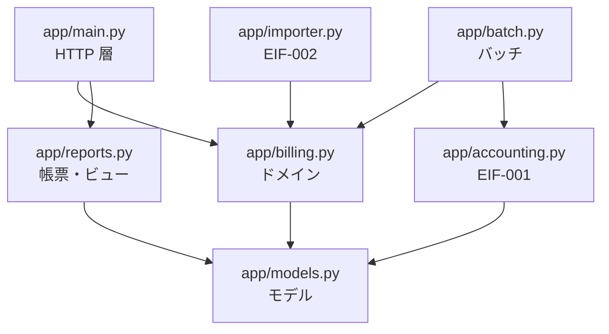
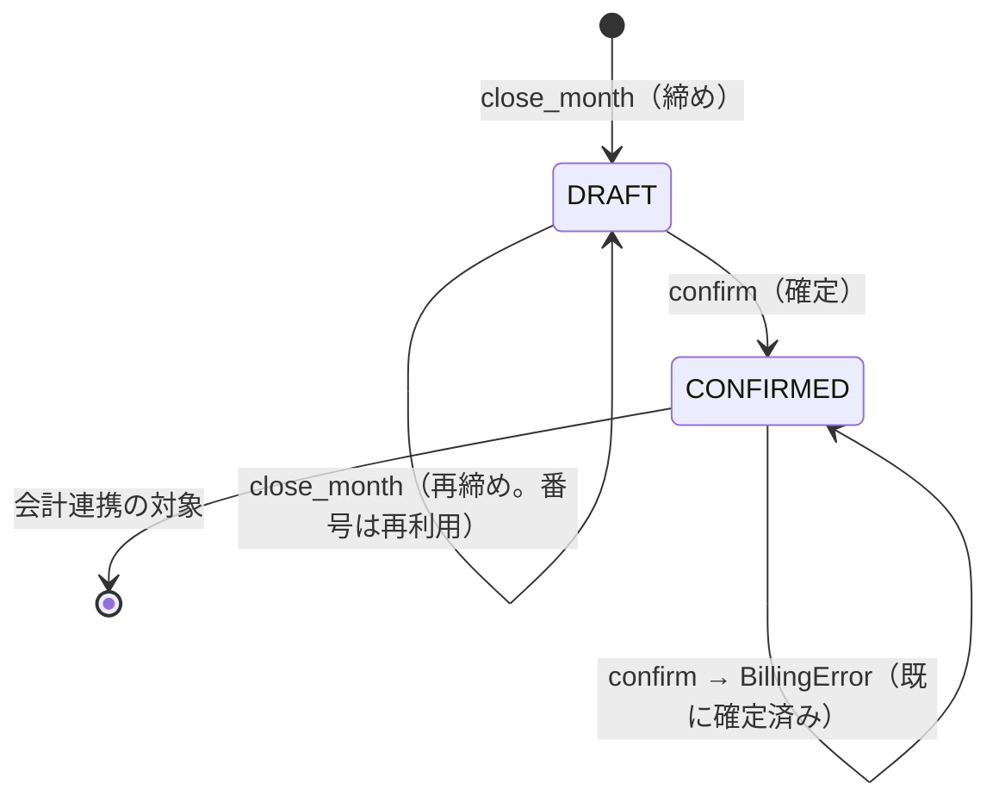

# 詳細設計書 — 月次請求書発行

> **本書はプロジェクトの組立定義に基づいていない。** `docs/design-docs/assembly-shousai-sekkei.md` が無く、
> **顧客と目次を合意していない**ため、`doc-reverse-gen` Skill 同梱の組立例
> `templates/deliverables/assembly/shousai-sekkei.md` の目次をそのまま使って組み立てた。

**設計書**: 詳細設計書（内部設計） ／ **対象**: 月次請求書発行（monthly-billing）
**版**: 1.0（納品版・Phase 6） ／ **組立日**: 2026-09-21 ／ **組立時の HEAD**: `dd4ebbb`
**構成要素**: コード（`app/`）＋ 性質テスト ＋ ADR ＋ 証跡パッケージ

> **本書は実装から逆生成したビューであり、直接編集しない。** 修正はコード・テスト・ADR の側で行い、
> 組み立て直す。

## 本書の位置づけ

IPA「機能要件の合意形成ガイド」の工程成果物27点は**外部設計工程**の成果物であり、内部設計
（モジュール構成・処理の実装方式）は含まれない。したがって本書の章立ては IPA ガイドに拠らず、
**J-SIX の方針（著者見解）**として定めたものである。

J-SIX では詳細設計書を**実装前に書かない**。詳細設計工程に相当する Phase 3 の成果物は
タスク一覧（受入条件・PROP・変更許可ファイル範囲）であり、本書は Phase 6 にコード・テスト・
ADR から逆生成する。

| 時期 | 顧客に出すもの |
|---|---|
| 実装前 | Phase 3 のタスク一覧（例: [TASK-MB-007](../tasks/TASK-MB-007.md)）。詳細設計書の代替として合意する |
| 納品 | 本書 |

### 何を書き、何を書かないか

詳細設計書の価値は、**コードを読んでもすぐには分からないこと**にある。

| 書く | 書かない |
|---|---|
| モジュールの責務と依存の向き | 関数本体を日本語に置き換えた処理記述 |
| 不変条件（PROP）と、それをどこで守っているか | 変数ごとの説明 |
| 例外と外部への応答の対応 | コードに書かれた条件分岐の列挙 |
| 状態遷移と、遷移を許す／拒む箇所 | 自明な getter / setter |
| 計算方式と**その根拠**（ADR・法令） | 型注釈から読める引数と戻り値の一覧だけの表 |

---

## 1. モジュール構成

> **由来**: コードから逆生成 ／ **逆生成元**: `app/*.py`（パッケージ構成と import の静的解析）

### 1.1 モジュール一覧と責務

| モジュール | 行数 | 責務 | 備考 |
|---|---|---|---|
| `app/models.py` | 185 | ドメインモデル（エンティティ・値オブジェクト・列挙型） | 業務ルールを持たない |
| `app/billing.py` | 354 | **業務ルールの集約点**。月次締め・消費税計算・確定・監査記録 | ここ以外に業務ルールを書かない（CLAUDE.md） |
| `app/importer.py` | 80 | EIF-002 売上データ取込 | 1行の不備で取込全体を止めない |
| `app/accounting.py` | 68 | EIF-001 会計連携ファイル出力 | 確定済み請求のみを対象にする |
| `app/reports.py` | 113 | 帳票出力と表示用ビュー | 画面・帳票・JSON が同じデータ源を見る |
| `app/batch.py` | 29 | BATCH-001／002 のエントリポイント | 業務ルールを持たず `billing` と `accounting` を呼ぶだけ |
| `app/main.py` | 153 | HTTP 層（画面 SCR・帳票 RPT） | `BillingError` を HTTP 409／404 に変換する |

### 1.2 依存関係



**依存の向きは一方向**である。`models` は何にも依存せず、`billing` は `models` にのみ依存する。
HTTP 層・バッチ・外部 IF はドメインに依存するが、その逆は無い。ドメインが Web フレームワークや
CSV の都合を知らないため、**画面や連携方式が変わってもドメインは変わらない**。

---

## 2. モジュール詳細

### 2.1 公開インタフェース（`BillingService`）

> **由来**: コードから逆生成 ／ **逆生成元**: `app/billing.py` の公開メソッドと docstring

| メソッド | 引数 | 責務 | 対応要件 |
|---|---|---|---|
| `register_customer` | customer_code, name, closing_day, payment_terms | 取引先を登録する | REQ-001, REQ-002 |
| `set_bank_account` | customer_code, bank_name, branch_name, account_type, account_number, account_holder | 振込先口座を登録・変更する | REQ-011 |
| `add_sale` | record_id, customer_code, sales_date, item_name, quantity, unit_price, tax_rate | 売上を登録する（同一 record_id は無視。冪等） | UC-001 |
| `close_month` | year_month, actor | 月次締めを実行し取引先ごとの請求を作る | UC-002 / REQ-003, REQ-008 |
| `confirm` | invoice_no, actor | 請求を確定する | UC-006 / REQ-007 |
| `get_invoice` / `list_invoices` / `get_customer` | — | 参照系 | UC-003 |
| `reset` | clock | ストアを初期化する（テスト用。時刻を注入する） | — |

**時刻の注入**: `BillingService(clock=...)` で現在時刻を外から与える。監査記録の時刻が
テストで固定でき、`datetime.now()` への依存をドメインに残さないため。

### 2.2 不変条件（Property）

> **由来**: 要求 Spec の PROP ＋ 性質テスト ／ **逆生成元**: `tests/test_properties.py`

| PROP | 不変条件 | どこで守っているか |
|---|---|---|
| PROP-001 | 請求の税抜合計 = 明細の税抜金額の総和 | `Invoice.subtotal`（導出属性。保持しない） |
| PROP-002 | 税率ごとの消費税額 = floor(税率ごとの税抜合計 × 税率) | `billing.calc_tax` と `summarize_tax`。`InvoiceLine` が消費税額を**持たない**ことで、明細ごとの丸めを構造的に不可能にしている（ADR-0001） |
| PROP-003 | 税率ごとの対価の額の総和 = 請求の税抜合計 | `summarize_tax`（明細を漏れなく区分に振り分ける） |
| PROP-004 | 支払期日 ≥ 締め日 | `billing.due_date_of` |
| PROP-005 | 請求は取引先ごとに高々1件。再締めしても番号が変わらない | `_build_invoice` と `_find_invoice`（既存があれば番号を再利用） |
| PROP-006 | 確定済みの請求は金額が変化しない | `_ensure_not_confirmed`（確定済みがある期間は再締めを拒否） |
| PROP-007 | 保存された振込先は締め後のマスタ変更で変化しない | `BankAccount` が `frozen=True` の値オブジェクトであること、`set_bank_account` が常に新インスタンスで置き換えること |
| PROP-008 | 振込先の登録有無は請求の件数・金額に影響しない | `_build_invoice` が口座を参照するだけで集計に使わないこと |

**構造で守る／検査で守る**: PROP-002 と PROP-007 は、テストだけでなく**型と構造**で守っている。
消費税額を明細に持たせない、口座を不変にする、という設計判断がそれである。

### 2.3 状態遷移

> **由来**: コードから逆生成 ／ **逆生成元**: `app/models.py` の `InvoiceStatus`、`app/billing.py`



| 遷移 | 許す／拒む | 実装 |
|---|---|---|
| 未作成 → DRAFT | 許す（対象売上がある取引先のみ） | `_build_invoice`（売上0件なら None を返す。REQ-008） |
| DRAFT → DRAFT | 許す。請求番号は再利用する | `_find_invoice` → 既存の `invoice_no` を引き継ぐ（PROP-005） |
| DRAFT → CONFIRMED | 許す | `confirm` |
| CONFIRMED → DRAFT | **拒む** | `_ensure_not_confirmed`（対象年月に確定済みがあれば締め自体を拒否。REQ-007） |
| CONFIRMED → CONFIRMED | **拒む** | `confirm` が `BillingError`（既に確定済み） |

---

## 3. 業務ロジック

### 3.1 計算方式

> **由来**: コード＋ADR ／ **逆生成元**: `app/billing.py` の `calc_tax` / `summarize_tax`、ADR-0001, ADR-0002

```
税率ごとの消費税額 = floor( 税率ごとの税抜合計 × 税率 / 100 )
請求合計           = 税抜合計 + Σ 税率ごとの消費税額
```

| 判断 | 内容 | 根拠 |
|---|---|---|
| 端数処理の単位 | **一の請求につき、税率ごとに1回**。明細ごとには行わない | ADR-0001（国税庁「インボイス制度に関するQ&A」問57） |
| 端数処理の方法 | **切捨て** | ADR-0002（事業者が選択できるため、自社方針として固定） |
| 数値の型 | すべて整数。浮動小数点を使わない | ADR-0002。丸め誤差を持ち込まない |

**具体例**: 10% 対象が 999 円 + 1,111 円 = 2,110 円のとき、消費税額は floor(211.0) = **211 円**。
明細ごとに丸めると floor(99.9) + floor(111.1) = 210 円となり、1円ずれる。

### 3.2 採番・一意性

> **由来**: コード＋Spec ／ **逆生成元**: `app/billing.py` の `_next_invoice_no`

| 対象 | 方式 | 一意性の担保 |
|---|---|---|
| 請求番号 | `INV-{YYYYMM}-{連番4桁}` | サービス内の連番。再締めでは既存番号を再利用する（PROP-005） |
| 売上の record_id | 販売管理システムの採番をそのまま使う | 取込時に既存 ID を無視する（冪等。UC-001） |
| 明細番号 | 対象期間内の売上を（計上日, record_id）順に並べた通番 | 同じ入力なら同じ並び（決定的） |

---

## 4. エラー処理

### 4.1 例外の種類と発生条件

> **由来**: コードから逆生成 ／ **逆生成元**: `app/billing.py` / `app/importer.py` の `raise` 箇所

| 例外 | 発生条件 | 発生箇所 |
|---|---|---|
| `BillingError` | 締め日が 20／31 以外 | `register_customer` |
| `BillingError` | 支払サイトが列挙型以外 | `register_customer` |
| `BillingError` | 預金種別が 普通／当座 以外 | `set_bank_account` |
| `BillingError` | 未登録の取引先 | `set_bank_account` / `add_sale` / `get_customer` |
| `BillingError` | 税率が 8／10 以外 | `add_sale` |
| `BillingError` | 対象年月に確定済みの請求がある | `close_month` |
| `BillingError` | 既に確定済みの請求を再確定 | `confirm` |
| `BillingError` | 請求が見つからない | `get_invoice` |
| `BillingError` | EIF-002 の必須列が不足 | `importer.import_sales` |

**取込の1行の不備は例外にしない**。エラー行として記録し、処理を継続する（外部 IF 処理説明を参照）。
ファイル自体が仕様違反（必須列の不足）の場合だけ、取込全体を中止する。

### 4.2 外部への応答

> **由来**: コードから逆生成 ／ **逆生成元**: `app/main.py` の例外変換

| 状況 | HTTP | 実装 |
|---|---|---|
| 業務ルール違反（`BillingError`） | **409 Conflict** | `main.py` の例外ハンドラ |
| 対象が存在しない | **404 Not Found** | `_get`（請求の取得） |
| `multipart/form-data` での送信 | **415 Unsupported Media Type** | ADR-0004。form 解析を標準ライブラリで行い、既定値で黙って確定させない |

Design Spec 3.2 が規定しているのは**このステータスコードだけ**であり、メッセージ本文は規定していない。
そのためメッセージ文言はテストで固定していない（mutation testing の生存ミュータントを意図的に生かしている）。

---

## 5. 外部仕様の詳細

外部仕様（画面・帳票・データ・外部 IF・バッチ）は工程成果物として
[基本設計書](kihon-sekkei.md) に収めた。**本書では繰り返さない**（組立ガイド 1.5: 同じ工程成果物を
2冊に全文で入れない）。

| 参照先 | 内容 |
|---|---|
| [基本設計書 4章](kihon-sekkei.md) | 画面6点 |
| [基本設計書 5章](kihon-sekkei.md) | 帳票5点 |
| [基本設計書 6章](kihon-sekkei.md) | データモデル4点 |
| [基本設計書 7章](kihon-sekkei.md) | 外部インタフェース3点 |
| [基本設計書 8章](kihon-sekkei.md) | バッチ4点 |

---

## 6. 物理データ設計

> **由来**: コードから逆生成 ／ **逆生成元**: `app/billing.py` のストア定義

本サンプルは**インメモリ実装**であり、DDL・マイグレーション・インデックス定義を持たない。
`BillingService` が辞書でエンティティを保持する。

| ストア | 構造 | キー |
|---|---|---|
| `_customers` | `Dict[str, Customer]` | 取引先コード |
| `_sales` | `Dict[str, SalesRecord]` | record_id（冪等性の担保） |
| `_invoices` | `Dict[str, Invoice]` | 請求番号 |
| `audit_log` | `List[AuditEntry]` | 追記のみ |

**本番化する場合**: エンティティ定義（[基本設計書 6.3](kihon-sekkei.md)）の型・制約がそのまま
テーブル定義の入力になる。請求は締め時点のスナップショット（取引先名・振込先）を持つため、
取引先マスタへの外部キーだけでは復元できない点に注意する。

---

## 7. 単体テスト

### 7.1 テスト観点

> **由来**: コードから逆生成 ／ **逆生成元**: `tests/` のテスト関数名と要件 ID

| テストファイル | 観点 | 件数 |
|---|---|---|
| `tests/test_billing.py` | 締め・期間・支払期日・税計算・確定・監査記録・振込先 | 例ベース |
| `tests/test_properties.py` | PROP-001〜008 の性質（Hypothesis） | 性質ベース |
| `tests/test_importer.py` | EIF-002 取込（冪等・エラー行・列数不一致） | 例ベース |
| `tests/test_accounting.py` | EIF-001 出力（確定済みのみ・内訳行） | 例ベース |
| `tests/test_reports.py` | 帳票の記載事項・表示用ビュー | 例ベース |
| `tests/test_api.py` | HTTP 層の応答とステータス | 例ベース |
| `tests/acceptance/` | **hold-out 受入テスト**（実装を書く工程からは読めない） | 23件 |

### 7.2 テスト結果

> **由来**: 証跡パッケージ（決定論的な実行結果） ／ **逆生成元**: `reports/evidence/TASK-MB-007/`

数値は証跡から引用したものであり、再計算していない。詳細は
[テスト結果報告書](test-report.md) と [品質報告書](quality-report.md) を参照。

| 指標 | 実測値 |
|---|---|
| テスト | 111件（すべて通過） |
| hold-out 受入テスト | 23件（すべて通過） |
| ステートメントカバレッジ | 99.7% |
| mutation score | 91.49%（552 ミュータント中 505 killed） |
| トレーサビリティ | 21/21（REQ 13 + PROP 8） |

---

## 8. 設計判断（実装段階の ADR）

> **由来**: 人手（ADR）

| ADR | 内容 | 段階 |
|---|---|---|
| [ADR-0001](../adr/0001-tax-rounding-unit.md) | 消費税の端数処理を「請求単位・税率ごとに1回」で行う | Phase 2 |
| [ADR-0002](../adr/0002-rounding-method-floor.md) | 端数処理の方法として「切捨て」を採用する | Phase 2 |
| [ADR-0003](../adr/0003-report-format.md) | 帳票を印刷用 HTML と CSV で出力する（PDF を生成しない） | Phase 2 |
| [ADR-0004](../adr/0004-no-python-multipart.md) | python-multipart を使わず、form 解析を標準ライブラリで行う | **Phase 4（実装中）** |

ADR-0004 は実装中に生じた判断である。依存ライブラリの脆弱性で CI の G1 が止まったことを契機に、
依存を1つ減らす判断を行い、`multipart/form-data` は既定値で黙って確定させず 415 で拒否することにした。

---

## 付録. 本書の逆生成元

| 章 | 逆生成元 |
|---|---|
| 1 | `app/*.py`（パッケージ構成、import の静的解析） |
| 2.1 | `app/billing.py` の公開メソッドと docstring |
| 2.2 | 要求 Spec 3.3 の PROP ＋ `tests/test_properties.py` |
| 2.3 | `app/models.py` の `InvoiceStatus`、`app/billing.py` の遷移箇所 |
| 3 | `app/billing.py` ＋ ADR-0001／0002 |
| 4 | `app/billing.py` / `app/importer.py` の `raise`、`app/main.py` の例外変換 |
| 6 | `app/billing.py` のストア定義 |
| 7 | `tests/` ＋ 証跡パッケージ `reports/evidence/TASK-MB-007/` |
| 8 | `docs/adr/` |

**組立時の HEAD**: `dd4ebbb`（j-six リポジトリ）
