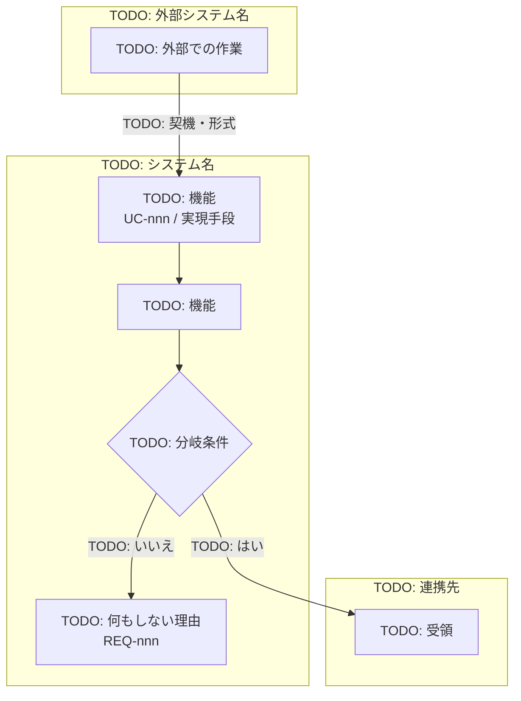

<!-- 自動生成: tools/sync_plugin_templates.py が templates/deliverables/behavior/02-business-flow.md から生成。直接編集せず、正のファイルを直して再生成すること -->
# システム化業務フロー

**工程成果物**: システム振舞い ② ／ **由来**: Spec（人手更新）
**逆生成元**: [TODO: 要求 Spec の業務概要 / Design Spec のシステム構成図]
**対象**: [TODO: システム名] ／ **版**: 0.1 ／ **日付**: YYYY-MM-DD

> 業務全体を俯瞰する流れ図において、システム化する部分を識別したもの。

## [TODO: 業務名] フロー

## 担当と実行契機

| 作業 | 担当 | 契機 | 自動/手動 |
|---|---|---|---|
| [TODO: 作業] | [TODO: 役割] | [TODO: 日次 / 月次 / 随時] | [TODO: バッチ / 画面] |

## 業務上の分岐

| 分岐 | 条件 | 動作 | 要件 |
|---|---|---|---|
| [TODO: 分岐名] | [TODO: 条件] | [TODO: 動作] | REQ-nnn |

---

## 記入ガイド（記入後は削除する）

- **書き方**: 外部システム・本システム・利用者を `subgraph` で分け、**システム化の境界**が
  一目で分かるようにする。ノードには UC-nnn と実現手段（SCR / BATCH / EIF）を併記する。
- **分岐の表**: 図だけでは「なぜその分岐があるか」が残らない。要件 ID（REQ-nnn）に紐づけて
  必ず表でも書く。この表が [システム化業務説明](03-business-description.md) の代替シナリオと対応する。
- **書き落としやすい点**: 「何もしない」経路（該当データが0件のとき等）。図に描かないと
  実装・テストの両方から抜ける。
- **記入済み実例**: [月次請求書発行](https://github.com/SeckeyJP/j-six/blob/main/examples/monthly-billing/docs/deliverables/behavior/02-business-flow.md)
