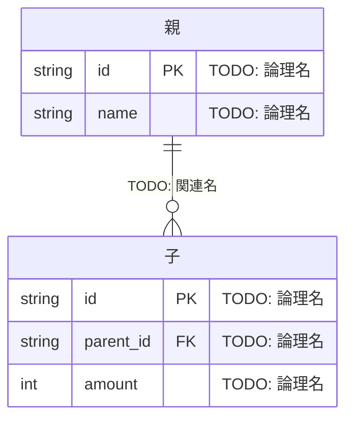

<!-- 自動生成: tools/sync_plugin_templates.py が templates/deliverables/data/01-er-diagram.md から生成。直接編集せず、正のファイルを直して再生成すること -->
# ER図

**工程成果物**: データモデル ① ／ **由来**: **コードから逆生成**
**逆生成元**: [TODO: モデル定義ファイル / マイグレーション]
**対象**: [TODO: システム名] ／ **版**: 0.1 ／ **日付**: YYYY-MM-DD

## 構造上の重要点

### [TODO: 意図的に「持たせていない」属性]

[TODO: なぜ持たせないか。業務ルール（丸め規則・不変条件）を構造として書けなくするための
判断であれば、その ADR を参照する]

### [TODO: 独立させたエンティティとその理由]

[TODO: 要件（REQ-nnn）との対応]

### [TODO: スナップショットとして保持する属性]

[TODO: マスタの現在値ではなく、ある時点の値を保持する理由]

---

## 記入ガイド（記入後は削除する）

- **逆生成の手順**: モデル定義（ORM のクラス / 型定義 / マイグレーション）から、エンティティ・
  属性・関連・PK/FK を機械的に起こす。`erDiagram` のコメント欄に論理名を書く。
- **「構造上の重要点」がこの成果物の価値**。図だけならコードを読めば足りる。**なぜその構造に
  したか**、とくに**意図的に持たせなかった属性**を書く。持たせない判断は、後の工程で
  善意から追加されて壊れる。
- **書き落としやすい点**: 導出属性（合計値など）。実体として持つのか都度計算するのかを
  [エンティティ定義](03-entity-definition.md)と揃える。
- **記入済み実例**: [月次請求書発行](https://github.com/SeckeyJP/j-six/blob/main/examples/monthly-billing/docs/deliverables/data/01-er-diagram.md)
