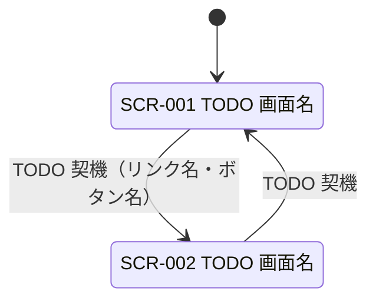

<!-- 自動生成: tools/sync_plugin_templates.py が templates/deliverables/screen/02-screen-transition.md から生成。直接編集せず、正のファイルを直して再生成すること -->
# 画面遷移

**工程成果物**: 画面 ② ／ **由来**: **コードから逆生成**
**逆生成元**: [TODO: テンプレートの `<a href>` / `<form action>`、ハンドラのリダイレクト]
**対象**: [TODO: システム名] ／ **版**: 0.1 ／ **日付**: YYYY-MM-DD

## 遷移の詳細

| # | 遷移元 | 遷移先 | 契機 | 条件 | 実装 |
|---|---|---|---|---|---|
| 1 | SCR-001 | SCR-002 | [TODO: 操作] | [TODO: 条件。無条件なら —] | `[TODO: 該当する href / form / リダイレクト]` |

## 条件付き表示

| 画面 | 要素 | 表示条件 | 実装 |
|---|---|---|---|
| [TODO: SCR-nnn] | [TODO: ボタン・メッセージ] | [TODO: 条件式] | `[TODO: テンプレートの条件分岐]` |

[TODO: 操作できない状態のボタンを「表示しない」のか「無効化する」のか、方針とその理由]

## エラー時の遷移

| 事象 | 動作 |
|---|---|
| [TODO: 対象が存在しない] | [TODO: HTTP 404（画面遷移しない）] |

---

## 記入ガイド（記入後は削除する）

- **逆生成の手順**: テンプレート内の `<a href>` / `<form action>` と、POST ハンドラの
  リダイレクト先をすべて拾う。図と表の両方を作り、表には**実装の該当箇所**を書く。
- **条件付き表示を必ず書く**。「確定済みには確定ボタンを出さない」のような制御は、
  画面遷移図には現れないが業務ルール（REQ-nnn）の一部である。
- **書き落としやすい点**: POST 後のリダイレクト（PRG パターン）。遷移元と遷移先が
  同じ画面に戻る場合、図から漏れやすい。
- **記入済み実例**: [月次請求書発行](https://github.com/SeckeyJP/j-six/blob/main/examples/monthly-billing/docs/deliverables/screen/02-screen-transition.md)
