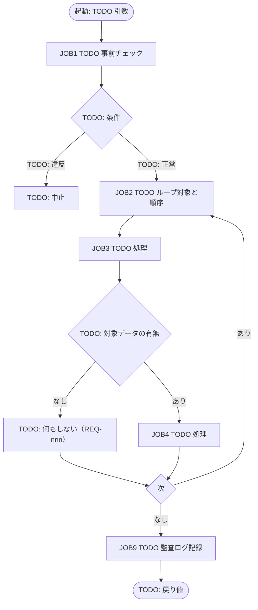

# バッチ処理フロー

**工程成果物**: バッチ ② ／ **由来**: **コードから逆生成**
**逆生成元**: [TODO: バッチと業務ロジックの実装ファイル]
**対象**: [TODO: システム名] ／ **版**: 0.1 ／ **日付**: YYYY-MM-DD

## BATCH-001 [TODO: バッチ名]

### ジョブステップと件数の目安

| ジョブ | 処理内容 | 入力件数 | 出力件数 |
|---|---|---|---|
| JOB1 | [TODO] | [TODO] | [TODO] |

## BATCH-002 [TODO: バッチ名]

[TODO: 上と同じ構成で、バッチの数だけ繰り返す]

### [TODO: 非自明な制御の説明]

[TODO: 打ち切りとスキップの違い、順序依存など、図だけでは伝わらない制御。
検出した回帰テストがあれば名前を書く]

---

## 記入ガイド（記入後は削除する）

- **逆生成の手順**: バッチ本体から業務ロジックへの呼び出しを追い、ループ・分岐を
  JOB 単位のフロー図にする。JOB 名は実装の関数名に対応させる。
- **件数の目安の表**: 性能問題が起きる箇所を事前に合意するための欄。「取引先数 × 売上件数」の
  ように、実データの規模で膨らむ箇所を書く。
- **書き落としやすい点**: ループ内で対象外に出会ったときの制御（continue か break か）。
  テストが通っていても誤っていることがあるため、mutation testing で確認して結果を残す。
- **記入済み実例**: [月次請求書発行](../../../examples/monthly-billing/docs/deliverables/batch/02-batch-flow.md)
