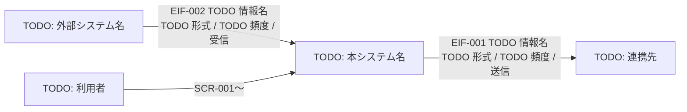

# 外部システム関連図

**工程成果物**: 外部インタフェース ① ／ **由来**: **コードから逆生成**
**逆生成元**: [TODO: 取込・出力・連携の実装ファイル]
**対象**: [TODO: システム名] ／ **版**: 0.1 ／ **日付**: YYYY-MM-DD

## 連携方式

| 凡例 | 方式 |
|---|---|
| [TODO: 実線] | [TODO: ファイル渡し / 同期 API] |

**[TODO: この方式にした理由]**（Design Spec n.n）: [TODO: 相手システムの制約、
障害時の復旧のしやすさ、連携先の停止への耐性など]

## 授受のタイミング

| IF-ID | 連携先 | 方向 | タイミング | 起動 |
|---|---|---|---|---|
| EIF-001 | [TODO] | 送信 | [TODO: 日次] | [TODO: BATCH-nnn] |
| EIF-002 | [TODO] | 受信 | [TODO: 日次] | [TODO] |

[TODO: 送信対象を絞る条件があれば明記する（確定済みのみ等）と、絞らないと何が起きるか]

---

## 記入ガイド（記入後は削除する）

- **逆生成の手順**: 外部とのデータ授受を行う実装（ファイル取込・出力、HTTP クライアント、
  メッセージ送受信）を列挙し、相手システム・方向・形式・頻度を図と表に起こす。
- **方式の理由を書く**。「なぜ API ではなくファイルか」は後から必ず問われ、書いていないと
  再検討が繰り返される。
- **書き落としやすい点**: 送信対象の絞り込み条件。「確定済みのみ送る」のような条件は
  連携先との合意事項であり、図には現れない。
- **記入済み実例**: [月次請求書発行](../../../examples/monthly-billing/docs/deliverables/external-if/01-system-relation.md)
