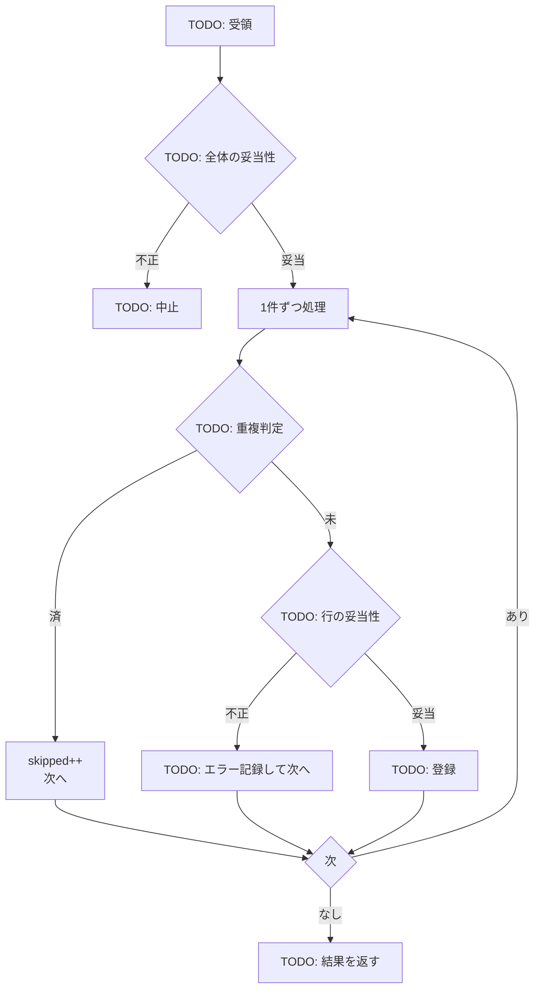
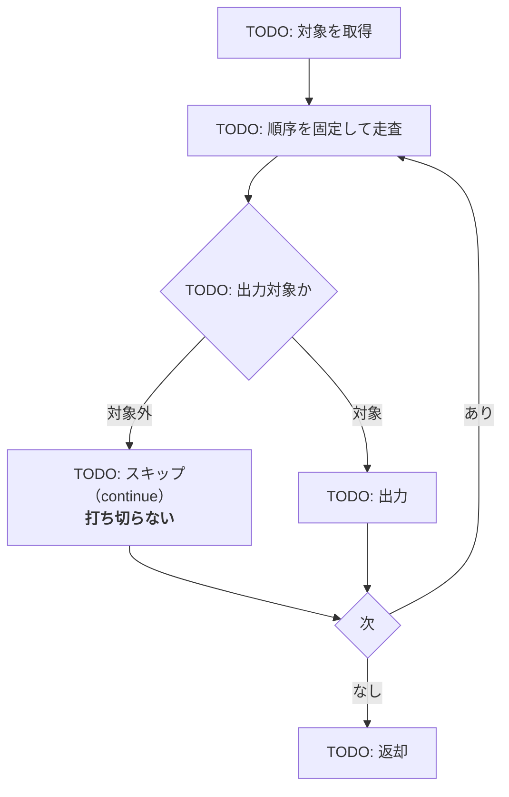

# 外部インタフェース処理説明

**工程成果物**: 外部インタフェース ④ ／ **由来**: コード＋Spec
**逆生成元**: [TODO: 取込・出力の実装ファイル]
**対象**: [TODO: システム名] ／ **版**: 0.1 ／ **日付**: YYYY-MM-DD

---

## EIF-002 [TODO: 情報名]の取込

**起動**: [TODO: 頻度]。`[TODO: 関数シグネチャ]`

### 設計上の判断

| 判断 | 理由 |
|---|---|
| [TODO: 全体を中止する条件] | [TODO] |
| [TODO: 1件だけスキップして継続する条件] | [TODO] |
| [TODO: 冪等性の担保] | [TODO] |

### 再実行時の動作

[TODO: 同じ入力を再投入したときに何が起きるか。障害復旧時に再投入してよいかを明記する]

---

## EIF-001 [TODO: 情報名]の出力

**起動**: [TODO: 頻度]。`[TODO: 関数シグネチャ]`

### [TODO: スキップと打ち切りの区別]

[TODO: 対象外のデータに出会ったときに走査を打ち切ると何が欠けるか。
mutation testing が `continue` → `break` の未検証を検出した場合は、その回帰テスト名を書く]

### 再実行時の動作

[TODO: 再出力の結果が同一になるか（冪等か）。受信側での重複取込対策が別途必要かどうか]

---

## 記入ガイド（記入後は削除する）

- **逆生成の手順**: 取込・出力の関数を1本ずつ読み、分岐をそのままフロー図にする。
  分岐ノードの文言はコードの条件式に対応させる。
- **「設計上の判断」の表がこの成果物の価値**。フロー図はコードを読めば書けるが、
  「なぜ中止ではなく継続か」は書かないと失われ、後の改修で逆にされる。
- **再実行時の動作を必ず書く**。運用の問い合わせで最も多く、かつ設計書に最も書かれない項目。
- **書き落としやすい点**: スキップと打ち切りの違い。`continue` を `break` にしても多くの
  テストは通る。mutation testing で検証し、結果をここに残す。
- **記入済み実例**: [月次請求書発行](../../../examples/monthly-billing/docs/deliverables/external-if/04-interface-process.md)
